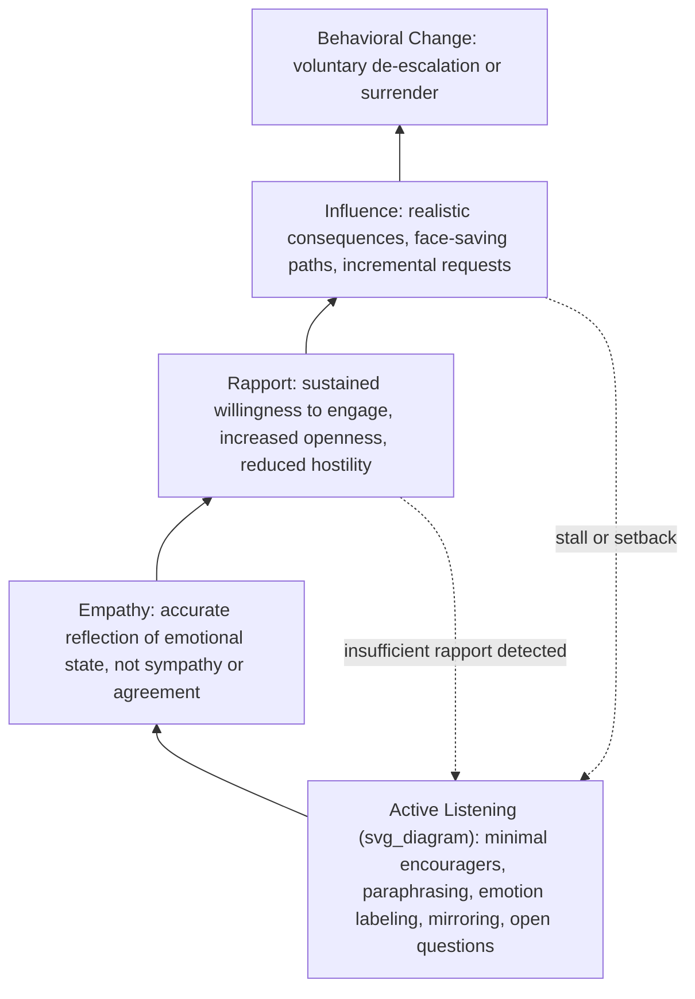

## The Behavioral Change Stairway Model

### Overview

The Behavioral Change Stairway Model (BCSM) is the foundational communication framework developed by the FBI's Crisis Negotiation Unit to structure how crisis and hostage negotiators move a subject from an acute, often hostile or non-cooperative state toward voluntary behavioral change. The model formalizes a strict sequential dependency among five stages — Active Listening, Empathy, Rapport, Influence, and Behavioral Change — arguing that each later stage can only be reliably achieved once the preceding stages have been genuinely established, and that attempting to skip stages (particularly attempting influence before rapport exists) is a common and consequential error. While developed specifically for crisis and hostage contexts, the model's underlying communication sequence has substantially influenced broader negotiation and conflict-resolution practice.

### The Five Stages

**Key Points**

1. **Active Listening** — the foundational communication behaviors (attention, verbal and nonverbal signaling of engagement, accurate reflection of content) that demonstrate genuine attention to the subject's communication.
2. **Empathy** — conveying accurate understanding of the subject's emotional state and perspective, built on the foundation of active listening, and distinct from sympathy or endorsement of the subject's actions or demands.
3. **Rapport** — a working relationship characterized by the subject's willingness to continue engaging, trust the negotiator's sincerity, and remain in communication, built cumulatively through sustained active listening and empathy.
4. **Influence** — the negotiator's capacity to meaningfully affect the subject's perspective, decisions, or intended actions, which the model holds is only genuinely available once rapport has been established.
5. **Behavioral Change** — the terminal objective: the subject voluntarily changes behavior (de-escalating, releasing hostages, surrendering, stepping back from self-harm) as a result of the trust and influence built through the preceding stages.

### Stage 1: Active Listening

**Key Points**

- Comprises specific, trainable techniques: **minimal encouragers** (brief verbal signals of continued attention), **paraphrasing** (restating the subject's message to confirm understanding), **emotion labeling** (naming the emotion the negotiator perceives), **mirroring** (repeating back key words or phrases to encourage elaboration), **open-ended questions**, and **effective use of silence and pauses**.
- Functions as the **foundational, load-bearing stage** of the model: because every subsequent stage depends on the subject's continued willingness to communicate, active listening's core purpose is sustaining engagement and demonstrating genuine attentiveness before any other objective is pursued.
- A common documented error is treating active listening as a superficial or perfunctory step to move quickly past, rather than as a sustained, genuinely attentive practice — the model's sequential logic depends on this stage being authentically achieved, not merely performed.

### Stage 2: Empathy

**Key Points**

- Empathy in this model specifically means **accurately perceiving and reflecting the subject's emotional state and perspective**, distinguished explicitly from sympathy (feeling sorry for the subject) or agreement/endorsement (validating the subject's actions, demands, or behavior as acceptable).
- Emotion labeling (carried over from the active listening stage) is a primary technique through which empathy is conveyed concretely — verbally naming the subject's apparent emotional state gives the subject direct evidence that their internal state has been accurately perceived, not merely nominally acknowledged.
- The model treats empathy as the **mechanism through which trust begins to form**: a subject who perceives genuine understanding of their emotional state is modeled as significantly more likely to begin extending trust than a subject who perceives the negotiator as detached, purely procedural, or focused only on extracting information or compliance.

### Stage 3: Rapport

**Key Points**

- Rapport is defined behaviorally rather than as an abstract feeling: it is evidenced by the subject's **continued willingness to communicate**, increased **openness in sharing information or context**, and reduced **hostility or defensiveness** in tone and content over the course of the interaction.
- Rapport is explicitly modeled as **cumulative and built over time** through sustained active listening and empathy, not achievable through any single technique or statement — this is a key reason the model treats time as a resource to be used deliberately (extended engagement) rather than compressed.
- A subject's willingness to continue engaging (rather than disengaging, going silent, or escalating hostility) is treated as the primary observable indicator that the rapport stage is being genuinely achieved, providing negotiators a concrete, moment-to-moment signal for whether the preceding stages are functioning as intended.

### Stage 4: Influence

**Key Points**

- The model's central sequential claim is that **influence is only reliably available once genuine rapport has been established** — attempts to persuade, redirect, or request behavioral change before rapport exists are identified as significantly less effective, and can actively increase resistance by signaling that the negotiator's engagement was instrumental rather than genuine.
- Influence techniques appropriate at this stage include **presenting realistic consequences without threat framing**, **offering face-saving paths toward de-escalation**, and **incremental behavioral requests** (small, low-cost cooperative asks that build toward larger behavioral change) rather than immediately requesting the full desired behavioral outcome.
- Because influence depends on rapport, a stall or setback at this stage is generally diagnosed by the model as **insufficient rapport**, prompting a negotiator to return to active listening and empathy techniques rather than escalating influence attempts more forcefully — a direct practical implication of the model's strict sequential dependency.

### Stage 5: Behavioral Change

**Key Points**

- The model's terminal objective: the subject **voluntarily** changes behavior as a result of the trust and influence cultivated through the preceding stages, distinguished from behavioral change achieved through coercion, force, or capitulation under pure pressure.
- Behavioral change achieved through this model is generally treated as **more durable and lower-risk** than change achieved through force or pure pressure, since it reflects the subject's own agency and decision-making rather than an externally imposed outcome that the subject may resist, reverse, or react against once immediate pressure is removed.
- Behavioral change is frequently **incremental rather than singular** in practice: small requested changes (releasing one hostage, agreeing to a pause, moving away from a window) that succeed reinforce the model's stages and build toward the larger behavioral change objective, rather than the model necessarily targeting one large behavioral shift directly.

### The Strict Sequential Dependency and Common Errors

**Key Points**

- The model's most consequential practical claim is that **stages cannot be reliably skipped**: attempting rapport-building without genuine active listening, or attempting influence without established rapport, tends to fail specifically because each stage's effectiveness is modeled as dependent on the authentic achievement of the stage before it.
- **Diagnostic use of the model**: when a crisis negotiation stalls or a subject becomes less cooperative, the model provides a structured diagnostic heuristic — rather than escalating pressure or influence attempts, the negotiator is trained to reassess which stage may not have been genuinely achieved and to return to that stage (most often returning to active listening and empathy) before proceeding further.
- **Bidirectional movement is expected and normal**: the model is not a strictly one-directional or one-time process; a negotiator may move back down the stairway (from attempted influence back to active listening) multiple times over the course of an extended incident as the subject's emotional state and the negotiation's dynamics shift.

### Illustrative Example

**Example**

A crisis negotiator, several hours into a barricade incident, attempts to introduce a specific behavioral request (asking the subject to release a hostage) after only a brief initial exchange. The subject responds with increased hostility and disengagement. Applying the model's diagnostic logic, the negotiator recognizes this as evidence that rapport had not yet been genuinely established, and returns to active listening and empathy techniques — extended minimal encouragers, paraphrasing, and emotion labeling focused on the subject's evident fear and desperation — over a substantially longer period before attempting any further influence. Only once the subject's tone shifts (evidenced by increased willingness to share personal context and reduced defensiveness, the behavioral markers of rapport) does the negotiator reintroduce a small, incremental request (asking the subject to allow a phone call rather than immediately requesting hostage release), which succeeds and builds toward the eventual larger behavioral change.

### Diagram: The Behavioral Change Stairway Model

### Comparison to Related Frameworks

**Key Points**

- The model's sequencing logic (engagement and trust before influence) parallels, and in formalized law-enforcement practice substantially predates, similar emphases in broader negotiation frameworks such as Ury's *Getting Past No* (particularly the "Step to Their Side" acknowledgment stage preceding "Reframe" and influence-oriented later steps).
- Emotion labeling and active listening techniques from the BCSM have been adapted into broader negotiation training contexts (notably popularized in commercial and everyday negotiation contexts by former FBI negotiator Chris Voss's *Never Split the Difference*), extending techniques developed for the crisis context into general negotiation practice.
- Unlike most general negotiation frameworks, the BCSM's terminal objective (behavioral change, often narrowly defined as de-escalation or surrender) is more constrained than the broader "mutually beneficial substantive agreement" objective found in commercial and diplomatic negotiation frameworks, reflecting its origin in acute crisis contexts where life preservation and de-escalation, not integrative value creation, are the immediate priorities.

### Practical Application

**Key Points**

- Treat rapport as an observable, evidenced state (continued engagement, increased openness, reduced hostility) rather than an assumed byproduct of simply spending time in conversation, and verify its presence before attempting influence.
- When influence attempts stall or provoke increased resistance, default to the model's diagnostic logic: return to active listening and empathy rather than escalating pressure or repeating the same influence attempt more forcefully.
- Use incremental behavioral requests rather than seeking the full desired behavioral change in a single attempt, building momentum through smaller successful asks.
- In non-crisis high-stakes negotiation contexts where trust and emotional engagement are relevant, apply the same sequencing discipline: prioritize genuine active listening and empathy before attempting substantive persuasion or reframing.
- Recognize that the model's bidirectional movement is normal and expected; treat a stall as diagnostic information about which stage needs to be revisited, not as a failure requiring escalation.

### Related Topics

- Principles of Crisis and Hostage Negotiation
- Getting Past No: Handling Difficult Counterparts
- Active Listening and Reframing Techniques
- De-escalation Techniques for Stalled Talks
- Emotional Regulation and De-Escalation Tactics in Negotiation
- Face-Saving Techniques and Golden Bridge Construction
- Managing Cross-Cultural Misunderstanding and Conflict