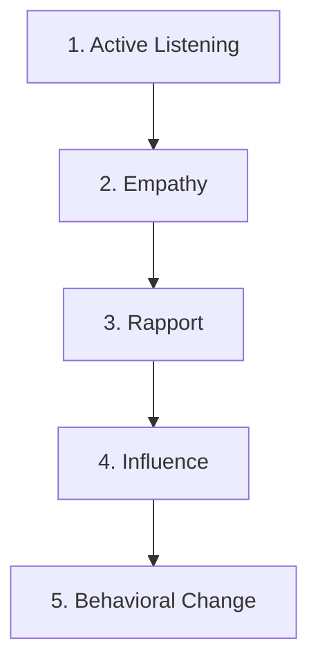
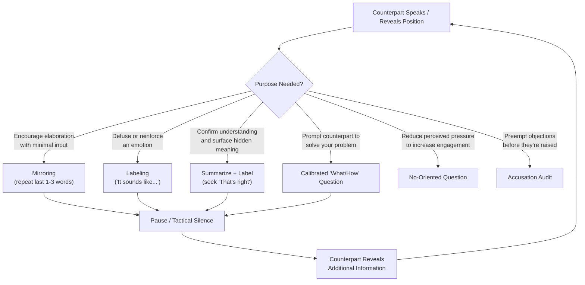

## Tactical Empathy Techniques

### Definition and Conceptual Foundation

Tactical empathy is a term popularized by former FBI lead international kidnapping negotiator Chris Voss, particularly through his book *Never Split the Difference* (2016), drawing on his experience with the FBI's Crisis Negotiation Unit. It is defined as the deliberate, disciplined use of empathy, understanding and articulating a counterpart's perspective, feelings, and underlying concerns, as a strategic tool to build trust, gather information, and influence outcomes, rather than as an end in itself or a purely emotional or sympathetic response.

Tactical empathy is distinguished from ordinary empathy in that it is instrumentally deployed within a structured negotiation or crisis intervention framework. It does not require agreement with the counterpart's position or feelings; it requires accurate recognition and verbal acknowledgment of them. This distinction traces to earlier behavioral science work on active listening (Carl Rogers' client-centered therapy concepts adapted to crisis contexts) and was operationalized within the FBI's Behavioral Change Stairway Model (BCSM).

### Theoretical Foundation: The Behavioral Change Stairway Model (BCSM)

The BCSM, developed by the FBI's Crisis Negotiation Unit, describes a five-stage sequential process through which rapport and behavioral influence are built in high-stakes situations, particularly hostage and barricade scenarios. Tactical empathy techniques are the primary tools used to progress through the early stages.

**Key Points**

- Each stage is a *precondition* for the next; attempting to jump directly to influence or behavioral change without establishing active listening, empathy, and rapport first is considered a common tactical error, since counterparts under stress or in conflict typically resist influence attempts that feel unearned or manipulative.
- The model assumes behavioral change (e.g., a hostage-taker releasing hostages, a counterpart agreeing to terms) is the terminal outcome of a trust-building sequence, not something that can be commanded or coerced directly in most non-immediately-lethal scenarios.

### Core Tactical Empathy Techniques

**Mirroring (Isopraxism)**

Repeating the last one to three critical words a counterpart has just said, typically phrased as a question through vocal inflection, to prompt elaboration without imposing the listener's own framing.

**Example**

Counterpart: "I can't accept these payment terms, they're going to hurt our cash flow."

Negotiator: "Hurt your cash flow?"

This technique, sometimes called isopraxism in behavioral science, leverages neurological mirroring tendencies (related to but distinct from mirror neuron research) to encourage the counterpart to continue talking and reveal additional information with minimal negotiator intervention.

**Labeling**

Verbally identifying and naming the emotion or perspective a counterpart appears to be experiencing, typically using tentative, non-presumptuous framing ("It seems like...", "It sounds like...", "It looks like...") rather than declarative statements ("You are...").

**Example**

"It sounds like you're worried that agreeing to this timeline will put your team in an impossible position."

Labeling functions to defuse the emotional charge of a feeling by naming it explicitly (a mechanism with parallels to "affect labeling" studied in affective neuroscience, where verbally naming an emotion is associated with reduced amygdala reactivity in some experimental paradigms). Voss's framework additionally distinguishes:

- **Negative labels**: naming a negative emotion or objection directly to neutralize it before the counterpart voices it further.
- **Positive labels**: naming a favorable disposition to reinforce it.

**Tactical Silence (Effective Pauses)**

Deliberately pausing for several seconds after a mirror or a label, allowing the counterpart to fill the silence with additional, often more candid, information. This technique relies on the discomfort most people feel with unfilled conversational silence.

**Open-Ended (Calibrated) Questions**

Questions beginning with "What" or "How" designed to prompt the counterpart to solve the negotiator's problem for them, framed to feel collaborative rather than adversarial, and deliberately avoiding "Why" questions, which can carry an accusatory or defensive-triggering connotation.

**Example**

Instead of: "Why can't you meet this deadline?"

Use: "What would need to happen for this deadline to work on your end?"

Or: "How am I supposed to do that?" (a calibrated question used to signal a constraint without an outright refusal, prompting the counterpart to problem-solve collaboratively).

**Summarizing and Paraphrasing**

Restating the counterpart's stated position, facts, and underlying meaning in the negotiator's own words to confirm accurate understanding, distinct from simple repetition. Effective summarizing typically incorporates a label, combining factual restatement with emotional acknowledgment.

**The "That's Right" Trigger**

The stated goal of an effective summary/label combination, per Voss's framework, is to elicit a "That's right" response from the counterpart, indicating the negotiator has genuinely captured their perspective, as distinct from a reluctant "You're right," which often signals appeasement rather than authentic agreement or feeling understood.

**No-Oriented Questions**

Framing questions so that "No" is an easy, low-risk answer, since many individuals feel more secure and less pressured when declining is a comfortable, available option, which paradoxically can increase engagement and openness.

**Example**

Instead of: "Do you have time to talk now?" (which invites a reflexive refusal to disengage entirely)

Use: "Is now a bad time to talk?" or "Have you given up on resolving this?"

### The Accusation Audit

A preparatory technique in which the negotiator proactively lists every negative thing the counterpart could plausibly think or say about them, their offer, or their organization, and then voices these concerns aloud, unprompted, before the counterpart raises them.

**Example**

"You're probably thinking this sounds like a terrible deal, and it might feel like we're not taking your constraints seriously here."

By stating negative perceptions first, the negotiator can defuse their emotional force, demonstrate self-awareness, and signal a lack of concealment, functioning as a specialized, front-loaded application of negative labeling.

### Application in High-Stakes and Crisis Contexts

**Key Points**

- In hostage and barricade negotiation, tactical empathy techniques are the primary tools for stabilizing an individual in crisis, since the immediate priority in the BCSM sequence is establishing enough trust and de-escalation to progress toward safe resolution, not achieving a substantive concession or "win."
- Crisis negotiators typically avoid early problem-solving or bargaining because BCSM theory holds that influence attempted before sufficient rapport is established tends to be rejected, and may escalate rather than de-escalate a volatile situation.
- These techniques are also widely adapted into commercial, legal, and interpersonal negotiation training, though the stakes, time pressure, and psychological state of counterparts differ substantially from acute crisis scenarios, and the applicability of specific findings from crisis contexts to lower-stakes business negotiation is [Inference] not always empirically validated to the same degree, given differing research bases for each domain.

### Tactical Empathy Technique Selection Flow

### Common Errors in Applying Tactical Empathy

**Key Points**

- **Sympathy substitution:** Confusing tactical empathy (accurate perspective recognition) with sympathy or agreement, which can lead to unwarranted concessions rather than information-gathering.
- **Over-mirroring:** Repeating too many words or mirroring too frequently, which can feel unnatural or condescending rather than facilitative.
- **Declarative labeling:** Using "You are..." instead of tentative framing ("It sounds like...") can come across as presumptuous and provoke defensiveness rather than openness, since it removes the counterpart's ability to correct a mischaracterization gracefully.
- **Premature influence attempts:** Skipping active listening and empathy stages to move directly to persuasion or terms, which the BCSM framework predicts is likely to be met with resistance, particularly in emotionally elevated situations.
- **Performative rather than genuine tone:** Because these techniques rely on vocal tone and perceived sincerity (Voss's framework also emphasizes tone of voice categories such as the "late-night FM DJ voice" for calm assertions and a "positive/playful voice" for rapport-building), mechanical or insincere delivery can undermine effectiveness. [Unverified: the specific behavioral impact of these particular vocal-tone categories, as opposed to tone and delivery generally, has not been extensively validated in peer-reviewed negotiation research independent of Voss's own practitioner accounts.]

### Practical Application Steps

**Next Steps**

- **Prepare an accusation audit** before entering a high-stakes or adversarial negotiation, listing likely objections and negative framings the counterpart may hold.
- **Practice calibrated question framing**, converting closed or "why" questions into open "what/how" questions in advance of the conversation.
- **Rehearse labeling language** using tentative framing consistently ("It seems," "It sounds like," "It looks like") to reduce the risk of declarative, presumptive statements under pressure.
- **Build in deliberate pauses** after mirrors and labels rather than filling silence, particularly in tense exchanges where the instinct to speak further can undercut the technique's effect.
- **Debrief post-negotiation** on whether summaries elicited "That's right" responses, using this as a practical, in-context indicator of whether genuine understanding was communicated and received.

**Related Topics**

- The Behavioral Change Stairway Model in Crisis Negotiation
- Active Listening Techniques in Adversarial Contexts
- Calibrated Questions vs. Closed Questions
- Emotional Labeling and Affect Regulation Research
- De-escalation Strategies in Hostage and Barricade Situations
- Chris Voss's FBI Negotiation Framework and Commercial Adaptations
- Building Rapport Under Time Pressure and High Stakes
- Ethical Boundaries of Tactical Empathy in Non-Crisis Negotiation