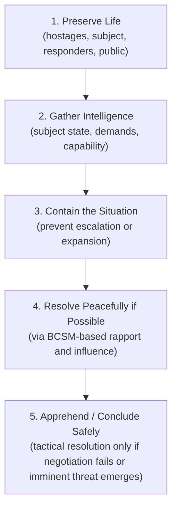

## Negotiating Under Extreme Time Pressure and Threat

### Definition and Conceptual Foundation

Negotiating under extreme time pressure and threat refers to negotiation conducted in conditions where decision windows are severely compressed, consequences of failure are catastrophic (loss of life, safety, or irreversible harm), and physiological and psychological stress responses materially affect both the negotiator's and counterpart's cognitive functioning. This context is most extensively studied in hostage and barricade negotiation, kidnap-for-ransom cases, active-shooter and suicide-intervention scenarios, and by extension, high-stakes crisis contexts such as extortion, cyber-ransom events, and acute business crises (e.g., product recalls with imminent safety deadlines).

This differs fundamentally from ordinary time-pressured negotiation (e.g., a closing deadline on a business deal) in that the threat component introduces acute stress physiology, life-safety stakes, and often an adversary or subject in a compromised psychological state, requiring specialized frameworks beyond standard distributive or integrative bargaining models.

### Physiological and Cognitive Effects of Acute Stress on Negotiation

**Key Points**

- Acute threat activates the sympathetic nervous system's fight-flight-freeze response, mediated by the amygdala and hypothalamic-pituitary-adrenal (HPA) axis, producing elevated cortisol and catecholamines (adrenaline, noradrenaline).
- This physiological state is associated with narrowed attentional focus (sometimes termed "tunnel vision" or weapon/threat focus in eyewitness and stress research), impaired working memory, and degraded complex reasoning, since prefrontal cortex executive function is relatively suppressed relative to more reflexive limbic system responses under high acute stress (consistent with the Yerkes-Dodson law describing an inverted-U relationship between arousal and performance).
- Time pressure independently increases reliance on heuristic, System 1-style processing (per dual-process theories such as Kahneman's) over deliberative System 2 processing, increasing susceptibility to anchoring, framing effects, and impulsive decision-making in both the negotiator and the subject.
- These effects apply asymmetrically: the crisis negotiator's role frequently includes actively managing their own stress response (through training, protocol, and team support) while assessing and responding to the elevated, often more acute, stress state of the subject or counterpart.

$$\text{Performance} = f(\text{Arousal}), \quad \text{with an inverted-U relationship (Yerkes-Dodson)}$$

Moderate arousal can enhance focus and performance, but arousal beyond an individual's optimal threshold, common in life-threat scenarios, produces performance degradation, including in negotiation-relevant skills like active listening and calibrated question formulation.

### Time Pressure as a Structural Variable

**Key Points**

- Formal negotiation research (e.g., work stemming from the FBI Crisis Negotiation Unit and academic hostage negotiation literature) distinguishes between negotiator-imposed time and subject-imposed time; a core early tactical objective is typically to slow down subject-imposed deadlines wherever safely possible, since compressed time windows reduce the number of BCSM-stage cycles (see Behavioral Change Stairway Model) achievable before a critical decision point.
- Artificial or self-imposed urgency (e.g., a subject's stated deadline, or a business counterpart's claimed "this offer expires today") should be distinguished analytically from genuinely fixed constraints, since perceived urgency is often more negotiable than it initially appears, a principle consistent with general negotiation literature on manufactured deadlines as a pressure tactic.
- Time-pressure reduction techniques in crisis contexts include intentional slow, calm speech pacing, extended silences, and deliberately unhurried question sequencing, which serve the dual function of de-escalating the subject's arousal (via vocal entrainment/pacing effects) and creating more decision-making space for all parties.

### Threat Assessment and Prioritization Framework

In life-safety contexts, negotiation strategy is explicitly subordinated to a structured threat and risk assessment, typically organized around the following prioritized objectives, consistent with standard crisis negotiation doctrine:

**Key Points**

- This ordering reflects the doctrine, common across many crisis negotiation units, that a negotiated resolution is generally preferred over tactical intervention wherever safely achievable, given the elevated risk of casualties in forced tactical resolutions; however, this preference is always subordinate to priority 1 (preserving life), including authorizing tactical intervention if intelligence indicates imminent lethal action.
- Extreme threat scenarios often require parallel-track management: a negotiation team engaging the subject while a separate tactical/command team maintains containment and prepares contingency options, a structural feature largely absent from standard business or diplomatic negotiation.

### Specialized Techniques for Time-Pressured, High-Threat Negotiation

**Deliberate De-escalation of Pace**

Slowing the negotiator's own speech rate and response latency, even artificially, to counteract the subject's heightened arousal and to model calm affect, leveraging emotional contagion and vocal entrainment effects documented in crisis communication research.

**Active Listening Intensification**

Increased reliance on the foundational BCSM techniques, mirroring, labeling, and calibrated open-ended questions, since these techniques are specifically designed to extract critical intelligence (subject's emotional state, demands, capability, and intent) while simultaneously building the rapport needed for de-escalation, doing double duty under compressed time.

**Buying Time Without Appearing to Stall**

Framing requests for clarification, verification, or logistics (e.g., "I need to confirm that with my team before I can respond") as procedurally necessary rather than evasive, to legitimately extend the negotiation window without triggering the subject's perception of bad faith or deliberate delay.

**Example**

"I want to make sure I get this exactly right before I bring it to my supervisor, can you walk me through that demand one more time?" This simultaneously slows pace, gathers additional intelligence, and signals engagement rather than resistance.

**Establishing Small, Incremental Behavioral Commitments**

Rather than pursuing the full resolution immediately, negotiators typically pursue small, achievable behavioral changes first (e.g., releasing one hostage, permitting a phone call, agreeing to a short pause), consistent with the BCSM's incremental influence-to-behavioral-change progression, and with the "foot-in-the-door" compliance principle from social psychology (Freedman & Fraser), whereby small initial commitments increase the likelihood of subsequent, larger compliance.

**Suicide-by-Cop and Self-Harm Risk Assessment**

In barricade and crisis-negotiation contexts involving a subject at risk of self-harm, specialized risk indicators (hopelessness, direct or indirect verbal cues, escalating agitation, giving away possessions) inform an ongoing, dynamic risk assessment that runs concurrently with negotiation strategy, often governed by specific crisis-intervention protocols distinct from general negotiation technique.

### Application to Non-Crisis High-Stakes Business and Legal Contexts

**Key Points**

- Extreme time pressure appears in business contexts such as hostile takeover defense deadlines, ransomware/cyber-extortion demands with stated countdown timers, regulatory compliance deadlines with severe penalties, and crisis PR negotiations following an acute corporate incident.
- While life-safety stakes are typically absent, the same underlying cognitive-stress principles apply: compressed decision windows increase heuristic-driven errors, and negotiators benefit from deliberately manufactured pauses (e.g., "let me confirm with counsel"), pre-negotiated internal decision protocols, and pre-identified fallback positions established *before* entering the high-pressure exchange, since in-the-moment complex reasoning is degraded under acute stress even in non-life-threat business crises. [Inference: the degree of cognitive impairment in business-crisis time pressure is generally understood to be less severe than in genuine life-threat scenarios, given differing physiological activation levels, though both draw on the same stress-performance literature.]
- Ransomware negotiation specifically has emerged as a distinct professional practice combining crisis negotiation principles (deadline extension, calibrated questioning to assess attacker capability and intent) with technical and legal considerations (e.g., sanctions compliance, law enforcement coordination, and forensic verification of decryption capability before payment).

### Preparation and Protocol-Based Risk Mitigation

**Key Points**

- Crisis negotiation teams typically operate under pre-established protocols, checklists, and team structures (e.g., primary negotiator, secondary/coach, intelligence officer, and command liaison in FBI/law-enforcement models) specifically because individual improvisation under extreme stress is unreliable; structured role division offloads cognitive burden from any single individual.
- Extensive scenario-based training and simulation is standard preparation, since mastery experience under simulated stress (see self-efficacy literature, Bandura) is associated with better-regulated arousal and more reliable technique execution under genuine acute threat.
- Post-incident debriefing is a standard component of professional crisis negotiation practice, both for psychological processing of acute stress exposure among negotiators and for institutional learning to refine future protocol and training.

### Example

**Example**

In a barricade situation, a subject issues a 30-minute ultimatum demanding a getaway vehicle or threatening to harm a hostage. Rather than treating the 30-minute window as fixed, the negotiator deliberately slows the pace of the conversation, uses calibrated questions ("What's making 30 minutes feel like the right amount of time?") to explore and soften the deadline's rigidity, and secures a small incremental concession (a brief phone call to a family member) as an early behavioral change milestone. This simultaneously de-escalates arousal, extends the effective negotiation window well beyond the stated 30 minutes, and creates space for the negotiation team's tactical unit to gather additional intelligence, consistent with the BCSM's incremental influence model under acute time and threat constraints.

### Practical Guidance for Operating Under Extreme Pressure

**Next Steps**

- **Distinguish real from perceived deadlines** immediately upon entering a high-pressure exchange, and treat stated urgency as a starting hypothesis to be tested, not a fixed constraint.
- **Deliberately regulate personal pace and tone**, using slower speech and longer pauses as an active de-escalation tool rather than a passive default.
- **Pursue small, incremental commitments** before attempting full resolution, consistent with the BCSM's staged influence model.
- **Pre-establish decision protocols and fallback positions** before entering any anticipated high-pressure negotiation (business or crisis), since complex in-the-moment reasoning is degraded under acute stress.
- **Use structured team roles** where possible (a dedicated intelligence-gathering or coaching function separate from the primary negotiator) to offload cognitive burden and reduce single-point failure risk.
- **Debrief systematically after high-stakes events** to extract institutional learning and support psychological recovery from acute stress exposure.

**Related Topics**

- The Behavioral Change Stairway Model in Crisis Negotiation
- Tactical Empathy Techniques
- Stress Physiology and Decision-Making Under Threat (Yerkes-Dodson Law)
- Ransomware and Cyber-Extortion Negotiation Practices
- Foot-in-the-Door Compliance and Incremental Commitment Strategies
- Manufactured Deadlines as a Negotiation Pressure Tactic
- Crisis Negotiation Team Structure and Role Division
- Suicide Risk Assessment in Barricade Negotiation