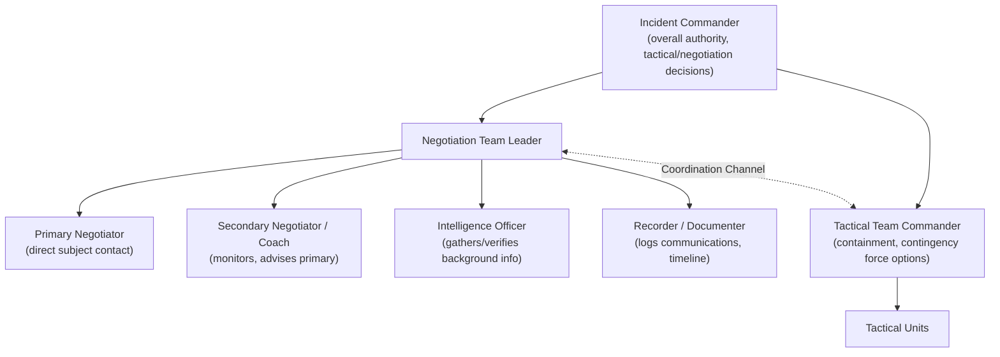
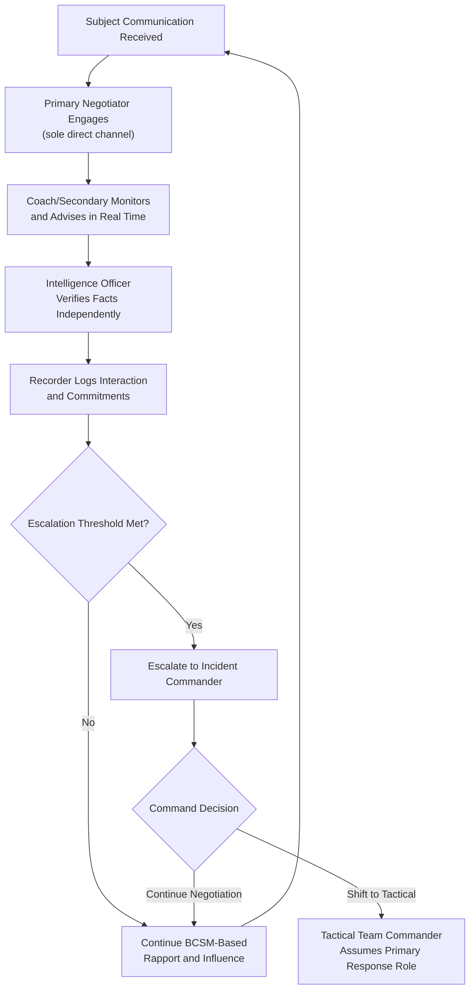

## Communication Protocols in High-Risk Situations

### Definition and Conceptual Foundation

Communication protocols in high-risk situations refer to the structured, standardized procedures governing how information flows between negotiators, command staff, tactical units, and subjects/counterparts during crisis events involving significant threat to life, safety, or critical assets. Unlike ad hoc conversational technique, these protocols establish formal channels, role definitions, message discipline, and escalation procedures designed to function reliably under acute stress, information scarcity, and severe time constraints.

These protocols are most extensively developed in law enforcement crisis/hostage negotiation (following frameworks established by the FBI Crisis Negotiation Unit and adopted, with variation, by many national and municipal law enforcement agencies), but analogous structured-communication principles apply in aviation crew resource management (CRM), emergency medical incident command, military command-and-control, and corporate crisis management (e.g., cyber incident response, product recall crises).

### Core Communication Architecture: The Negotiation Team Structure

Standard crisis negotiation doctrine establishes a multi-role team structure specifically to prevent communication breakdown and single-point failure under stress. This is distinct from ordinary negotiation, which is typically conducted by one or two principals.

**Key Points**

- The **Primary Negotiator** is the sole individual in direct communication with the subject, a deliberate design choice to maintain a consistent voice, tone, and relationship, since introducing multiple direct communicators can fragment rapport built through the Behavioral Change Stairway Model process.
- The **Secondary Negotiator/Coach** monitors the interaction in real time (often via headset or adjacent position), providing the primary with strategic suggestions, emotional regulation support, and an outside perspective, since the primary's own stress and cognitive load during direct engagement can impair objective judgment.
- The **Intelligence Officer** independently verifies subject background, demands, and situational facts (e.g., through family, employer, or database checks), feeding verified information to the negotiation team without directly engaging the subject, maintaining separation between fact-gathering and direct rapport-building functions.
- Formal **documentation/recording** is maintained continuously, serving both operational purposes (tracking commitments, timeline, and stated demands for consistency) and legal/after-action review purposes.
- A **coordination channel** between the negotiation team and tactical command is maintained but functionally separated from direct subject communication, ensuring that negotiation and tactical planning proceed on parallel tracks without either function compromising the other, consistent with the prioritization framework in life-safety crisis doctrine.

### Message Discipline and Consistency Principles

**Key Points**

- **Single point of contact:** Maintaining one primary voice channel to the subject prevents contradictory statements, mixed signals, or exploitable inconsistencies that a subject in a volatile state may interpret as deception or bad faith.
- **Commitment tracking:** Every commitment made by the negotiator (however small, e.g., "I'll check on that and get back to you in five minutes") is logged and must be honored precisely, since even minor broken commitments can undermine the credibility on which the entire BCSM-based rapport process depends.
- **No unilateral promises beyond authority:** Negotiators typically operate within a pre-defined authority envelope and escalate any request exceeding that envelope to command, rather than making commitments they cannot guarantee will be honored by the broader organization or agency.
- **Consistent terminology:** Standardized terminology (e.g., consistent labels for demands, deadlines, and subject identifiers) across the team reduces miscommunication risk during shift changes or when the coach relays information to the primary.

### Escalation and Handoff Procedures

**Key Points**

- Extended high-risk incidents often require negotiator rotation to manage fatigue and sustained stress exposure; formal handoff protocols (structured briefing of the incoming negotiator on rapport status, commitments made, subject emotional state, and unresolved issues) are used to preserve continuity despite personnel changes.
- Escalation thresholds are typically pre-defined (e.g., specific behavioral indicators, explicit threats, or elapsed time without progress) that trigger a shift from negotiation-primary to tactical-primary posture, requiring clear, unambiguous communication criteria to avoid delayed or premature escalation.
- Command retains ultimate decision authority for shifting between negotiated and tactical resolution pathways, with the negotiation team providing real-time input but not typically holding unilateral authority over that determination, reflecting the priority-ordering in which life-safety and overall incident resolution authority sits with the incident commander.

### Radio, Recording, and Technical Communication Discipline

**Key Points**

- Structured radio protocols (e.g., clear channel discipline, standardized call signs, avoidance of jargon accessible to the subject if channels can be overheard) are used to prevent tactical or strategic information from inadvertently reaching the subject.
- All subject-facing communications (phone lines, throw phones, robot-delivered communication devices) are typically recorded in full, both to support the intelligence function and to provide an evidentiary record.
- Redundant communication channels (backup phone lines, alternate contact methods) are established in case primary channels fail or are severed by the subject, a standard contingency practice given the criticality of maintaining contact once established.

### Adaptation to Non-Law-Enforcement High-Risk Contexts

**Aviation Crew Resource Management (CRM) Parallels**

Aviation CRM, developed following research into communication failures as a root cause in commercial aviation accidents (notably following NASA and NTSB research in the late 1970s and 1980s), establishes structured communication protocols including standardized phraseology, closed-loop communication (readback/verification), and explicit authority-gradient management (encouraging junior crew to voice concerns to senior crew through structured assertiveness models). [Inference: while CRM and crisis negotiation communication protocols developed in largely separate professional traditions, both are frequently cited together in high-reliability organization (HRO) literature as convergent solutions to the shared problem of communication failure under stress and time pressure.]

**Cyber Incident and Ransomware Response**

Corporate cyber-crisis response has increasingly adopted structured team-based communication protocols analogous to crisis negotiation: a designated incident commander, a technical intelligence function (forensics team assessing attacker capability and verifying claims), a designated single-channel negotiator (often a specialized ransomware negotiation firm or legal counsel) communicating with the threat actor, and a separate executive/legal decision-making track, mirroring the negotiation-team/tactical-command separation found in law enforcement models.

**Corporate and Public Crisis Communication**

In corporate crises (product recalls, safety incidents, data breaches), structured protocols typically designate a single public-facing spokesperson, an internal command structure separate from the public communication function, and pre-approved message consistency checks, applying the same underlying principle (single, consistent voice; verified information; separated fact-gathering and rapport/relationship functions) adapted to stakeholder and media communication rather than direct subject negotiation.

### Communication Protocol Flow During an Active Incident

### Common Protocol Failures

**Key Points**

- **Multiple uncoordinated voices** reaching the subject (e.g., a family member independently contacting the subject outside the negotiation channel) can undermine rapport and introduce contradictory information, a frequently cited operational risk in hostage negotiation case reviews.
- **Broken or unlogged commitments** due to inadequate documentation discipline, damaging credibility built through the BCSM process.
- **Delayed escalation** due to unclear or subjectively interpreted thresholds, increasing risk in situations requiring a timely shift to tactical resolution.
- **Information silos** between intelligence gathering and the negotiation team, resulting in the primary negotiator operating on outdated or unverified information during active dialogue.
- **Fatigue-driven degradation** in extended incidents without structured rotation and handoff protocols, increasing the likelihood of negotiator error, inconsistent tone, or diminished capacity for accurate risk assessment.

### Practical Implementation Guidance

**Next Steps**

- **Establish role clarity before an incident occurs**, ensuring personnel understand the distinct primary, coach, intelligence, and command functions rather than improvising role division during an active crisis.
- **Pre-define authority envelopes** for negotiators, specifying what commitments can be made independently versus what requires command escalation.
- **Implement mandatory documentation practices** for all commitments and key statements, in real time rather than retrospectively.
- **Build redundant communication channels** into crisis response planning, tested prior to deployment in genuine incidents.
- **Train using realistic simulation**, incorporating multi-role team dynamics rather than single-negotiator scenarios, to build familiarity with handoff and escalation procedures under stress.
- **Apply structural analogues in non-law-enforcement contexts** (cyber incident response, corporate crisis communication) by adapting the single-channel, verified-intelligence, and separated command-function principles even where life-safety stakes are absent.

**Related Topics**

- The Behavioral Change Stairway Model in Crisis Negotiation
- Negotiating Under Extreme Time Pressure and Threat
- Tactical Empathy Techniques
- Crew Resource Management and High-Reliability Organization Theory
- Ransomware and Cyber-Extortion Negotiation Practices
- Incident Command Systems and Command Authority Structures
- Negotiator Fatigue, Rotation, and Psychological Debriefing
- Documentation and Evidentiary Standards in Crisis Negotiation