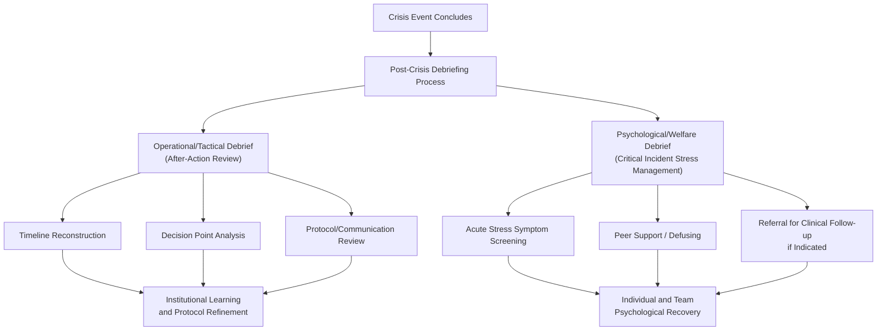

## Post-Crisis Debriefing and Analysis

### Definition and Conceptual Foundation

Post-crisis debriefing and analysis refers to the structured, systematic process conducted after a high-stakes negotiation or crisis event concludes, encompassing both the operational/tactical review (what happened, what worked, what failed) and the psychological/welfare component (supporting personnel who experienced acute stress exposure). This dual function distinguishes crisis debriefing from ordinary post-negotiation review in standard business or diplomatic contexts, since crisis negotiators are frequently exposed to significant psychological stressors including life-threat proximity, moral injury risk (e.g., outcomes involving injury or death despite negotiator effort), and cumulative occupational stress across a career of high-stakes incidents.

The practice draws on two distinct but related traditions: organizational after-action review (AAR) methodology, widely used in military, aviation, and emergency response contexts, and clinical psychological debriefing models developed in traumatic stress research, most notably Critical Incident Stress Debriefing (CISD) and its successors within Critical Incident Stress Management (CISM) frameworks.

### The Two Functions of Post-Crisis Debriefing

**Key Points**

- These two functions are typically conducted as **separate processes**, often with different facilitators and different formats, since combining tactical critique with psychological support in a single session risks undermining the safety needed for genuine emotional processing (a participant may be reluctant to disclose distress if the same session is simultaneously evaluating their tactical performance).
- Both functions feed back into the organization: tactical debriefs refine protocols, training, and future decision-making frameworks, while psychological debriefs support individual recovery and organizational psychological health surveillance over time.

### Operational Debriefing: After-Action Review (AAR) Methodology

**Core AAR Structure**

The after-action review format, originally developed within U.S. Army training doctrine and widely adopted across emergency services, negotiation units, and high-reliability organizations, is typically structured around four core questions:

| AAR Question | Purpose |
| --- | --- |
| What was supposed to happen? | Establishes the baseline plan, protocol, or expected sequence against which actual events are compared |
| What actually happened? | Factual, non-judgmental timeline reconstruction of the actual sequence of events |
| Why were there differences? | Root-cause analysis of gaps between plan and execution, distinguishing situational factors from decision or protocol failures |
| What can be learned/improved? | Actionable recommendations for training, protocol revision, or resource allocation |

**Key Points**

- Effective AAR practice emphasizes a **non-attributional, non-punitive tone** during the factual reconstruction phase, since participants who fear blame are less likely to disclose errors or uncertainties candidly, undermining the accuracy of the "what actually happened" reconstruction (a principle closely related to "just culture" concepts in aviation and healthcare safety literature).
- **Chronological timeline reconstruction** typically draws on the documentation maintained during the incident (see communication protocol logging), radio/phone recordings, and multiple participant accounts (primary negotiator, coach, intelligence officer, command), cross-referenced to identify discrepancies in perception or recall.
- **Decision point analysis** examines specific junctures where alternative choices were available (e.g., escalation timing, specific technique selection, resource deployment) and evaluates the reasoning available to decision-makers *at the time*, rather than solely with the benefit of hindsight, an important methodological safeguard against hindsight bias (the tendency to view past events as having been more predictable than they actually were, well-documented in judgment and decision-making research).

### Root Cause and Contributing Factor Analysis

**Key Points**

- Structured root-cause techniques (e.g., the "5 Whys" method, or more formal fault-tree/fishbone-diagram approaches adapted from industrial safety analysis) are often applied to significant deviations or failures identified during timeline reconstruction, distinguishing proximate causes (the immediate trigger of an issue) from systemic or latent causes (underlying protocol gaps, training deficits, resource constraints).
- Analysis typically considers multiple contributing factor categories: individual performance (technique execution, judgment under stress), team coordination (communication protocol adherence, handoff quality), organizational factors (staffing, training adequacy, equipment), and situational/environmental factors (subject behavior, external constraints, information availability).
- This multi-level analytical approach parallels frameworks used in aviation and healthcare incident investigation (e.g., James Reason's "Swiss cheese model" of organizational accidents), which conceptualizes failures as resulting from the alignment of multiple latent and active weaknesses across system layers rather than a single isolated error.

### Psychological Debriefing: Critical Incident Stress Management (CISM)

**Historical and Theoretical Background**

Critical Incident Stress Debriefing (CISD) was developed by Jeffrey Mitchell in the 1980s, primarily for emergency services personnel, as a structured group process intended to mitigate the psychological impact of acute traumatic exposure and reduce risk of subsequent conditions such as post-traumatic stress disorder (PTSD). CISD is typically delivered as one component within the broader CISM framework, which also includes pre-incident education, one-on-one crisis intervention, and follow-up referral pathways.

**Key Points**

- CISD is traditionally structured around a **seven-phase model**: introduction, fact phase (what happened, factually), thought phase (initial cognitive reactions), reaction phase (emotional impact), symptom phase (physical/psychological symptoms experienced), teaching phase (normalizing stress responses, providing coping information), and re-entry phase (summary, resources, closure).
- [Unverified: Empirical research on single-session CISD's effectiveness at preventing PTSD has produced mixed and, in some systematic reviews, unfavorable findings, with some studies suggesting that mandatory single-session debriefing may not reduce, and in certain populations may modestly increase, later psychological symptoms compared to no intervention or natural recovery; this has led many professional bodies to revise recommendations toward more flexible, needs-based approaches rather than universal mandatory single-session CISD.] Given this evidence base, many contemporary CISM programs now emphasize voluntary participation, peer support "defusing" (a shorter, less structured immediate post-incident conversation), and triaged referral to individual clinical care for those showing significant symptoms, rather than treating group debriefing as a universally effective standalone intervention.
- Distinguishing acute stress reactions (expected, typically self-resolving responses to abnormal events) from clinical conditions requiring intervention (acute stress disorder, PTSD) is a key function of trained CISM peer support personnel and mental health professionals, who typically conduct symptom screening and appropriate referral rather than attempting clinical treatment within the debriefing itself.

### Timing and Sequencing Considerations

**Key Points**

- Immediate post-incident "defusing" (brief, informal peer support conversation, often within hours of the incident) is generally distinguished from formal debriefing (which may occur 24 to 72 hours post-incident, allowing initial acute stress responses to stabilize before structured processing), a sequencing distinction reflected in most CISM program designs.
- Operational/tactical AAR timing varies by incident severity and complexity: brief "hot debriefs" may occur immediately for rapid learning capture, while comprehensive formal AAR sessions, incorporating full documentation review, are typically scheduled after initial recovery time has passed, balancing the value of fresh recall against the risk of conducting substantive critique while personnel remain acutely stressed.
- For extended, multi-day, or highly complex incidents, both operational and psychological debriefing may occur in phases, with interim check-ins during the incident itself (where feasible) and more comprehensive review after full resolution.

### Documentation and Institutional Learning Integration

**Key Points**

- Findings from operational debriefs typically feed into formal after-action reports, which inform revisions to training curricula, protocol documents, equipment procurement, and staffing models, closing the loop between individual incident learning and organizational capability improvement.
- Aggregated, de-identified trend analysis across multiple incidents over time (e.g., recurring communication breakdowns, common decision-point errors) supports broader organizational learning beyond any single event, consistent with high-reliability organization (HRO) principles of continuous, systemic learning from both failures and near-misses.
- Legal and evidentiary considerations often constrain documentation practices in law-enforcement contexts, since after-action materials may be subject to disclosure requirements, discoverable in litigation, or relevant to internal accountability processes, requiring coordination between debriefing practice and legal/records management guidance. [Inference: the specific legal treatment of debriefing records varies substantially by jurisdiction and agency policy, and organizations typically consult legal counsel to establish appropriate documentation protocols.]

### Example

**Example**

Following the resolution of a multi-hour barricade negotiation, the agency conducts two separate processes over the following week. First, within 24 hours, a CISM peer support team conducts voluntary defusing sessions with the negotiation team, screening for acute stress symptoms and providing normalization and coping information, with one team member showing elevated symptoms referred to a clinical psychologist for individual follow-up. Separately, three days later, the negotiation team leader facilitates a formal AAR with the full team (primary negotiator, coach, intelligence officer, tactical liaison), reconstructing the incident timeline from recorded communications and logs, identifying that a 45-minute delay in escalation notification stemmed from ambiguous threshold criteria in the current protocol, and recommending a specific protocol revision to clarify escalation triggers for future incidents. The two processes remain distinct, but both ultimately serve organizational resilience, one supporting individual recovery, the other supporting systemic improvement.

### Common Pitfalls in Post-Crisis Debriefing

**Key Points**

- **Blending tactical critique with psychological support** in a single session, undermining both the psychological safety needed for emotional disclosure and the candor needed for accurate tactical reconstruction.
- **Conducting debrief too soon or too late**: excessively immediate comprehensive tactical review can occur before personnel are psychologically ready for substantive critique, while excessive delay risks recall degradation and reduced institutional urgency to act on findings.
- **Hindsight bias in decision point analysis**, judging past decisions by outcomes and currently available information rather than by what was reasonably knowable to decision-makers at the time.
- **Treating single-session group debriefing as a mandatory, universally effective intervention** despite mixed evidence, rather than adopting a flexible, needs-based, and voluntary approach informed by current trauma-response research.
- **Failure to close the loop institutionally**, where AAR findings and recommendations are documented but not systematically tracked through to actual protocol, training, or resource changes, undermining the incident's value as an organizational learning opportunity.

### Practical Implementation Guidance

**Next Steps**

- **Separate psychological and tactical debriefing processes explicitly**, with different facilitators, formats, and, where appropriate, different timing.
- **Use structured, non-attributional AAR methodology** (what was supposed to happen, what happened, why, what to improve) to support candid, blame-minimized reconstruction.
- **Apply multi-level root-cause analysis** distinguishing individual, team, organizational, and situational contributing factors rather than attributing outcomes to a single cause.
- **Adopt voluntary, needs-based psychological support models** informed by current CISM evidence, rather than defaulting to mandatory single-session group debriefing as a standalone intervention.
- **Establish a formal tracking mechanism** ensuring AAR recommendations translate into actual protocol, training, or resource changes, closing the institutional learning loop.
- **Coordinate with legal counsel** on documentation and record-retention practices given potential disclosure and evidentiary implications specific to the relevant jurisdiction and agency.

**Related Topics**

- Communication Protocols in High-Risk Situations
- Negotiating Under Extreme Time Pressure and Threat
- The Behavioral Change Stairway Model in Crisis Negotiation
- Critical Incident Stress Management (CISM) and Peer Support Programs
- Just Culture and Non-Punitive Safety Reporting Systems
- Hindsight Bias in Organizational Decision Review
- High-Reliability Organization (HRO) Theory
- Occupational Stress and Burnout in Crisis Negotiation Careers