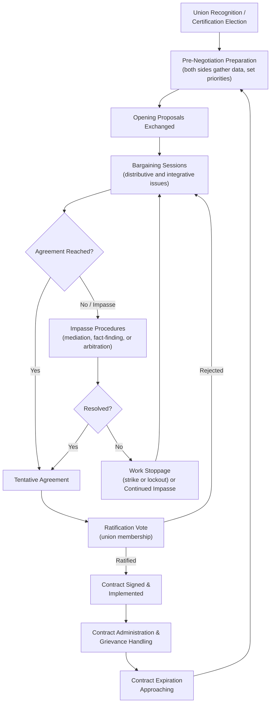

## Labor Relations and Collective Bargaining

### Definition and Conceptual Foundation

Labor relations and collective bargaining refers to the structured negotiation process between organized labor (typically represented by a union) and management (representing an employer or group of employers) over terms and conditions of employment, including wages, benefits, working hours, workplace safety, job security, and grievance procedures. Collective bargaining is distinguished from individual employment negotiation by its representative structure: outcomes bind an entire bargaining unit rather than a single employee, and the process typically operates within a specific legal and institutional framework governing recognition, good-faith bargaining obligations, and dispute resolution mechanisms.

The field draws on foundational labor economics and industrial relations theory, notably the work of John R. Commons and the "Wisconsin School" of institutional labor economics, as well as game-theoretic and behavioral negotiation frameworks applied to the specific structural features of labor-management relations (repeated interaction, legally mandated processes, and the dual-agent nature of union representation).

### Legal and Institutional Framework

**Key Points**

- In the United States, collective bargaining is primarily governed by the National Labor Relations Act (NLRA) of 1935 for private-sector employees, which establishes union recognition procedures, defines unfair labor practices, and imposes a legal duty to bargain in good faith on both parties, administered and enforced by the National Labor Relations Board (NLRB). Public-sector labor relations are governed by a patchwork of federal, state, and local statutes that vary considerably by jurisdiction. [Inference: readers should verify current jurisdiction-specific statutory frameworks, as labor law provisions and their interpretation are subject to legislative amendment and evolving case law.]
- "Good faith bargaining" is a legal standard, not merely an ethical norm, requiring both parties to meet at reasonable times, confer in good faith on mandatory subjects of bargaining, and refrain from certain unfair labor practices (e.g., unilateral changes to mandatory bargaining subjects without negotiation, or bad-faith "surface bargaining" that mimics negotiation without genuine intent to reach agreement).
- Bargaining subjects are typically classified into three categories: **mandatory** subjects (wages, hours, and other terms/conditions of employment, over which parties must bargain if either side raises them), **permissive** subjects (topics either party may raise but need not bargain over, such as certain management structure decisions), and **illegal** subjects (terms that would violate law, such as discriminatory provisions).
- Other jurisdictions maintain distinct frameworks; for example, many European countries operate under sectoral or national-level bargaining systems with different statutory architecture (works councils, sectoral agreements extended by law), reflecting differing institutional traditions in labor relations. [Inference: specific comparative details vary significantly by country and should be verified against current national labor law where cross-jurisdictional accuracy is required.]

### The Collective Bargaining Cycle

**Key Points**

- Collective bargaining is inherently cyclical: contracts have defined terms (commonly one to five years), and the negotiation process recurs at each contract expiration, creating a genuinely repeated-game structure with long-term reputational and relational dynamics distinct from one-shot commercial negotiations.
- **Contract administration and grievance handling** occurs continuously during the life of an agreement and constitutes a substantial, ongoing negotiation function distinct from the periodic full-contract renegotiation, since disputes over contract interpretation and application arise regularly.

### Distributive and Integrative Dimensions in Labor Negotiation

**Distributive Bargaining Elements**

Wage rates, most economic benefit levels, and other zero-sum-appearing allocations typically involve classic distributive bargaining dynamics: anchoring via opening proposals, resistance point (reservation price) estimation for both sides, and a bargaining zone shaped by each side's alternatives (management's alternative being a work stoppage's cost or replacement labor availability; the union's alternative being members' willingness to strike or accept a settlement below target).

$$\text{ZOPA}_{labor} = [\text{Union Resistance Point}, \text{Management Resistance Point}]$$

Where a positive bargaining zone exists when the union's minimum acceptable settlement is below management's maximum acceptable offer; when resistance points do not overlap, formal impasse becomes likely absent a shift in either party's alternatives or priorities.

**Integrative Bargaining Elements**

Many labor negotiation issues admit integrative, value-creating solutions when parties move beyond positional bargaining to interest-based approaches: for example, trading enhanced job security provisions (high union priority, potentially lower direct cost to management) against flexibility in scheduling or work rules (potentially high management priority, lower direct cost to union), consistent with general integrative negotiation theory (Walton and McKersie's foundational 1965 framework, *A Behavioral Theory of Labor Negotiations*, which remains a core theoretical reference in the field).

**Walton and McKersie's Four Subprocesses**

Walton and McKersie's behavioral theory identifies four concurrent subprocesses operating within labor negotiations:

| Subprocess | Description |
| --- | --- |
| Distributive bargaining | Zero-sum allocation of resources between the parties |
| Integrative bargaining | Joint problem-solving to expand mutual gains |
| Attitudinal structuring | Shaping the ongoing relationship, trust level, and attitudes between the parties |
| Intraorganizational bargaining | Negotiation within each side (union leadership with membership; management negotiators with executives/board) to achieve internal consensus on a position |

**Key Points**

- **Intraorganizational bargaining** is a distinctive structural feature of labor negotiation: union negotiators must maintain sufficient support among the membership (who ultimately ratify or reject any tentative agreement) while management negotiators must secure internal executive or board approval, meaning each side's negotiators are simultaneously managing an external negotiation and an internal one.
- **Attitudinal structuring** reflects that labor-management relationships are typically long-term and repeated, making relationship quality (adversarial versus collaborative orientation) itself a variable that both sides can deliberately influence over successive bargaining cycles, connecting to broader reputation-effects and trust-building theory in repeated negotiation.

### Impasse Resolution Mechanisms

**Mediation**

A neutral third party (in the U.S., often through the Federal Mediation and Conciliation Service for private-sector disputes) facilitates continued negotiation without binding authority, helping parties identify creative options, reality-test positions, and manage communication, particularly useful when relationship deterioration or communication breakdown, rather than substantive gaps, is impeding progress.

**Fact-Finding**

A neutral fact-finder investigates the dispute and issues public, non-binding recommendations, often used in public-sector labor disputes where strikes may be legally restricted; the mechanism relies partly on reputational and public-pressure effects to encourage settlement around the fact-finder's recommendations.

**Interest Arbitration**

A neutral arbitrator issues a binding decision establishing the terms of the new contract itself (distinct from grievance/rights arbitration, which interprets an existing contract's application to a specific dispute). Common in public-sector contexts (e.g., police and firefighter bargaining) where strikes are frequently prohibited by statute, interest arbitration substitutes a legally binding third-party determination for the economic leverage that a strike would otherwise provide.

**Work Stoppages (Strikes and Lockouts)**

When negotiation and impasse-resolution mechanisms fail to produce agreement, either party may exercise economic leverage: a **strike** (union members withhold labor) or a **lockout** (employer withholds work), both functioning as costly signals of resolve and mechanisms to shift the other side's calculation of their alternatives, directly analogous to the cost-of-disagreement concept underlying BATNA-based negotiation theory.

### Distinctive Structural Features of Labor Negotiation

**Key Points**

- **Agency and representation dynamics:** Union negotiators are agents representing a heterogeneous membership with potentially divergent individual interests (e.g., senior versus junior employees may prioritize pension improvements versus wage increases differently), requiring internal coalition-building alongside external bargaining, a dynamic well-suited to analysis under agency theory and coalition negotiation frameworks.
- **Public and reputational visibility:** Labor negotiations, particularly in the public sector or at large employers, frequently occur under public and media scrutiny, adding reputational stakes beyond the immediate parties and connecting to broader negotiation literature on audience effects and public commitment.
- **Repeated, long-horizon relationship:** As noted, the same parties typically negotiate repeatedly across contract cycles, making long-term relationship quality and reputation for good-faith dealing materially consequential in ways that can outweigh short-term distributive gains, consistent with repeated-game and reputation-effects theory.
- **Statutory constraints on tactics:** Unlike most commercial negotiation, specific tactics (e.g., unilateral implementation of terms, direct dealing with employees bypassing the union, certain forms of economic pressure) may constitute unfair labor practices with legal consequences, meaning tactical choices are constrained by a formal legal compliance layer largely absent from ordinary business negotiation.

### Example

**Example**

A manufacturing union and management enter negotiations for a new three-year contract. The union's opening proposal emphasizes a 12% wage increase and enhanced health benefits; management's opening counter emphasizes cost containment and flexibility in shift scheduling. Rather than treating this purely distributively, the parties identify an integrative trade: the union values a guaranteed no-layoff clause more than an immediate large wage increase (reflecting membership priorities around job security amid automation concerns), while management values scheduling flexibility more than resisting a modest wage increase (since flexibility reduces overtime costs that otherwise offset wage savings). The resulting tentative agreement includes a moderate wage increase, a limited-term no-layoff guarantee, and revised scheduling flexibility provisions, an outcome exceeding what pure distributive bargaining over wages alone would have produced. The union negotiating committee then conducts internal ratification communication (intraorganizational bargaining) to secure membership approval before the agreement is finalized.

### Common Pitfalls and Failure Modes

**Key Points**

- **Positional rigidity** treating all issues as zero-sum distributive contests, foreclosing integrative trades that could benefit both parties, particularly common when historical relationship adversarialism (poor attitudinal structuring from prior cycles) constrains current-cycle problem-solving.
- **Insufficient intraorganizational alignment**, where a negotiator reaches a tentative agreement that fails ratification because it did not adequately reflect internal constituency priorities, a costly failure mode that can damage negotiator credibility and require reopening negotiations.
- **Surface bargaining risk**: engaging in the formal appearance of negotiation without genuine intent to reach agreement can constitute an unfair labor practice, carrying legal risk beyond the negotiation relationship itself.
- **Escalating adversarialism** across bargaining cycles when attitudinal structuring is neglected, potentially increasing the likelihood and severity of future impasses and work stoppages, illustrating how relationship-level dynamics compound over repeated interactions.

### Practical Guidance for Labor Negotiators

**Next Steps**

- **Map both distributive and integrative dimensions explicitly** before bargaining begins, identifying which issues admit trade-offs based on differing priority weightings between union and management.
- **Manage intraorganizational bargaining deliberately**, maintaining regular communication with the constituency (membership or executives) throughout the process to avoid ratification or approval surprises at the end.
- **Invest in attitudinal structuring across cycles**, recognizing that relationship quality built or damaged in one negotiation carries forward into future contract cycles.
- **Understand applicable impasse-resolution mechanisms** specific to the relevant jurisdiction and sector (mediation, fact-finding, interest arbitration, or strike/lockout rights) before reaching a bargaining impasse.
- **Maintain legal compliance awareness** throughout the process, given that certain tactics carry statutory unfair-labor-practice risk distinct from ordinary negotiation ethics considerations.

**Related Topics**

- Walton and McKersie's Behavioral Theory of Labor Negotiations
- Reputation Effects Across Repeated Interactions
- BATNA Development and Its Effect on Perceived Power
- Mediation and Third-Party Dispute Resolution Mechanisms
- Interest Arbitration in Public-Sector Labor Disputes
- Coalition Negotiation and Multi-Party Bargaining Dynamics
- Unfair Labor Practices and Good-Faith Bargaining Obligations
- Intraorganizational Bargaining and Constituent Ratification Dynamics