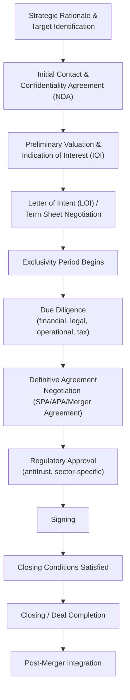

## Mergers, Acquisitions, and Corporate Deal-Making

### Definition and Conceptual Foundation

Mergers, acquisitions, and corporate deal-making refers to the negotiation processes surrounding the combination, purchase, or sale of companies or business units, encompassing strategic rationale development, valuation, deal structuring, due diligence, definitive agreement negotiation, and closing. M&A negotiation is distinguished from most other negotiation domains by its multi-party, multi-phase, and multi-disciplinary structure: a single transaction typically involves simultaneous negotiation across financial, legal, tax, regulatory, and human-capital dimensions, conducted by teams of specialized advisors (investment bankers, lawyers, accountants) representing each principal party.

The field draws on corporate finance theory (valuation methodologies, deal structuring), negotiation theory (distributive and integrative bargaining, information asymmetry management), and behavioral finance/psychology (overconfidence in acquirer decision-making, anchoring in valuation negotiations, escalation of commitment in deal pursuit).

### The M&A Transaction Lifecycle

**Key Points**

- Each phase transition typically involves distinct negotiation dynamics: early-phase negotiation (IOI, LOI) focuses on high-level valuation and deal structure with significant information asymmetry favoring the seller, while later-phase negotiation (definitive agreement) becomes increasingly detailed and legally technical as due diligence narrows information gaps.
- The **Letter of Intent (LOI)** or term sheet is typically non-binding on core commercial terms but often contains binding provisions on specific matters (confidentiality, exclusivity/"no-shop" clauses, governing law), creating an important negotiation dynamic where parties must distinguish which provisions carry genuine legal commitment.
- **Exclusivity ("no-shop") periods** granted to a buyer during LOI negotiation represent a significant negotiated concession by the seller, trading away competitive tension (and thus some leverage) in exchange for typically faster deal certainty and reduced transaction costs, illustrating a direct trade-off between process-level and outcome-level value.

### Valuation as a Negotiation Anchor

**Key Points**

- Valuation methodologies, discounted cash flow (DCF) analysis, comparable company analysis, precedent transaction analysis, and asset-based valuation, are not merely technical exercises but function as negotiation anchors, since each methodology can produce a materially different valuation range depending on assumptions (discount rates, growth projections, comparable selection), and each party's advisors typically select and emphasize the methodology most favorable to their client's position.
- The resulting valuation gap between buyer and seller often reflects genuine differences in risk assessment, growth expectations, or synergy estimation rather than purely tactical positioning, meaning effective M&A negotiators need to distinguish substantive valuation disagreement (requiring analytical resolution) from purely strategic anchoring (requiring negotiation technique).
- **Earnout structures** (contingent payments tied to future performance) function as a specific integrative mechanism for resolving valuation gaps rooted in genuine disagreement about future performance: rather than settling on a single compromise price, parties can structure payment to be contingent on which party's performance projections prove accurate, converting a valuation dispute into a risk-allocation mechanism.

$$\text{Total Consideration} = \text{Upfront Payment} + \sum_{t=1}^{n} \frac{\text{Contingent Payment}_t}{(1+r)^t} \quad \text{if performance targets met}$$

Where the earnout component allows optimistic sellers (who believe future performance will be strong) and more conservative buyers (who discount those projections) to reach agreement despite differing beliefs, since each party's expected value calculation can support the same contractual structure under their respective beliefs.

### Deal Structure Negotiation

**Asset Purchase vs. Stock Purchase**

A foundational structural negotiation determines whether a transaction is structured as an asset purchase (buyer acquires specific assets and liabilities) or a stock/equity purchase (buyer acquires ownership of the entity itself, including all assets and liabilities by default). This choice carries substantial tax, liability, and contractual-assignment implications for both parties, making structure itself a significant negotiation lever independent of headline price. [Inference: specific tax and liability consequences vary by jurisdiction and transaction-specific facts; parties typically rely on tax and legal counsel rather than general negotiation frameworks for these determinations.]

**Consideration Mix**

Negotiating whether consideration is paid in cash, acquirer stock, seller notes, or a combination affects risk allocation (stock consideration exposes the seller to post-closing acquirer performance risk), tax treatment, and financing requirements, functioning as another integrative lever, since parties with different risk tolerances or tax positions may derive different value from otherwise economically similar total consideration.

**Representations, Warranties, and Indemnification**

Extensive negotiation in the definitive agreement centers on representations and warranties (factual assurances about the target business) and indemnification provisions (allocating risk if those representations prove false), including negotiated caps, baskets/deductibles, and survival periods. This represents a distinctly legal-technical negotiation layer where risk allocation is negotiated through detailed contractual mechanics rather than headline price adjustment.

### Due Diligence as an Information-Asymmetry Reduction Process

**Key Points**

- Due diligence functions, in negotiation-theoretic terms, as a structured mechanism for reducing the information asymmetry inherent in M&A transactions (the seller typically knows materially more about the target business than the buyer, a classic "lemons problem" per Akerlof's foundational adverse-selection framework).
- Findings during due diligence frequently trigger renegotiation of previously agreed LOI terms (a "re-trade"), a common and often contentious dynamic where buyers leverage newly discovered issues (undisclosed liabilities, weaker-than-represented financial performance) to negotiate price reductions or additional protective provisions, testing the practical weight of the LOI's non-binding nature on commercial terms.
- Sellers can proactively manage this dynamic through **sell-side due diligence** (commissioning independent diligence before marketing the business) or **vendor due diligence reports**, reducing the informational surprise available to buyers and potentially strengthening the seller's negotiating position by demonstrating transparency, connecting to broader signaling theory in negotiation (costly, credible disclosure as a trust-building mechanism).

### Multi-Party and Competitive Dynamics

**Key Points**

- Auction processes (formal sale processes run by investment banks soliciting multiple bidders) fundamentally alter negotiation dynamics compared to bilateral negotiation, since competitive tension among multiple bidders substitutes for individual negotiating leverage, often compressing the negotiation timeline and limiting the scope for extensive back-and-forth on individual terms.
- **Management's dual role** in many transactions (particularly management buyouts or transactions where existing management will continue post-closing) creates an agency and conflict-of-interest dimension, since management may simultaneously represent the selling entity's interests while personally negotiating their own post-closing employment or equity terms, a dynamic requiring specific governance safeguards (special committees, independent advisors) in many jurisdictions.
- **Activist investor and hostile takeover dynamics** introduce additional negotiation complexity when a potential acquirer bypasses friendly board-level negotiation in favor of direct shareholder appeals (tender offers, proxy contests), shifting the negotiation battleground from bilateral deal terms to a broader public and shareholder-relations contest.

### Behavioral and Psychological Dynamics in M&A Negotiation

**Key Points**

- **Acquirer overconfidence** is well-documented in M&A research as a contributing factor to value-destroying acquisitions, where executives systematically overestimate synergy realization and underestimate integration difficulty, a pattern consistent with broader overconfidence bias research and connected to the "winner's curse" phenomenon in competitive bidding contexts (the winning bidder in a competitive process is statistically more likely to have overestimated the asset's value).
- **Escalation of commitment** (sunk-cost-driven persistence in a deal pursuit despite deteriorating economics or emerging red flags) is a recognized risk in extended M&A processes, particularly after significant time, advisory fees, and reputational capital have been invested in pursuing a specific target, connecting to broader behavioral decision-making research on sunk cost fallacy.
- **Deal fatigue** in extended negotiations can lead to premature concessions on important but seemingly secondary issues (e.g., detailed indemnification mechanics) as parties prioritize reaching closing over optimizing every contractual term, a dynamic negotiation teams often explicitly guard against through structured issue-tracking and negotiation authority protocols.

### Example

**Example**

A strategic acquirer negotiates to purchase a privately held technology company. The seller's DCF-based valuation, built on aggressive growth assumptions, produces a materially higher valuation than the acquirer's comparable-company-based analysis, which discounts the target's projected growth given market conditions. Rather than settling purely on a compromise price reflecting neither party's full confidence, the parties negotiate an earnout structure: a lower upfront cash payment supplemented by additional payments over two years contingent on the target achieving specific revenue milestones. This allows the seller to capture the full value of their growth thesis if it proves correct, while limiting the acquirer's downside risk if growth falls short of projections, an integrative resolution of what began as a purely distributive valuation gap. During subsequent due diligence, the acquirer discovers a previously undisclosed customer concentration risk, triggering a renegotiation of specific indemnification terms (a targeted, narrower representation and a dedicated indemnity basket for that specific risk) rather than reopening the entire valuation discussion, illustrating how due diligence findings are typically addressed through structural, mechanism-specific adjustments rather than wholesale renegotiation.

### Common Pitfalls in M&A Negotiation

**Key Points**

- **Conflating non-binding LOI terms with final commitments**, leading to disputes or trust erosion when subsequent due diligence or definitive agreement negotiation adjusts previously discussed terms.
- **Over-anchoring on a single valuation methodology** without engaging substantively with the counterpart's differing assumptions, prolonging distributive standoffs that structural mechanisms like earnouts could resolve more efficiently.
- **Underinvesting in sell-side preparation**, entering a sale process without proactive due diligence, leaving the seller more exposed to buyer-driven re-trades during the process.
- **Escalation of commitment to a specific target** despite emerging diligence red flags, driven by sunk costs in advisory fees, time, and reputational investment in "getting the deal done."
- **Neglecting integration planning during negotiation**, since many empirically observed M&A value-destruction outcomes are attributed to post-closing integration failures that could have been anticipated and partially addressed through negotiated provisions (retention agreements, transition services agreements) during the deal process itself. [Inference: the specific attribution of M&A value destruction to integration failure versus overpayment versus other factors varies across studies and is an active area of empirical corporate finance research.]

### Practical Guidance for M&A Negotiators

**Next Steps**

- **Clarify binding versus non-binding provisions explicitly** at each stage (LOI, term sheet) to manage expectations and reduce disputes when terms evolve during diligence.
- **Consider earnouts and contingent consideration structures** proactively when valuation gaps stem from genuine differences in performance expectations rather than purely tactical positioning.
- **Invest in sell-side due diligence** when representing a seller, to reduce information-asymmetry-driven re-trade risk and support a stronger negotiating position.
- **Establish clear negotiation authority and issue-tracking protocols** for extended transactions to guard against deal-fatigue-driven premature concessions on secondary but consequential terms.
- **Address post-closing integration considerations during negotiation**, not solely afterward, including key employee retention and transition mechanics, given the documented link between integration planning and overall deal value realization.

**Related Topics**

- Information Asymmetry and the "Lemons Problem" in Negotiation
- Anchoring Effects in Valuation-Based Negotiations
- Overconfidence Bias and the Winner's Curse in Competitive Bidding
- Escalation of Commitment and Sunk Cost Fallacy in Deal Pursuit
- Earnouts and Contingent Consideration as Integrative Mechanisms
- Due Diligence as a Signaling and Trust-Building Process
- Multi-Party and Auction Negotiation Dynamics
- Post-Merger Integration Planning and Negotiated Retention Structures