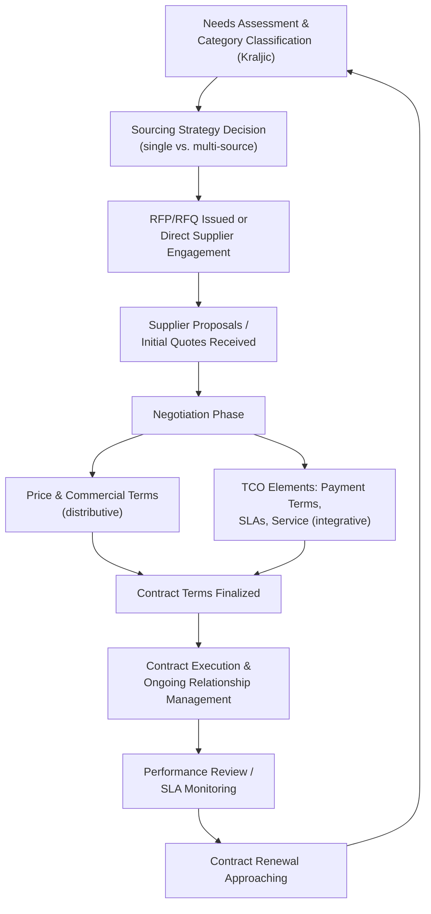

## Sales, Procurement, and Vendor Negotiation

### Definition and Conceptual Foundation

Sales, procurement, and vendor negotiation encompasses the commercial negotiation processes governing the exchange of goods and services between buying and selling organizations, spanning transactional one-time purchases, ongoing supply agreements, and complex strategic sourcing relationships. This domain is distinguished by its recurring, often long-term relational structure (many buyer-supplier relationships persist across multiple negotiation cycles), its frequent embedding within formal organizational procurement processes (competitive bidding, request-for-proposal procedures, approved vendor lists), and its dual character combining price-focused distributive bargaining with total-cost-of-ownership and relationship-value considerations that support integrative approaches.

The field draws on classic distributive and integrative negotiation theory (Walton and McKersie; Fisher, Ury, and Patton's principled negotiation framework), supply chain management theory (total cost of ownership, supplier relationship management frameworks), and power-dependence theory as applied to buyer-supplier relationships.

### Buyer-Supplier Power Dynamics

**Key Points**

- Negotiating leverage in sales and procurement contexts is substantially shaped by structural market factors rather than purely by individual negotiator skill: the concentration of buyers versus suppliers in a given market, switching costs, product differentiation, and the availability of substitute goods or alternative counterparts all shape each party's effective BATNA.
- The **Kraljic Matrix**, a widely used procurement portfolio framework developed by Peter Kraljic (1983), classifies purchased items along two dimensions, profit impact (or supply value) and supply risk (or market complexity), to guide differentiated negotiation and sourcing strategy.

| Kraljic Category | Profit Impact | Supply Risk | Typical Negotiation Approach |
| --- | --- | --- | --- |
| Non-critical/Routine items | Low | Low | Efficient transactional negotiation; minimize process cost |
| Leverage items | High | Low | Competitive bidding; exploit buyer power for favorable terms |
| Bottleneck items | Low | High | Secure supply continuity; relationship management over price optimization |
| Strategic items | High | High | Deep collaborative, integrative partnership negotiation |

- This framework directly informs negotiation strategy selection: leverage-category items typically favor aggressive distributive tactics (multiple competing bids, reverse auctions) given genuine buyer power, while strategic and bottleneck items typically favor integrative, relationship-preserving approaches given the buyer's genuine dependence on continuity or the value of joint innovation.

### Distributive Elements in Sales and Procurement

**Anchoring and First-Offer Dynamics**

Sales negotiations frequently begin with a supplier-provided list price or initial quote functioning as an anchor; procurement counter-anchoring (an aggressive initial counteroffer or target price communicated early) is a standard distributive technique to shift the effective bargaining range, consistent with general anchoring research in negotiation.

**Competitive Bidding and Reverse Auctions**

Structured competitive processes (requests for proposal/quotation, and increasingly, electronic reverse auctions where suppliers submit successively lower bids in real time) are used, particularly for leverage-category purchases, to convert what might otherwise be bilateral negotiation into a multilateral competitive dynamic, shifting leverage toward the buyer by making alternative suppliers' presence explicit and salient rather than merely a background BATNA consideration.

**Volume and Commitment-Based Pricing**

Tiered pricing structures tied to purchase volume or duration commitments function as a distributive mechanism allowing suppliers to offer lower unit prices in exchange for demand certainty, converting a portion of what might be a pure price negotiation into a volume-risk trade-off.

### Integrative Elements: Total Cost of Ownership and Relationship Value

**Key Points**

- **Total Cost of Ownership (TCO)** analysis extends negotiation focus beyond unit price to encompass the full lifecycle cost of a purchase, acquisition price, transportation, quality/defect costs, inventory carrying costs, payment terms, and service/support costs, creating substantially more room for integrative trades than a price-only negotiation frame permits.

$$\text{TCO} = P_{unit} \times Q + C_{transport} + C_{quality} + C_{inventory} + C_{service} - V_{payment\ terms}$$

Where a buyer and supplier with different cost structures or capabilities can often identify trades (e.g., extended payment terms in exchange for a higher unit price, or consignment inventory arrangements) that reduce one party's TCO more than they cost the other, consistent with general integrative bargaining logic of identifying differently-valued concessions.

- **Payment terms** as a negotiation lever: extended payment terms benefit buyer cash flow while potentially costing suppliers financing costs; this trade-off's relative value depends heavily on each party's cost of capital, meaning payment terms often represent genuine integrative value rather than a pure distributive transfer, particularly when the buyer's cost of capital is lower than the supplier's.
- **Service level agreements (SLAs) and quality guarantees** can be negotiated as risk-allocation mechanisms analogous to earnouts in M&A: rather than settling on a single price reflecting uncertain future performance, parties can tie a portion of compensation or penalties to actual delivered performance, aligning incentives and reducing the need to resolve underlying performance-expectation disagreements through price alone.

### Strategic Sourcing and Supplier Relationship Management

**Key Points**

- **Strategic partnership negotiations** for high-value, high-dependency relationships (per the Kraljic strategic quadrant) increasingly incorporate joint value-creation elements beyond the immediate transaction: joint process improvement initiatives, shared innovation or co-development arrangements, and risk-sharing mechanisms, reflecting a shift in some industries (particularly automotive and technology manufacturing) from purely adversarial procurement toward collaborative supplier relationship management (SRM) models.
- **Single-sourcing versus multi-sourcing strategy** represents a foundational negotiation and risk-management decision: single-sourcing can secure better pricing and deeper collaboration (higher supplier dependence on the relationship) but increases supply continuity risk, while multi-sourcing preserves competitive tension and continuity but typically sacrifices some pricing leverage achievable through volume concentration.
- **Category management approaches** in mature procurement organizations apply differentiated negotiation playbooks by spend category (aligned with Kraljic-style classification), reflecting institutional recognition that a single negotiation approach is suboptimal across a heterogeneous purchasing portfolio.

### The Sales-Side Perspective

**Key Points**

- From the selling organization's perspective, negotiation strategy typically differentiates by customer segment and deal size: high-volume, low-margin transactional sales often rely on standardized pricing with limited negotiation flexibility (sometimes explicitly, as in fixed-price retail or e-commerce contexts), while enterprise or strategic account sales typically involve extensive, multi-stakeholder negotiation incorporating customization, service levels, and long-term contract value.
- **Value-based selling** approaches explicitly aim to shift negotiation away from price-only distributive bargaining by quantifying and communicating the buyer's total value received (cost savings, revenue enablement, risk reduction), functioning as a sales-side application of the interests-based, value-creation orientation central to integrative negotiation theory.
- **Discount and concession management discipline** on the sales side (e.g., requiring documented business justification for discounts beyond a certain threshold, or trading discounts only against specific reciprocal concessions such as longer contract terms or referenceable case studies) helps prevent unstructured concession erosion, a common failure mode where sequential ad hoc discounting compounds into significantly reduced margin without corresponding buyer commitments.

### Negotiation Flow in Complex B2B Procurement

### Example

**Example**

A manufacturing company negotiates an annual supply contract for a critical, single-source component (a Kraljic "strategic" item given high supply risk and high profit impact). Rather than pursuing an aggressive price-only negotiation that might strain a relationship on which the buyer is highly dependent, the procurement team pursues a TCO-based negotiation: accepting a modest unit price increase in exchange for a supplier commitment to a specific defect-rate SLA with associated penalty provisions, extended payment terms reflecting the buyer's lower cost of capital, and a joint quarterly forecasting process to reduce the supplier's own inventory carrying costs. This integrative structure reduces the buyer's effective TCO despite the higher unit price, while giving the supplier improved demand visibility and predictable payment, illustrating how strategic-category negotiations typically favor TCO and relationship-based integrative structuring over unit-price distributive contests.

### Common Pitfalls

**Key Points**

- **Price fixation on strategic or bottleneck items**, applying aggressive distributive tactics appropriate for leverage-category purchases to relationships where supply continuity or collaboration value substantially outweighs marginal price gains, risking relationship damage disproportionate to the price benefit achieved.
- **Ignoring total cost of ownership** in favor of unit-price-only comparison, potentially selecting suppliers or terms that appear cheaper but generate higher downstream costs (quality issues, inventory inefficiency, poor service responsiveness).
- **Unstructured concession erosion** on the sales side, where sequential discounting without reciprocal buyer commitments compounds into significant margin loss over a negotiation or relationship lifecycle.
- **Underinvesting in supplier relationship management** for strategic-category suppliers, treating each contract renewal as an isolated transactional negotiation rather than leveraging the repeated, long-term relationship structure for compounding integrative value, consistent with broader reputation-effects and repeated-game negotiation theory.
- **Misclassifying purchase categories**, applying a uniform sourcing and negotiation strategy across a heterogeneous portfolio rather than differentiating approach by genuine profit impact and supply risk characteristics.

### Practical Guidance

**Next Steps**

- **Classify purchases using a framework such as the Kraljic Matrix** before determining negotiation strategy, differentiating aggressive competitive approaches for leverage items from collaborative approaches for strategic and bottleneck items.
- **Negotiate using total cost of ownership rather than unit price alone**, identifying payment terms, service levels, and volume/duration commitments as potential integrative trade variables.
- **Establish concession-management discipline** (particularly on the sales side) requiring reciprocal value for significant discounts rather than unstructured price erosion.
- **Invest deliberately in supplier or customer relationship management** for high-dependency, repeated relationships, recognizing the compounding value of trust and collaboration across multiple negotiation cycles.
- **Consider risk-sharing mechanisms** (SLA-linked penalties/incentives) to resolve performance-expectation disagreements without requiring full resolution through price alone.

**Related Topics**

- The Kraljic Matrix and Strategic Sourcing Classification
- Total Cost of Ownership Analysis in Procurement Negotiation
- Anchoring and First-Offer Strategy
- Value-Based Selling and Interest-Based Sales Negotiation
- Supplier Relationship Management and Long-Term Partnership Negotiation
- Reputation Effects Across Repeated Interactions
- Reverse Auctions and Competitive Bidding Mechanisms
- BATNA Development and Its Effect on Perceived Power