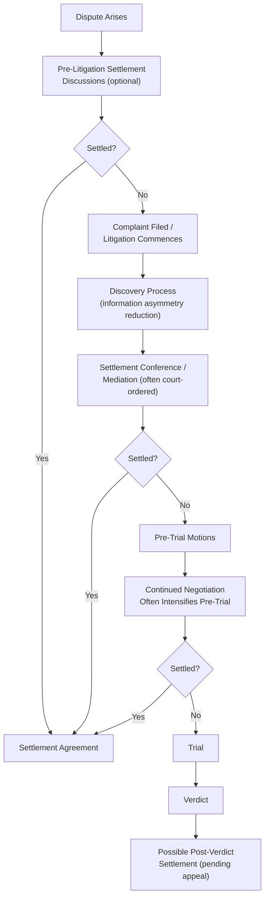

## Legal Settlement and Litigation Negotiation

### Definition and Conceptual Foundation

Legal settlement and litigation negotiation refers to the negotiation processes surrounding the resolution of legal disputes outside of, or in the shadow of, formal adjudication, spanning pre-litigation settlement discussions, negotiation during active litigation, and settlement conferences facilitated by courts or mediators. This domain is distinguished by its explicit embedding within a formal legal and procedural framework: negotiated outcomes are shaped by the parties' predicted litigation outcomes, procedural rules governing disclosure and evidence, professional ethical obligations on counsel, and the availability of binding adjudication as an ever-present alternative to agreement.

The field draws heavily on the "bargaining in the shadow of the law" framework developed by Robert Mnookin and Lewis Kornhauser (1979), which conceptualizes settlement negotiation as fundamentally shaped by each party's prediction of litigation outcomes, alongside standard distributive and integrative negotiation theory, decision-analytic frameworks (expected value calculation), and behavioral law-and-economics research on litigant psychology.

### Bargaining in the Shadow of the Law

**Key Points**

- The Mnookin-Kornhauser framework holds that settlement negotiations are structured around each party's assessment of the expected outcome at trial, discounted by litigation costs, time value of money, and risk preferences, meaning legal rules and predicted judicial outcomes function as a background anchor shaping the bargaining zone even though the parties are negotiating privately rather than adjudicating.
- This framework implies that changes in substantive law, procedural rules, or even perceived shifts in judicial tendencies can shift settlement negotiation dynamics without any change in the specific facts of a given dispute, since the "shadow" cast by anticipated legal outcomes moves the reference point around which parties bargain.
- Legal negotiation is thus doubly structured: by the underlying negotiation dynamics common to all bargaining (interests, BATNA, anchoring) and by the parties' shared, though often divergent, predictions about a specific external adjudicative process that would apply if negotiation fails.

### Expected Value Framework for Settlement Analysis

A foundational analytical tool in litigation negotiation is the expected value (EV) calculation, used by both plaintiff and defense counsel to establish a rational settlement range:

$$EV_{plaintiff} = (P_{win} \times \text{Damages}_{if\ won}) - C_{litigation} - C_{time}$$

$$EV_{defendant} = -(P_{lose} \times \text{Damages}_{if\ lost}) - C_{litigation} - C_{reputational}$$

Where $P_{win}$ and $P_{lose}$ represent each side's subjective probability of a favorable/unfavorable verdict, $\text{Damages}$ reflects anticipated award magnitude, and $C_{litigation}$ captures attorney fees, expert witness costs, and other litigation expenses that accrue regardless of outcome.

**Key Points**

- A settlement bargaining zone exists when the plaintiff's minimum acceptable settlement (informed by their EV calculation, adjusted for risk aversion) is below the defendant's maximum acceptable settlement, mirroring standard ZOPA analysis but with the reservation points derived from litigation-outcome modeling rather than purely commercial alternatives.
- **Divergent probability estimates** between plaintiff and defense counsel (each side's attorneys often genuinely and non-strategically assess $P_{win}$ differently, sometimes influenced by advocate overconfidence in their own case) are a major driver of settlement failure, since a wide gap between each side's perceived probability of success can eliminate any positive bargaining zone even when both sides are negotiating in good faith. [Inference: the extent to which such divergence reflects genuine differing professional judgment versus strategic posturing varies by case and is often difficult to disentangle in practice.]
- **Litigation cost asymmetry** (e.g., a well-resourced defendant able to sustain protracted litigation versus a plaintiff with limited resources) materially shifts effective bargaining leverage independent of the underlying merits, since the cost of pursuing the "no deal" alternative differs substantially between parties, directly analogous to BATNA asymmetry in general negotiation theory.

### Risk Aversion and Litigant Psychology

**Key Points**

- Litigants are frequently risk-averse regarding potential losses and, per prospect theory (Kahneman and Tversky), may exhibit asymmetric risk preferences depending on whether they are in a perceived "gains" or "losses" frame: a plaintiff (typically framed as pursuing a gain) may be more risk-averse and thus more willing to settle for a certain amount below expected trial value, while a defendant (typically framed as avoiding a loss) may be more risk-seeking and thus more willing to gamble on trial rather than accept a certain settlement cost, a pattern with some empirical support in litigation behavior research. [Inference: the strength and consistency of this framing effect in real-world litigation settlement behavior, as opposed to controlled experimental settings, remains an area of ongoing empirical study and may vary by case type and stakes.]
- **Endowment effects and loss aversion** can also affect settlement negotiation when a party has already "banked" a favorable early ruling or procedural win, potentially increasing reluctance to settle for less than the perceived value of the position already secured, even when objectively rational EV analysis might favor settlement.
- **Emotional and non-monetary factors** (desire for vindication, public acknowledgment of wrongdoing, apology, or simply litigation fatigue and stress) frequently operate alongside purely monetary EV calculations, meaning purely quantitative settlement models, while analytically useful, typically require supplementation with qualitative assessment of party interests beyond damages figures, consistent with general interests-based negotiation theory (Fisher and Ury) applied to the legal context.

### Structural and Procedural Features Unique to Legal Negotiation

**Key Points**

- **Attorney-client agency dynamics**: settlement negotiation is typically conducted by counsel on behalf of clients, introducing an agency layer where attorney incentives (contingency fee structures, hourly billing incentives, reputational concerns with opposing counsel encountered repeatedly across cases) may not perfectly align with client interests, requiring attorneys to navigate both external negotiation with opposing counsel and internal negotiation/counseling with their own client regarding settlement authority and expectations.
- **Discovery as an information-exchange mechanism**: formal discovery procedures (document production, depositions, interrogatories) function partly as a structured, legally mandated information-exchange process that reduces information asymmetry between parties over the course of litigation, meaning settlement negotiation dynamics often shift materially as litigation progresses and discovery narrows factual disputes, distinct from most commercial negotiation where information exchange is voluntary and strategic.
- **Confidentiality and settlement privilege**: many jurisdictions provide evidentiary protections for settlement negotiation communications (e.g., inadmissibility of settlement offers as evidence of liability), designed explicitly to encourage candid settlement discussion without fear that concessions or offers will be used against a party if negotiation fails, a structural feature largely absent from ordinary commercial negotiation. [Inference: the precise scope of such protections varies by jurisdiction and evidentiary rule, and parties should consult applicable local rules rather than assume uniform protection.]
- **Court-connected settlement mechanisms**: many court systems mandate or strongly encourage settlement conferences, mediation, or other alternative dispute resolution (ADR) procedures at specific procedural junctures, embedding negotiation directly within the formal litigation timeline rather than leaving it purely to party discretion.

### The Litigation-Negotiation Timeline

**Key Points**

- Settlement rates increase measurably as trial approaches in many empirical studies of litigation behavior, often attributed to the combined effect of narrowing uncertainty (as discovery resolves factual questions), rising imminent litigation costs (trial preparation expenses), and heightened salience of trial risk as the "shadow of the law" becomes less abstract and more immediate. [Inference: specific settlement-rate patterns vary considerably by jurisdiction, case type, and court, and general patterns observed in aggregate litigation research should not be assumed to predict any individual case's trajectory.]
- Mediation, whether court-ordered or voluntary, introduces a neutral third party to facilitate settlement discussion without binding authority, often valuable in litigation contexts specifically because it allows a neutral evaluator to test each side's case assessment and probability estimates, potentially narrowing the divergent-probability-estimate problem identified above.

### Ethical and Professional Considerations

**Key Points**

- Attorneys negotiating settlements typically operate under professional conduct rules (e.g., in the U.S., state-adopted versions of the ABA Model Rules of Professional Conduct) governing candor, communication of settlement offers to clients, and prohibitions on certain misrepresentations during negotiation, layering a formal ethical compliance framework onto general negotiation ethics considerations. [Inference: specific professional conduct rules vary by jurisdiction and bar association; practitioners should consult applicable local rules directly.]
- **Client communication obligations**: attorneys are typically obligated to communicate settlement offers to clients regardless of the attorney's own recommendation, and settlement authority ultimately rests with the client rather than counsel, an important structural constraint on attorney negotiating authority distinct from many commercial agency relationships where an agent may hold broader independent authority.

### Example

**Example**

A plaintiff's counsel assesses a 60% probability of prevailing at trial with anticipated damages of $500,000 if successful, against estimated litigation costs of $80,000 through trial. This yields an expected value of approximately $220,000 (0.6 × $500,000 − $80,000), before accounting for risk aversion and time value considerations. Defense counsel, assessing the plaintiff's win probability at only 40% given a differing read of key evidence, calculates a materially lower expected liability exposure. This divergence in probability assessment initially produces little or no overlapping settlement range. Following a court-ordered mediation, a neutral mediator's independent case evaluation narrows this gap by providing both sides an outside perspective on likely trial outcome, and the parties settle at $260,000, a figure within a bargaining zone informed by, but not strictly derived from, either side's original expected value calculation, reflecting the role mediation can play in resolving divergent-probability settlement impasses.

### Common Pitfalls

**Key Points**

- **Advocate overconfidence** in one's own case assessment, leading to inflated $P_{win}$ estimates that eliminate a genuine bargaining zone despite an underlying settlement being economically rational for both sides.
- **Neglecting non-monetary interests** (vindication, apology, confidentiality, ongoing relationship preservation) by focusing exclusively on damages-based expected value calculations, potentially missing integrative settlement structures that address underlying interests more efficiently than monetary compromise alone.
- **Poor attorney-client settlement authority management**, where counsel negotiates without adequately clarified client settlement parameters, risking either overstepping authority or failing to respond to a genuine settlement opportunity due to unclear internal authorization.
- **Escalating litigation costs eroding settlement value** through prolonged, unnecessarily adversarial pre-settlement litigation activity, reducing the effective surplus available for settlement as accruing costs consume potential settlement value for both parties.
- **Failure to leverage court-connected ADR mechanisms** effectively, treating mandatory mediation as a procedural formality rather than a genuine opportunity to narrow probability-estimate divergence through neutral case evaluation.

### Practical Guidance for Legal Negotiators

**Next Steps**

- **Conduct rigorous, honest expected-value analysis** early and revisit it as discovery narrows factual and legal uncertainty, guarding against advocate overconfidence through structured, non-adversarial internal case assessment.
- **Clarify settlement authority and client parameters** proactively and maintain clear communication obligations regarding offers received.
- **Identify non-monetary interests** (confidentiality, apology, ongoing relationship, precedent-setting concerns) that may support integrative settlement structures beyond pure damages negotiation.
- **Leverage mediation and neutral case evaluation** deliberately to address divergent probability estimates rather than treating court-ordered ADR as a procedural checkbox.
- **Monitor accruing litigation costs** as a dynamic factor in ongoing settlement calculus, recognizing that the rational settlement range shifts as costs accrue and trial approaches.

**Related Topics**

- Bargaining in the Shadow of the Law (Mnookin and Kornhauser)
- Prospect Theory and Risk Framing in Negotiation
- BATNA Development and Its Effect on Perceived Power
- Mediation and Third-Party Dispute Resolution Mechanisms
- Attorney-Client Agency Dynamics in Settlement Authority
- Overconfidence Bias and Debiasing Techniques in Negotiation Preparation
- Interests-Based Negotiation Beyond Monetary Compromise
- Discovery and Information Asymmetry Reduction in Litigation