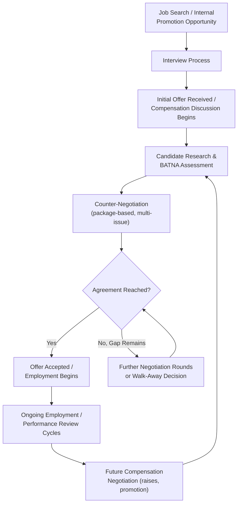

## Salary, Compensation, and Employment Negotiation

### Definition and Conceptual Foundation

Salary, compensation, and employment negotiation refers to the negotiation processes between individual job candidates or employees and employers over the terms of employment, encompassing base salary, variable compensation (bonuses, commissions, equity), benefits, working conditions, title, and non-monetary terms (flexibility, remote work, professional development). This domain is distinguished from most other negotiation contexts by its pronounced information asymmetry (employers typically possess better information about internal salary bands and comparable compensation than individual candidates), its embedding within an ongoing employment relationship with significant power and dependency dynamics, and its substantial psychological and social-identity dimensions, given that compensation often carries symbolic meaning about a person's perceived value beyond its purely economic content.

The field draws on general distributive and integrative negotiation theory, labor economics (information asymmetry, signaling theory as applied to job candidates), and a substantial body of behavioral and social-psychological research specifically focused on individual salary negotiation behavior, including extensively studied gender differences in negotiation propensity and outcomes.

### Information Asymmetry and Its Strategic Implications

**Key Points**

- Employers typically possess systematically better information than individual candidates regarding internal salary bands, budget flexibility, comparable employee compensation, and the true urgency or difficulty of filling the position, creating a structural information asymmetry that shapes much of the strategic advice literature in this domain.
- **Pay transparency legislation** in an increasing number of jurisdictions (requiring salary range disclosure in job postings or upon request) has been changing this information landscape [Inference: the specific jurisdictions, disclosure requirements, and effective dates of such legislation vary and continue to evolve, so current local requirements should be verified directly rather than assumed from general awareness of the trend], reducing though not eliminating the underlying information asymmetry that has historically favored employers in this negotiation context.
- Candidates can partially offset information asymmetry through pre-negotiation research (industry salary surveys, platforms aggregating self-reported compensation data, professional network inquiries), functioning as a preparation-stage analog to due diligence in other negotiation domains, directly supporting more accurate BATNA and target-point calibration.

### The "First Offer" and Anchoring Dynamics

**Key Points**

- Anchoring research in negotiation broadly (and salary negotiation specifically) suggests that whoever makes the first credible, well-justified offer often shapes the subsequent bargaining range disproportionately, since counteroffers are frequently generated as adjustments from the initial anchor rather than fully independent assessments, consistent with anchoring-and-adjustment heuristic research (Tversky and Kahneman).
- This creates a strategic tension for candidates: making the first offer risks under-anchoring (leaving value on the table if the candidate's figure is lower than the employer's actual budget) but can also proactively establish a higher reference point than the employer might have initially proposed, provided the candidate has sufficient market data to justify a credible, ambitious anchor.
- Many negotiation practitioners recommend that when facing genuine information asymmetry (uncertain employer budget), candidates deflect being the first to name a specific figure where socially and contextually appropriate (e.g., "I'd like to learn more about the role and the budgeted range before discussing specific numbers"), while investing in research to be prepared for an ambitious anchor when a number must be named, balancing anchoring theory against the genuine information-asymmetry risk of under-anchoring.

### Structuring the Full Compensation Package

**Key Points**

- Framing salary negotiation as a **multi-issue package negotiation** rather than a single-issue price negotiation substantially increases the potential for integrative, mutually beneficial outcomes, since base salary, signing bonus, equity, vacation time, remote work flexibility, professional development budget, and start date often carry different relative value to candidate and employer, creating natural opportunities for trades.

$$\text{Total Compensation Value} = \text{Base} + \text{Bonus}_{EV} + \text{Equity}_{EV} + \text{Benefits} + \text{Non-Monetary Value}$$

Where $\text{Bonus}_{EV}$ and $\text{Equity}_{EV}$ represent expected/risk-adjusted values (since variable compensation carries performance or market risk distinct from guaranteed base salary), and $\text{Non-Monetary Value}$ captures the candidate's subjective valuation of flexibility, title, or development opportunities that may cost the employer relatively little but hold significant value to the candidate.

- **Presenting multiple issues simultaneously** rather than sequentially (a technique sometimes termed "multiple equivalent simultaneous offers" or MESOs in negotiation literature) allows a candidate to signal genuine priorities across a package (e.g., "I'd be equally satisfied with Option A: higher base and standard vacation, or Option B: slightly lower base with additional equity and remote flexibility") rather than negotiating each item as an isolated distributive contest, helping both parties identify efficient trades more quickly.
- Employers similarly benefit from package flexibility, since organizational budget constraints often apply differently across compensation categories (e.g., base salary bands may be rigid due to internal equity policy, while signing bonuses, equity grants, or flexible work arrangements may carry more discretionary latitude), meaning a candidate fixated solely on base salary may be missing more readily available value elsewhere in the package.

### Gender and Social Dynamics in Salary Negotiation

**Key Points**

- A substantial body of research, notably associated with Linda Babcock and Sara Laschever's *Women Don't Ask* (2003) and subsequent academic work, has documented that women, on average, are less likely to initiate salary negotiation than men in comparable circumstances, and that this "ask gap" contributes to observed compensation disparities alongside other structural factors. [Inference: the relative contribution of negotiation-initiation differences versus other structural and discriminatory factors to aggregate gender pay gaps remains a subject of ongoing empirical research and is not fully settled.]
- Subsequent research has identified a **social backlash effect**: when women do negotiate assertively for compensation, particularly using self-advocacy framing, they may face greater social penalty or likability costs than men engaging in comparably assertive negotiation behavior, a finding associated with research by Hannah Riley Bowles and colleagues, attributed to violation of prescriptive gender-role expectations regarding communal versus agentic behavior. [Inference: the magnitude and consistency of this backlash effect varies across studies, contexts, and has evolved over time as workplace norms shift; specific current-context applicability should be treated as an evolving area of research rather than a fixed, universal finding.]
- Proposed mitigating strategies in the literature include reframing negotiation using relational or "other-oriented" justifications (e.g., negotiating on behalf of a team or explicitly connecting the request to organizational or role-based rationale rather than purely personal terms) and negotiating via advocacy on behalf of others (which research suggests may reduce backlash effects compared to self-advocacy), though the empirical robustness and appropriate generalization of these specific mitigation techniques continues to be studied and debated within the field.

### The Employment Negotiation Timeline

**Key Points**

- Salary negotiation typically recurs across the employment relationship (initial offer, subsequent raises, promotion negotiations), making it a genuinely repeated negotiation context within a single employer relationship, distinct from typical one-time transactional negotiations, and connecting to reputation and relationship-quality considerations relevant to repeated negotiation theory.
- **Internal equity considerations** distinguish employment negotiation from most external commercial negotiation: employers frequently must consider how any individual negotiated outcome compares to existing employee compensation, since significant negotiated premiums for new hires relative to similarly situated existing employees can create internal equity and retention risks, a constraint largely absent from arm's-length commercial negotiation between organizations.

### Employer-Side Considerations

**Key Points**

- From the employer's perspective, salary negotiation strategy typically balances competitive candidate acquisition against internal equity, budget constraints, and precedent-setting concerns (a generous negotiated exception for one candidate may create pressure for similar treatment of future candidates or current employees who become aware of the arrangement).
- Structured compensation bands and approval hierarchies in many organizations function to constrain individual hiring manager negotiating discretion, reflecting organizational risk management around the accumulation of ad hoc, inconsistent negotiated outcomes across a workforce.
- **Cost of turnover and replacement** functions as an important, though sometimes underweighted, factor in employer BATNA calculation during negotiation, particularly for specialized or senior roles where recruitment and onboarding costs may substantially exceed a modest compensation increase requested by a promising candidate.

### Example

**Example**

A candidate receives an initial offer for a base salary that falls below their researched market-rate target. Rather than treating this as a single-issue price negotiation, the candidate researches comparable market compensation data, prepares a package-based counter, a modest base salary increase justified by specific market data, combined with an accelerated performance review timeline (six months rather than twelve) and an additional week of vacation, framing the equity ask as understanding of possible internal salary band constraints while identifying other package elements where the employer may have more discretionary flexibility. The employer, constrained by internal equity policy on base salary bands but with more latitude on vacation policy and review timing, accepts the modified package, an outcome that would not have been available had the negotiation remained fixated solely on the base salary figure.

### Common Pitfalls

**Key Points**

- **Treating salary negotiation as single-issue**, focusing exclusively on base salary and overlooking package elements (equity, vacation, flexibility, professional development, signing bonus) where employer flexibility may be substantially greater.
- **Insufficient market research**, entering negotiation without credible comparative data, increasing vulnerability to the underlying information asymmetry and reducing the credibility of any counter-offer anchor presented.
- **Naming a figure prematurely without leverage or data**, risking under-anchoring in a context of genuine information asymmetry favoring the employer.
- **Underestimating backlash risk in self-advocacy framing** without being aware of documented research on gender-differentiated social costs of assertive negotiation, and failing to consider relational or role-based framing alternatives where relevant to the individual's context and comfort.
- **Failing to consider the repeated nature of the employment relationship**, treating an initial offer negotiation as a one-time, isolated event rather than the first of multiple compensation negotiation cycles across an ongoing employment relationship, with resulting relationship and reputational dynamics.

### Practical Guidance for Employment Negotiators

**Next Steps**

- **Conduct thorough market research** using multiple data sources before entering negotiation, to counteract structural information asymmetry and support a credible, well-justified position.
- **Negotiate the full compensation package**, not base salary alone, identifying which elements likely carry more employer flexibility (bonus structure, equity, flexible work, development budget) versus more rigid constraints (base salary bands).
- **Consider presenting multiple package options** (MESO-style) to help identify efficient, mutually beneficial trades more quickly than sequential single-issue negotiation.
- **Be aware of, without being unduly constrained by, documented social-backlash research**, considering framing choices (relational, role-based, or data-driven justifications) that fit the specific organizational culture and individual context.
- **View compensation negotiation as an ongoing relationship process** rather than a single-event negotiation, recognizing that early-relationship negotiation behavior can shape long-term reputational and relational dynamics within the employment relationship.

**Related Topics**

- Anchoring and First-Offer Strategy
- Multiple Equivalent Simultaneous Offers (MESOs) in Package Negotiation
- Gender, Social Role Expectations, and Negotiation Assertiveness
- BATNA Development and Its Effect on Perceived Power
- Information Asymmetry in Negotiation Contexts
- Pay Transparency Legislation and Its Effect on Negotiation Dynamics
- Self-Efficacy and Confidence at the Table
- Reputation Effects Across Repeated Interactions