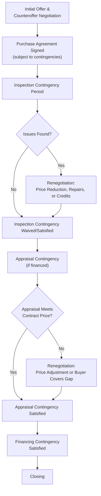

## Real Estate and Property Negotiation

### Definition and Conceptual Foundation

Real estate and property negotiation refers to the negotiation processes surrounding the purchase, sale, or lease of residential, commercial, or industrial property, encompassing price negotiation, contract contingencies, financing terms, and post-inspection renegotiation. This domain is distinguished by several structural features: the frequent involvement of intermediary agents representing each party (creating a distinctive principal-agent negotiation structure), the near-universal presence of contingency-based contract structures (financing, inspection, appraisal contingencies that create sequential renegotiation opportunities after initial agreement), significant information asymmetry regarding property condition, and the substantial emotional and identity-linked dimension of real estate transactions, particularly for residential buyers and sellers.

The field draws on general distributive and integrative negotiation theory, information asymmetry and signaling theory (particularly relevant given the "lemons problem" dynamics inherent in property condition disclosure), agency theory (as applied to buyer's and seller's agents), and behavioral research on anchoring, loss aversion, and endowment effects as they manifest in property valuation.

### The Principal-Agent Structure in Real Estate Negotiation

**Key Points**

- Most residential and much commercial real estate negotiation is conducted not directly between buyer and seller but through their respective agents (buyer's agent and listing/seller's agent), introducing an agency layer with potential incentive misalignment: agent compensation is typically commission-based (a percentage of sale price), which can create incentives that only partially align with a principal's precise interests, for example, an agent's marginal commission gain from negotiating a somewhat higher sale price may be smaller than the client's marginal benefit, potentially affecting an agent's effort allocation at the margin. [Inference: the practical significance of this incentive misalignment varies by market, commission structure, and individual agent practice, and is a subject of ongoing debate within real estate economics research.]
- **Dual agency** (a single agent or brokerage representing both buyer and seller in the same transaction) introduces a more acute conflict-of-interest structure, subject to varying disclosure and consent requirements across jurisdictions, and represents a specific case where standard agency-negotiation dynamics require additional scrutiny. [Inference: dual agency regulations differ substantially by jurisdiction, with some jurisdictions restricting or prohibiting the practice; local regulatory requirements should be verified directly.]
- Agent expertise and repeated-market participation (agents typically negotiate far more frequently than individual buyers or sellers, who may transact only a few times in a lifetime) creates an experience and information asymmetry between agents and their own principals as well as between the two sides' agents, relevant to both principal-agent theory and general negotiation preparation and expertise research.

### Anchoring, Listing Price, and Initial Offer Dynamics

**Key Points**

- The **listing price** functions as a powerful anchor shaping subsequent negotiation, consistent with general anchoring-and-adjustment research; empirical real estate research has found that listing price can influence even professional appraisers' independent valuations, despite appraisers' presumed expertise and independence, illustrating the robustness of anchoring effects even among domain experts. [Inference: specific magnitude findings from individual studies on appraiser anchoring should be treated as illustrative of a documented general phenomenon rather than as precise, universally applicable figures given variation across studies, markets, and time periods.]
- **Strategic underpricing or overpricing** relative to genuine market value functions as a deliberate anchoring and competitive-dynamics tool: underpricing can generate multiple competing offers (creating an auction-like dynamic that may drive final price above initial listing), while overpricing may signal seller inflexibility or misjudge market conditions, potentially extending time-on-market and ultimately requiring larger downward adjustments.
- **First-offer research** in negotiation broadly suggests whoever anchors first often shapes the resulting bargaining range disproportionately; in real estate, this dynamic is partially institutionalized through the listing price itself as a seller-controlled initial anchor, with buyer offers functioning as counter-anchors within a already-shaped reference framework.

### Contingencies as Sequential Renegotiation Points

A distinctive structural feature of real estate transactions (particularly residential) is the presence of contractual contingencies, conditions that must be satisfied for the contract to proceed to closing, each of which creates a distinct, sequential renegotiation opportunity after the initial price agreement.

**Key Points**

- **Inspection-based renegotiation** functions as a structured mechanism for addressing information asymmetry regarding property condition discovered after initial price agreement, converting what was an information gap at the time of the original offer into a specific, itemized renegotiation over repair credits, price reduction, or seller-completed repairs.
- **Appraisal contingency gaps** (when a lender's independent appraisal values the property below the agreed contract price) create a distinct renegotiation dynamic often disconnected from genuine changes in property condition, instead reflecting differing valuation methodologies or market timing, requiring parties to negotiate whether the buyer covers the gap in cash, the seller reduces price, or the parties split the difference.
- This sequential-contingency structure means real estate negotiation is rarely resolved in a single negotiation event, but instead unfolds across multiple discrete renegotiation points, each carrying its own leverage dynamics (a buyer who has already invested significant time and emotional commitment by the inspection stage may have reduced walk-away leverage compared to the initial offer stage, an application of sunk-cost and escalation-of-commitment dynamics to the buyer's own negotiating position).

### Emotional and Identity Dimensions in Residential Real Estate

**Key Points**

- Residential real estate transactions frequently carry substantial emotional and identity-linked significance (a family home, a first purchase, an inherited property) beyond their purely economic value, which can affect both buyer and seller negotiating behavior in ways not fully captured by standard rational-actor bargaining models.
- **Endowment effects** (the well-documented tendency to value an owned asset more highly than an equivalent asset one does not own, per behavioral economics research associated with Kahneman, Knetsch, and Thaler) are frequently observed in seller pricing behavior, with sellers often anchoring on personal or sentimental valuation that may exceed objective comparable-market valuation.
- **Loss aversion** can manifest in both directions: sellers may resist accepting offers below a certain threshold even when objectively reasonable, framing the gap as a "loss" relative to their reference point (often the listing price or a previous informal valuation), while buyers who have become emotionally invested in a specific property may exhibit reduced negotiating firmness during contingency renegotiation, fearing the "loss" of a property they have begun to psychologically claim as their own.

### Commercial Real Estate Distinctions

**Key Points**

- Commercial real estate negotiation (office, retail, industrial leasing and sale) typically involves more sophisticated, often institutional principals (REITs, corporate tenants, professional investors) with more standardized valuation methodologies (capitalization rate analysis, discounted cash flow modeling of lease income) reducing some, though not all, of the emotional-valuation dynamics prominent in residential transactions.
- **Commercial lease negotiation** introduces additional recurring negotiation dimensions largely absent from residential purchase transactions: tenant improvement allowances, rent escalation clauses, renewal option terms, and operating expense pass-through structures, each functioning as distinct integrative-negotiation variables beyond base rental rate.
- Long-term commercial lease relationships (multi-year terms with renewal negotiations) create a genuinely repeated-negotiation structure between landlord and tenant, connecting to reputation-effects and relationship-quality considerations relevant to repeated negotiation theory, distinct from the largely one-time nature of most residential purchase transactions.

### Example

**Example**

A buyer submits an offer at 5% below listing price for a residential property that has been on the market for an extended period, reasoning that extended market time signals reduced seller negotiating leverage. The seller counters at 2% below listing, and the parties settle at 3.5% below listing, a distributive negotiation shaped substantially by the listing price anchor and market-time signal. During the subsequent inspection period, the buyer's inspector identifies a roof issue requiring an estimated $8,000 in repairs. Rather than renegotiating the entire purchase price, the parties resolve this through a targeted, itemized negotiation: the seller provides an $8,000 credit at closing rather than completing repairs directly, avoiding both a full price renegotiation and the delay and quality-control uncertainty of seller-managed repairs, illustrating how the inspection contingency functions as a narrow, targeted renegotiation mechanism rather than reopening the full transaction.

### Common Pitfalls

**Key Points**

- **Over-anchoring on listing price** without independent comparable-market analysis, on either the buyer or seller side, given the documented influence of listing price even on professional valuations.
- **Underestimating agent incentive misalignment**, assuming an agent's negotiating priorities perfectly mirror the principal's interests without active client engagement in strategy and authority-setting.
- **Escalating emotional commitment during contingency renegotiation**, where a buyer's accumulated time and psychological investment by the inspection or appraisal stage reduces effective walk-away leverage compared to the initial offer stage, a dynamic sellers' agents may be attentive to and buyers should actively guard against.
- **Treating contingency renegotiation as reopening the entire deal** rather than as a targeted, itemized negotiation addressing the specific issue discovered, potentially generating unnecessary conflict or delay.
- **Neglecting non-price contract terms** (closing timeline, included fixtures/appliances, rent-back arrangements for sellers needing extended occupancy) that may offer integrative trade opportunities beyond pure price negotiation.

### Practical Guidance for Real Estate Negotiators

**Next Steps**

- **Conduct independent comparable-market analysis** rather than relying solely on listing price as a valuation anchor, for both buy-side and sell-side positions.
- **Actively manage agency dynamics** by clarifying negotiating authority, strategy, and priorities directly with one's agent rather than assuming default alignment of interests.
- **Anticipate the sequential-contingency structure** when assessing overall negotiating position, recognizing that leverage and psychological commitment shift across the inspection, appraisal, and financing stages.
- **Address contingency issues with targeted, itemized negotiation** rather than reopening full price discussions, where the issue and remedy are reasonably scoped and quantifiable.
- **Consider non-price contract terms** (timeline, contingency waivers, included items) as potential integrative trade variables beyond the headline purchase price or rental rate.

**Related Topics**

- Anchoring and First-Offer Strategy
- Agency Theory and Principal-Agent Negotiation Dynamics
- Endowment Effect and Loss Aversion in Valuation
- Information Asymmetry and the "Lemons Problem" in Negotiation
- Commercial Lease Negotiation and Recurring Landlord-Tenant Relationships
- Reputation Effects Across Repeated Interactions
- Sunk Cost Fallacy and Escalation of Commitment in Buyer Behavior
- Dual Agency and Conflict-of-Interest Disclosure Requirements