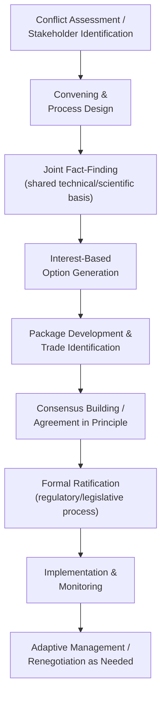

## Public Policy, Regulatory, and Environmental Negotiation

### Definition and Conceptual Foundation

Public policy, regulatory, and environmental negotiation refers to negotiation processes involving government agencies, regulated industries, advocacy organizations, and affected communities over the formulation, implementation, or enforcement of public policy, regulatory standards, and environmental management decisions. This domain is distinguished by its characteristically multi-party structure (often involving many more than two stakeholders with divergent and sometimes many-sided interests), the presence of diffuse or difficult-to-represent interests (future generations, ecosystems, unorganized publics), formal public participation and procedural requirements embedded in administrative and environmental law, and outcomes that typically function as binding rules or standards affecting parties beyond the negotiating table itself.

The field draws substantially on multi-party negotiation theory, the "mutual gains approach" developed by Lawrence Susskind and colleagues specifically for public disputes (building on Fisher and Ury's principled negotiation framework), consensus-building and collaborative governance theory, and environmental dispute resolution practice that emerged prominently from the 1970s onward in response to litigation-heavy, adversarial approaches to environmental conflict.

### Structural Distinctiveness of Public Policy Negotiation

**Key Points**

- **Multi-party complexity**: unlike bilateral commercial negotiation, public policy negotiations frequently involve numerous stakeholders (government agencies at multiple levels, industry representatives, environmental organizations, community groups, indigenous or tribal representatives, scientific/technical experts) each with distinct interests, decision-making authority, and internal constituency-management needs, substantially increasing coordination complexity relative to two-party frameworks.
- **Representation of diffuse and future interests**: environmental negotiations in particular must grapple with representing interests that cannot directly participate, non-human ecological systems, future generations affected by long-term environmental decisions, or geographically dispersed publics without organized representation, a challenge with no direct analog in most commercial or interpersonal negotiation contexts.
- **Binding effect on non-parties**: regulatory negotiation outcomes typically become generally applicable rules or standards affecting entities and individuals who were not direct parties to the negotiation, raising legitimacy and procedural fairness considerations distinct from private negotiated agreements that bind only the signing parties.
- **Formal procedural embedding**: many public policy negotiations occur within statutorily mandated public participation processes (notice-and-comment rulemaking, environmental impact assessment public comment periods, public hearings), meaning negotiation dynamics are shaped by formal legal procedure to a degree uncommon in private negotiation.

### The Mutual Gains Approach to Public Disputes

Lawrence Susskind and colleagues developed the Mutual Gains Approach (MGA) specifically adapting integrative, interest-based negotiation theory to the distinctive challenges of multi-party public disputes, particularly environmental and land-use conflicts.

**Key Points**

- **Joint fact-finding** is a distinctive MGA technique in which stakeholders with differing scientific or technical assessments (common in environmental disputes involving contested risk assessments or ecological impact predictions) commission or review technical analysis jointly, aiming to establish a shared factual foundation before interest-based negotiation proceeds, directly addressing a common driver of impasse in technically complex public disputes: disagreement over underlying facts rather than purely over values or interests.
- **Stakeholder identification and representation legitimacy** is treated as a foundational process design question: since outcomes affect non-parties, the perceived legitimacy of who is included (and how absent or diffuse interests are represented, sometimes through advocacy proxies or expert representation) materially affects both the negotiation process's fairness and the durability of any resulting agreement once implemented.
- **Single-negotiating-text and package development techniques** (procedural tools originally associated with facilitated multi-party negotiation, notably used in international diplomatic contexts such as the Camp David Accords negotiation process) are frequently employed to manage the complexity of multi-party option generation, having a neutral facilitator or convener draft and iteratively revise a composite proposal text rather than requiring parties to negotiate purely through sequential position exchange.

### Regulatory Negotiation ("Reg-Neg")

**Key Points**

- **Negotiated rulemaking** (formalized in the U.S. under the Negotiated Rulemaking Act of 1990) is a specific regulatory process in which an agency convenes affected stakeholders to negotiate the substance of a proposed regulation collaboratively before or in place of the traditional adversarial notice-and-comment process, aiming to reduce subsequent litigation and improve regulatory compliance through direct stakeholder buy-in during rule formulation. [Inference: agency adoption and frequency of formal negotiated rulemaking processes has varied over time and by agency, and current practice should be verified against specific agency procedures where precise, current usage patterns matter.]
- This approach reflects an underlying theoretical premise (associated with dispute-system-design and collaborative governance literature) that stakeholder participation in rule formulation can reduce later implementation conflict and litigation costs compared to purely top-down rule promulgation followed by adversarial comment and challenge, though outcomes depend heavily on process design quality and genuine stakeholder good faith. [Inference: comparative empirical evidence on negotiated rulemaking's actual litigation-reduction and compliance benefits versus traditional rulemaking shows mixed results across different studies and contexts.]
- Regulatory negotiation also occurs informally and continuously outside formal negotiated-rulemaking processes, through ongoing agency-industry dialogue during rule implementation, compliance negotiation, and enforcement discretion discussions, representing a less formally structured but pervasive form of regulatory negotiation.

### Environmental Negotiation: Distinctive Features

**Key Points**

- **Scientific uncertainty as a negotiation variable**: environmental disputes frequently involve genuine scientific uncertainty (regarding ecological impact magnitude, long-term risk, or causal attribution) that functions differently from ordinary information asymmetry, since the uncertainty may be irreducible with current knowledge rather than merely undisclosed, requiring negotiation frameworks (adaptive management, phased implementation with monitoring triggers) that can function under genuine, persistent uncertainty rather than assuming uncertainty resolution through disclosure alone.
- **Adaptive management** as a negotiated structural solution: rather than settling all implementation details in a single, static agreement, parties negotiate a framework with built-in monitoring, review points, and pre-agreed adjustment mechanisms, allowing agreement to proceed despite genuine scientific uncertainty by converting rigid, one-time terms into a dynamic, revisable structure, conceptually analogous to earnout or contingent-consideration mechanisms in commercial negotiation but applied to regulatory and environmental standard-setting.
- **Value-based versus interest-based conflict**: some environmental disputes involve genuinely divergent underlying values (e.g., differing fundamental views on the relative priority of economic development versus ecological preservation) rather than purely reconcilable interests, a distinction with important implications for negotiation strategy, since integrative, interest-based techniques are generally more effective at resolving interest-based conflict than fundamental value disagreement, which may require different conflict-management approaches (values clarification, broader public deliberation) alongside or instead of standard negotiation technique. [Inference: the practical distinction between value conflict and interest conflict is not always clear-cut in specific disputes and is itself a subject of ongoing discussion in conflict resolution theory.]

### Power Asymmetries in Public Policy Negotiation

**Key Points**

- Public policy negotiations frequently exhibit substantial resource and expertise asymmetries between well-funded industry or government participants and community or grassroots stakeholders, raising concerns about genuine negotiating parity even within formally inclusive collaborative processes.
- Process design responses to this asymmetry include funded technical assistance for under-resourced stakeholders (allowing community groups to retain independent scientific or legal expertise), extended timelines to allow genuine stakeholder preparation, and skilled neutral facilitation specifically tasked with managing power dynamics to support substantive, not merely procedural, participation.
- Critics of collaborative and negotiated approaches to public policy have raised concerns that consensus-based processes can sometimes produce outcomes reflecting the preferences of better-resourced or more strategically sophisticated participants despite formally equal participation structures, an ongoing area of debate within public participation and environmental justice scholarship regarding the conditions under which collaborative governance genuinely equalizes versus merely formalizes existing power differentials. [Inference: this remains a genuinely contested area in the academic and practitioner literature rather than a settled empirical finding, and specific outcomes vary considerably by process design and context.]

### Example

**Example**

A state environmental agency convenes a negotiated rulemaking process to establish new water quality standards for an industrial discharge permit program, including representatives from affected manufacturing companies, environmental advocacy organizations, downstream agricultural water users, and a tribal government with treaty-protected fishing rights in the affected watershed. Rather than beginning with position-based bargaining over specific numeric discharge limits, the facilitator organizes a joint fact-finding process in which a neutral technical panel, selected with input from all stakeholders, develops a shared scientific assessment of ecological impact at varying discharge levels, reducing the degree to which subsequent negotiation is distorted by each party's independently commissioned and potentially biased technical studies. The resulting negotiated standard incorporates an adaptive management framework: initial discharge limits set at a specified level, with mandatory monitoring and a pre-agreed review process to adjust standards if ecological indicators diverge from projections, allowing the parties to reach agreement despite genuine remaining scientific uncertainty about long-term ecological response, rather than requiring full uncertainty resolution before any agreement could be reached.

### Common Pitfalls

**Key Points**

- **Inadequate stakeholder identification**, excluding affected parties (particularly diffuse, under-resourced, or geographically dispersed interests) from the process, risking both procedural legitimacy challenges and durability problems once excluded parties challenge implementation.
- **Treating scientific uncertainty as a purely tactical information-asymmetry problem**, applying standard disclosure-based negotiation technique to genuinely irreducible uncertainty rather than adopting adaptive, monitoring-based structural solutions.
- **Conflating value conflict with interest conflict**, applying integrative interest-based technique to disputes rooted in genuinely divergent fundamental values, potentially prolonging impasse or producing superficial agreements that fail to address underlying disagreement.
- **Underestimating resource and expertise asymmetries** in nominally inclusive collaborative processes, resulting in outcomes disproportionately shaped by better-resourced participants despite formal procedural equality.
- **Neglecting implementation and monitoring design**, reaching an agreement in principle without adequate structural provision for adaptive management, monitoring, and dispute resolution during the implementation phase, increasing the risk of later breakdown or renegotiation under adversarial rather than collaborative conditions.

### Practical Guidance for Public Policy Negotiators

**Next Steps**

- **Invest in thorough stakeholder identification and inclusive process design** early, considering how diffuse or under-resourced interests will be genuinely represented, not merely formally invited.
- **Employ joint fact-finding mechanisms** where technical or scientific disagreement is a significant driver of conflict, to establish shared factual grounding before substantive interest-based negotiation.
- **Distinguish value-based from interest-based sources of conflict** early in process design, adapting strategy accordingly rather than applying uniform integrative-negotiation technique to all dispute types.
- **Build adaptive management and monitoring provisions into agreements** explicitly, rather than treating scientific uncertainty as a barrier requiring full resolution before agreement is possible.
- **Address power and resource asymmetries proactively** through funded technical assistance, extended timelines, and skilled neutral facilitation, recognizing that formal inclusion alone does not guarantee substantive negotiating parity.

**Related Topics**

- The Mutual Gains Approach to Public Disputes (Susskind)
- Negotiated Rulemaking and Regulatory Negotiation Processes
- Joint Fact-Finding in Technically Complex Disputes
- Adaptive Management as a Negotiated Structural Solution
- Multi-Party Negotiation and Coalition Dynamics
- Power Asymmetries in Collaborative Governance
- Value Conflict versus Interest Conflict in Dispute Resolution
- Environmental Justice and Equity in Public Participation Processes