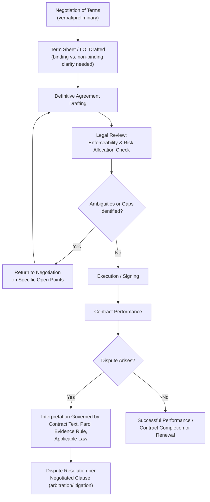

## Contract Drafting and Legal Enforceability Considerations

### Definition and Conceptual Foundation

Contract drafting and legal enforceability considerations refers to the process of translating a negotiated agreement into a legally binding written instrument, and the body of legal doctrine and drafting practice that determines whether, and to what extent, that instrument will be recognized and enforced by courts or arbitral tribunals. This subject sits at the intersection of negotiation theory and contract law: a negotiated agreement's practical value depends substantially on whether its terms are drafted with sufficient clarity, completeness, and legal validity to be enforceable if a dispute later arises, meaning negotiation and drafting are properly understood as sequential but deeply interdependent phases of the same overall deal-making process.

This domain draws on contract law doctrine (offer, acceptance, consideration, capacity, and legality as foundational elements of an enforceable contract), drafting craft and precision practice developed extensively in transactional legal practice, and negotiation theory concerning how agreement-in-principle translates, or fails to translate, into binding written terms.

### Foundational Elements of Contract Enforceability

**Key Points**

- Under most common-law systems, an enforceable contract generally requires several core elements: a valid **offer**, unambiguous **acceptance**, **consideration** (something of value exchanged by each party, distinguishing enforceable bargains from unenforceable gratuitous promises), **capacity** of the parties to contract, and **legality** of the contract's purpose and terms. [Inference: specific doctrinal requirements and their precise application vary by jurisdiction, including material differences between common-law and civil-law systems, and practitioners should consult applicable local contract law rather than assume uniform requirements across jurisdictions.]
- **Mutual assent** ("meeting of the minds") is a foundational conceptual requirement, meaning courts generally examine whether the parties' communications, viewed objectively, demonstrate genuine agreement on essential terms, rather than requiring proof of subjective internal mental agreement, an important practical point connecting negotiation communication clarity directly to subsequent enforceability.
- **Definiteness and completeness of essential terms** (price, subject matter, parties, and other terms considered material to the specific type of agreement) is generally required for enforceability; agreements that leave essential terms open or to be negotiated later ("agreements to agree") are frequently found unenforceable in many jurisdictions absent a sufficiently definite mechanism for resolving the open terms, directly connecting back to negotiation practice regarding when parties should finalize versus defer specific terms.

### The Negotiation-to-Drafting Translation Problem

**Key Points**

- A negotiated "agreement in principle" or handshake understanding does not automatically translate into an enforceable contract; the drafting process frequently surfaces previously unrecognized ambiguities, gaps, or genuine disagreements that were papered over during verbal negotiation, a phenomenon sometimes informally termed the "drafting gap," where parties discover during contract drafting that they had not, in fact, reached genuine agreement on all material terms.
- **Letters of intent, term sheets, and memoranda of understanding** occupy an important and often legally ambiguous middle ground: parties frequently intend these documents to be non-binding on core commercial terms while genuinely binding on certain specific provisions (confidentiality, exclusivity, governing law), but courts examining such documents focus on the parties' objectively manifested intent regarding bindingness, which can create significant enforceability uncertainty if the document's language does not clearly and explicitly address this distinction. [Inference: specific judicial approaches to interpreting ambiguous preliminary agreements vary by jurisdiction and by the specific language and context of each document; explicit, unambiguous drafting on this point is generally recommended precisely because courts' default interpretive approaches can vary.]
- Effective negotiation practice increasingly incorporates drafting considerations into the negotiation process itself, for example, having legal counsel review term sheet language for enforceability implications before execution, or negotiating with explicit awareness of which terms will require precise legal definition, reflecting a general principle that negotiation and drafting should not be treated as fully separable, sequential phases but as an integrated process with feedback between them.

### Key Contractual Provisions and Their Negotiation Significance

| Provision | Function | Negotiation Consideration |
| --- | --- | --- |
| Representations and warranties | Factual assurances about state of affairs | Allocates risk for undisclosed or misstated facts; heavily negotiated in M&A and complex commercial contracts |
| Indemnification clauses | Allocates responsibility for specific losses/liabilities | Often negotiated with caps, baskets, and survival periods |
| Limitation of liability | Caps maximum recoverable damages | Frequently a heavily contested distributive negotiation point balancing risk allocation |
| Force majeure | Excuses performance due to specified extraordinary events | Scope and triggering events are negotiated; increasingly scrutinized post-pandemic |
| Dispute resolution clause | Specifies arbitration, litigation venue, and governing law | Shapes the "shadow of the law" for any future dispute negotiation |
| Termination provisions | Specifies conditions and process for ending the agreement | Affects each party's ongoing leverage and exit options during the contract's life |
| Integration/merger clause | States the written contract is the complete, final agreement | Typically excludes prior negotiations/representations from being enforceable unless included in the final text |

**Key Points**

- The **integration or merger clause** carries particular importance for negotiators: it typically operates to exclude prior verbal representations, side agreements, or earlier drafts from legal effect, meaning any negotiated commitment not incorporated into the final written text may become legally unenforceable regardless of how clearly it was agreed upon during verbal negotiation, a critical practical link between negotiation diligence and drafting completeness.
- **Dispute resolution clauses** (arbitration versus litigation, chosen governing law, and venue) function as a form of prospective negotiation about how future disputes will themselves be negotiated and resolved, directly shaping the "bargaining in the shadow of the law" dynamics (see legal settlement negotiation) that will apply if the relationship later encounters conflict.

### The Parol Evidence Rule and Its Negotiation Implications

**Key Points**

- The parol evidence rule, a doctrine present in various forms across common-law jurisdictions, generally restricts the admissibility of evidence of prior or contemporaneous oral or written agreements to contradict, vary, or add to the terms of a final, fully integrated written contract. [Inference: the precise scope, exceptions, and application of the parol evidence rule vary considerably by jurisdiction and by whether a contract is deemed fully or partially integrated; specific application to a given contract requires jurisdiction-specific legal analysis.]
- This doctrine has direct negotiation practice implications: negotiators should recognize that informal side commitments, verbal assurances, or understandings not reflected in the final written agreement may be legally unenforceable even if genuinely intended and relied upon by a party, reinforcing the practical importance of ensuring all material negotiated terms are captured in the final written instrument rather than relying on the negotiation history itself for enforcement.

### Ambiguity, Interpretation, and Drafting Precision

**Key Points**

- Contractual ambiguity, whether latent (not apparent from the text alone but arising from external circumstances) or patent (apparent on the face of the document), creates interpretation risk that courts typically resolve using various interpretive canons (e.g., interpreting ambiguous terms against the drafter, or *contra proferentem*, in some jurisdictions and contexts), meaning imprecise drafting can shift outcomes away from what either party genuinely intended during negotiation.
- **Defined terms and consistent terminology** throughout a contract reduce interpretation risk; drafting practice generally favors explicit definition of key terms used repeatedly, and flags inconsistent terminology (using different words for what should be the same concept) as a common source of later interpretive dispute.
- **Conditional and contingent language precision** (distinguishing conditions precedent, conditions subsequent, and covenants) carries substantial enforceability significance, since courts often examine such distinctions closely to determine when obligations are triggered, suspended, or excused, an area where drafting precision directly determines whether the negotiated risk allocation is actually implemented as intended.

### Contract Lifecycle and Enforceability Touchpoints

**Key Points**

- The feedback loop from legal review back into negotiation (step D to F) is a normal and expected part of sophisticated deal-making, reflecting the principle that drafting frequently surfaces genuine open issues requiring further negotiation, rather than being a purely mechanical transcription exercise following negotiation's conclusion.
- Once a dispute arises, resolution is governed substantially by what was actually captured in the written instrument (subject to parol evidence rule constraints) and by the previously negotiated dispute-resolution clause, illustrating how negotiation choices made at the drafting stage directly shape the parties' options and leverage during any subsequent dispute-negotiation process.

### Practical Risks of Inadequate Drafting Follow-Through

**Key Points**

- **Unenforceable "gentlemen's agreements"**: informal understandings that parties genuinely intend to honor but fail to document with sufficient legal formality, risking complete unenforceability if the relationship later breaks down and one party denies the understanding existed or disputes its terms.
- **Gaps discovered only during a dispute**: contracts silent on a scenario that later occurs (a gap not identified during either negotiation or drafting) can result in courts applying default legal rules that may not reflect what either party would have negotiated had the scenario been anticipated, underscoring the value of thorough issue-spotting during the drafting process itself.
- **Boilerplate neglect**: treating standard or "boilerplate" provisions (governing law, notice provisions, assignment restrictions, severability) as unimportant template language rather than substantively negotiated terms, despite such provisions frequently having significant practical consequences if a dispute arises.

### Example

**Example**

Two companies negotiate a multi-year supply agreement and reach verbal agreement on pricing, volume commitments, and quality standards, memorialized in a brief, informally worded letter of intent that both parties believe reflects a "done deal." During subsequent contract drafting, legal counsel identifies that the parties never actually discussed what happens if the supplier's key manufacturing facility is destroyed by a natural disaster, a gap neither side had considered during the verbal negotiation. Rather than leaving this gap for a court to resolve via default legal rules if the scenario later occurs, the drafting process prompts a targeted return to negotiation specifically on force majeure and business continuity provisions, resulting in an agreed contractual mechanism (alternate sourcing obligations, notice requirements, and a defined suspension period) that reflects deliberate risk allocation rather than an unaddressed contingency. This illustrates how drafting functions not merely as a transcription of prior negotiation but as an active mechanism for identifying and resolving previously unrecognized negotiation gaps.

### Common Pitfalls

**Key Points**

- **Assuming verbal or informal agreement is automatically enforceable**, without accounting for jurisdiction-specific requirements regarding written form, consideration, or definiteness of essential terms.
- **Failing to clarify binding versus non-binding provisions** in preliminary documents (term sheets, LOIs), creating enforceability disputes when one party later treats preliminary terms as final and binding while the other does not.
- **Relying on side agreements or verbal assurances** not incorporated into the final written contract, particularly given integration clauses and parol evidence rule constraints that may render such understandings legally unenforceable.
- **Treating "boilerplate" provisions as non-negotiable or unimportant**, overlooking their frequently significant practical consequences in dispute scenarios.
- **Neglecting to negotiate for genuinely unanticipated contingencies**, leaving gaps that default legal rules will fill in ways that may not reflect either party's actual risk-allocation preferences had the scenario been considered during negotiation.

### Practical Guidance for Negotiators and Drafters

**Next Steps**

- **Engage legal counsel early in the negotiation process**, not merely at the final drafting stage, to identify enforceability implications of key terms while they remain subject to negotiation.
- **Explicitly clarify binding versus non-binding status** of preliminary agreements (LOIs, term sheets), addressing this directly in the document's language rather than relying on informal understanding.
- **Ensure all genuinely negotiated material terms are captured in the final written instrument**, recognizing that unincorporated verbal commitments may be unenforceable due to integration clauses and parol evidence rule constraints.
- **Treat the drafting phase as an active issue-spotting process**, expecting and planning for a feedback loop back into negotiation when drafting surfaces genuine gaps or ambiguities.
- **Review standard/boilerplate provisions substantively** rather than treating them as non-negotiable template language, given their potential significance in future dispute scenarios.

**Related Topics**

- Bargaining in the Shadow of the Law (Mnookin and Kornhauser)
- Mergers, Acquisitions, and Corporate Deal-Making
- Legal Settlement and Litigation Negotiation
- The Parol Evidence Rule and Contract Interpretation Doctrine
- Force Majeure Clauses and Risk Allocation in Contract Drafting
- Dispute Resolution Clause Selection (Arbitration vs. Litigation)
- Letters of Intent and Preliminary Agreement Enforceability
- Representations, Warranties, and Indemnification Negotiation