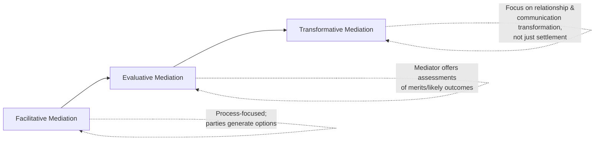
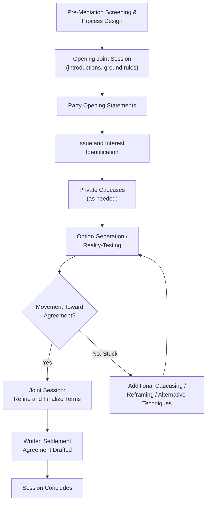

## Roles and Techniques of Mediators

### Definition and Conceptual Foundation

Mediation is a structured dispute resolution process in which a neutral third party, the mediator, facilitates communication and negotiation between disputing parties to help them reach a voluntary, mutually acceptable resolution, without imposing a binding decision. The mediator's role is fundamentally distinct from that of an arbitrator or judge: mediators possess no decision-making authority over the substantive outcome, and their function is instead to manage process, facilitate communication, and support the parties' own negotiation, making mediator technique a specialized application of negotiation theory focused on process facilitation rather than direct advocacy for any particular substantive outcome.

The field draws on foundational negotiation theory (particularly Fisher, Ury, and Patton's principled negotiation framework, which heavily influenced modern facilitative mediation practice), communication and conflict resolution theory, and a substantial body of practitioner literature distinguishing different mediator styles and their appropriate application across dispute types.

### Core Mediator Functions

**Key Points**

- **Process management**: mediators structure the sequence of the mediation session (opening statements, private caucuses, joint sessions, agenda-setting), manage time, and establish ground rules for respectful communication, functioning as the architect of the negotiation process itself rather than a participant in the substantive negotiation.
- **Communication facilitation**: mediators often reframe emotionally charged or accusatory statements into more neutral, interest-focused language, apply active listening techniques (reflecting, summarizing, clarifying) to ensure each party feels heard, and manage communication breakdowns that might otherwise stall direct negotiation between the parties.
- **Reality-testing**: mediators frequently probe each party's assessment of their alternatives to settlement (their BATNA), the strength of their legal or factual position, and the risks of continued conflict, without directly opining on the merits, helping parties form more realistic expectations that can narrow an otherwise unrealistic gap between positions.
- **Option generation and agenda management**: mediators often help parties move from positional statements to underlying interests, and then facilitate brainstorming or option-generation processes aimed at identifying integrative, mutually beneficial solutions not apparent to the parties when engaged in direct, often adversarial, negotiation.

### The Facilitative-Evaluative-Transformative Spectrum

Mediation practice and scholarship commonly distinguish among several mediator style orientations, each reflecting different assumptions about the mediator's appropriate role and the goals of the process.

| Style | Core Orientation | Typical Context |
| --- | --- | --- |
| Facilitative | Mediator manages process; parties generate their own substantive options and evaluate their own positions | General civil, commercial, and community disputes; consistent with interest-based negotiation theory |
| Evaluative | Mediator may offer opinions on the merits, likely litigation outcomes, or specific settlement recommendations | Court-connected mediation, particularly in litigation contexts where parties seek expert case assessment |
| Transformative | Mediator focuses on empowering parties and fostering mutual recognition between them, treating relationship and communication change as valuable independent of settlement | Family, workplace, and community disputes with ongoing relationships |

**Key Points**

- **Facilitative mediation**, most closely aligned with Fisher and Ury's interest-based negotiation framework, assumes parties are best positioned to generate and evaluate their own substantive solutions, with the mediator strictly avoiding recommending specific outcomes or opining on the merits of either party's position.
- **Evaluative mediation** (a style particularly associated with court-connected mediation programs and litigation settlement contexts) involves the mediator actively assessing case strengths and weaknesses, sometimes providing a candid opinion on likely litigation outcomes, directly connecting to the expected-value and "bargaining in the shadow of the law" framework relevant to legal settlement negotiation. [Inference: the appropriateness and prevalence of evaluative mediation varies by jurisdiction, mediator training tradition, and professional ethical guidelines, and is a subject of ongoing debate within mediation practice and scholarship regarding whether evaluative activity is consistent with mediator neutrality norms.]
- **Transformative mediation**, developed prominently by Robert A. Baruch Bush and Joseph Folger, reframes the goal of mediation away from settlement alone toward fostering "empowerment" (helping parties recognize and exercise their own capacity to handle their situation) and "recognition" (helping parties achieve genuine understanding of the other party's perspective), treating these relational and communicative shifts as valuable in their own right, independent of whether a specific settlement results.

### Structural Techniques: Caucusing and Joint Sessions

**Key Points**

- **Private caucusing** (separate, confidential meetings between the mediator and each party individually) allows parties to disclose interests, concerns, or flexibility they may be unwilling to reveal in front of the other party, functioning as a structured mechanism for the mediator to gather private information that can inform, without directly disclosing to the other side, the design of integrative proposals.
- **Confidentiality of caucus disclosures** is a foundational procedural norm: information shared in caucus is generally treated as confidential and not shared with the other party unless the disclosing party explicitly authorizes it, creating a trusted-intermediary structure that can reduce strategic information-withholding compared to direct party-to-party negotiation where any disclosure is immediately visible to the counterpart.
- **Joint sessions** (where all parties and the mediator meet together) are typically used for opening statements, establishing mutual understanding of the dispute, and, in facilitative and transformative approaches particularly, for direct communication and joint option generation, while shuttle diplomacy (mediator moving between separate caucuses without a joint session) may be used when direct communication is unproductive or when high conflict or power imbalances make joint sessions counterproductive.
- The choice between caucus-heavy ("shuttle") and joint-session-heavy mediation models reflects both mediator style preference and situational assessment of whether direct party communication is likely to be constructive or destructive given the specific relationship and conflict dynamics involved.

### Reframing as a Core Technique

**Example**

A party states, in an accusatory tone: "They completely ignored our contract and just did whatever they wanted." A mediator employing reframing might restate this as: "It sounds like clarity and adherence to the agreed terms is really important to you, and that's part of what we need to address." This reframing technique preserves the substantive concern (contract adherence) while removing the accusatory framing that might trigger defensive reaction from the other party, functioning similarly to the labeling technique in tactical empathy but applied specifically to lower the emotional temperature of communication between two parties rather than between a single negotiator and a counterpart.

### The Mediator's Neutrality and Its Limits

**Key Points**

- **Neutrality (or impartiality)** is a foundational ethical and functional requirement across most mediation traditions and professional codes of conduct, requiring the mediator to avoid favoritism toward either party and to disclose any conflicts of interest that might compromise perceived or actual impartiality. [Inference: specific neutrality and disclosure standards are typically codified in professional mediator ethics codes and, in some jurisdictions, statute or court rule; specific requirements vary by jurisdiction and mediation context.]
- Despite formal neutrality regarding outcome, mediators are not neutral regarding *process fairness*: mediators typically intervene to address power imbalances, ensure each party has adequate opportunity to speak, and may terminate a mediation if they assess that a fair process cannot be maintained (for example, in cases involving coercion, domestic violence dynamics, or severe information or capability asymmetry that undermines the voluntariness the process depends on).
- The **evaluative mediation debate** noted above reflects a genuine tension in the field regarding the outer limits of appropriate mediator neutrality: providing a candid case assessment can be highly valuable for realistic settlement (particularly relevant given advocate overconfidence dynamics discussed in litigation negotiation), but risks compromising perceived neutrality if a party believes the mediator has sided with, or unduly favored, the other party's position.

### Managing Power Imbalances and Difficult Dynamics

**Key Points**

- Mediators are frequently trained to recognize and manage power imbalances between parties (resource disparities, expertise gaps, emotional intensity differences, or coercive relationship dynamics), employing techniques such as ensuring balanced speaking time, private caucusing to allow a less assertive party to fully articulate their position without direct confrontation, or, in appropriate cases, recommending that a party obtain independent advisory support before proceeding.
- In certain dispute types (notably domestic and family mediation involving allegations of abuse), specialized screening protocols and heightened caution regarding mediation's appropriateness are standard practice, given that mediation's voluntary, cooperative-communication premise may not function safely or fairly when severe power or safety imbalances are present. [Inference: specific screening protocols and professional guidance on mediation appropriateness in such cases vary by jurisdiction and professional body, and practitioners should consult current, jurisdiction-specific professional standards rather than general negotiation theory alone in these sensitive contexts.]

### The Mediation Process Flow

### Common Pitfalls in Mediator Practice

**Key Points**

- **Premature evaluation or advocacy**, where a facilitative mediator inadvertently signals a substantive opinion on the merits, undermining perceived neutrality and potentially damaging trust in the process.
- **Excessive caucusing without adequate joint communication**, which can prevent parties from developing genuine mutual understanding and may allow the mediator's own framing to substitute for authentic direct communication, particularly relevant in transformative mediation contexts where direct communication itself is a valued outcome.
- **Failure to manage power imbalances adequately**, allowing a more assertive, resourced, or knowledgeable party to dominate the process in ways that undermine the voluntariness and fairness the mediation model depends upon.
- **Style mismatch with dispute type**: applying a purely facilitative approach in contexts where parties genuinely need expert case evaluation (e.g., complex litigation settlement) may prolong impasse, while applying an evaluative approach in relationship-centered disputes (family, workplace) may undermine the relational repair that transformative or facilitative approaches are better suited to support.
- **Inadequate screening for safety and voluntariness**, proceeding with mediation in contexts involving coercion or severe power imbalance where the underlying premises of voluntary, good-faith negotiation may not hold.

### Practical Guidance for Mediators and Parties Selecting Mediators

**Next Steps**

- **Select a mediator style appropriate to the dispute type**: facilitative or transformative approaches for relationship-centered or values-based disputes; evaluative approaches where realistic case assessment is a primary need, such as litigation settlement.
- **Clarify confidentiality and caucusing practices** with the mediator before beginning, ensuring all parties understand what information will and will not be shared between caucus sessions.
- **Watch for signs of inadequate neutrality management**, including any perception that the mediator favors one party, and address such concerns directly with the mediator or process administrator if they arise.
- **Consider power-imbalance screening** proactively, particularly in family, workplace, or other relationship-embedded disputes, to ensure the mediation process can function fairly given the specific relationship dynamics involved.
- **Use joint fact-finding or neutral expert evaluation** (where mediator evaluative activity may be limited or inappropriate) as a supplementary technique for resolving genuine factual or technical disagreement within an otherwise facilitative process.

**Related Topics**

- Legal Settlement and Litigation Negotiation
- The Mutual Gains Approach to Public Disputes
- Tactical Empathy Techniques (Reframing and Labeling Parallels)
- BATNA Development and Reality-Testing in Negotiation
- Transformative Mediation Theory (Bush and Folger)
- Arbitration versus Mediation: Structural and Authority Distinctions
- Power Imbalances and Safety Screening in Family Mediation
- Confidentiality Protections in Alternative Dispute Resolution