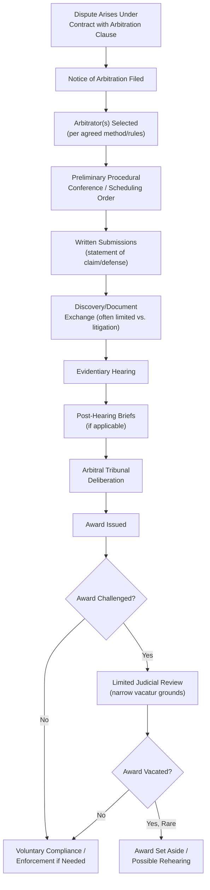

## Arbitration Procedures and Award Enforceability


### Definition and Conceptual Foundation

Arbitration is a private dispute resolution process in which parties submit their dispute to one or more neutral arbitrators who render a binding decision (an award), functioning as a private adjudicative alternative to court litigation. Unlike mediation, where the neutral facilitates but does not decide, arbitration vests the neutral with actual decision-making authority, making arbitration procedurally more similar to litigation while remaining contractually and procedurally distinct from it in significant ways, including confidentiality, procedural flexibility, and limited grounds for judicial review of the resulting award.

The field draws on contract law (since arbitration is fundamentally consent-based, arising from an arbitration agreement between the parties), international commercial law (particularly for cross-border arbitration, governed substantially by treaty frameworks), procedural law governing arbitral conduct, and negotiation theory insofar as arbitration functions as a "shadow" alternative shaping settlement negotiation dynamics in a manner analogous to litigation (see legal settlement negotiation).

### Arbitration as a Consent-Based, Contractual Process

**Key Points**

- Arbitration's authority derives entirely from the parties' contractual agreement to arbitrate, typically an arbitration clause within a broader contract or a separate submission agreement executed after a dispute arises, meaning the scope of arbitral authority (what disputes are covered, which rules apply, seat/location of arbitration, arbitrator selection method) is fundamentally a matter of prior negotiation and drafting rather than externally imposed procedural rule, directly connecting arbitration practice to contract drafting and enforceability considerations discussed elsewhere in this domain.
- **Arbitrability** refers to the threshold legal question of whether a given dispute falls within the scope of a valid arbitration agreement and is the type of dispute that can legally be resolved through arbitration in the relevant jurisdiction; some categories of disputes (varying by jurisdiction) may be deemed non-arbitrable as a matter of public policy despite a contractual arbitration clause. [Inference: which categories of disputes are considered non-arbitrable varies substantially by jurisdiction and has evolved over time through legislation and case law; current jurisdiction-specific rules should be verified directly.]
- **Institutional versus ad hoc arbitration**: parties may select an established arbitral institution (e.g., the International Chamber of Commerce (ICC), the American Arbitration Association (AAA), the London Court of International Arbitration (LCIA)) to administer the arbitration under its established procedural rules, or may instead conduct ad hoc arbitration without institutional administration, typically governed by rules such as the UNCITRAL Arbitration Rules, each option carrying different cost, procedural predictability, and administrative support trade-offs negotiated during the contract drafting stage.

### The Arbitration Procedural Lifecycle

```plaintext
===syllabot placeholder===
```



**Key Points**

- **Arbitrator selection** typically occurs through a party-driven or institution-facilitated process (each party selecting one arbitrator, with those two selecting a third for a three-member panel, or a single arbitrator selected by mutual agreement or institutional appointment), a structural feature giving parties direct influence over decision-maker selection generally unavailable in litigation, where judicial assignment is typically outside party control.
- **Discovery in arbitration** is generally more limited than in litigation, reflecting arbitration's design goal of procedural efficiency; the specific scope of document exchange and pre-hearing disclosure is often negotiated within the arbitration agreement or determined by the arbitral tribunal's procedural discretion, varying considerably by the applicable institutional rules and the arbitrators' own procedural preferences. [Inference: the degree of discovery limitation compared to litigation varies considerably by arbitral institution, governing rules, and specific tribunal practice, and should not be assumed uniform across all arbitration proceedings.]

### Award Finality and Limited Judicial Review

**Key Points**

- A central, defining feature of arbitration is the **limited scope of judicial review** available for arbitral awards compared to appellate review of court judgments: courts reviewing arbitral awards generally do not re-examine the merits of the arbitrators' factual findings or legal conclusions, but instead apply narrow, specifically enumerated grounds for vacatur (setting aside an award), such as arbitrator corruption or evident partiality, arbitrator misconduct prejudicing a party's rights, or the arbitrators exceeding their contractually granted authority. [Inference: the specific statutory grounds for vacatur vary by jurisdiction and governing arbitration statute (e.g., the Federal Arbitration Act in the U.S., or the UNCITRAL Model Law as adopted in various national arbitration statutes internationally); precise grounds should be verified against the applicable governing law.]
- This narrow review standard reflects a deliberate policy choice, generally described as favoring arbitration's finality and efficiency benefits over the more extensive substantive review available through litigation appeals, meaning parties who select arbitration are typically understood to be trading away extensive appellate review rights in exchange for arbitration's other procedural advantages (speed, confidentiality, arbitrator expertise selection, reduced formality).
- **"Manifest disregard of the law"** has historically been argued as an additional, non-statutory ground for vacatur in some U.S. jurisdictions, though its continued viability and precise scope following relevant Supreme Court precedent has been subject to considerable judicial and scholarly debate. [Unverified: the current status and jurisdictional application of the "manifest disregard" doctrine varies and has been the subject of ongoing legal debate; readers requiring precise current legal status should consult current case law directly rather than rely on general awareness of this historically contested doctrine.]

### International Arbitration Enforcement: The New York Convention

**Key Points**

- The **1958 Convention on the Recognition and Enforcement of Foreign Arbitral Awards** (commonly known as the New York Convention), with well over 160 contracting states, establishes a widely adopted international framework requiring signatory states' courts to recognize and enforce foreign arbitral awards, subject to a limited, enumerated set of grounds for refusal (e.g., invalid arbitration agreement, lack of proper notice or opportunity to present one's case, award exceeding the scope of the arbitration agreement, or enforcement being contrary to the enforcing state's public policy).
- This treaty framework is frequently cited as one of international arbitration's principal practical advantages over cross-border litigation, since foreign court judgments generally lack an equivalently broad, reciprocal international enforcement framework, meaning a party's choice of arbitration in cross-border commercial agreements is often substantially motivated by superior international enforceability rather than by arbitration's other procedural characteristics alone.
- The New York Convention's narrow refusal grounds parallel and reinforce the domestic-law preference for limited judicial review of arbitral awards discussed above, creating a broadly consistent global policy framework favoring arbitral finality across both domestic and cross-border enforcement contexts. [Inference: specific national implementation and judicial interpretation of New York Convention grounds for refusal varies by contracting state, and enforcement outcomes in any specific jurisdiction should be assessed against that jurisdiction's specific implementing legislation and case law.]

### Negotiating the Arbitration Clause: A Prospective Negotiation Exercise

**Key Points**

- Because arbitration's procedural framework derives from the parties' contractual agreement, the arbitration clause itself represents a significant prospective negotiation exercise conducted at the contract drafting stage, well before any specific dispute exists, requiring parties to negotiate procedural terms without yet knowing which party might benefit from any particular procedural choice in a future, unknown dispute (an interesting structural parallel to Rawlsian "veil of ignorance" reasoning in negotiation theory, since neither party can be certain in advance whether a given procedural choice will favor them).
- Key negotiated elements of an arbitration clause typically include: the arbitral institution and governing rules, the seat/location of arbitration (which determines the procedural law governing the arbitration and the courts with primary supervisory jurisdiction), the number of arbitrators and selection method, the language of proceedings, the scope of discoverable disputes, and any specified limitations on remedies or damages.
- **Class action waivers** and mandatory arbitration clauses in consumer and employment contracts have generated significant legal and policy controversy in various jurisdictions, reflecting genuine disagreement about whether such clauses, often presented on a take-it-or-leave-it basis with limited genuine negotiation by the weaker-bargaining-power party, represent legitimate contractual risk allocation or an inappropriate limitation on access to collective legal remedies. [Inference: the legal treatment and enforceability of such clauses varies considerably by jurisdiction, contract context (consumer versus commercial), and has been subject to ongoing legislative and judicial development; current jurisdiction-specific treatment should be verified directly given the evolving and contested nature of this area.]

### Arbitration Compared to Litigation and Mediation

| Dimension | Arbitration | Litigation | Mediation |
| --- | --- | --- | --- |
| Decision authority | Neutral arbitrator(s) render binding decision | Judge/jury renders binding decision | Parties retain decision authority; mediator has none |
| Confidentiality | Typically private/confidential | Generally public record | Typically confidential |
| Appeal/review | Narrow, limited grounds | Broader appellate review available | Not applicable (non-binding process) |
| Procedural flexibility | Parties can customize via agreement | Governed by court procedural rules | Highly flexible, mediator/party-determined |
| Cross-border enforcement | Strong (New York Convention) | Variable, no equivalent universal treaty | Not directly applicable (non-binding) |

### Common Pitfalls in Arbitration Practice and Clause Drafting

**Key Points**

- **Poorly drafted arbitration clauses** (ambiguous regarding scope, governing rules, or seat) can generate substantial preliminary disputes over arbitrability and procedure before the underlying substantive dispute is even addressed, undermining arbitration's intended efficiency benefits.
- **Underestimating the finality trade-off**: parties sometimes select arbitration primarily for perceived speed or confidentiality benefits without fully appreciating the corresponding loss of extensive appellate review, a trade-off that can prove significant if an unfavorable award later appears, in hindsight, to reflect clear legal or factual error not correctable through the narrow vacatur standard.
- **Inadequate consideration of enforcement jurisdiction** at the drafting stage, failing to anticipate where a future award might need to be enforced and whether relevant enforcement treaties or reciprocal arrangements will apply.
- **Overlooking discovery limitations** when drafting or agreeing to arbitration, particularly in disputes likely to depend heavily on documentary evidence not otherwise accessible without robust discovery procedures.
- **Assuming uniform international treatment**, given that New York Convention implementation, arbitrability rules, and vacatur standards vary meaningfully by jurisdiction despite the broadly harmonizing effect of the treaty framework.

### Practical Guidance for Negotiating and Utilizing Arbitration

**Next Steps**

- **Negotiate arbitration clauses deliberately and specifically** at the contract drafting stage, addressing institutional rules, seat, arbitrator selection, and scope explicitly rather than relying on generic template language.
- **Assess the finality trade-off consciously** before selecting arbitration, weighing the value of speed, confidentiality, and arbitrator expertise against the reduced availability of substantive appellate review.
- **Consider likely future enforcement jurisdictions** when selecting the arbitral seat and applicable rules, particularly in cross-border transactions where New York Convention coverage may materially affect practical enforceability.
- **Clarify discovery expectations** within the arbitration agreement or through institutional rule selection, particularly for disputes likely to require substantial documentary evidence.
- **Consult current, jurisdiction-specific legal guidance** regarding arbitrability limits, vacatur standards, and the enforceability of specific clause types (such as class action waivers), given the genuinely evolving and jurisdiction-variable nature of this legal area.

**Related Topics**

- Contract Drafting and Legal Enforceability Considerations
- Legal Settlement and Litigation Negotiation
- Roles and Techniques of Mediators
- The New York Convention and International Award Enforcement
- Dispute Resolution Clause Selection (Arbitration vs. Litigation)
- Institutional Arbitration Rules (ICC, AAA, LCIA, UNCITRAL)
- Class Action Waivers and Mandatory Arbitration Policy Debates
- Arbitrability and Jurisdictional Limits on Arbitration Agreements