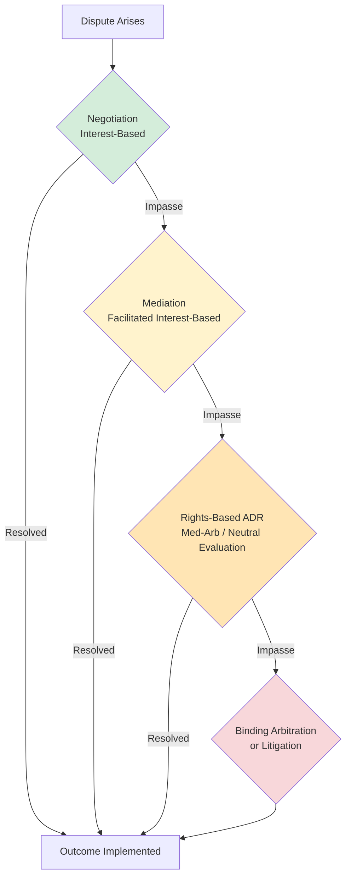

## Alternative Dispute Resolution Program Design

### Definition and Scope

Alternative Dispute Resolution (ADR) program design is the systematic process of architecting institutional mechanisms—negotiation, mediation, arbitration, and hybrid processes—that divert disputes away from formal adjudication. Program design operates at a meta-level above individual dispute resolution: rather than resolving a single conflict, it constructs the rules, incentives, personnel structures, and feedback loops that will govern how classes of disputes are resolved on an ongoing basis, whether within a court system, a corporation, an industry, or a community institution.

The designer's task differs fundamentally from that of a negotiator or mediator. A negotiator optimizes a single interaction; a program designer optimizes a system that will process many heterogeneous disputes over time, under resource constraints, with imperfect information about which mechanism fits which case.

### Core Design Objectives

**Key Points**

- **Efficiency**: minimizing the time and cost (both direct fees and opportunity cost) of resolving disputes relative to litigation baselines.
- **Quality of outcomes**: durability of agreements, party satisfaction, and perceived fairness (both distributive and procedural).
- **Access and equity**: ensuring the system does not systematically disadvantage lower-resource parties.
- **Legitimacy**: voluntary or court-connected programs need buy-in from users, referring institutions (courts, agencies), and the professional community (bar associations, industry bodies).
- **Scalability and sustainability**: the program must function under caseload growth without proportional cost growth.

These objectives frequently trade off against each other. A program optimized purely for speed (e.g., mandatory short-form arbitration) may sacrifice perceived fairness or party voice; a program optimized for maximal party autonomy (fully voluntary mediation) may see low utilization and fail to divert meaningful caseload from courts.

### Diagnostic Framework: Fitting Process to Dispute

Ury, Brett, and Goldberg's interests–rights–power framework, developed in *Getting Disputes Resolved* (1988), remains the dominant lens for program design diagnosis. Disputes can be resolved by focusing on:

1. **Interests** — underlying needs and concerns (negotiation, interest-based mediation).
2. **Rights** — who is entitled to what under a contract, statute, or norm (rights-based mediation, arbitration, litigation).
3. **Power** — who can coerce whom (strikes, litigation as attrition, unilateral action).

The design principle is that interest-based processes are generally cheaper and produce more durable, higher-satisfaction outcomes than rights- or power-based processes, so an efficient system is architected as a series of "low-cost backups": start with negotiation, escalate to mediation if unresolved, escalate to arbitration or adjudication only as a last resort. Each escalation should be more costly and more binding than the last, creating a structural incentive to resolve disputes at the lowest viable tier.

### Loop of Escalating Cost and Bindingness

The tiered design above encodes three structural properties, per Ury, Brett, and Goldberg:

- **Low-to-high cost**: transaction costs (time, money, relationship damage) increase at each tier.
- **Interests-to-power gradient**: earlier tiers address underlying needs; later tiers apply positional or coercive resolution.
- **Loop-back provisions**: well-designed systems allow parties to return to a lower tier at any point (e.g., settling during arbitration), since escalation should never foreclose earlier, cheaper options.

[Inference] The specific ordering and thresholds for escalation (e.g., mandatory mediation before arbitration vs. optional) are context-dependent design choices rather than universal prescriptions, and different institutional settings (labor relations vs. commercial contracts vs. family courts) justify different sequencing.

### Design Dimensions and Decision Variables

A comprehensive ADR program design specifies choices along several axes:

#### Mandatory vs. Voluntary Participation

- **Mandatory** (court-annexed mediation, mandatory arbitration clauses): increases utilization and predictability of caseload diversion but raises due process and legitimacy concerns, particularly where parties have unequal bargaining power (e.g., consumer or employment arbitration clauses).
- **Voluntary**: preserves party autonomy and generally yields higher satisfaction among those who opt in, but suffers from selection effects and lower aggregate diversion of caseload.
- **Opt-out models**: presumptive referral to ADR with an opt-out right, used as a middle path to raise utilization while preserving a formal exit.

#### Binding vs. Non-Binding Outcomes

- Non-binding processes (facilitative mediation, non-binding arbitration/early neutral evaluation) preserve the right to litigate but risk being used strategically for discovery or delay.
- Binding processes (arbitration, binding med-arb) provide finality but reduce recourse for error, raising fairness concerns absent adequate procedural safeguards (right to counsel, reasoned awards, limited judicial review standards).

#### Neutral Selection and Qualification

- **Roster models**: institutions (AAA, JAMS, court ADR offices) maintain qualified neutral rosters with defined training, experience, and continuing education requirements.
- **Party-selected vs. institution-appointed**: party selection increases perceived legitimacy and fit but can be exploited by repeat players who develop informal relationships with favorable neutrals (the "repeat player effect," empirically documented in employment arbitration research).
- **Diversity and subject-matter expertise**: technical disputes (construction, IP, financial) often require subject-matter-qualified neutrals; design must balance expertise against panel size and availability.

#### Funding and Fee Structures

- **Fee-shifting rules**: who bears the cost of the neutral, administrative fees, and each party's own representation costs shapes access. Employer-pays models (common in mandatory employment arbitration) raise conflict-of-interest concerns tied to the repeat-player effect.
- **Sliding-scale or subsidized fees**: used in community mediation and small-claims contexts to preserve access for low-resource parties.
- **Court-funded vs. self-funded**: court-annexed programs may be funded by filing fee surcharges, general court budgets, or a hybrid.

#### Confidentiality and Precedent

- Mediation confidentiality is near-universal by statute or rule (e.g., Uniform Mediation Act in U.S. states that have adopted it) to encourage candor.
- Arbitration confidentiality is contractual and varies; publication of awards affects the development of a body of interpretive precedent, which matters in industries (securities, construction) where consistency across disputes has value.

#### Timelines and Procedural Rules

- Fixed timelines (e.g., "mediation within 30 days of filing," "arbitration award within 60 days of hearing") are used to prevent process capture by parties who benefit from delay.
- Discovery scope in arbitration is a major design lever: limited discovery reduces cost but may disadvantage the party with less pre-dispute access to information.

### Institutional Design Patterns

#### Court-Connected ADR Programs

Court-annexed mediation and arbitration programs are typically designed with:

- A referral trigger (case type, dollar threshold, or judicial discretion).
- A roster of court-approved neutrals, often compensated below market rate or via pro bono/reduced-fee panels.
- A "good faith participation" requirement enforceable via sanctions, without mandating settlement.
- Statistical reporting requirements to track diversion rates, settlement rates, and time-to-resolution, feeding back into program evaluation.

#### Organizational/Workplace ADR Systems

Organizational Ombuds and internal ADR systems (per Costantino and Merchant's *Designing Conflict Management Systems*, 1996) are designed around a "systems design" methodology:

1. Conduct a conflict audit (types, frequency, and cost of disputes across the organization).
2. Identify stakeholder interests across the organization (employees, management, legal, HR).
3. Design multiple, parallel access points (open-door policy, ombudsperson, peer mediation, formal grievance).
4. Build in loop-backs and confidentiality protections to encourage early-stage use before disputes escalate to formal complaints or litigation.
5. Establish evaluation metrics and iterate.

[Inference] The systems design methodology is normatively well-established in organizational conflict management literature, though the specific audit and evaluation tools vary considerably by consulting practice and organizational context.

#### Industry and Sector-Specific ADR (Construction, Securities, Consumer)

Sector-specific programs (e.g., FINRA arbitration for securities disputes, AAA Construction Industry Rules) are designed with domain-specific procedural rules, standing panels of subject-matter-expert neutrals, and often mandatory pre-dispute arbitration clauses embedded in industry-standard contracts. These raise distinct policy debates about class-action waivers and the erosion of public adjudication norms in consumer and employment contexts.

#### Community and Restorative Justice Programs

Community mediation centers and restorative justice programs (victim-offender mediation, community conferencing) are designed around volunteer neutral training, sliding-scale or free access, and outcome goals that extend beyond dispute settlement to relationship repair and community cohesion. Program design here emphasizes facilitator training depth and community trust-building over speed or cost metrics.

### Med-Arb, Arb-Med, and Hybrid Process Design

Hybrid processes combine mediation and arbitration to capture benefits of both:

- **Med-Arb**: the same or different neutral first mediates; unresolved issues proceed to binding arbitration. Design risk: if the same neutral performs both roles, parties may self-censor during mediation (withholding information they don't want used against them in arbitration), which undermines the candor mediation depends on.
- **Arb-Med**: arbitration occurs first and the award is sealed; parties then mediate, with the sealed award opened and binding only if mediation fails. This preserves mediation candor since the award, once rendered, is not influenced by mediation disclosures.
- **Med-Arb with different neutrals**: mitigates the role-conflict problem of same-neutral med-arb at the cost of increased administrative complexity and expense.

$$\text{Total Program Cost} \approx \sum_{i=1}^{n} p_i \cdot c_i$$

where $p_i$ is the proportion of disputes resolved at tier $i$ and $c_i$ is the marginal cost of resolution at that tier. Effective tiered design minimizes total cost by maximizing $p_i$ at low-$c_i$ tiers, subject to quality and fairness constraints.

### Evaluation Metrics for Program Design

**Key Points**

- **Utilization rate**: proportion of eligible disputes that enter the ADR track rather than proceeding directly to litigation or unilateral action.
- **Settlement/resolution rate**: proportion of ADR cases resolved without escalation to the next tier.
- **Time-to-resolution**: median and distributional measures, compared against a litigation or non-ADR baseline.
- **Cost per case**: administrative, neutral, and party costs, again benchmarked against baseline.
- **Durability**: recidivism or re-filing rate for the same underlying dispute (a proxy for whether the resolution addressed root interests rather than papering over them).
- **Party satisfaction and perceived fairness**: typically measured via post-process surveys covering both procedural justice (voice, respect, neutrality) and distributive justice (perceived fairness of the outcome).
- **Equity audits**: disaggregated outcome and satisfaction data by party characteristics (income, represented vs. unrepresented, repeat player vs. one-shot player) to detect systemic bias.

[Unverified] Specific benchmark figures (e.g., "ADR reduces cost by X%") vary widely across studies, jurisdictions, and dispute types, and should be treated as context-specific empirical findings rather than fixed constants applicable to any given program.

### Common Design Failure Modes

- **Coercion masquerading as voluntariness**: mandatory referral without adequate opt-out or due process safeguards, particularly problematic in unequal-power contexts like consumer and employment arbitration.
- **Repeat-player capture**: neutrals dependent on repeat corporate clients for referrals develop, consciously or not, systematic leanings that disadvantage one-shot parties (a well-documented empirical concern in mandatory employment arbitration literature).
- **Confidentiality without accountability**: excessive secrecy can prevent detection of patterns of misconduct (e.g., serial harassment claims settled individually and confidentially), a tension central to post-#MeToo debates over mandatory arbitration and NDAs.
- **Under-resourced neutral pools**: insufficient training or subject-matter depth in the neutral roster degrades outcome quality and undermines legitimacy.
- **Metric myopia**: over-optimizing for settlement rate or speed can pressure neutrals (especially in mediation) to push parties toward agreement regardless of underlying interest satisfaction, producing brittle settlements that later unravel.
- **Poor integration with the formal system**: ADR programs that are not clearly sequenced relative to litigation deadlines, statutes of limitations, or discovery rules create confusion and can inadvertently prejudice parties' legal rights.

### Illustrative Example: Designing a Court-Annexed Small Claims Mediation Program

**Example**

A jurisdiction observes small-claims court congestion and designs a mediation diversion program:

1. **Referral trigger**: all filed small-claims cases under a defined dollar threshold are automatically scheduled for a mediation session before a trial date is set (opt-out available with judicial approval).
2. **Neutral pool**: trained volunteer mediators (a defined hours of training plus mentored co-mediation sessions) drawn from the local bar and community, coordinated by a court ADR administrator.
3. **Process**: single-session facilitative mediation, roughly a bounded duration (e.g., 60–90 minutes), free to parties, held on-site at the courthouse on the trial date.
4. **Escalation**: unresolved cases proceed immediately to the scheduled trial before the same-day judge, preserving the loop-back to formal adjudication without added delay.
5. **Evaluation**: the court tracks settlement rate, time saved versus average trial-track disposition time, and post-session party satisfaction surveys, reporting these annually to the judiciary's oversight committee.

This design embodies the tiered escalation principle (mediation as a low-cost backup before the higher-cost trial tier), addresses access (free, on-site, same-day) and neutral quality (trained roster) design dimensions, and builds in an evaluation feedback loop.

### Related Topics

- Interests–Rights–Power Framework (Ury, Brett, and Goldberg)
- Conflict Management Systems Design in Organizations
- Court-Annexed Mediation and Judicial ADR Referral Policy
- Mandatory Arbitration Clauses and Due Process Concerns
- Repeat-Player Effects in Arbitration
- Med-Arb and Arb-Med Procedural Design
- Restorative Justice and Victim-Offender Mediation Program Models
- Ombudsperson Office Design and Institutional Neutrality
- Measuring Procedural and Distributive Justice in Dispute Resolution
- Online Dispute Resolution (ODR) Platform Design