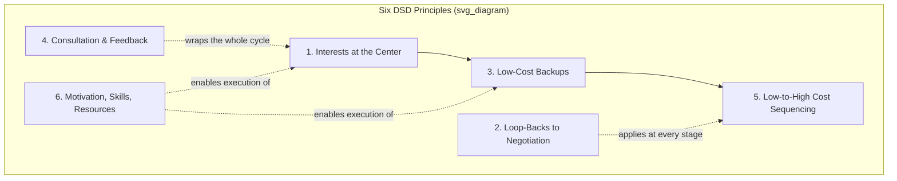

## Dispute Systems Design Principles

### Definition and Origins

Dispute Systems Design (DSD) is the discipline of designing, implementing, and evaluating integrated structures for handling recurring disputes within an organization, community, or institution. It emerged from the work of William Ury, Jean Poitras, Cathy Costantino, Christina Sickles Merchant, and others in the late 1980s and 1990s, most notably codified in Ury, Brett, and Goldberg's *Getting Disputes Resolved* (1988) and Costantino and Merchant's *Designing Conflict Management Systems* (1996). DSD differs from designing a single ADR process (e.g., a mediation clause) in that it addresses the entire ecosystem of dispute-handling mechanisms an organization offers, how they interconnect, and how the system as a whole is diagnosed, built, and continuously improved.

### The Six Foundational Principles (Ury, Brett, and Goldberg)

Ury, Brett, and Goldberg's original framework specifies six core design principles, treated as the canonical starting point for the field.

#### 1. Put Interests at the Center

Design the primary dispute-resolution track around interest-based negotiation and mediation, since these processes are cheaper, faster, and more likely to produce durable, mutually satisfactory outcomes than rights- or power-based processes. Rights- and power-based mechanisms are retained but positioned as lower-cost-backup, not the default entry point.

#### 2. Build in "Loop-Backs" to Negotiation

Every stage of a dispute-resolution system should permit parties to return to negotiation or mediation, even after escalating to rights- or power-based processes. A grievance procedure that allows settlement discussions at any point before or during arbitration exemplifies a loop-back; a system with no such off-ramp forces parties toward all-or-nothing rights adjudication once initiated.

#### 3. Provide Low-Cost Backups when Interest-Based Negotiation Fails

Where negotiation alone cannot resolve a dispute, the next-cheapest mechanism should be offered before more costly options. This is the origin of the tiered escalation structure: negotiation → mediation → rights-based ADR (arbitration, neutral evaluation) → litigation or other power contests, each tier more costly and binding than the last.

#### 4. Build in Consultation Before, and Feedback After

Parties and stakeholders should be consulted during system design (to ensure legitimacy and fit) and should receive feedback after a dispute is resolved (to reinforce learning and satisfaction). Feedback loops also serve the organizational-learning function: recurring dispute patterns identified through post-resolution feedback can inform upstream prevention.

#### 5. Arrange Procedures in a Low-to-High-Cost Sequence

Sequencing procedures from least to most costly (in time, money, and relationship strain) creates a structural incentive for parties to resolve disputes early, since escalation is costly by design. This principle operationalizes principle 3 into a general sequencing rule applicable across dispute types.

#### 6. Provide the Necessary Motivation, Skills, and Resources

A system's procedural design is inert without parties who have the incentive, training, and resources to use it as intended. This includes training negotiators and managers in interest-based bargaining, incentivizing early resolution (e.g., cost-sharing formulas that reward early settlement), and resourcing the system adequately (staffing, funding, neutral panels).

### Diagnostic Phase: Conducting a Conflict Audit

Before designing or redesigning a system, practitioners conduct a **conflict audit** (or "dispute audit"), a structured diagnostic process, typically including:

- **Dispute inventory**: cataloging the types, volume, and cost (time, money, relationship damage, reputational) of disputes currently occurring.
- **Stakeholder interviews**: gathering perspectives from all parties who interact with the current system — disputants, neutrals, managers, legal counsel, and administrative staff.
- **Existing mechanism mapping**: documenting all current formal and informal channels through which disputes are currently being addressed, including undocumented or ad hoc practices.
- **Root cause analysis**: identifying whether disputes stem from ambiguous rules, resource scarcity, structural role conflicts, or interpersonal/relational sources, since the appropriate design response differs by cause.
- **Benchmarking**: comparing current metrics (cost, time, satisfaction) against comparable organizations or industry standards where available.

[Inference] The specific audit methodology varies by consulting practice; the elements above represent a synthesized standard approach rather than a single universally mandated protocol.

### Stakeholder Analysis and Participatory Design

DSD emphasizes designing *with* rather than *for* the people who will use the system. Key participatory design steps:

1. Identify all stakeholder classes (not just disputants, but also gatekeepers, decision-makers, and those who bear implementation costs).
2. Elicit each group's interests regarding the system itself (not the underlying disputes) — e.g., management may prioritize speed and cost control, employees may prioritize voice and confidentiality, unions may prioritize precedent and collective protections.
3. Pilot-test proposed mechanisms with a subset of the population before full rollout.
4. Iterate based on pilot feedback, treating the design as provisional rather than final.

This mirrors general principles of organizational change management: systems imposed without stakeholder buy-in tend to suffer low utilization and legitimacy problems regardless of their procedural merits.

### Structural Design Elements

#### Multiple Access Points ("No Wrong Door")

Effective systems provide several entry points into the dispute-resolution process (open-door policy with a supervisor, HR intake, ombudsperson, peer mediation panel, formal grievance filing) so that disputants are not forced through a single, potentially intimidating or ill-fitting channel. This is sometimes called the "no wrong door" principle: wherever a disputant enters, they should be guided toward an appropriate resolution track.

#### Confidentiality Architecture

Systems must specify, for each mechanism, what is confidential, to whom, and under what exceptions (e.g., mandatory reporting of harassment, safety threats, or legal violations). Confidentiality design directly affects candor and utilization but interacts with accountability concerns at a systemic level (see Common Failure Modes below).

#### Neutral Roles and Independence

Design must specify:

- **Who serves as neutral** (internal staff, ombudsperson, external panel, hybrid).
- **Reporting lines** — an internal ombudsperson's independence is typically protected by reporting directly to the highest levels of the organization (e.g., a board or CEO) rather than to line management, to preserve both real and perceived neutrality.
- **Qualification and training standards** for each role in the system.

#### Cost and Resource Allocation

Systems specify who bears the cost of each mechanism (organization-funded vs. cost-shared vs. disputant-funded) and how staffing, training, and administrative infrastructure will be resourced and sustained over time, not just at initial rollout.

### Implementation Process

**Key Points**

- **Secure sponsorship**: visible commitment from organizational leadership is necessary for legitimacy and resourcing.
- **Pilot before full deployment**: test the system on a bounded population or dispute category before organization-wide rollout.
- **Train all stakeholders**: not only neutrals, but also managers and staff who will refer disputes into the system.
- **Communicate the system clearly**: disputants must understand what channels exist, how they work, and what protections (confidentiality, non-retaliation) apply.
- **Institutionalize feedback loops**: build in scheduled review points (e.g., annual system audits) rather than treating design as a one-time event.

### Evaluation Framework

Ongoing evaluation of a dispute system typically tracks:

- **Utilization**: are stakeholders actually using the system, and through which access points?
- **Distribution across tiers**: what proportion of disputes resolve at each tier of the escalation ladder? A system where most disputes reach the highest-cost tier suggests the low-cost tiers are underperforming or under-trusted.
- **Outcome durability**: recurrence or re-filing rates as a proxy for whether root interests were addressed.
- **Satisfaction and perceived fairness**: both procedural (voice, respect, neutrality) and distributive (outcome fairness) dimensions, typically via post-resolution surveys.
- **Equity**: disaggregated outcomes by demographic or power-position variables (e.g., seniority, represented vs. unrepresented status) to detect systemic bias.
- **Cost-effectiveness**: total system cost relative to the cost of disputes left unmanaged or resolved via the prior (pre-redesign) mechanisms.

$$E_{\text{system}} = \frac{\sum_{i} p_i \cdot s_i}{\sum_{i} p_i \cdot c_i}$$

where $p_i$ is the proportion of disputes resolved at tier $i$, $s_i$ is a satisfaction/durability score for that tier, and $c_i$ is the marginal cost. This is a stylized formalization; [Speculation] no single standardized formula is universally adopted in DSD evaluation practice, and organizations typically rely on a dashboard of the discrete metrics listed above rather than a composite index.

### Common Failure Modes in Systems Design

- **Designing a mechanism, not a system**: implementing a single new process (e.g., an ombudsperson office) without integrating it with existing channels, resulting in fragmented, competing pathways rather than a coherent system.
- **Ignoring power asymmetries**: a system that formally offers "voluntary" mediation to parties with grossly unequal bargaining power (e.g., an individual employee vs. an organization) can reproduce the power imbalance the system was meant to mitigate, absent safeguards such as independent advisors or minimum procedural protections.
- **Confidentiality without pattern detection**: fully confidential, case-by-case resolution can prevent an organization from detecting systemic issues (e.g., a manager with repeated complaints), undermining principle 4's feedback function at the organizational-learning level.
- **Underinvestment in principle 6 (motivation, skills, resources)**: a well-designed procedural sequence fails in practice if managers are not trained or incentivized to use interest-based approaches, or if the neutral panel is under-resourced.
- **Static design**: treating the system as permanent rather than iteratively evaluated and revised as dispute patterns, organizational structure, or legal requirements change.
- **Retaliation risk**: without explicit non-retaliation protections and enforcement, disputants may avoid using the system regardless of its formal availability, undermining utilization metrics.

### Illustrative Example: Redesigning a University Grievance System

**Example**

A university identifies that student-faculty disputes are disproportionately escalating directly to formal Title IX or academic-integrity tribunals, overwhelming the tribunal's capacity and producing adversarial, low-satisfaction outcomes.

1. **Conflict audit**: administrators interview students, faculty, and department chairs, finding that most disputes originate in ambiguous grading or advising expectations, not misconduct, and that students avoid informal channels for fear of retaliation.
2. **Redesign per the six principles**:
   - *Interests at the center*: introduce a departmental ombudsperson trained in interest-based facilitation as the default first step.
   - *Loop-backs*: allow parties to return to informal facilitation even after filing a formal complaint, up until a tribunal hearing begins.
   - *Low-cost backups*: sequence as informal facilitation → department-level mediation → formal tribunal, each tier progressively more costly and binding.
   - *Consultation and feedback*: establish a standing student-faculty advisory committee that reviews anonymized system data annually.
   - *Low-to-high cost sequencing*: formal tribunal proceedings require documented attempt at the lower tiers except in cases involving safety or legal mandatory-reporting triggers.
   - *Motivation, skills, resources*: fund ombudsperson training and require department chairs to complete interest-based conflict training.
3. **Non-retaliation protections**: explicit policy and independent reporting line for the ombudsperson to preserve neutrality and encourage utilization.
4. **Evaluation**: track utilization by access point, tier-distribution of resolved disputes, and annual satisfaction surveys, feeding results back to the advisory committee.

This redesign directly operationalizes all six Ury-Brett-Goldberg principles within a single coherent institutional system rather than treating each mechanism in isolation.

### Related Topics

- Interests–Rights–Power Framework
- Alternative Dispute Resolution Program Design
- Organizational Ombudsperson Office Design and Independence Standards
- Conflict Audits and Organizational Diagnosis Methods
- Procedural Justice and Perceived Fairness in Institutional Systems
- Power Asymmetry and Due Process Safeguards in Mandatory ADR
- Change Management and Stakeholder Buy-In for Institutional Reform
- Non-Retaliation Policy Design in Grievance Systems
- Systemic Pattern Detection vs. Confidentiality Trade-offs
- Online Dispute Resolution (ODR) System Architecture