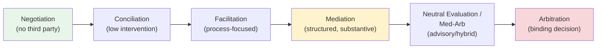

## Facilitated Negotiation and Third-Party Roles

### Definition and Scope

Facilitated negotiation refers to any negotiation process in which a neutral or quasi-neutral third party assists disputing parties in reaching agreement without imposing a binding decision on them. This distinguishes facilitated processes from adjudicative processes (arbitration, litigation) where a third party decides the outcome. The third party's function ranges from purely procedural (managing communication flow) to substantively evaluative (offering opinions on likely legal outcomes), and the specific role selected shapes both the process dynamics and the appropriate ethical constraints on the neutral.

### The Continuum of Third-Party Intervention

Third-party roles exist on a continuum defined by two variables: **decision-making authority** (does the third party decide the outcome?) and **process control** (how much does the third party structure the interaction?).

Moving left to right, the third party's authority over the outcome increases; moving right to left, party self-determination increases. Program and process designers select a point on this continuum based on dispute characteristics: complexity, power balance between parties, need for confidentiality, desired precedent value, and time/cost constraints.

### Core Third-Party Roles Defined

#### Facilitator

A facilitator manages the *process* of a multi-party discussion or negotiation without engaging substantively with the content of the dispute. Common in group settings (public policy dialogues, multi-stakeholder negotiations, organizational meetings), the facilitator's tasks include:

- Setting and enforcing ground rules for communication.
- Managing turn-taking and ensuring balanced participation.
- Structuring the agenda and sequencing of issues.
- Summarizing and reflecting positions to check understanding.

Facilitators typically do not offer opinions on the substance of the dispute or propose solutions; their neutrality is procedural rather than substantive.

#### Conciliator

A conciliator's role is historically associated with labor relations and international disputes. Conciliation typically involves the third party carrying messages, clarifying misunderstandings, and encouraging parties back to the table, often with lower structural formality than mediation. In many jurisdictions and international contexts (e.g., UNCITRAL's historical conciliation rules), "conciliation" and "mediation" are used near-interchangeably; where distinguished, conciliation is often characterized as more directive and evaluative than facilitative mediation, with the conciliator sometimes empowered to propose settlement terms.

#### Mediator

A mediator facilitates negotiation between parties with more structural and substantive involvement than a pure facilitator, typically working through a defined process (see stages below) to help parties identify interests, generate options, and reach a voluntary, non-binding agreement. Mediator styles vary along the facilitative–evaluative spectrum (detailed below).

#### Neutral Evaluator

In **early neutral evaluation (ENE)**, a subject-matter expert (often a retired judge or senior practitioner) reviews the parties' positions and provides a non-binding assessment of the likely outcome if the matter proceeded to litigation or arbitration. This is used primarily to correct unrealistic expectations that are blocking settlement, particularly effective when an impasse stems from differing assessments of legal merits (a rights-based information gap) rather than from interest incompatibility.

#### Ombudsperson

An ombudsperson serves as an independent, impartial resource within an organization, offering informal, confidential assistance that may include facilitation, informal mediation, coaching, and systemic issue identification, without formal decision-making authority and typically without creating a formal record. Organizational ombuds generally adhere to the International Ombudsman Association's standards of practice: independence (reporting to the highest organizational level), neutrality, confidentiality, and informality.

### The Facilitative–Evaluative–Transformative Mediator Spectrum

This is among the most consequential design and practice distinctions in third-party facilitation literature.

| Style | Core Orientation | Third Party's Primary Activity | Typical Use Case |
| --- | --- | --- | --- |
| Facilitative | Process control, party self-determination | Asks questions, reframes, manages process; does not opine on merits or propose solutions | Interpersonal, family, community disputes where relationship and ownership of outcome matter |
| Evaluative | Substantive assessment | Offers opinions on likely legal outcomes, may propose specific settlement terms | Commercial and legal disputes where parties want a reality check grounded in likely litigation outcomes |
| Transformative | Party empowerment and recognition | Focuses on shifting the interaction pattern itself (empowerment and mutual recognition) rather than settlement per se | Ongoing-relationship disputes (workplace, family, community) where relational change matters more than a specific settlement |

[Inference] Most practicing mediators blend elements of these styles situationally rather than adhering to a single pure style throughout a session; the tripartite framework (most closely associated with Leonard Riskin's mediator orientation grid, and the transformative model with Bush and Folger's *The Promise of Mediation*, 1994) is a widely used analytic taxonomy rather than a description of how any single practitioner necessarily behaves.

### Riskin's Grid

Leonard Riskin's influential model plots mediator orientation along two axes: **facilitative vs. evaluative** (activity type) and **narrow vs. broad** (problem definition — narrow meaning legal/positional issues only, broad meaning underlying interests and relationship). This produces four quadrants (narrow-facilitative, narrow-evaluative, broad-facilitative, broad-evaluative) used to characterize mediator style choices and to match mediator selection to dispute type during program design.

### Stages of a Facilitated Mediation Process

A canonical facilitative mediation process, synthesized from standard mediation training curricula, typically proceeds through:

1. **Opening/convening**: mediator explains the process, confidentiality, ground rules, and their own neutrality; secures procedural agreement from parties.
2. **Joint session — storytelling**: each party presents their perspective without interruption, allowing the mediator to identify issues and emotional undercurrents.
3. **Issue identification and agenda-setting**: mediator reframes positions into a neutral, negotiable agenda of issues.
4. **Interest exploration** (often via **private caucus**, a confidential one-on-one session with each party): mediator probes underlying interests behind stated positions, tests reality, and may explore BATNA/WATNA with each party privately.
5. **Option generation**: joint or caucus-based brainstorming of possible solutions, often reality-tested against each party's alternatives.
6. **Bargaining and convergence**: parties (often through the mediator acting as a conduit during caucusing) narrow toward mutually acceptable terms.
7. **Agreement and closure**: mediator assists in drafting a memorandum of understanding or formal settlement agreement; some processes include a formal reality-check or cooling-off period before finalization.

**Key Points**

- **Caucusing** is a defining structural tool unavailable in most pure facilitation: it allows candid disclosure of interests, priorities, and BATNA information the party would not reveal in joint session, at the cost of the mediator now holding asymmetric information that must be carefully managed (with explicit rules about what is/is not relayed to the other side).
- **Confidentiality within caucus** must be explicitly established (what the mediator can share versus must keep confidential) since ambiguity undermines trust in the process.

### Neutrality, Impartiality, and Multi-Partiality

A core ethical foundation across all third-party roles is neutrality regarding the outcome and impartiality regarding the parties. However, contemporary mediation theory (particularly in family and community mediation) increasingly favors the term **multi-partiality** over strict neutrality: the mediator actively attends to and balances the interests and voice of *all* parties rather than claiming to have no perspective at all, since true value-neutrality is often unattainable and the more operative ethical commitment is even-handed engagement.

[Inference] The shift in terminology from "neutrality" to "multi-partiality" reflects an evolving theoretical emphasis in parts of the mediation field rather than a uniformly adopted standard across all training and certification bodies.

### Third-Party Ethical Constraints

- **Impartiality**: disclosure and management of any real or perceived conflicts of interest with either party.
- **Informed consent**: parties must understand the process, the third party's role, and the voluntary/non-binding nature of outcomes (where applicable) before proceeding.
- **Competence**: subject-matter and process competence appropriate to the dispute type, often governed by certification standards (e.g., state court-roster requirements, IMI—International Mediation Institute—certification).
- **Confidentiality**: statutory or contractual protection of communications made during the process (e.g., the Uniform Mediation Act in adopting U.S. states), balanced against mandatory reporting exceptions.
- **Self-determination**: preserving parties' right to decide whether and on what terms to settle, distinguishing facilitative roles sharply from adjudicative ones.
- **Avoiding the unauthorized practice of law**: mediators, particularly those with legal backgrounds, must distinguish providing legal information (permissible) from giving legal advice (generally prohibited in most mediation ethical codes).

### Illustrative SVG: Third-Party Role Continuum

<svg xmlns="http://www.w3.org/2000/svg" viewBox="0 0 720 220">
<text x="360" y="24" text-anchor="middle" font-size="16" font-weight="bold" fill="#1a1a1a">Third-Party Authority Continuum (svg_diagram)</text>
<line x1="60" y1="120" x2="660" y2="120" stroke="#555" stroke-width="3" marker-end="url(#arrow)" />
<circle cx="90" cy="120" r="8" fill="#4caf50" />
<text x="90" y="150" text-anchor="middle" font-size="12" fill="#1a1a1a">Facilitator</text>
<text x="90" y="165" text-anchor="middle" font-size="10" fill="#666">process only</text>
<circle cx="240" cy="120" r="8" fill="#8bc34a" />
<text x="240" y="150" text-anchor="middle" font-size="12" fill="#1a1a1a">Conciliator</text>
<circle cx="390" cy="120" r="8" fill="#ffc107" />
<text x="390" y="150" text-anchor="middle" font-size="12" fill="#1a1a1a">Mediator</text>
<text x="390" y="165" text-anchor="middle" font-size="10" fill="#666">facilitative to evaluative</text>
<circle cx="530" cy="120" r="8" fill="#ff9800" />
<text x="530" y="150" text-anchor="middle" font-size="12" fill="#1a1a1a">Neutral Evaluator</text>
<circle cx="640" cy="120" r="8" fill="#e53935" />
<text x="640" y="150" text-anchor="middle" font-size="12" fill="#1a1a1a">Arbitrator</text>
<text x="640" y="165" text-anchor="middle" font-size="10" fill="#666">binding decision</text>
<text x="90" y="95" text-anchor="middle" font-size="11" fill="#4caf50" font-weight="bold">Low authority</text>
<text x="640" y="95" text-anchor="middle" font-size="11" fill="#e53935" font-weight="bold">High authority</text>
</svg>

### Practical Illustration: Selecting a Third-Party Role

**Example**

A manufacturing company and a component supplier dispute whether a delivery delay breached their contract, and the relationship (which has value beyond this dispute) is at risk.

- If the parties primarily disagree on **facts and legal interpretation** (was the delay a force majeure event under the contract?), a **neutral evaluator** with construction/supply-chain contract expertise may be most efficient, giving both sides a realistic anchor for the legal question before further negotiation.
- If the parties disagree on **how to move forward given genuinely mixed interests** (continuing the relationship, cost allocation, delivery schedule adjustments), a **facilitative mediator** is better suited, since the goal is a mutually crafted, relationship-preserving solution rather than a ruling on rights.
- If the relationship is effectively over and the parties want a **fast, final, cost-capped resolution**, moving directly to **arbitration** under the contract's dispute clause may be preferable, accepting reduced party control in exchange for finality and speed.

This illustrates the general design principle (see Dispute Systems Design Principles): match the third-party role's authority and orientation to the actual source of impasse (interests vs. rights vs. informational gap) rather than defaulting to a single process for all disputes.

### Related Topics

- Mediator Styles: Facilitative, Evaluative, and Transformative Models
- Riskin's Grid and Mediator Orientation Theory
- Caucusing Technique and Confidentiality Management
- Early Neutral Evaluation Procedures
- Organizational Ombudsperson Standards of Practice
- Med-Arb and Arb-Med Hybrid Process Design
- Multi-Partiality and Neutrality Ethics in Mediation
- BATNA/WATNA Analysis Within Mediation Caucusing
- Uniform Mediation Act and Mediation Confidentiality Law
- Cross-Cultural Considerations in Third-Party Facilitation