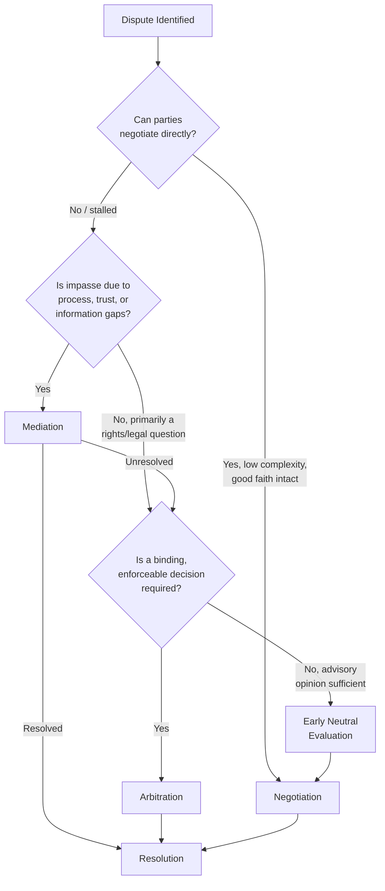

## Choosing Among Negotiation, Mediation, and Arbitration

### Definition and Framing

Choosing among negotiation, mediation, and arbitration is a decision-analytic problem: given a specific dispute's characteristics, which dispute resolution mechanism maximizes expected value across the criteria that matter to the parties (cost, speed, control, precedent, relationship preservation, confidentiality, and enforceability)? Unlike Dispute Systems Design (which builds the institutional architecture in advance) or Alternative Dispute Resolution Program Design (which structures a program for a class of disputes), this topic addresses the case-level, often within-process decision: given this dispute, right now, which mechanism—or which sequence of mechanisms—should the parties pursue?

### The Three Mechanisms Contrasted

| Dimension | Negotiation | Mediation | Arbitration |
| --- | --- | --- | --- |
| Decision authority | Parties retain full control | Parties retain full control; mediator has no decision power | Third-party arbitrator decides; binding (typically) |
| Process formality | Informal, party-driven | Semi-structured, third-party-facilitated | Formal, rules-governed (often modeled on litigation) |
| Cost | Lowest (no third-party fees) | Moderate (mediator fees, administrative costs) | Higher (arbitrator fees, possible discovery, representation costs) |
| Speed | Fastest, if parties can agree | Fast to moderate (single session to a few sessions) | Slower (scheduling, hearings, award drafting), though generally faster than litigation |
| Confidentiality | Fully private by default | Generally protected by rule/statute | Contractual/institutional; award may or may not be public |
| Outcome type | Mutually agreed, flexible terms | Mutually agreed, flexible terms | Binding award, typically rights-based and less flexible |
| Appeal/recourse | N/A (no imposed outcome) | N/A (no imposed outcome) | Very limited judicial review (narrow statutory grounds) |
| Relationship impact | Can preserve or strain relationship depending on tactics | Generally preserves relationship (collaborative framing) | Can strain relationship (adversarial, rights-focused) |

### Decision Framework: The Interests–Rights–Power Lens Applied

As established in dispute systems design literature (Ury, Brett, and Goldberg), the choice among mechanisms maps onto the underlying source of the dispute:

- If the impasse is primarily an **interests** problem (parties want different things but haven't found a mutually beneficial trade), **direct negotiation** is usually sufficient and cheapest.
- If interests are the problem but negotiation has stalled due to communication breakdown, trust deficits, emotional escalation, or asymmetric information, **mediation** adds value by supplying process structure, reality-testing, and a channel for confidential information exchange (via caucusing) without either party having to concede leverage.
- If the impasse is primarily a **rights** problem (parties disagree about what they are legally entitled to, and that disagreement itself is blocking resolution), and mediation has not resolved it, **arbitration** (or litigation) provides a definitive answer to the rights question.

### Key Decision Variables

#### 1. Relationship Value and Continuity

If the parties have an ongoing relationship of significant future value (business partners, family members, coworkers, neighbors), mechanisms that preserve collaborative dynamics—negotiation and mediation—are generally preferable, since arbitration's adversarial, rights-focused framing tends to entrench positions and can damage the relationship even when it resolves the immediate dispute.

#### 2. Power Balance Between Parties

Where a significant power imbalance exists (unequal resources, information, or leverage), unmediated direct negotiation can allow the more powerful party to dictate terms. Mediation can partially rebalance this through the mediator's process control (ensuring both parties have voice) and reality-testing (helping the weaker party assess its BATNA accurately), but a mediator has no power to correct an underlying substantive imbalance. Arbitration, by contrast, applies a rights-based standard uniformly regardless of relative bargaining power, which can favor the weaker party if the law substantively favors their position, but is a poor equalizer if the imbalance affects each party's practical ability to litigate/arbitrate effectively (representation quality, cost-bearing capacity).

#### 3. Need for Precedent or Public Resolution

Disputes with implications beyond the immediate parties (test cases, matters of public policy or widely applicable contract interpretation) may favor arbitration or litigation, since negotiated and mediated outcomes are private and do not create binding precedent. Conversely, parties who specifically want to avoid setting precedent (common in commercial and employment settings) prefer negotiation or mediation.

#### 4. Cost and Time Constraints

Direct negotiation is nearly always cheapest and fastest when it succeeds. Mediation adds a moderate cost (typically split between the parties or organization-subsidized) but often resolves disputes in a single session, making it dramatically faster than either continued unassisted negotiation-under-impasse or arbitration/litigation. Arbitration, while generally faster and cheaper than court litigation, still involves scheduling, potential discovery, hearing preparation, and award drafting, making it the most resource-intensive of the three options.

#### 5. Desire for a Definitive, Enforceable Outcome

When parties need finality and enforceability (e.g., a party who anticipates the other side may not comply voluntarily), arbitration's binding award, enforceable in most jurisdictions under frameworks like the New York Convention (for international awards) or domestic arbitration statutes, offers a guarantee that negotiation and non-binding mediation cannot: a settlement reached in negotiation or mediation is only as enforceable as the contract embodying it, generally requiring a separate breach-of-contract action if violated (though in some jurisdictions mediated settlements can be converted into consent judgments or arbitration awards for streamlined enforcement).

#### 6. Emotional and Psychological Readiness

Parties in early-stage conflict with high emotional intensity may not yet be ready for direct negotiation; a mediator's structured process (including private caucusing) can create the psychological safety needed to move toward resolution. [Inference] Practitioners generally hold that attempting direct negotiation prematurely, before emotional escalation subsides, can entrench positions further, though the specific timing threshold is dispute- and party-dependent rather than governed by a fixed rule.

### BATNA-Based Decision Analysis

A rigorous case-level choice can be modeled by comparing the expected value of each mechanism against each party's **BATNA (Best Alternative to a Negotiated Agreement)**:

$$EV_{\text{mechanism}} = \sum_{i} P(\text{outcome}_i) \cdot V(\text{outcome}_i) - C_{\text{mechanism}}$$

where $P(\text{outcome}_i)$ is the probability of a given result under that mechanism, $V(\text{outcome}_i)$ is the value of that result to the party, and $C_{\text{mechanism}}$ is the direct and opportunity cost of pursuing it. A rational party should prefer whichever mechanism yields the highest $EV_{\text{mechanism}}$, provided it exceeds the value of the party's BATNA (walking away or pursuing an alternative outside any of the three mechanisms, such as unilateral action).

[Inference] This expected-value framing is a useful analytical heuristic drawn from negotiation-analytic theory (in the tradition of Raiffa's decision-analytic approach to negotiation); in practice, parties rarely compute these values with precision, and the framework functions more as a structured way to compare options than as a literal calculation most negotiators perform.

### Escalation and Mechanism-Switching Mid-Dispute

Real disputes often move between mechanisms rather than committing to one at the outset:

- **Negotiation → Mediation**: the most common escalation, triggered by impasse, communication breakdown, or one party requesting a neutral's assistance.
- **Mediation → Arbitration** (via med-arb, or via separately invoking a pre-existing arbitration clause): triggered when mediation resolves some but not all issues, or fails entirely, and a binding outcome is required.
- **Arbitration → Negotiation/Mediation (mid-process settlement)**: parties frequently settle during arbitration proceedings once the arbitration process itself generates new information (e.g., through limited discovery or pre-hearing exchanges) that changes each side's assessment of their BATNA; well-designed systems (per Dispute Systems Design Principles' "loop-back" principle) explicitly permit this.

This dynamic switching means the case-level choice is rarely a single, one-time decision — it is often revisited as new information emerges over the life of the dispute.

### Illustrative Example: Sequential Decision-Making in a Commercial Dispute

**Example**

Two mid-sized companies dispute payment terms under a multi-year services contract. The relationship has substantial future value (renewal is likely if resolved well).

1. **Initial attempt — Negotiation**: the companies' account managers attempt direct negotiation. They reach impasse because each side has a different, firmly held interpretation of an ambiguous contract clause, and personal friction has developed.
2. **Escalation trigger — Mediation**: given the relationship value and the fact that impasse stems partly from miscommunication and partly from a genuine interpretive dispute, the parties (per their contract's tiered dispute clause) proceed to mediation. A facilitative-evaluative mediator uses caucusing to surface each side's actual priorities (one party cares more about cash flow timing than the disputed amount itself) and floats a reality-tested interpretation of the ambiguous clause.
3. **Partial resolution**: mediation resolves the cash-flow timing issue but the parties remain split on the legal interpretation of the ambiguous clause, since each has a genuinely defensible reading and neither wants to concede a position that could affect future contracts.
4. **Final tier — Arbitration**: per the contract's dispute-resolution clause, the narrow remaining legal question proceeds to binding arbitration before a single arbitrator with relevant industry expertise, producing a definitive, enforceable interpretation while the underlying relationship — largely preserved through the mediation phase — continues.

This sequence illustrates the general decision logic: use negotiation and mediation to resolve the interest-based and relational components of the dispute, and reserve arbitration for the narrow residual rights-based question that genuinely requires a binding third-party determination.

### Related Topics

- Interests–Rights–Power Framework in Dispute Resolution
- BATNA and WATNA Analysis in Negotiation Strategy
- Dispute Systems Design Principles
- Med-Arb and Arb-Med Hybrid Process Design
- Alternative Dispute Resolution Program Design
- Enforceability of Arbitration Awards (New York Convention, Domestic Frameworks)
- Facilitated Negotiation and Third-Party Roles
- Power Imbalance and Procedural Safeguards in ADR
- Decision-Analytic Approaches to Negotiation (Raiffa's Framework)
- Multi-Tiered Dispute Resolution Clauses in Commercial Contracts