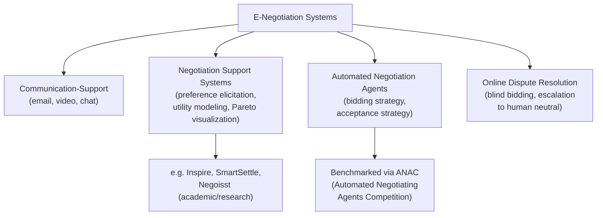

## E-Negotiation Platforms and Virtual Bargaining

### Definition and Scope

E-negotiation refers to negotiation processes mediated substantially or entirely through information and communication technology, ranging from simple email exchanges to purpose-built software platforms that structure offers, track concessions, and in some cases apply algorithmic support or automated agents. Virtual bargaining broadens the scope to any negotiation conducted without face-to-face co-presence, including video conferencing, and encompasses both human-to-human negotiation over digital channels and human-to-agent or agent-to-agent negotiation. This field sits at the intersection of negotiation theory, human-computer interaction, decision support systems, and (increasingly) computational/AI-assisted bargaining.

### Taxonomy of E-Negotiation Systems

E-negotiation support systems (NSS) are generally classified by function:

#### Communication-Support Systems

Provide the channel for exchanging offers and messages (email, chat, video) without structuring the substantive negotiation process. These add convenience and reduce travel/scheduling costs but do not alter the underlying decision-making architecture.

#### Negotiation Support Systems (NSS) / Decision-Support Tools

Provide structured decision aids to one or both parties: preference elicitation, utility modeling, tradeoff analysis, and visualization of the efficient frontier of possible agreements. Academic systems in this tradition include **Inspire**, **SmartSettle**, and **Negoisst**, developed largely within negotiation-analytic and decision-science research programs. These systems typically:

- Elicit each party's preferences and priorities over issues via structured questionnaires (e.g., conjoint analysis or direct rating scales).
- Compute a multi-attribute utility function for each party.
- Visualize possible packages on a Pareto frontier, helping parties identify integrative (mutually beneficial) trades rather than purely distributive ones.
- In some implementations (e.g., SmartSettle), offer algorithmic mediation: the system suggests or optimizes package proposals based on each party's stated utility function, without a human mediator.

#### Automated Negotiation Agents

Software agents that negotiate on behalf of a principal, following predefined strategies, utility functions, and concession rules, used in both academic research (notably via the **ANAC — Automated Negotiating Agents Competition**, an annual research competition benchmarking agent strategies against standardized negotiation domains) and applied settings such as automated procurement, ad-exchange bidding, and some e-commerce price negotiation. These agents typically implement:

- A **preference/utility model** representing the principal's priorities.
- A **bidding strategy** (e.g., time-dependent concession functions, tit-for-tat mirroring, or Bayesian opponent modeling).
- An **acceptance strategy** determining when to accept an incoming offer versus counter-offer.

#### Online Dispute Resolution (ODR) Platforms

Extend e-negotiation into structured resolution of actual disputes (as opposed to pre-dispute deal-making), covered in more detail under dedicated ODR topics; these often combine automated blind-bidding negotiation (e.g., for monetary claims) with escalation paths to human mediators or arbitrators.

### Standard Architecture of a Negotiation Support System

A generalized NSS/automated negotiation architecture, synthesized from the research literature (Kersten and Lai's work on e-negotiation systems; the ANAC agent architecture standard, e.g., the GENIUS framework used for agent benchmarking):

1. **Domain/Issue Specification Layer**: defines the negotiation domain — the set of issues under negotiation and the possible values for each (e.g., price: $1000–$5000; delivery: 1–30 days).
2. **Preference Elicitation Module**: gathers each party's utility function over the domain, typically via direct weighting of issues plus value functions per issue (linear additive utility models are the most common simplification).
3. **Utility/Evaluation Engine**: computes the utility of any given offer or package for a party, enabling both visualization (Pareto frontier plotting) and, for automated agents, internal decision-making.
4. **Strategy/Protocol Module**: governs the negotiation protocol (e.g., alternating offers, simultaneous sealed bids) and, for automated agents, the concession and acceptance strategy.
5. **Communication/Exchange Layer**: transmits offers, counter-offers, and messages between parties or agents, often with logging for post-hoc analysis or audit.
6. **Outcome/Agreement Layer**: formalizes the final accepted package into a record (contract draft, settlement memorandum, or structured data output).

[Inference] This layered architecture is a synthesis drawn from common patterns across academic NSS platforms and agent competition frameworks rather than a single standardized specification universally implemented identically across all systems.

### Key Technical and Theoretical Concepts

#### Utility Modeling and the Pareto Frontier

Most structured e-negotiation systems represent each party's preferences as an additive multi-attribute utility function:

$$U(x) = \sum_{i=1}^{n} w_i \cdot v_i(x_i)$$

where $x$ is a package (a value for each issue), $w_i$ is the weight (importance) of issue $i$, and $v_i(x_i)$ is the value function scoring option $x_i$ on issue $i$, normalized typically to $[0,1]$. Once both parties' utility functions are known or estimated, the system can identify the **Pareto-efficient frontier**: the set of packages where no party's utility can be improved without decreasing the other's, which is the theoretical target of integrative bargaining.

[Inference] In practice, additive linear utility models are a simplifying assumption; they do not capture interaction effects between issues (e.g., a buyer who only values fast delivery *if* price is also low), and more sophisticated NSS implementations use non-linear or conditional utility structures.

#### Opponent Modeling

Automated negotiation agents frequently attempt to infer the opponent's utility function or strategy from observed offer sequences, using techniques ranging from simple frequency analysis of concession patterns to Bayesian updating and machine-learning classifiers trained on historical negotiation data. Accurate opponent modeling improves an agent's ability to propose Pareto-efficient packages rather than purely distributive ones, but overfitting to noisy early offers is a known failure mode. [Unverified] The comparative effectiveness of specific opponent-modeling techniques varies significantly by negotiation domain and is an active area of ongoing research rather than a settled question.

#### Concession Strategies (Time-Dependent Tactics)

A common class of automated agent strategy, formalized in the negotiation-agent literature (e.g., Faratin, Sierra, and Jennings' foundational work on negotiation tactics), defines an agent's offered utility as a function of remaining time:

$$U(t) = U_{\min} + (U_{\max} - U_{\min}) \cdot \left(1 - \left(\frac{t}{T}\right)^{1/\beta}\right)$$

where $t$ is elapsed time, $T$ is the deadline, and $\beta$ controls the concession curve shape: $\beta < 1$ produces a **Boulware** strategy (holds firm until near the deadline, then concedes rapidly), while $\beta > 1$ produces a **Conceder** strategy (concedes steadily and early). This time-dependent tactic family is among the most widely implemented in agent-based negotiation research and competitions.

#### Blind Bidding (Double-Blind Negotiation)

Used extensively in ODR for monetary disputes (notably insurance claim settlement platforms): each party submits a confidential settlement figure; if the figures are within a defined threshold of each other (or the claimant's offer is below the defendant's), the system automatically settles at the midpoint or a defined formula, without either party seeing the other's figure unless a match occurs. This mechanism structurally prevents anchoring and positional escalation that can occur in visible offer-counteroffer exchanges.

### Virtual Bargaining: Behavioral and Process Considerations

Beyond software-mediated automated negotiation, "virtual bargaining" also refers to human negotiators interacting via video conferencing, chat, or asynchronous email rather than in person. Empirical negotiation research identifies several consistent effects of virtuality on negotiation dynamics:

- **Reduced rapport-building**: text-based and even video-based channels typically transmit less nonverbal information (tone, posture, micro-expressions) than in-person negotiation, which can impede trust-building, particularly in early-stage or cross-cultural negotiations. [Inference] The magnitude of this effect varies by channel richness (video generally outperforms text/email on this dimension) and by the negotiators' prior relationship.
- **Increased likelihood of impasse and contentious tactics in low-richness channels**: research on email negotiation (notably Kathleen Valley, Leigh Thompson, and colleagues' work on electronic negotiation) has associated purely text-based negotiation with higher rates of deception, "burned bridges," and impasse relative to face-to-face or telephone negotiation, attributed in part to reduced social accountability and slower feedback loops.
- **Time-lag effects in asynchronous negotiation**: email and other asynchronous channels remove the real-time pacing cues present in live negotiation, which can be exploited strategically (e.g., delayed responses as an implicit tactic) but also allows more careful, less impulsively reactive drafting of offers.
- **"Small talk" and rapport-priming interventions**: experimental research has found that brief unstructured personal exchange before or alongside virtual negotiation ("schmoozing") can meaningfully improve trust and joint outcomes relative to purely transactional virtual exchanges, a finding used to justify deliberate rapport-building steps in platform design (e.g., a mandatory brief video check-in before automated bidding begins).

### Design Considerations for E-Negotiation Platforms

**Key Points**

- **Channel richness tradeoffs**: richer channels (video) support relationship-sensitive negotiations better; leaner, structured channels (blind bidding, form-based NSS) reduce anchoring and positional escalation for purely distributive, transactional disputes.
- **Transparency and trust in algorithmic components**: where a platform recommends or computes packages (as in SmartSettle-style optimization), parties' willingness to trust the recommendation depends on perceived neutrality of the underlying algorithm and clarity about what data informed it.
- **Data security and confidentiality**: preference and utility data submitted to an NSS is commercially sensitive; platform architecture must ensure this data is not exposed to the counterparparty beyond what negotiation protocol requires.
- **Fallback to human intervention**: well-designed e-negotiation and ODR systems build in an escalation path to a human mediator or arbitrator when automated processes reach impasse, mirroring the tiered-escalation principle from dispute systems design.
- **Bias and fairness in automated agents**: an agent's opponent-modeling and concession strategies can produce systematically worse outcomes for less sophisticated counterparties (e.g., individual consumers negotiating against a firm's optimized bidding agent), raising design and regulatory concerns analogous to power-imbalance concerns in human-mediated ADR.

### Illustrative Example: Structuring an Automated Procurement Negotiation

**Example**

A manufacturing firm deploys an e-negotiation platform to negotiate recurring raw-material supply contracts with multiple vendors on price, delivery time, and payment terms.

1. **Domain specification**: the platform defines the negotiation domain as three issues — unit price ($40–$60), delivery lead time (5–20 days), and payment terms (net-30 to net-90).
2. **Preference elicitation**: the firm's procurement team specifies weights (e.g., price 50%, delivery time 30%, payment terms 20%) and value functions per issue; each vendor separately specifies their own weights via the same interface.
3. **Utility computation and Pareto visualization**: the system computes each side's utility for candidate packages and displays the current best-known Pareto frontier to each party privately, without revealing the counterparty's specific weights (preserving competitive confidentiality).
4. **Automated agent negotiation**: the firm configures a moderately Boulware-strategy agent ($\beta \approx 0.5$) to conduct the initial rounds of back-and-forth bidding autonomously within pre-approved bounds, escalating to human review if no agreement is reached within a defined number of rounds or by a defined deadline.
5. **Human handoff and closure**: once the automated exchange converges near a mutually acceptable region, a human procurement officer reviews the near-final package, makes any final relationship-sensitive adjustments (e.g., accommodating a vendor's request tied to an ongoing partnership), and finalizes the contract.

This illustrates the standard hybrid pattern in applied e-negotiation: automation handles the high-volume, well-structured distributive/integrative tradeoff exploration, while human judgment is preserved for relationship-sensitive closure — mirroring the general design principle of reserving human involvement for the parts of a process where it adds the most value.

### Related Topics

- Automated Negotiating Agents Competition (ANAC) and Agent Benchmarking
- Multi-Attribute Utility Theory in Negotiation Analysis
- Pareto Efficiency and Integrative Bargaining
- Online Dispute Resolution (ODR) Platform Architecture
- Opponent Modeling and Bayesian Learning in Automated Negotiation
- Boulware and Conceder Concession Strategies
- Blind-Bidding Mechanisms in Claims Settlement Systems
- Trust and Rapport-Building in Virtual Negotiation
- Cross-Cultural Dynamics in Computer-Mediated Negotiation
- Algorithmic Fairness and Power Asymmetry in Automated Bargaining Agents