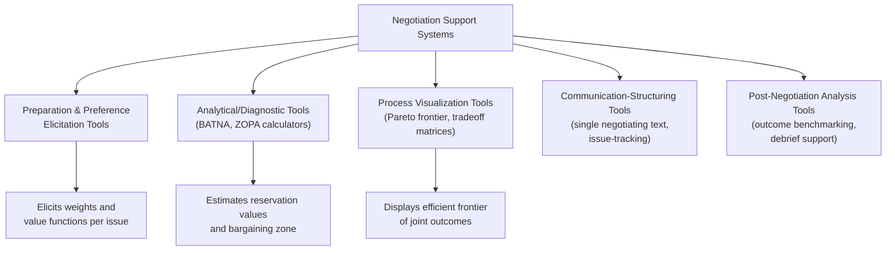

## Negotiation Support Systems and Decision Aids

### Definition and Scope

Negotiation Support Systems (NSS) are software tools designed to assist one or more negotiating parties in analyzing, structuring, and improving their decision-making before and during a negotiation, without replacing the parties' own judgment or authority to decide. NSS are distinguished from automated negotiation agents (which act autonomously on a principal's behalf) and from full e-negotiation platforms (which handle the offer-exchange process itself) by their primary function: decision support rather than negotiation execution. NSS draw heavily on decision analysis, multi-attribute utility theory, and behavioral decision research to correct known cognitive biases and structure otherwise unstructured bargaining.

### Rationale: Why Decision Aids Are Needed

Negotiation research has documented systematic cognitive biases that degrade unaided negotiator decision-making, providing the theoretical justification for structured decision support:

- **Fixed-pie bias**: the assumption that the negotiation is purely distributive (one party's gain is the other's loss), causing negotiators to miss integrative, mutually beneficial trades across issues with differing priorities.
- **Anchoring effects**: initial offers disproportionately influence the final settlement point, independent of their objective merit.
- **Overconfidence in own position's fairness or legal merit**: parties in conflict systematically overestimate the strength of their own case relative to neutral assessment (documented extensively in litigation-settlement research).
- **Reactive devaluation**: a proposal is valued less once it is known to come from the other side, even if its substantive terms are unchanged.
- **Failure to identify tradeoffs across multiple issues**: without structured elicitation, negotiators often fail to recognize that they value issues differently than their counterpart, missing "logrolling" opportunities (trading concessions on low-priority issues for gains on high-priority ones).

NSS are designed specifically to counteract these biases by externalizing preference structures, visualizing tradeoffs, and providing objective reference points.

### Core Functional Categories

#### Preparation and Preference-Elicitation Tools

Structured questionnaires and interfaces that help a negotiator (or negotiating team) systematically identify and weight the issues at stake before negotiation begins. Common elicitation techniques include:

- **Direct rating/ranking**: assigning importance weights or rank order to a predefined list of issues.
- **Conjoint analysis**: presenting hypothetical packages and inferring implicit weights from stated preferences among them, a technique borrowed from market research and adapted for negotiation preparation.
- **Issue-by-issue value functions**: mapping the range of possible outcomes on a single issue (e.g., price from $10,000 to $50,000) to a normalized utility score, capturing non-linearities (e.g., diminishing returns above a certain price point).

#### Analytical and Diagnostic Tools

Tools that compute or estimate key negotiation-analytic quantities:

- **BATNA calculators**: structured worksheets or software that help a party systematically identify, evaluate, and rank their alternatives to a negotiated agreement, converting the qualitative BATNA concept into a quantified reservation value.
- **ZOPA (Zone of Possible Agreement) estimators**: given each party's reservation value (often estimated or ranged, since a party typically cannot observe the other's true reservation value directly), the tool visualizes the possible bargaining zone and highlights whether a positive ZOPA plausibly exists.
- **Risk and uncertainty modeling**: for negotiations involving probabilistic outcomes (e.g., litigation settlement value estimation), decision-tree tools compute expected values across possible outcomes, a technique with deep roots in negotiation analysis following Howard Raiffa's foundational decision-analytic approach.

$$\text{Expected Litigation Value} = \sum_{i=1}^{n} P(\text{outcome}_i) \cdot V(\text{outcome}_i) - C_{\text{litigation}}$$

This expected value, once computed, functions as a data-driven reservation point/BATNA reference for settlement negotiation, directly informing the walk-away threshold.

#### Process Visualization Tools

Graphical representations that make abstract negotiation-analytic concepts tangible for negotiators without formal training in decision analysis:

- **Pareto frontier plots**: displaying the set of packages where no party's outcome can improve without worsening the other's, helping negotiators visually identify whether a proposed agreement leaves value on the table (is "inside" the frontier) versus is Pareto-efficient.
- **Tradeoff/issue matrices**: tabular displays cross-referencing each party's stated priorities across issues, surfacing potential logrolling opportunities where priorities diverge.
- **Concession-tracking timelines**: visualizing the sequence of offers and counteroffers over the course of a negotiation, useful for post-hoc analysis of concession patterns and pacing.

#### Communication-Structuring Tools

Tools that shape how information and proposals are exchanged, rather than analyzing preferences directly:

- **Single negotiating text procedure**: a facilitator or system iteratively drafts and revises a single proposed agreement document based on both parties' feedback, rather than parties exchanging competing counter-proposals — a technique with a well-documented history in complex multiparty negotiations (notably used in the Camp David Accords mediation process) and adaptable into software as a shared, version-controlled draft document.
- **Structured issue-tracking**: maintaining a running, mutually visible (or selectively visible) list of open, resolved, and contingent issues, preventing the common failure mode of re-litigating already-settled points.

#### Post-Negotiation Analysis Tools

Tools used after a negotiation concludes (or fails) to support organizational learning:

- **Outcome benchmarking**: comparing the achieved agreement against the pre-negotiation Pareto frontier estimate or against comparable historical negotiations, quantifying "value left on the table."
- **Debrief structuring**: guided post-mortem templates that prompt systematic reflection on what tactics worked, where biases may have influenced decisions, and what could improve future negotiations — an application of deliberate-practice principles to negotiation skill development.

### Illustrative Academic and Applied Systems

[Inference] The specific systems named below are drawn from published negotiation-analytic and NSS research literature; feature details reflect the general design patterns documented for each rather than necessarily their current, most up-to-date commercial state, since some of these are long-running academic research platforms.

- **Inspire**: a web-based NSS developed for negotiation research and teaching, providing preference elicitation, a negotiation history log, and post-negotiation efficiency analysis, widely used in academic negotiation courses to generate large datasets for behavioral negotiation research.
- **Negoisst**: a research NSS emphasizing structured electronic communication alongside offer/counteroffer tracking and semantic analysis of negotiation messages.
- **SmartSettle**: a system combining NSS decision-support functions (preference elicitation, Pareto visualization) with an optional algorithmic "optimization" feature that can compute or suggest mutually improving packages given both parties' stated utility functions, sitting at the boundary between pure decision support and algorithmic mediation.

### Design Principles for Effective NSS

**Key Points**

- **Preserve party autonomy**: an NSS should support, not supplant, the negotiator's own judgment; decision aids that are overly prescriptive risk being rejected by users who feel their agency is being displaced, or being followed uncritically in ways that mask the tool's simplifying assumptions.
- **Transparency of underlying assumptions**: since most NSS rely on simplified additive utility models, users benefit from visibility into what the model assumes (e.g., independence between issues) so they can judge when the tool's recommendations may not capture real-world interaction effects.
- **Protect competitively sensitive data**: in multi-party or adversarial-preparation contexts, an NSS must ensure a party's elicited preferences and weights are not exposed to the counterparty unless the party explicitly authorizes disclosure.
- **Calibrate to negotiator sophistication**: novice negotiators benefit from more scaffolded elicitation and plainer visualizations; experienced negotiators may want direct access to raw utility computations and sensitivity analysis.
- **Integrate rather than isolate**: standalone decision-support outputs are most useful when integrated into the broader negotiation preparation workflow (e.g., feeding directly into an opening-offer strategy or agenda-setting document) rather than existing as a disconnected analytical exercise.

### Limitations and Critiques

- **Model oversimplification**: additive linear utility models, the most common NSS foundation, cannot represent conditional preferences (where the value of one issue depends on the resolved value of another), a known and frequently cited limitation in the negotiation-analytic literature.
- **Elicitation burden and fatigue**: thorough preference elicitation (especially conjoint-analysis-based methods) can be time-consuming, creating a tradeoff between analytical rigor and practical usability, particularly for time-pressured or lower-stakes negotiations.
- **False precision**: numerically precise utility scores and Pareto-frontier visualizations can create an illusion of objectivity that obscures the genuine uncertainty in how preferences were elicited and estimated, a risk parties should be aware of before treating NSS output as authoritative.
- **Asymmetric adoption**: if only one party in a negotiation uses sophisticated decision support while the other does not, the informed party may gain a structural advantage — raising a design and ethics question analogous to power-imbalance concerns in mediation, and a consideration relevant to whether NSS tools should be offered symmetrically within a given negotiation program.

### Illustrative Example: Preparing for a Multi-Issue Employment Negotiation

**Example**

A job candidate uses an NSS-style preparation worksheet before negotiating a job offer involving base salary, signing bonus, remote-work flexibility, and start date.

1. **Preference elicitation**: the candidate rates the relative importance of the four issues (e.g., base salary 40%, remote flexibility 30%, signing bonus 20%, start date 10%) and defines a value function for each (e.g., diminishing marginal value of salary above a certain threshold, since the candidate's primary financial goal is met at that level).
2. **BATNA quantification**: the candidate quantifies their BATNA as a competing offer's total compensation-equivalent value, converting it into the same utility scale used for the current negotiation's issues, establishing a clear walk-away reservation point.
3. **Tradeoff matrix construction**: the candidate hypothesizes the employer's likely priorities (e.g., start date flexibility may be low-cost for the employer to grant, while base salary above a certain band may face internal equity constraints), identifying a likely logrolling opportunity: trading a later start date (low cost to the candidate, valuable to the employer) for greater remote-work flexibility (high value to the candidate, plausibly low cost to the employer).
4. **Frontier visualization**: the candidate maps out several candidate packages and estimates where each falls relative to their own reservation utility, entering the actual negotiation with a pre-identified target zone rather than a single fixed demand.

This illustrates the general NSS value proposition even outside a dedicated software platform: converting typically implicit, unstructured negotiation preparation into an explicit, bias-resistant analytical process.

### Related Topics

- Multi-Attribute Utility Theory in Negotiation Analysis
- BATNA and Reservation Value Estimation Techniques
- Zone of Possible Agreement (ZOPA) Modeling
- Pareto Efficiency and Integrative Bargaining
- Fixed-Pie Bias and Cognitive Biases in Negotiation
- Single Negotiating Text Procedure (Camp David Model)
- E-Negotiation Platforms and Virtual Bargaining
- Automated Negotiating Agents and Opponent Modeling
- Decision Analysis and Expected Value in Dispute Settlement
- Post-Negotiation Debriefing and Organizational Learning