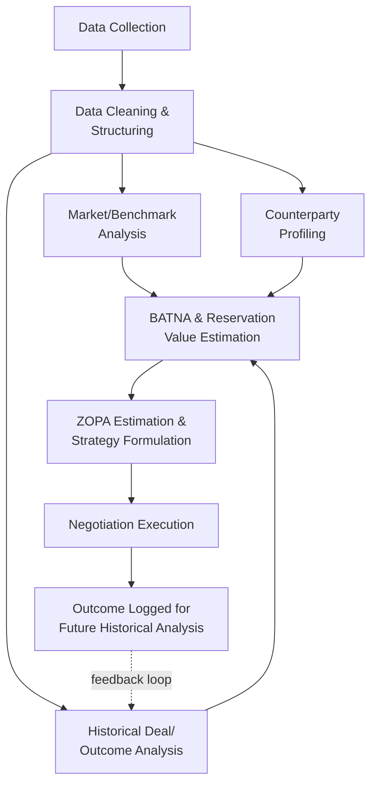

## Data Analytics for Negotiation Preparation

### Definition and Scope

Data analytics for negotiation preparation refers to the systematic collection, processing, and analysis of quantitative and qualitative data to inform a negotiator's strategy before entering a negotiation. This extends beyond the preference-elicitation and utility-modeling focus of Negotiation Support Systems into the broader practice of gathering external, market, historical, and counterparty-specific data to sharpen estimates of BATNA, reservation values, ZOPA boundaries, and counterparty behavior patterns. Where NSS structure a negotiator's own preferences, data analytics for preparation focuses on building an evidence base about the external environment and the counterparty.

### The Analytics-Preparation Pipeline

### Categories of Data Used in Negotiation Preparation

#### Market and Comparable Transaction Data

Quantitative benchmarks drawn from comparable transactions establish an objective external reference point, directly countering the overconfidence and anchoring biases discussed under Negotiation Support Systems. Examples include:

- **Comparable sales/pricing data**: real estate comparables, salary benchmarking surveys, industry pricing indices, or public deal databases (e.g., M&A transaction multiples).
- **Public market indicators**: for negotiations tied to commodities, currencies, or publicly traded instruments, live or historical price data anchors value discussions in observable fact rather than pure positional claims.
- **Regulatory or statutory benchmarks**: minimum wage data, statutory damages caps, or standard industry contract terms provide a floor/ceiling reference for what outcomes are plausible or customary.

#### Counterparty Profiling and Behavioral History

Data-driven counterparty analysis draws on:

- **Public disclosures**: financial statements, regulatory filings (e.g., SEC filings for public companies), press releases, and litigation records that reveal a counterparty's financial position, strategic priorities, and risk tolerance.
- **Past negotiation/deal history**: if available (e.g., within an organization's CRM or contract management system), a record of a specific counterparty's past concession patterns, typical opening positions, and closing behavior.
- **Social and reputational data**: publicly available information on a counterparty's negotiating style, reported in trade press, prior litigation, or professional networks, used cautiously given reliability concerns.
- **Organizational structure and decision authority mapping**: identifying who within a counterparty organization actually holds decision authority versus who is merely a conduit, informing which messages and arguments are likely to be most persuasive to the actual decision-maker.

#### Historical Internal Deal Data

Organizations with a sufficient volume of past negotiations (procurement, sales, licensing) can mine their own historical outcomes to establish internal benchmarks:

- **Concession pattern analysis**: examining how much movement from initial offers has historically occurred by deal type, counterparty segment, or negotiator, informing realistic target-setting for a new negotiation.
- **Win/loss and cycle-time analysis**: identifying which deal characteristics (issue mix, counterparty size, initial offer aggressiveness) correlate with successful closes versus prolonged impasse or failed negotiations.
- **Clause and term frequency analysis**: in contract negotiation contexts, analyzing a corpus of past contracts to identify standard versus negotiated terms, informing which requests are likely to be seen as reasonable versus unusual by a counterparty.

#### Sentiment and Communication Analysis

In organizations with access to negotiation correspondence (email threads, chat logs, call transcripts), natural language processing techniques can be applied to:

- **Detect sentiment shifts** across a negotiation's communication history, flagging escalating frustration or softening positions.
- **Identify linguistic markers of deception or overconfidence**, an area with some grounding in behavioral linguistics research, though [Unverified] the reliability of automated deception-detection from text remains contested in the broader NLP and psychology literature and should be treated as a supplementary signal rather than a definitive indicator.
- **Track topic emphasis over time**, revealing which issues a counterparty returns to repeatedly (a potential signal of true priority, distinct from their stated priority).

### Quantitative Techniques Applied to Negotiation Preparation

#### Reservation Value and BATNA Estimation via Regression

When a party's BATNA depends on an uncertain outside option (e.g., the likely price a house would fetch on the open market, informing a reservation price in a private sale negotiation), regression-based estimation using comparable data provides a statistically grounded point estimate along with a confidence interval, rather than a single anchoring guess:

$$\hat{V} = \beta_0 + \sum_{i=1}^{k} \beta_i X_i + \varepsilon$$

where $X_i$ are relevant comparable features (e.g., square footage, location, condition) and $\hat{V}$ is the estimated reservation value. The resulting confidence interval around $\hat{V}$ can directly inform how firmly a party should hold a given reservation price, since a wide interval suggests more flexibility may be warranted than a narrow one.

#### Monte Carlo Simulation for Uncertain Outcomes

For negotiations involving significant outcome uncertainty (e.g., settling litigation with uncertain trial outcomes, or negotiating a contract with variable future performance-based payouts), Monte Carlo simulation models the distribution of possible outcomes under different negotiated structures, allowing a party to compare not just expected value but also the variance/risk profile of different proposed deal structures — relevant when a party's risk tolerance (risk-averse vs. risk-seeking) should influence which structure is preferred even at similar expected value.

#### Game-Theoretic Modeling of Counterparty Strategy

Where sufficient structure exists to model the negotiation as a game (e.g., a known set of possible counterparty types with different reservation values), Bayesian game-theoretic models can inform optimal opening-offer strategy under uncertainty about the counterparty's true reservation value, drawing on the same theoretical foundations as the concession-strategy modeling used in automated negotiation agents. [Inference] Full formal game-theoretic modeling is more common in academic negotiation-analytic research and high-stakes institutional negotiations (labor relations, major M&A) than in routine day-to-day negotiation preparation, given the data and expertise requirements.

### Visualization Techniques for Preparation

**Key Points**

- **Comparable-data distribution plots**: histograms or box plots of comparable transaction values, visually establishing a defensible range rather than a single anchor figure.
- **Concession-pattern timelines**: plotting historical negotiation rounds (own or counterparty) to identify typical pacing and inform realistic expectations about how many rounds a negotiation may require.
- **Sensitivity/tornado charts**: showing how a computed reservation value or expected settlement value shifts as key assumptions (discount rate, probability of a given outcome, comparable set selection) are varied, helping a negotiator understand which assumptions most affect their walk-away point.
- **Counterparty decision-map diagrams**: visual mapping of a counterparty organization's decision-makers, influencers, and approval chain, clarifying where persuasive effort should be concentrated.

### Ethical and Practical Considerations

- **Data provenance and legality**: counterparty research must respect applicable privacy, data protection, and anti-competitive information-sharing laws (e.g., antitrust concerns around competitor pricing data exchange in some jurisdictions); [Unverified] specific legal boundaries vary substantially by jurisdiction and industry and should be confirmed against current local regulation rather than assumed from general practice.
- **Overreliance on incomplete data**: preparation analytics are only as good as the underlying data's representativeness; small or biased comparable sets can produce falsely precise reservation-value estimates, reproducing the "false precision" risk noted for NSS more broadly.
- **Balancing quantitative and relational judgment**: heavily analytics-driven preparation can undervalue relationship, trust, and non-quantifiable interests (e.g., reputational considerations) if the underlying data model does not explicitly incorporate them, a caution particularly relevant in negotiations where the ongoing relationship's value is genuinely difficult to quantify.
- **Static data vs. real-time dynamics**: pre-negotiation analytics necessarily reflect a snapshot; effective negotiators update their models as new information emerges during the negotiation itself, rather than treating pre-negotiation analysis as fixed and final.

### Illustrative Example: Data-Driven Preparation for a Vendor Contract Renewal

**Example**

A company preparing to renegotiate a multi-year software licensing contract with an incumbent vendor undertakes structured data-driven preparation:

1. **Market benchmarking**: the procurement team gathers publicly available pricing data and industry analyst reports on comparable software licensing deals, establishing a defensible price range rather than relying solely on the vendor's proposed renewal figure.
2. **Internal historical analysis**: the team mines its own contract management system for past negotiations with this vendor and similar vendors, finding that this vendor has historically granted an average discount off its initial renewal quote, informing a realistic target rather than an anchoring-driven overly aggressive or overly conservative opening counter.
3. **Counterparty financial profiling**: reviewing the vendor's public earnings statements reveals the vendor is under revenue pressure in the current quarter, suggesting increased flexibility on price in exchange for a longer contract term (informing a logrolling proposal: extended term for a larger discount).
4. **BATNA quantification**: the team estimates the cost and disruption of switching to a competing platform (migration cost, retraining, and switching-risk contingency), converting this into a dollar-denominated reservation value that establishes a clear walk-away threshold for the negotiation.
5. **Sensitivity check**: a tornado chart reveals that the switching-cost estimate is the most uncertain and impactful assumption in the BATNA calculation, prompting the team to tighten that estimate (via a vendor quote from the competing platform) before finalizing their negotiation strategy.

This illustrates how structured data analytics converts an otherwise intuition-driven renewal negotiation into an evidence-based process, directly feeding the BATNA, reservation-value, and ZOPA concepts central to negotiation-analytic theory.

### Related Topics

- BATNA and Reservation Value Estimation Techniques
- Zone of Possible Agreement (ZOPA) Modeling
- Negotiation Support Systems and Decision Aids
- Monte Carlo Simulation in Risk-Based Negotiation
- Game-Theoretic Models of Bargaining Under Incomplete Information
- Counterparty Due Diligence and Organizational Decision-Mapping
- Sentiment Analysis and NLP Applications in Negotiation
- Anchoring Bias and Overconfidence in Negotiator Judgment
- E-Negotiation Platforms and Virtual Bargaining
- Post-Negotiation Outcome Benchmarking and Organizational Learning