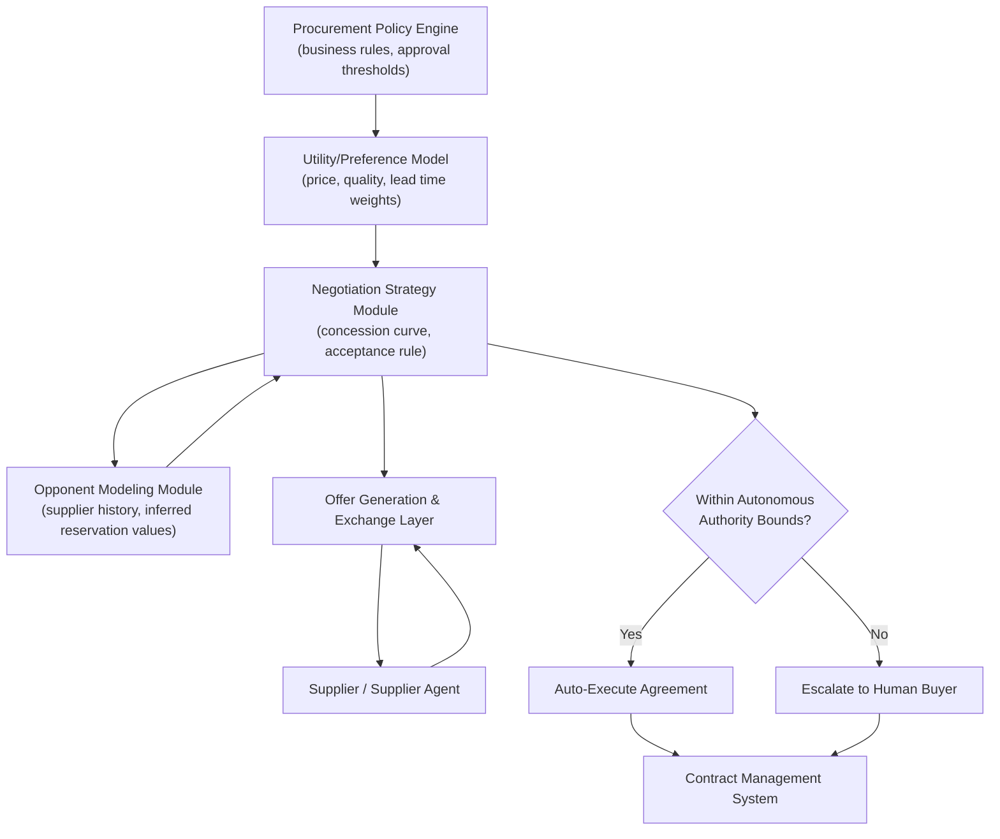

## Autonomous Negotiation Agents in Procurement and Supply Chains

### Definition and Scope

Autonomous negotiation agents in procurement and supply chains are software systems that conduct negotiation on behalf of a buying or selling organization with minimal or no real-time human intervention, applying predefined strategies, utility functions, and decision rules to reach agreements on price, quantity, delivery terms, and other contract parameters. This domain applies the general automated-negotiation-agent theory (introduced under E-Negotiation Platforms) to the specific, high-volume, often recurring transactional context of business-to-business procurement, where the scale of negotiations (many suppliers, many SKUs, frequent recurring contracts) makes full automation economically attractive in ways that lower-volume, higher-stakes negotiations typically do not justify.

### Why Procurement Is a Natural Fit for Automation

Several structural features of procurement negotiations make them especially amenable to autonomous agents, distinguishing this domain from relationship-sensitive or legally complex negotiations:

- **High transaction volume**: large organizations conduct thousands of recurring supplier negotiations (spot purchases, contract renewals, RFQ responses), where per-negotiation human labor cost is prohibitive at scale.
- **Structured, quantifiable issues**: procurement negotiations typically reduce to a well-defined set of issues (unit price, quantity, lead time, payment terms, quality specifications) that map cleanly onto multi-attribute utility models, unlike negotiations with significant unquantifiable relational or emotional content.
- **Repeated interactions with the same counterparties**: recurring supplier relationships generate historical data (see Data Analytics for Negotiation Preparation) that can train and calibrate opponent models over time, improving agent performance with experience.
- **Time-sensitive, high-frequency decisions**: dynamic pricing and just-in-time procurement scenarios (e.g., spot-market commodity purchasing) require negotiation speeds beyond human real-time capability.

### Architecture of a Procurement Negotiation Agent

#### Procurement Policy Engine

Encodes organizational business rules constraining what the agent may agree to autonomously: approved supplier lists, minimum quality/compliance thresholds, budget ceilings, and required contractual clauses (e.g., mandatory liability terms). This layer functions as a hard constraint set applied before any utility optimization, ensuring the agent cannot autonomously agree to terms that violate organizational policy or legal requirements regardless of the utility calculation's output.

#### Utility/Preference Model

Represents the buying organization's priorities across negotiable issues using the standard additive multi-attribute utility structure introduced in Negotiation Support Systems:

$$U(x) = \sum_{i=1}^{n} w_i \cdot v_i(x_i)$$

In procurement contexts, weights are frequently derived from total cost of ownership (TCO) models rather than price alone — incorporating lead time (inventory carrying cost implications), quality/defect rate (downstream cost of poor quality), and payment terms (working capital impact) into a unified utility function rather than optimizing price in isolation.

#### Negotiation Strategy Module

Implements the agent's bidding behavior, typically drawing on the same time-dependent concession-curve family used in general automated negotiation research (Boulware/Conceder strategies, per the Faratin-Sierra-Jennings formalization), often augmented in procurement-specific implementations with:

- **Multi-supplier parallel negotiation**: simultaneously negotiating with several candidate suppliers for the same requirement, using competitive pressure (visible or implied) as a strategic lever, sometimes structured as a reverse auction rather than pairwise bilateral negotiation.
- **Volume/tier-based concession logic**: adjusting acceptance thresholds based on order volume tiers, reflecting real procurement economics where per-unit price expectations shift with committed quantity.

#### Opponent Modeling Module

For recurring supplier relationships, opponent modeling can leverage substantial historical data (past negotiated prices, past concession patterns, supplier financial health indicators) to build a more accurate estimate of a specific supplier's likely reservation price than is possible in one-shot negotiations, improving the efficiency (fewer rounds, better outcomes) of automated bidding over time as the historical dataset grows.

#### Escalation and Human-in-the-Loop Boundaries

A defining design feature of applied procurement agents (as distinct from purely academic automated-negotiation research) is the explicit **authority boundary**: the agent operates autonomously within a defined envelope (e.g., price within X% of budget, standard terms only) and escalates to a human buyer when a negotiation approaches or exceeds that envelope, when the counterparty proposes non-standard terms, or when negotiation fails to converge within a set number of rounds or time limit. This mirrors the general dispute-systems-design principle of reserving human judgment for higher-stakes or non-routine decisions while automating the high-volume, well-structured cases.

### Common Negotiation Protocols in Procurement Automation

**Key Points**

- **Reverse auctions**: multiple suppliers submit competing bids for a defined requirement; price (and sometimes other weighted criteria) determines the winner, typically the most automatable and lowest-complexity protocol, best suited to commoditized goods with minimal differentiation.
- **Bilateral alternating-offer negotiation**: buyer and supplier (or their respective agents) exchange offers and counteroffers according to the classic alternating-offers protocol from bargaining theory, used where the requirement is more customized and reverse-auction commoditization is inappropriate.
- **Request-for-proposal (RFP) with automated scoring**: suppliers submit multi-dimensional proposals; an automated scoring engine (an extension of the utility model) ranks proposals, sometimes followed by automated or human-led final-round negotiation with top-ranked bidders.
- **Dynamic/spot-market negotiation**: for commodity inputs with volatile pricing (raw materials, energy, freight capacity), agents may negotiate or transact against live market-linked pricing models with minimal per-transaction human involvement, similar in spirit to automated trading systems.

### Integration with Supply Chain Systems

Autonomous negotiation agents in production settings are typically integrated with broader supply chain and enterprise systems rather than operating in isolation:

- **ERP (Enterprise Resource Planning) integration**: negotiation agents draw inventory levels, demand forecasts, and budget data directly from ERP systems to inform real-time negotiation parameters (e.g., increasing urgency/willingness to concede when inventory is critically low).
- **Supplier relationship management (SRM) systems**: historical performance data (on-time delivery rates, quality metrics, past pricing) feeds the opponent-modeling and supplier-scoring components.
- **Contract lifecycle management (CLM) systems**: finalized agreements from the negotiation agent flow directly into contract generation and management systems, closing the loop from negotiation to executable, trackable contract.
- **Demand forecasting/planning systems**: anticipated future demand informs the volume commitments an agent is authorized to negotiate, linking negotiation strategy to broader supply chain planning.

### Benefits and Documented Advantages

- **Scalability**: enables negotiation of a far larger number of supplier relationships and SKUs than human procurement teams could individually manage, particularly valuable for long-tail, lower-value spend categories that would not otherwise receive dedicated negotiation attention ("tail spend" optimization).
- **Consistency and policy compliance**: automated agents apply procurement policy uniformly, reducing the risk of individual buyer inconsistency, favoritism, or unintentional policy violations.
- **Speed**: enables near-real-time negotiation for time-sensitive spot purchases where human-paced negotiation would be impractically slow.
- **Data-driven continuous improvement**: because every automated negotiation generates structured data, organizations can systematically analyze and improve strategy parameters over time in ways that are harder to do consistently with purely human-conducted negotiations.

### Risks, Limitations, and Ethical Considerations

- **Relationship erosion**: fully automating negotiation in relationship-significant supplier categories (strategic, sole-source, or innovation-partner suppliers) risks damaging the collaborative, trust-based dynamics that such relationships often require, arguing for reserving automation primarily for transactional/commoditized spend categories rather than strategic partnerships. [Inference] This risk is widely discussed in supply-chain management literature as a rationale for selective/tiered automation rather than universal automation across all supplier categories.
- **Algorithmic collusion and market concerns**: where multiple buyers or sellers in a market deploy similar automated pricing/negotiation agents, there is documented regulatory and academic concern (particularly in competition-law and algorithmic-pricing research) about the potential for tacit algorithmic coordination that could raise prices or reduce competitive dynamics, even absent explicit human intent to collude. [Unverified] The empirical prevalence and legal treatment of this risk is an evolving area, and organizations deploying such agents should monitor current competition-law guidance in their relevant jurisdictions.
- **Opponent-modeling exploitation**: a sophisticated supplier-side agent negotiating against a less sophisticated buyer-side agent (or vice versa) can systematically extract more favorable terms, an asymmetry-of-capability risk analogous to the power-imbalance concerns raised elsewhere in automated and human-mediated negotiation contexts.
- **Escalation-boundary miscalibration**: setting the autonomous authority envelope too broadly risks the agent committing the organization to unfavorable terms without adequate review; setting it too narrowly undermines the efficiency gains that justified automation in the first place, making this boundary a critical and ongoing tuning decision rather than a one-time setup parameter.
- **Data quality dependency**: agent performance (particularly opponent modeling and TCO-based utility weighting) is only as good as the underlying ERP, SRM, and historical negotiation data; poor data quality can degrade agent decisions in ways that may not be immediately visible without dedicated monitoring.

### Illustrative Example: Tiered Automation Across a Procurement Portfolio

**Example**

A manufacturing company segments its supplier base into three tiers to determine the appropriate degree of negotiation automation for each:

1. **Tail spend (commoditized, low-value, high-volume)**: office supplies, standard packaging materials, and generic MRO (maintenance, repair, operations) items are negotiated through fully autonomous reverse-auction agents with minimal human oversight, since the low per-transaction stakes and commoditized nature of these goods make full automation low-risk and highly efficient at scale.
2. **Transactional/standard spend (moderate value, recurring but somewhat differentiated goods)**: standard raw material contracts use a bilateral negotiation agent operating within a defined authority envelope (e.g., price within 5% of the TCO-optimal target, standard payment terms only), with automatic escalation to a human category manager for any negotiation approaching the envelope's edge or lasting beyond a defined number of rounds.
3. **Strategic spend (high-value, sole-source, or innovation-critical suppliers)**: negotiations with strategic suppliers (e.g., a sole-source component critical to a flagship product) remain fully human-led, with data analytics and NSS-style decision support (see Data Analytics for Negotiation Preparation and Negotiation Support Systems) available to the human negotiator, but no autonomous agent execution authority, preserving the relationship-sensitive judgment such negotiations require.

This tiered approach illustrates the general design principle that automation value is highest where transaction volume is high and relationship/customization complexity is low, and that a well-designed procurement negotiation system explicitly segments its supplier base along these lines rather than applying a uniform automation policy across all spend categories.

### Related Topics

- E-Negotiation Platforms and Virtual Bargaining
- Multi-Attribute Utility Theory and Total Cost of Ownership Modeling
- Boulware and Conceder Concession Strategies
- Reverse Auctions and Automated RFP Scoring
- Supplier Relationship Management (SRM) System Integration
- Algorithmic Collusion and Competition Law in Automated Pricing
- Opponent Modeling in Recurring Bilateral Negotiations
- Tail Spend Management and Procurement Segmentation Strategy
- Human-in-the-Loop Design for Autonomous Decision Systems
- Contract Lifecycle Management (CLM) System Integration