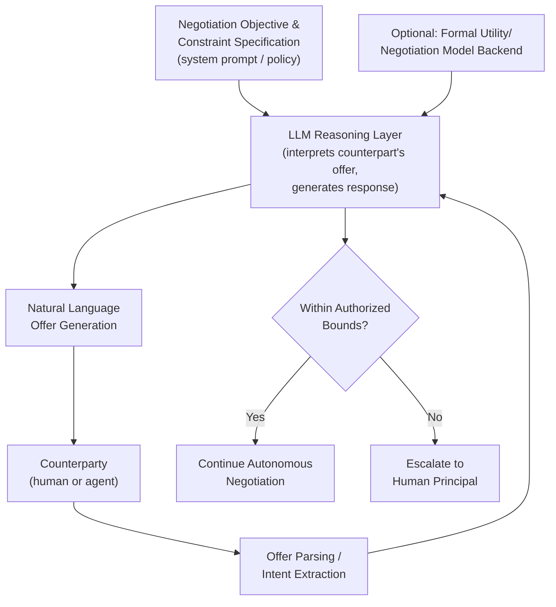

## Large Language Model-Based Negotiation Agents

### Definition and Scope

Large language model (LLM)-based negotiation agents are software agents that use natural-language generation and understanding capabilities to conduct negotiation directly in unstructured or semi-structured dialogue, rather than through the fixed-schema offer/counteroffer exchanges typical of classical automated negotiation agents (e.g., ANAC-style agents operating over predefined issue-value domains). This represents a distinct generation of negotiation automation: where classical agents require the negotiation domain to be formally specified in advance (a fixed set of issues and value ranges), LLM-based agents can parse free-form natural language offers, generate persuasive argumentation, interpret ambiguous or implicit signals, and negotiate in open-ended domains without a pre-built formal utility schema — while introducing new categories of risk around consistency, manipulability, and fairness.

### How LLM-Based Agents Differ from Classical Automated Negotiation Agents

| Dimension | Classical Automated Agents (ANAC-style) | LLM-Based Agents |
| --- | --- | --- |
| Domain specification | Formal, predefined issue-value space | Can operate over natural-language, loosely specified domains |
| Offer representation | Structured (e.g., vector of issue values) | Free-text, potentially ambiguous |
| Strategy formalization | Explicit concession functions (Boulware/Conceder), formal acceptance rules | Emergent from prompting, fine-tuning, or scaffolded reasoning; less formally verifiable |
| Persuasion/argumentation | Minimal or absent | Can generate rich natural-language justification, framing, and rapport-building |
| Consistency across turns | Deterministic given strategy parameters | Can exhibit inconsistency, especially across long dialogues or under adversarial prompting |
| Explainability | Strategy logic is inspectable | Reasoning may be opaque even with chain-of-thought prompting |
| Vulnerability to manipulation | Limited to domain-specific exploits | Vulnerable to prompt injection, social-engineering-style manipulation, and jailbreak-style attacks on stated objectives |

### Architectural Patterns

A generalized architecture for LLM-based negotiation agents, synthesized from current research prototypes (including hybrid approaches that pair an LLM front end with a classical negotiation model back end):

A frequently studied hybrid pattern combines an LLM used specifically for natural-language offer generation and interpretation with a formal negotiation model operating in the back end to track utility and enforce strategy constraints — the LLM handles the linguistic surface of the interaction while a more classical, verifiable model governs the underlying decision logic. This approach, combining negotiation models at the back end with the capabilities of LLMs to generate textual offers at the front end, has been proposed and prototyped for machine-human negotiations, such as a sales-representative agent case in a phone-plan sales context. [DOI](https://doi.org/10.1080/10447318.2025.2502981)

### Empirical Findings on LLM Negotiation Performance

#### Model-to-Model Behavioral Differences

Comparative benchmarking research evaluating multiple frontier LLMs against each other in structured bargaining games (from ultimatum games to Nash bargaining setups) has found systematic behavioral differences between models. One such study found that a Llama-3 model generally struck the most effective bargains, a Claude-3 model leaned toward aggressive proposals that maximized its own gain but risked counterpart push-back, while a GPT-4 model tended to offer the fairest splits. The same research found that even when negotiation efficiency was high, the balance of utility between agents could be uneven, producing suboptimal joint (Nash product) outcomes despite nominally efficient deals. [Sage Journals](https://journals.sagepub.com/doi/10.1177/10711813251372102)[Sage Journals](https://journals.sagepub.com/doi/10.1177/10711813251372102)

[Unverified] These model-specific behavioral characterizations reflect a specific benchmark study's findings under its particular experimental conditions; model providers continue to update and retrain models, so behavioral tendencies observed in any single study should not be assumed to remain fixed or to generalize across all negotiation contexts.

#### Human-Agent Negotiation Outcomes

Controlled experiments with human participants negotiating against LLM-enhanced software agents have found measurable performance effects favoring the LLM-equipped side. In one human-subjects experiment, two versions of LLM-enhanced software agents achieved more beneficial agreements for the agents (functioning as sellers) compared to agents without LLM enhancement. This finding is consistent with a broader pattern in the literature suggesting LLM-based agents can gain a negotiation advantage over less-augmented human counterparts, raising the same capability-asymmetry and fairness concerns discussed for automated agents generally. [DOI](https://doi.org/10.1080/10447318.2025.2502981)

#### Fairness and Bias Concerns

Emerging research has begun probing whether LLM negotiator agents introduce or amplify social bias into negotiation outcomes. One study found that when either the seller or buyer agent is made aware of the gender and race of the other party, they secure more profit compared to negotiations conducted in a gender- and race-blind manner, indicating that LLM-based agents can reproduce demographic bias patterns observed in human negotiation research when demographic information is available in the negotiation context. [Unverified] The generalizability of this finding across different models, prompting strategies, and negotiation domains is still being established in an active area of research. [MDPI](https://www.mdpi.com/2227-7390/14/3/458)

#### Persistent Weaknesses

Human-factors research on LLM negotiation capability has identified recurring limitations. Human factors research indicates AI systems often struggle with contextual interpretation, social signaling, and rationality under ambiguity, and prior research has shown that perceived fairness and transparency are vital for user trust in automation, with AI negotiators risking violations of fairness expectations when clear reasoning visibility is absent. This motivates ongoing research into explainability techniques (e.g., structured chain-of-thought disclosure) specifically for negotiation-agent transparency. [Sage Journals](https://journals.sagepub.com/doi/10.1177/10711813251372102)[Sage Journals](https://journals.sagepub.com/doi/10.1177/10711813251372102)

### Applied and Prototype Domains

- **Sales and customer negotiation**: LLM-enhanced sales agents capable of natural-language price and terms negotiation with customers, an active applied research area given the direct commercial incentive to reduce human sales-negotiation labor costs.
- **Legal contract negotiation**: AI agents have begun negotiating with each other over legal contracts as LLM capabilities have increased, extending the classical automated procurement-negotiation paradigm into more linguistically complex, clause-based contract negotiation. [arxiv](https://arxiv.org/pdf/2503.06416)
- **Humanitarian and crisis negotiation research**: a distinct and notably higher-stakes research thread examines LLM use in humanitarian frontline negotiation contexts, exploring both opportunities and considerations for using large language models in humanitarian frontline negotiation settings, a domain where errors carry substantially higher human costs than commercial applications and where research emphasizes caution over deployment enthusiasm. [arxiv](https://arxiv.org/pdf/2604.08567)
- **Consumer agent-to-agent marketplaces**: emerging research models scenarios where both buyer-side and seller-side consumer-facing agents negotiate autonomously on behalf of their respective principals, examining the risk and transaction dynamics of such agent-to-agent consumer markets.
- **Large-scale procurement**: extending the classical automated procurement paradigm discussed under Autonomous Negotiation Agents in Procurement and Supply Chains, LLM capability has intensified interest and investment in this space. Major multinational organizations have begun implementing such technologies at scale, exemplified by a large retailer's 2022 operationalization of an autonomous negotiation platform to manage supplier contract renegotiations that would be infeasible for human negotiators to address individually. [arxiv](https://arxiv.org/pdf/2503.06416)

### Training and Improvement Techniques

Research on improving LLM negotiation performance has explored several technique families:

- **Feedback-conditioned fine-tuning**: training approaches that incorporate structured feedback signals about negotiation outcome quality to improve bargaining performance, an active technique family in recent negotiation-specific LLM research.
- **Emotional policy modeling**: research into adversarial multi-turn price-negotiation settings has explored evolving emotional expression policies for negotiating agents, treating emotional framing as a learnable strategic variable rather than a fixed stylistic property.
- **Buyer/seller role-specific enhancement methods**: benchmark research measuring LLM bargaining ability has proposed methods specifically to enhance weaker-performing roles (e.g., a documented "buyer-enhancement method" addressing an observed asymmetry where LLM agents perform differently depending on which side of a transaction they represent).
- **Multi-agent deliberation and partial-observability research**: broader work on LLM agents in joint decision-making under partial observability studies how agents coordinate and negotiate when neither party has full information about the other's constraints, directly relevant to realistic negotiation settings where reservation values are private information.

### Risk Categories Specific to LLM-Based Negotiation

**Key Points**

- **Prompt injection and adversarial manipulation**: because LLM agents process natural-language input from a potentially adversarial counterparty, a negotiation partner can attempt to manipulate the agent's stated objectives or constraints through crafted language, a risk with no clear analogue in classical structured-domain automated agents. Research on system-prompt robustness has emerged partly in response to this class of vulnerability.
- **Inconsistency and hallucination**: an LLM agent may generate offers inconsistent with its own prior statements or fabricate details about terms, pricing, or authority it does not actually possess, a failure mode requiring guardrails (e.g., a formal constraint-checking layer, as in the hybrid architecture pattern above) beyond what pure prompting reliably prevents.
- **Opacity of reasoning**: even with chain-of-thought-style prompting, the internal basis for an LLM agent's specific offer or concession is not fully verifiable in the way a classical agent's formal concession-curve parameter is, complicating both debugging and post-hoc accountability.
- **Bias amplification when demographic signals are present**: as the fairness research above indicates, LLM agents exposed to counterpart demographic information may produce disparate outcomes, arguing for careful control over what contextual information such agents can access during negotiation.
- **Authority and liability ambiguity**: when an LLM agent commits an organization to a natural-language-negotiated term, questions of legal authority, contract formation, and liability may be less clearly delineated than with a formally scoped classical agent operating within an explicit, auditable authority envelope.

### Design Recommendations Emerging from Current Research

- **Bound autonomous authority explicitly**: as with classical procurement agents, define hard constraints (price floors/ceilings, permissible clause types) enforced outside the LLM's own natural-language reasoning, rather than relying solely on prompted instructions the model might not reliably follow under adversarial pressure.
- **Prefer hybrid architectures for high-stakes use**: pairing an LLM's natural-language capability with a formal, auditable negotiation/utility model back end (as demonstrated in current sales-agent prototypes) mitigates the consistency and verifiability weaknesses of pure end-to-end LLM negotiation.
- **Build in transparency and reasoning disclosure**: given documented findings that perceived fairness and transparency drive user trust, exposing structured rationale for offers (not just the offer itself) is an emerging best practice for human-facing LLM negotiation agents.
- **Control demographic and contextual information exposure**: given documented bias-amplification findings, limit what identity-linked information an LLM negotiation agent can access or condition on, particularly in consumer-facing contexts.
- **Reserve high-stakes and humanitarian applications for extensive human oversight**: research in the humanitarian negotiation space explicitly frames LLM use as requiring careful consideration of opportunities *and* risks rather than straightforward deployment, a caution that generalizes to other high-consequence negotiation domains (e.g., crisis, hostage, or safety-critical negotiations).

### Illustrative Example: A Hybrid LLM-Backend Sales Negotiation Agent

**Example**

A telecommunications company deploys a customer-facing negotiation agent for phone plan renewals, modeled on the hybrid architecture pattern described in current research.

1. **Formal backend model**: a classical multi-attribute utility model defines the company's acceptable ranges for monthly price, contract length, and data allowance, together with a Boulware-style concession curve bounding how quickly the agent may move from its opening offer toward its walk-away point.
2. **LLM front end**: the LLM receives the customer's natural-language messages (which may include complaints, comparisons to competitor offers, or emotional appeals), interprets the customer's implicit priorities and reservation signals, and generates a natural-language response and counteroffer consistent with the current permissible range computed by the backend model.
3. **Constraint enforcement**: regardless of how persuasively the customer argues, the LLM's generated offers are checked against the backend model's hard constraints before being sent, preventing the natural-language layer from being manipulated into an unauthorized concession.
4. **Escalation trigger**: if the customer's request falls outside the agent's authorized envelope (e.g., a request contingent on a non-standard bundled service), the conversation is escalated to a human retention specialist, with the full negotiation transcript and the LLM's summarized understanding of the customer's stated priorities passed along to preserve continuity.
5. **Outcome logging**: the negotiation transcript and outcome feed back into the company's historical negotiation dataset, both for classical opponent-modeling refinement (as in Data Analytics for Negotiation Preparation) and for auditing the agent for consistency, fairness, and any bias patterns across customer demographics.

This illustrates the currently emerging best-practice pattern: using the LLM for what it does uniquely well — natural-language understanding, generation, and rapport — while retaining a formally verifiable, auditable decision core for the actual negotiation stance, directly addressing the consistency, authority, and bias risks documented in current research.

### Related Topics

- Autonomous Negotiation Agents in Procurement and Supply Chains
- E-Negotiation Platforms and Virtual Bargaining
- Opponent Modeling and Bayesian Learning in Automated Negotiation
- Prompt Injection and Adversarial Robustness in LLM Agents
- Fairness and Bias in Algorithmic Negotiation Systems
- Human-in-the-Loop Design for Autonomous Decision Systems
- Multi-Agent LLM Coordination and Communication
- Hybrid Symbolic-Neural Architectures for Decision Automation
- Humanitarian and Crisis Negotiation Ethics
- Explainability and Transparency in Automated Bargaining Agents