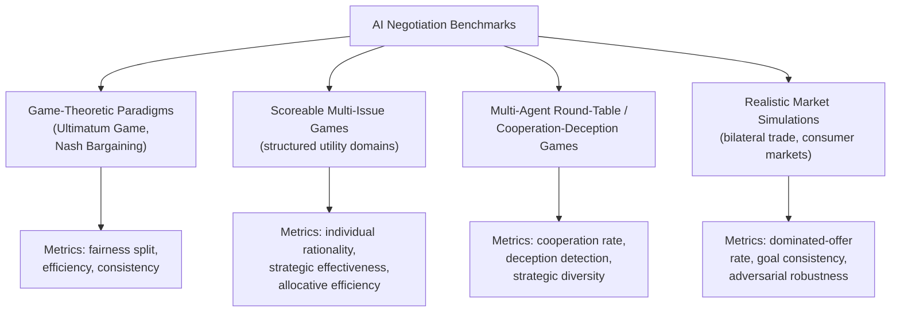

## Benchmarking and Evaluating AI Negotiation Capabilities

### Definition and Scope

Benchmarking and evaluating AI negotiation capabilities is the research discipline concerned with designing standardized environments, metrics, and protocols to measure how well an AI system — historically rule-based automated agents, and increasingly large language model (LLM)-based agents — performs negotiation tasks. This differs from evaluating negotiation *outcomes* in a single applied deployment (e.g., a procurement agent's contract terms); benchmarking aims to produce reproducible, comparative measurements that generalize across models, letting researchers and practitioners answer questions like "which model negotiates most effectively?" or "does this model exhibit strategically rational behavior?" under controlled, repeatable conditions.

### Why Negotiation Is a Distinctively Hard Benchmarking Target

Negotiation poses evaluation challenges that differ from static benchmarks (question-answering, coding, math):

- **Interactivity**: negotiation is a live, back-and-forth process — exactly the kind of dynamic human interaction that static AI benchmarks miss, since outcomes depend on a sequence of interdependent moves rather than a single input-output pair.
- **No single ground truth**: unlike a math problem with one correct answer, a "good" negotiation outcome depends on each party's private, often unobservable utility function, making objective scoring inherently harder than for tasks with a verifiable correct output.
- **Opponent-dependence**: an agent's measured performance is partly a function of who or what it negotiates against, so evaluation results can shift substantially depending on the counterpart model, complicating comparisons across studies that do not share the same evaluation partners.
- **Multi-dimensional success criteria**: a negotiation can be evaluated on efficiency (value created), fairness (value distribution), individual rationality (whether each party's outcome beats its reservation value), strategic consistency, and process quality (communication, legitimacy, relationship), and these dimensions do not collapse into a single scalar easily.

### Core Evaluation Paradigms

#### Game-Theoretic Paradigms

Classical game-theoretic settings — the one-shot **Ultimatum Game** and the open-ended **Nash Bargaining** task — have been adapted into interactive agent environments to study how LLMs reason, cooperate, and compete as a deal evolves over successive rounds. One notable evaluation used the Harvard Negotiation Project's six principles (Interests, Legitimacy, Relationship, Options, Commitment, Communication) as a structured scoring rubric applied across hundreds of negotiation rounds, moving beyond a pure economic-efficiency score toward a framework grounded in established negotiation theory.

#### Scoreable Multi-Issue Games

A prominent benchmark line uses "Scoreable Games" — structured multi-issue negotiation domains with defined, computable utility functions — where a round-table format has agents negotiate and cooperate while being instructed to keep their own preferences hidden from other parties, testing both negotiation skill and strategic information management. A reproduction study of this benchmark found that model comparisons using the framework could be ambiguous and raised questions about the benchmark's objectivity, while also identifying limitations in information-leakage detection and the thoroughness of ablation testing — illustrating a broader, recurring theme in AI benchmarking generally: published benchmark claims often do not fully replicate or generalize when independently reproduced across a wider range of models.

A related and more recent benchmark design addresses these reproducibility concerns directly by separating binding offers from natural-language messages in the action space, which enables unambiguous utility computation without requiring human annotation or LLM-based parsing of ambiguous natural language. This benchmark evaluates along three formally defined dimensions — **individual rationality** (does the agent avoid outcomes worse than its reservation value?), **strategic effectiveness** (does it capture available value?), and **allocative efficiency** (is the joint outcome close to Pareto-optimal?) — using automated metrics rather than relying on aggregate or qualitative scores, and employs a round-robin tournament design with every model negotiating against every other model in both buyer and seller roles, which reveals pairwise behavioral dynamics (such as which specific models induce rationality violations in their opponents) that single-opponent evaluation setups cannot capture.

#### Multi-Agent Cooperation and Deception Games

Another benchmark line studies cooperation and deception in multi-agent LLM negotiation games specifically, finding that models can exhibit inconsistent strategic behavior across repeated interactions with the same setup — a finding with direct implications for deploying such agents in recurring negotiation contexts (e.g., procurement) where behavioral consistency and predictability matter to the deploying organization. A related multi-domain evaluation platform, NegotiationArena, has been used to reveal limited strategic diversity across models, suggesting that despite differing training and scale, many current models converge on a narrower range of negotiation tactics than might be expected.

#### Realistic Market Simulation Benchmarks

More recent benchmark efforts push toward greater domain realism, evaluating LLM agency specifically through multi-issue negotiations and finding that models frequently accept dominated offers (offers objectively worse than an available alternative) and fail to maintain consistent goals across a negotiation session — a core rationality failure distinct from strategic suboptimality. Complementary research specifically measuring bargaining ability and susceptibility to adversarial tactics has quantified violations of negotiation rationality directly, providing a more granular diagnostic than aggregate outcome scores. Other work has noted that existing benchmarks predominantly focus on simplified, single-issue negotiation settings, which limits their ability to diagnose known LLM shortcomings such as underdeveloped Theory-of-Mind reasoning, restricted strategic adaptability, and often superficial reasoning, and has argued that prevailing datasets largely overlook real-world market complexities such as installment plans, monopolistic conditions, or the effect of negative public perception on negotiation dynamics.

### Core Evaluation Metrics

**Key Points**

- **Individual rationality (IR)**: whether an agreement leaves each party at least as well off as its reservation value/BATNA; IR violations indicate the agent accepted a strictly dominated outcome.
- **Allocative/Pareto efficiency**: how close the achieved outcome is to the Pareto-efficient frontier for the given utility functions, capturing whether value was left on the table.
- **Fairness/distributional balance**: how evenly value is split between parties, often assessed via Nash product scores or similar measures; research has found that even high-efficiency outcomes can show an uneven balance of utility between agents, producing suboptimal joint (Nash product) outcomes despite nominal efficiency.
- **Strategic consistency**: whether an agent maintains stable goals and non-contradictory positions across a multi-round negotiation, a dimension on which current models have been found to falter, particularly as stakes rise.
- **Cooperation and deception rates**: in multi-agent settings, measuring how often agents cooperate, defect, or engage in strategically deceptive communication.
- **Adversarial robustness**: susceptibility to counterpart tactics designed to induce irrational concessions or extract unauthorized information.
- **Process-quality dimensions**: legitimacy, relationship preservation, and communication quality, assessed via rubric-based scoring (e.g., applying the Harvard Negotiation Project's six principles) rather than purely outcome-based metrics.

### Documented Model-Comparative Findings

Comparative evaluation across frontier models has surfaced consistent, model-specific behavioral tendencies in at least one widely cited study: a Llama-3 model generally struck the most effective bargains, a Claude-3 model leaned toward aggressive proposals that maximized its own gain but risked counterpart push-back, and a GPT-4 model tended to offer the fairest splits, with these strategic differences echoing similar findings in other independent negotiation studies. The same body of research found that today's top LLMs can already secure mutually beneficial deals, yet still falter on consistency, legitimacy, and commitment when stakes rise, suggesting that negotiation capability does not degrade uniformly but rather concentrates in specific, identifiable failure modes under pressure.

[Unverified] These specific model-behavioral characterizations are drawn from particular benchmark studies under their specific experimental conditions and model versions; given the pace of model updates, such findings should be treated as time-bound empirical snapshots rather than fixed, permanent characterizations of any model family.

### Known Benchmarking Pitfalls and Methodological Concerns

- **Benchmark contamination/leakage**: negotiation scenarios or their solutions may have been present in a model's training data, artificially inflating performance and invalidating fair comparison, a concern raised broadly across LLM benchmarking literature and specifically flagged as a risk in negotiation benchmark reproduction studies.
- **Inconsistent metric rigor across studies**: different negotiation benchmarks use different scoring conventions, making cross-study comparison difficult and potentially creating unfair comparisons between models evaluated under different frameworks.
- **Limited game/scenario diversity**: reproduction and critique studies have identified limited adaptability and a lack of game diversity as a recurring weakness, meaning strong performance on one negotiation benchmark format may not generalize to structurally different negotiation scenarios.
- **Reliance on LLM-based parsing/judging introduces its own noise**: benchmarks that rely on natural-language offer interpretation (rather than structured, unambiguous offer representations) risk conflating a model's negotiation skill with the evaluation framework's own parsing accuracy — a concern that motivated newer benchmark designs to separate binding structured offers from free-text messages specifically to enable unambiguous, non-LLM-dependent utility computation.
- **Single-opponent evaluation blind spots**: evaluating a model against only one fixed counterpart (rather than a full round-robin across many models) can miss important pairwise dynamics, such as one model's tendency to induce rationality violations specifically in certain other models.

### Fairness, Bias, and Equity Evaluation

A growing evaluation focus examines whether AI negotiators reproduce or amplify demographic biases. By providing objective assessments and highlighting inequities in proposals, LLMs have been proposed as tools that could support more inclusive negotiation outcomes and reduce power-asymmetry effects in bargaining. However, empirical testing complicates this optimistic framing: research evaluating fairness in LLM negotiator agents via economic games found that when either the seller or buyer agent is made aware of the gender and race of the counterparty, that agent secures more profit compared to negotiations conducted in a gender- and race-blind setting — indicating that awareness of demographic attributes can itself become a channel for bias in AI-mediated negotiation, a finding directly relevant to evaluation protocol design (i.e., whether and how a benchmark exposes agents to demographic signals materially affects the fairness properties being measured).

### Emerging Directions in Benchmark Design

- **Utility-based feedback training coupled with evaluation**: research on LLM agents for bargaining with utility-based feedback demonstrates a trend toward benchmarks that double as training signals, closing the loop between evaluation and capability improvement rather than treating benchmarking as a purely post-hoc measurement exercise.
- **Bilateral trade with private information**: newer benchmark designs specifically model settings where each party's reservation value is genuinely private information unknown to the other side (and often to the evaluator without instrumentation), more faithfully capturing the information-asymmetry conditions of real-world negotiation than benchmarks with fully observable utility structures.
- **Theory-of-Mind–focused diagnostics**: given documented findings that current models show underdeveloped Theory-of-Mind reasoning in negotiation contexts, dedicated diagnostic sub-tasks are being developed to isolate this specific capability from general negotiation competence.
- **Applied real-world complexity modeling**: benchmark designers are increasingly incorporating features largely overlooked by earlier datasets, such as installment plans, monopolistic market structures, and the reputational impact of negative public perception, aiming to close the realism gap between benchmark performance and applied deployment performance.

### Illustrative Example: Designing a Round-Robin Evaluation Protocol

**Example**

A research team wants to compare three candidate LLMs for potential deployment as a customer-facing sales negotiation agent, avoiding the single-opponent blind spot documented in the literature.

1. **Structured domain design**: the team defines a multi-issue negotiation domain (price, contract length, add-on services) with a formally specified, automatically computable utility function for both a "buyer" and "seller" role, separating binding structured offers from any accompanying natural-language message to avoid ambiguous-parsing noise.
2. **Round-robin tournament**: each candidate model negotiates against every other candidate model (and a fixed baseline rule-based agent) in both the buyer and seller role, rather than testing each model against only a single fixed opponent.
3. **Multi-dimensional scoring**: for every completed negotiation, the team computes individual rationality (did either side accept a dominated offer?), allocative efficiency (distance from the Pareto frontier), and a Nash-product fairness score (balance of utility gained).
4. **Consistency stress test**: the team introduces a mid-negotiation twist (e.g., a sudden change in a stated requirement) partway through several sessions to test whether each model maintains coherent goals and revises its position rationally, rather than exhibiting the goal-inconsistency failure mode documented in the literature.
5. **Demographic-signal control condition**: the team runs a parallel set of sessions where simulated customer personas include demographic cues, comparing outcomes against a demographic-blind control condition to check for the bias-amplification effect documented in prior fairness research before finalizing a deployment recommendation.

This protocol directly incorporates the methodological lessons from the benchmarking literature discussed above: round-robin design to avoid single-opponent blind spots, formally computable utility to avoid LLM-parsing noise, and an explicit fairness/bias control condition rather than relying on outcome efficiency alone.

### Related Topics

- Large Language Model-Based Negotiation Agents
- Individual Rationality and Pareto Efficiency in Bargaining Evaluation
- Theory-of-Mind Reasoning in AI Negotiation
- Fairness and Bias in Algorithmic Negotiation Systems
- Harvard Negotiation Project's Six Principles Framework
- Benchmark Contamination and Reproducibility in LLM Evaluation
- NegotiationArena and Multi-Domain Evaluation Platforms
- Nash Bargaining Solution and Nash Product Scoring
- Adversarial Robustness Testing for Negotiation Agents
- Round-Robin Tournament Design for Multi-Agent Evaluation