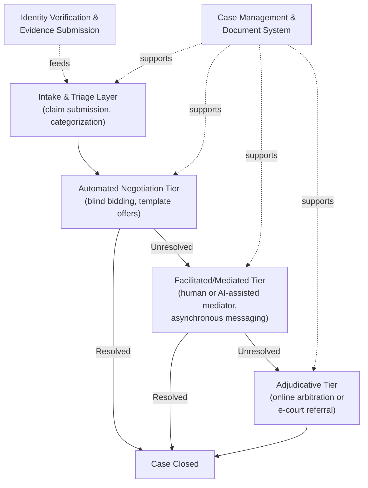

## Online Dispute Resolution Technologies

### Definition and Scope

Online Dispute Resolution (ODR) technologies are digital platforms and systems that facilitate the resolution of disputes through internet-based tools, extending Alternative Dispute Resolution mechanisms (negotiation, mediation, arbitration) into fully or partially automated, remote-accessible workflows. ODR emerged initially to resolve disputes arising from e-commerce transactions (where the parties were often geographically distant and the dispute value too low to justify traditional dispute resolution costs) and has since expanded into court-connected systems, consumer protection frameworks, and general-purpose commercial dispute platforms. ODR is distinguished from the general e-negotiation and e-mediation tools discussed elsewhere by its explicit focus on resolving disputes that have already crystallized (as opposed to pre-dispute deal-making) and by its frequent integration with formal legal or institutional escalation pathways.

### Historical Development and Rationale

ODR arose from a specific structural problem: traditional dispute resolution mechanisms (litigation, in-person mediation/arbitration) impose fixed costs that make them economically irrational for small-value, high-volume disputes — the canonical example being e-commerce buyer-seller disputes where the amount at stake (a mis-shipped or defective low-cost item) is far smaller than the cost of any formal process. This access-to-justice gap for low-value, high-volume disputes drove the earliest large-scale ODR deployments (notably eBay's internal dispute resolution system, which grew to process a very large volume of buyer-seller disputes annually), demonstrating that automated, low-cost processes could resolve disputes at a scale and cost point traditional ADR could not reach. This "small claims, high volume" origin has shaped much of ODR's subsequent technical architecture: blind bidding, template-driven claim submission, and automated triage remain core design patterns precisely because they were built to handle enormous caseloads with minimal per-case human labor.

### The ODR Technology Stack

#### Intake and Triage Layer

The entry point for a dispute, typically including:

- **Structured claim forms**: guided intake wizards that categorize the dispute type (non-delivery, item not as described, billing dispute, contract breach) and route it to the appropriate resolution track.
- **Automated eligibility screening**: rules-based logic determining whether a claim meets the platform's jurisdiction, value threshold, or subject-matter criteria for ODR handling versus requiring referral elsewhere.
- **Identity verification**: authentication mechanisms (increasingly including document verification and biometric checks in higher-stakes ODR deployments) to establish party identity before proceeding, particularly important where the eventual outcome may be legally binding.

#### Automated Negotiation Tier (Blind Bidding)

The **double-blind bidding** mechanism, introduced under E-Negotiation Platforms, remains a foundational ODR technique, especially for monetary claims: each party submits a confidential settlement figure; if the figures fall within a defined threshold of each other, the system automatically settles at a formulaic point (often the midpoint), without either party ever seeing the other's figure unless a match occurs. This mechanism structurally prevents anchoring and positional escalation, and is particularly well-suited to disputes that are purely distributive over a single monetary amount rather than requiring exploration of multiple interacting issues.

#### Facilitated/Mediated Tier

Where automated negotiation fails to resolve a dispute, ODR platforms typically escalate to a facilitated tier featuring:

- **Asynchronous messaging-based mediation**: unlike in-person mediation's real-time joint sessions, ODR mediation frequently occurs through structured asynchronous message exchange, with a human (or increasingly AI-assisted) mediator reviewing submissions and facilitating exchange over an extended period rather than a single session.
- **Document and evidence management**: structured upload and organized presentation of evidence (photos, receipts, correspondence) supporting each party's position, often with automated formatting into a shared case file visible to the mediator.
- **AI-assisted mediator support tools**: emerging platforms incorporate AI-based drafting assistance, sentiment analysis of party communications, and suggested settlement ranges to support human mediators handling higher case volumes than would be feasible with purely manual review.

#### Adjudicative Tier

For disputes that resist negotiated or mediated resolution, ODR platforms may provide:

- **Online arbitration**: a binding decision rendered by a human or, in narrowly defined domains, algorithmically assisted arbitrator based on submitted evidence and arguments, without requiring an in-person hearing.
- **E-court integration/referral**: structured handoff of case data and evidentiary record to a formal court system's electronic filing infrastructure, preserving the record built during the ODR process rather than requiring the parties to reconstruct their case from scratch.

### Court-Connected ODR Systems

A significant and growing category of ODR technology is embedded directly within judicial systems, extending court-annexed ADR programs (see Alternative Dispute Resolution Program Design) into fully online workflows:

- **Small claims and traffic ODR portals**: several jurisdictions have deployed court-run online platforms allowing self-represented litigants to negotiate, mediate, or resolve small claims and traffic infraction disputes without appearing in person, typically combining structured negotiation tools with an escalation path to a judicial officer.
- **E-filing integrated dispute resolution**: ODR modules integrated into broader e-filing and case management systems, allowing referral to online mediation as a standard step in the civil case workflow rather than a separate, disconnected system.
- **Access-to-justice rationale**: court-connected ODR is frequently justified on access grounds — reducing the burden of travel, time off work, and procedural complexity that disproportionately affects self-represented and lower-income litigants, extending the equity objectives central to Dispute Systems Design Principles into a specifically technological implementation.

### Design Principles Specific to ODR

**Key Points**

- **Asynchronicity as a design asset, not just a constraint**: unlike in-person processes, ODR can leverage asynchronous interaction to reduce the emotional intensity of live confrontation, allow more considered responses, and accommodate parties across time zones — while requiring careful design to prevent asynchronicity from being exploited as a delay tactic.
- **Plain-language, self-help-oriented interfaces**: because ODR often serves self-represented parties without legal training, interface design emphasizes plain-language explanations of process and options at each stage, a design requirement distinct from professional-neutral-facing e-negotiation tools.
- **Proportionality of process to dispute value**: ODR platforms typically calibrate process complexity (number of tiers, degree of human involvement) to the monetary or practical stakes of the dispute, reserving the most resource-intensive tiers (human mediation, adjudication) for disputes that survive automated and lower-cost tiers.
- **Trust and legitimacy despite reduced human contact**: since parties in ODR often never interact with a human neutral face-to-face (or at all, for automated-tier resolutions), platforms must establish procedural legitimacy through transparent process explanation, clear escalation rights, and visible neutrality safeguards rather than relying on in-person rapport-building.
- **Data security and confidentiality**: ODR platforms handle sensitive personal, financial, and dispute-specific data at scale, requiring robust data protection architecture, particularly where platforms operate across jurisdictions with differing privacy regulatory regimes.

### Integration with AI and Automation

Contemporary ODR platforms increasingly incorporate AI capabilities beyond the classical blind-bidding and rules-based triage patterns:

- **Automated document and evidence analysis**: natural-language processing applied to submitted evidence and correspondence to extract relevant facts, flag inconsistencies, or summarize lengthy submissions for human reviewers.
- **Predictive triage and outcome estimation**: machine-learning models trained on historical case data to estimate the likely resolution pathway or outcome for a new case, informing routing decisions (e.g., directing cases with a high predicted settlement likelihood toward the automated tier first).
- **Chatbot-based intake and guidance**: conversational interfaces guiding parties through claim submission, document gathering, and process explanation, reducing the human staffing burden of intake support at scale.
- **LLM-assisted mediation support**: as discussed under Large Language Model-Based Negotiation Agents, LLM capabilities are beginning to be applied to draft settlement proposals, summarize party positions, and provide reasoning transparency to build party trust — though the same consistency, bias, and authority-boundary risks documented for LLM negotiation agents generally apply directly to their use within ODR mediation and adjudication tiers, arguing for the same hybrid, human-oversight architecture recommended in that context.

### Risks, Limitations, and Critiques

- **Digital divide and access barriers**: ODR's core access-to-justice rationale can be undermined for populations lacking reliable internet access, digital literacy, or comfort with asynchronous text-based communication, potentially reproducing rather than resolving access inequities for specific demographic groups.
- **Due process concerns in binding automated/algorithmic tiers**: where ODR platforms incorporate binding decision-making with limited human review, due process questions analogous to those raised about mandatory arbitration (see Alternative Dispute Resolution Program Design) apply with added complexity around the transparency and contestability of any algorithmic components.
- **Power imbalance reproduction**: as with in-person ADR, ODR does not automatically correct underlying power or resource imbalances between parties (e.g., an individual consumer versus a large platform operating its own ODR system), and platform-operator-run ODR systems in particular raise structural conflict-of-interest questions when the platform itself is a repeat-player counterparty to many of the disputes it adjudicates.
- **Confidentiality versus systemic pattern detection**: as with mediation confidentiality generally, high-volume automated ODR's case-by-case privacy can obscure systemic issues (e.g., a merchant with a persistent pattern of a specific type of complaint) unless the platform explicitly builds in aggregate pattern-monitoring separate from individual case confidentiality.
- **Emotional and relational limitations**: ODR's efficiency gains for high-volume, low-value disputes come with the same virtual-negotiation limitations discussed under E-Negotiation Platforms and Virtual Bargaining — reduced rapport-building capacity and higher potential for miscommunication in text-based exchange, making ODR less well-suited to disputes where relationship repair or complex emotional dynamics are central.

### Illustrative Example: E-Commerce Marketplace Dispute Resolution Flow

**Example**

A buyer on an online marketplace receives an item significantly different from its listing description and files a dispute through the platform's ODR system.

1. **Intake and triage**: the buyer completes a structured claim form categorizing the issue as "item not as described," uploads photos of the received item alongside the original listing, and the system automatically verifies the claim falls within the platform's covered transaction value threshold.
2. **Automated negotiation tier**: the platform first prompts direct buyer-seller messaging with suggested resolution templates (partial refund, full refund plus return, replacement), allowing many disputes to resolve without further escalation.
3. **Blind bidding fallback**: if direct messaging fails to resolve the dispute within a set window, the system offers a blind-bidding refund negotiation: both parties submit a confidential acceptable refund percentage, and the system automatically settles if the figures are sufficiently close.
4. **Facilitated tier escalation**: if blind bidding also fails, the case escalates to a human platform-employed dispute specialist who reviews the submitted evidence and issues a resolution recommendation, with both parties given a defined window to accept or contest it.
5. **Final appeal/adjudicative tier**: for higher-value disputes or contested specialist recommendations, the case escalates to a final internal review process functioning as a de facto binding adjudicative tier, since the marketplace's terms of service typically make this determination final for the platform-mediated transaction (with the buyer retaining any external legal rights, such as a payment-processor chargeback, outside the platform's ODR system).

This flow illustrates the standard proportional-escalation architecture common to high-volume ODR systems: automated and self-service tiers absorb the large majority of low-complexity disputes, reserving increasingly costly human involvement for the smaller subset of cases that genuinely require it.

### Related Topics

- Alternative Dispute Resolution Program Design
- E-Negotiation Platforms and Virtual Bargaining
- Blind-Bidding Mechanisms in Claims Settlement Systems
- Large Language Model-Based Negotiation Agents
- Court-Connected Mediation and E-Filing Integration
- Digital Divide and Access-to-Justice in Automated Systems
- Due Process Safeguards in Algorithmic Dispute Resolution
- Consumer Protection Frameworks for Platform-Operated ODR
- Data Privacy and Security in Dispute Resolution Platforms
- AI-Assisted Mediation and Human Oversight Architecture