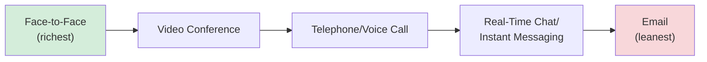

## Negotiating Across Digital and Remote Communication Channels

### Definition and Scope

Negotiating across digital and remote communication channels refers to the practice and behavioral study of conducting negotiation through mediated technological channels — email, chat/instant messaging, video conferencing, telephone, and hybrid combinations — as opposed to co-present, face-to-face interaction. This topic addresses the human-behavioral and process-design dimensions of channel choice, complementing the technological-architecture focus of E-Negotiation Platforms and Virtual Bargaining: where that topic covers the *systems* that support virtual bargaining, this topic covers how negotiators should *behave differently* depending on which channel they are using, and how to choose the right channel for a given negotiation.

### Media Richness Theory as the Foundational Framework

The dominant theoretical lens for understanding channel effects on negotiation is **Media Richness Theory** (originally developed by Daft and Lengel for organizational communication generally, and extensively applied to negotiation by researchers including Kathleen Valley, Leigh Thompson, and colleagues). Media richness is typically defined by four channel properties:

- **Capacity for immediate feedback** (synchronous vs. asynchronous).
- **Number of cues conveyed** (verbal only vs. verbal plus vocal tone vs. verbal, vocal, and visual/nonverbal).
- **Language variety** (ability to convey nuance, emotion, and natural language versus constrained/formal expression).
- **Personal focus** (degree to which the medium conveys individualized, personal presence versus impersonal transmission).

Channels are typically ranked from richest to leanest as follows:

The core theoretical claim is that richer channels transmit more of the contextual, emotional, and nonverbal information that supports trust-building, accurate interpretation of intent, and relationship-sensitive negotiation, while leaner channels strip away this information, with consequences documented extensively in the empirical negotiation literature.

### Documented Behavioral Effects of Channel Leanness

#### Increased Contentiousness and Impasse in Lean Channels

Research on email-mediated negotiation has found consistently higher rates of contentious, aggressive, or "burned bridges" behavior compared to face-to-face or telephone negotiation, along with elevated impasse rates. [Inference] The mechanism most commonly proposed in this literature is reduced social accountability: without visible nonverbal feedback signaling the counterpart's emotional reaction, negotiators may underestimate the interpersonal cost of aggressive tactics, though the precise causal mechanism remains a subject of ongoing behavioral research rather than a single settled explanation.

#### Reduced Trust and Rapport Formation

Lean channels transmit fewer of the nonverbal cues (tone of voice, facial expression, posture, timing of responses) that humans use to assess trustworthiness and build rapport. This has direct negotiation consequences: trust is a key input to information-sharing behavior in negotiation, and negotiators who trust each other less tend to share less information about their true priorities, reducing the likelihood of discovering integrative, mutually beneficial trades (see the fixed-pie bias discussion under Negotiation Support Systems and Decision Aids).

#### The "Schmoozing" Effect and Rapport-Priming Interventions

A well-documented experimental finding is that brief, unstructured personal exchange before or alongside a lean-channel negotiation — informal small talk unrelated to the substantive negotiation — measurably improves subsequent trust and joint negotiated outcomes relative to purely transactional exchange. This finding has directly informed both platform design (e.g., structured rapport-building steps before automated negotiation, discussed under E-Negotiation Platforms) and practitioner guidance for negotiators using lean channels: deliberately front-loading a period of informal, non-substantive interaction (even a brief phone or video call before an email-based negotiation proceeds) as a low-cost trust-building intervention.

#### Deception and Strategic Misrepresentation

Some research on electronic negotiation has associated leaner, more anonymous channels with higher self-reported willingness to misrepresent information or engage in ethically questionable tactics, plausibly linked to the reduced sense of social presence and accountability in text-based, asynchronous exchange. [Unverified] The magnitude and consistency of this effect across different populations, cultures, and specific channel types remains an area where findings vary across studies, and practitioners should treat it as a documented risk factor rather than a universal, fixed law of virtual negotiation.

#### Pacing and the Strategic Use of Delay

Asynchronous channels (email, asynchronous messaging) remove the real-time pacing cues present in synchronous negotiation, creating both a risk and a tool:

- **Risk**: delayed responses can be exploited strategically (implicit pressure tactics, feigned unavailability) without the immediate social cost that stalling would carry in a live conversation.
- **Tool**: the same lack of real-time pressure allows more careful, deliberate drafting of offers and responses, potentially reducing impulsive, reactive concessions or escalations that can occur under live conversational pressure — a genuine advantage of asynchronicity for negotiators prone to being pressured into premature concessions.

### Channel Selection Framework

**Key Points**

- **Relationship value and complexity**: high-relationship-value, emotionally or politically sensitive negotiations should default to the richest available channel (ideally face-to-face, or video conferencing as the best remote substitute), since richness supports the trust and nuance such negotiations typically require.
- **Transactional simplicity**: highly structured, low-emotional-content, largely distributive negotiations (e.g., routine price negotiation on a well-understood, single-issue transaction) can be conducted efficiently over leaner channels without significant loss, since little relationship-sensitive nuance needs to be conveyed.
- **Need for a documented record**: email and written channels create an inherent documentary record useful for negotiations where precise terms must be unambiguously fixed and referenced later (e.g., contract term negotiation), an advantage leaner channels retain over synchronous verbal exchange despite their relational costs.
- **Cross-cultural considerations**: cultures with higher reliance on nonverbal and contextual communication (high-context cultures) may experience greater information loss and higher misinterpretation risk in lean-channel negotiation than cultures more comfortable with direct, explicit verbal/written communication (low-context cultures), suggesting channel choice should be sensitive to the counterpart's likely communication style, not just the deal's structural characteristics.
- **Time zone and logistical constraints**: geographically distributed negotiating parties may have practical constraints favoring asynchronous channels regardless of the theoretically preferable richer channel, requiring explicit compensating strategies (see below) to offset the relational costs of the necessarily leaner channel.

### Compensating Strategies for Lean-Channel Negotiation

Given that channel choice is often constrained by practical factors (geography, cost, logistics) rather than freely selected on relational merit alone, negotiation practice has developed compensating techniques to mitigate lean-channel risks:

1. **Deliberate rapport-building before substantive exchange**: scheduling a brief synchronous (voice or video) introduction before proceeding to email-based negotiation, directly operationalizing the schmoozing-effect finding.
2. **Explicit tone and intent clarification**: proactively stating intent and tone in writing (e.g., "I want to be direct without sounding harsh — this is meant collaboratively") to compensate for the absence of vocal tone and facial expression that would normally convey this in richer channels.
3. **Periodic synchronous check-ins during extended asynchronous negotiations**: interspersing occasional video or phone calls within a longer email-based negotiation to reset rapport and clarify any accumulated misunderstandings before they escalate into positional entrenchment.
4. **Written summaries and explicit confirmation loops**: given the higher misinterpretation risk in lean channels, proactively summarizing understood positions ("to confirm, my understanding is...") reduces the risk of divergent interpretations going undetected until a later breakdown.
5. **Managing response-time norms explicitly**: establishing shared expectations about acceptable response latency early in an asynchronous negotiation reduces the risk that normal scheduling delay is misread as a strategic tactic or a signal of disengagement.

### Video Conferencing: A Distinct Middle Case

Video conferencing occupies a theoretically important middle position: it restores visual nonverbal cues (facial expression, some body language) largely absent from voice-only and text channels, but differs from true face-to-face interaction in ways relevant to negotiation:

- **Reduced peripheral and environmental information**: video typically frames only the face/upper body, losing broader body language and shared physical environment cues available in person.
- **Turn-taking friction**: latency and single-channel audio in video calls can disrupt the natural interruption and overlapping-speech patterns present in in-person conversation, subtly altering conversational dynamics relevant to negotiation pacing and dominance signaling.
- **"Zoom fatigue" and attentional degradation**: extended video-based negotiation sessions have been associated in broader remote-work research with increased cognitive fatigue relative to equivalent in-person meeting duration, a practical consideration for structuring the length and pacing of video-based negotiation sessions specifically.
- **Screen-sharing as a unique affordance**: video platforms' capacity for shared document/screen viewing supports certain negotiation techniques (e.g., a live, jointly-edited single negotiating text, as discussed under Negotiation Support Systems) in ways neither pure audio nor pure text channels support as naturally.

[Inference] The relative theoretical positioning of video conferencing as intermediate between face-to-face and audio-only channels is a widely accepted extension of media richness theory; the specific magnitude of "zoom fatigue" effects and their direct impact on negotiation outcome quality specifically (as opposed to general meeting fatigue) is less thoroughly established in the negotiation literature specifically.

### Illustrative Example: Managing a Cross-Timezone Contract Renegotiation

**Example**

A US-based company must renegotiate contract terms with a supplier based in a significantly different time zone, making synchronous real-time negotiation logistically difficult to sustain over the multi-week process the renegotiation is expected to require.

1. **Initial synchronous rapport call**: before substantive terms are discussed, the parties schedule a single video call explicitly framed as a relationship check-in rather than a negotiation session, directly applying the schmoozing-effect finding to establish trust before the leaner asynchronous phase begins.
2. **Structured asynchronous exchange with explicit norms**: the parties agree upfront on expected response times (e.g., within one business day) and on using a shared document (rather than a scattered email thread) to track the current state of each issue, reducing the risk of asynchronous delay being misread as a tactic.
3. **Written tone-calibration**: given the higher misinterpretation risk of email, both sides adopt a practice of briefly stating intent alongside firm positions (e.g., explicitly noting when a position is a genuine constraint versus an opening position), compensating for the absence of vocal tone cues.
4. **Periodic video check-ins at key junctures**: rather than conducting the entire renegotiation over email, the parties schedule short video calls at each major milestone (e.g., after the pricing framework is provisionally agreed, before moving to liability terms) to confirm mutual understanding and rebuild rapport before proceeding to the next set of issues.
5. **Final synchronous closure**: the final agreement is confirmed via a live video call rather than purely in writing, providing a higher-richness channel for resolving any last-minute ambiguities and formally closing the negotiation on a collaborative note before written contract execution.

This illustrates the general compensating-strategy pattern: accepting the practical necessity of a leaner primary channel while deliberately inserting higher-richness touchpoints at the moments (opening, key milestones, closing) where trust-building and disambiguation matter most.

### Related Topics

- E-Negotiation Platforms and Virtual Bargaining
- Media Richness Theory in Organizational Communication
- Trust and Rapport-Building in Negotiation
- Cross-Cultural Dynamics in Computer-Mediated Negotiation
- High-Context vs. Low-Context Communication Styles
- Single Negotiating Text Procedure
- Fixed-Pie Bias and Information-Sharing in Negotiation
- Online Dispute Resolution Technologies
- Asynchronous Communication Norms in Distributed Teams
- Nonverbal Communication and Deception Cues in Negotiation