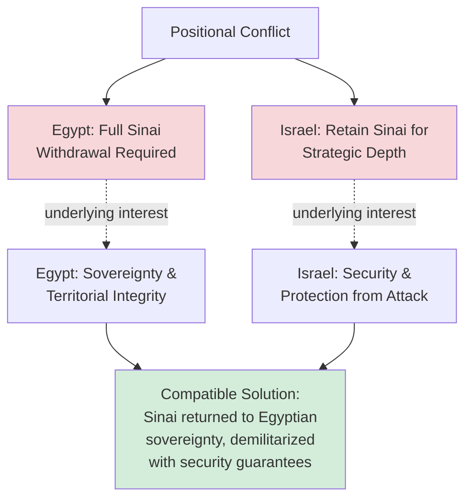

## The Camp David Accords and Principled Negotiation in Practice

### Definition and Historical Context

The Camp David Accords refer to the 1978 negotiations mediated by United States President Jimmy Carter between Egyptian President Anwar Sadat and Israeli Prime Minister Menachem Begin, resulting in two framework agreements signed on September 17, 1978, which subsequently led to the March 1979 Egypt-Israel Peace Treaty. The negotiation is one of the most frequently analyzed case studies in negotiation theory, principally because it is widely cited as the primary real-world illustration of the **single negotiating text procedure** and several core principles later formalized in Roger Fisher and William Ury's *Getting to Yes* (1981) as "principled negotiation." The case is valuable pedagogically precisely because it demonstrates interest-based techniques operating successfully in an extremely high-stakes, seemingly intractable, positionally entrenched conflict.

### The Situation Before Negotiation

By 1978, Egypt and Israel had fought four wars since 1948 (1948, 1956, 1967, and 1973), and the underlying territorial and security disputes — principally control of the Sinai Peninsula, occupied by Israel since the 1967 war — appeared positionally irreconcilable:

- **Egypt's stated position**: full Israeli withdrawal from the Sinai Peninsula as a precondition for any peace agreement.
- **Israel's stated position**: retention of strategic depth and security arrangements in the Sinai, including settlements and military installations, given the Peninsula's role as a buffer against prior invasions.

At the level of stated positions, these demands appeared mutually exclusive — a zero-sum conflict over the same territory. The negotiation's eventual success is attributed in negotiation-analytic literature primarily to a shift away from arguing over positions and toward identifying the parties' underlying interests, which turned out to be far more compatible than their positions suggested.

### Interests Versus Positions: The Core Diagnostic Insight

The canonical negotiation-theory account of Camp David centers on the discovery that Egypt's and Israel's underlying interests, once separated from their stated positions, were not actually in direct conflict:

- **Egypt's underlying interest**: sovereignty and restoration of national territory and dignity — the Sinai was Egyptian land, and its return was a matter of sovereignty and legitimacy, not necessarily a military or strategic requirement in itself.
- **Israel's underlying interest**: security — protection against future invasion and surprise attack, not necessarily retention of the specific territory itself.

Once reframed this way, a solution space opened that satisfied both underlying interests simultaneously: full Egyptian sovereignty over the Sinai (satisfying Egypt's interest) combined with demilitarization and multinational security guarantees in the territory (satisfying Israel's interest) — a solution that would have been invisible had the parties remained anchored to their initial positions, since "keep the territory" and "return the territory" appear mutually exclusive while "have sovereignty" and "have security" do not.

This example is used extensively in negotiation pedagogy (most notably in *Getting to Yes*) as the paradigmatic illustration of the principle that focusing on interests rather than positions can reveal integrative, mutually satisfying solutions in disputes that appear purely distributive at the positional level.

### The Single Negotiating Text Procedure

The negotiation's process methodology is as significant in negotiation theory as its substantive outcome. Rather than having Egypt and Israel exchange competing draft proposals (a structure that tends to entrench positions, since each side's draft naturally favors itself and revisions become a zero-sum bargaining exercise over document language), Carter's mediation team employed the **single negotiating text procedure**:

1. The American mediating team drafted a single proposed framework document.
2. This single draft was presented to both parties for reaction and criticism, not for counter-drafting.
3. Based on both parties' feedback, the mediating team revised the single text and presented the revised version again.
4. This cycle repeated iteratively — reportedly through numerous drafts over the 13-day negotiation period at Camp David — until a version emerged that both parties found acceptable enough to sign.

**Key Points**

- **Removes the "authorship" dynamic**: because neither party is defending "their" draft, criticism of the text is less likely to be experienced as a personal or positional attack, reducing the ego-investment and face-saving dynamics that entrench positional bargaining.
- **Shifts the parties' orientation from opposing each other to jointly critiquing a shared document**: this reframes the psychological structure of the interaction from adversarial (party versus party) to collaborative (both parties versus the shared problem of improving the text), a reframing effect noted extensively in principled-negotiation literature as valuable independent of the specific substantive content being negotiated.
- **Allows the mediator to control the pace and content of escalation**: since only the mediating team controls what changes make it into the next draft, the process prevents either party from making a public commitment to a position that would be difficult to walk back, preserving negotiating flexibility throughout.
- **Particularly valuable in multi-issue, complex agreements**: the single-text method is most valuable precisely in negotiations (like Camp David) involving numerous interconnected issues where competing counter-drafts would create an unmanageable proliferation of divergent document versions.

### Separating the People from the Problem

A second principled-negotiation element frequently drawn from the Camp David case is the deliberate separation of personal/relational dynamics from the substantive issues under negotiation. Sadat and Begin reportedly had significant personal friction and mutual distrust during the negotiation; Carter's mediation strategy involved substantial direct, separate engagement with each leader (including extended one-on-one relationship-building conversations) precisely to manage this personal dimension separately from the substantive text negotiation, preventing personal antagonism from derailing progress on the underlying issues. [Inference] The specific extent to which this personal-relational management single-handedly determined the outcome (as opposed to other contextual factors such as US strategic leverage and both leaders' independent political incentives to reach an agreement) is a matter of historical interpretation rather than a settled, quantifiable causal claim, and different historical accounts weight these factors differently.

### The Role of the Third-Party Mediator

Carter's role at Camp David illustrates several third-party functions discussed generally under Facilitated Negotiation and Third-Party Roles, though his role combined elements across the facilitative-evaluative spectrum rather than fitting neatly into a single category:

- **Process architect**: designing and controlling the single-negotiating-text procedure itself, a clear facilitative/process-focused function.
- **Substantively engaged drafter**: unlike a purely facilitative mediator who avoids proposing specific terms, the American team actively drafted substantive language, an evaluative/directive function atypical of pure facilitative mediation but characteristic of high-stakes diplomatic mediation.
- **Reality-tester and BATNA clarifier**: Carter is reported to have engaged both leaders individually on the costs of failure (continued conflict, regional instability, domestic political costs of walking away), a technique functionally similar to a mediator's private-caucus reality-testing of each party's alternatives to agreement.
- **Guarantor of commitments**: US involvement extended beyond the negotiation itself into ongoing commitments (military and economic aid packages to both Egypt and Israel) that helped make the eventual agreement's terms politically and practically sustainable for both leaders domestically — an application of third-party leverage beyond what a strictly neutral facilitative mediator typically possesses.

### Reframing and Legitimacy-Building Techniques

Beyond the single-text procedure, negotiation-analytic accounts of Camp David highlight additional techniques consistent with principled-negotiation theory:

- **Objective legitimacy criteria**: framing proposed security arrangements (demilitarized zones, early-warning stations, UN or multinational observer forces) around externally verifiable, internationally recognized security mechanisms rather than purely bilateral trust, giving Israel a legitimacy basis for security assurance that did not depend solely on trusting Egypt's future intentions.
- **Inventing options for mutual gain**: the demilitarization-plus-sovereignty solution required generating a genuinely novel option not present in either party's initial position — an instance of the "invent options for mutual gain" principle from principled-negotiation theory, requiring the parties (facilitated by the mediator) to brainstorm structural arrangements beyond the binary "who controls the territory" framing.
- **Addressing each side's legitimate justification needs**: Sadat needed a outcome he could present domestically as recovering full Egyptian sovereignty and dignity (addressing the Arab world's broader concerns about Egypt negotiating separately with Israel), while Begin needed an outcome defensible to an Israeli public and political coalition wary of security concessions — the final framework's dual-track structure (a bilateral Egypt-Israel treaty plus a separate, less binding framework addressing Palestinian self-governance) partly reflects the need to give each leader distinct, separately justifiable achievements.

### Outcomes and Subsequent Developments

The September 1978 Camp David Accords consisted of two framework documents: "A Framework for Peace in the Middle East" (addressing the broader Arab-Israeli conflict and Palestinian self-governance, with more limited concrete follow-through) and "A Framework for the Conclusion of a Peace Treaty between Egypt and Israel" (which directly led to the bilateral treaty). The March 1979 Egypt-Israel Peace Treaty that followed included Israel's phased withdrawal from the Sinai Peninsula (completed by 1982), normalization of diplomatic relations, and demilitarization arrangements in the Sinai — directly reflecting the interests-based reframing described above. [Inference] Historical and political-science assessments of the accords' broader regional legacy are considerably more mixed and contested than negotiation-theory's typically celebratory framing of the case as a process success; broader outcomes including the more limited progress on Palestinian self-governance, Sadat's 1981 assassination (linked partly to domestic backlash against the agreement), and Egypt's temporary suspension from the Arab League are relevant historical context generally given less emphasis in negotiation-pedagogy treatments focused specifically on the bilateral process technique.

### Critiques and Limitations of the Case as a Negotiation-Theory Exemplar

**Key Points**

- **Asymmetric mediator leverage**: Carter's mediation involved substantial US strategic and financial leverage over both parties (military aid, broader geopolitical relationships) not available to a typical facilitative mediator, limiting how directly the case's techniques transfer to lower-leverage mediation contexts.
- **High-level, state-actor negotiation dynamics differ from interpersonal or commercial negotiation**: the presence of substantial domestic political constituencies, historical/national narratives, and existential security concerns introduces dynamics (legitimacy needs, face-saving at a national level) not directly analogous to most interpersonal or commercial negotiations where the case's lessons are often applied.
- **Survivorship and narrative selection bias**: as a celebrated historical success, the Camp David case is more extensively analyzed and taught than comparable failed mediation attempts using similar techniques, potentially overstating the reliability of the single-negotiating-text procedure and interest-based reframing as generalizable techniques rather than techniques that succeeded in this specific, favorable confluence of circumstances (including both leaders' independent political incentives to reach an agreement).
- **Incomplete resolution of the broader conflict**: the accords resolved the bilateral Egypt-Israel dispute but did not resolve the broader Israeli-Palestinian and regional Arab-Israeli conflict, a limitation sometimes underemphasized in negotiation-theory treatments that focus narrowly on the bilateral process technique's success.

### Applying Camp David's Lessons to Other Negotiations

**Example**

A negotiation-training exercise might ask participants to apply the Camp David framework to a seemingly intractable, positionally entrenched business dispute — for instance, two divisions of a merged company disputing which division's software platform the combined organization should standardize on, with each division publicly committed to defending its own platform.

1. **Separate positions from interests**: rather than debating "which platform" (a positional, zero-sum framing), a facilitator elicits each division's underlying interests — one division may actually care primarily about minimizing migration disruption to their existing customer base, while the other cares primarily about long-term technical scalability, interests that are not inherently in conflict once separated from the "which platform wins" framing.
2. **Employ a single negotiating text**: rather than each division submitting competing recommendation memos, a neutral facilitator (or joint working group) drafts a single proposed technical transition plan, iteratively revised based on both divisions' feedback, avoiding the entrenchment risk of dueling competing proposals.
3. **Invent options for mutual gain**: the eventual solution might involve a phased, hybrid architecture that preserves the disruption-minimizing division's customer-facing systems in the near term while migrating toward the scalability-focused division's preferred backend infrastructure over a longer horizon — a structural option neither division's original positional proposal contained.
4. **Address each side's legitimacy needs separately**: the final plan gives each division leadership team a distinct, presentable "win" (one can report successful protection of customer continuity; the other can report a validated long-term technical roadmap), mirroring the dual-track structure used to give Sadat and Begin separately justifiable outcomes.

This illustrates how the Camp David case's specific techniques — separating positions from interests, using a single negotiating text, and inventing options that let each side claim a distinct legitimate achievement — generalize as transferable negotiation design principles well beyond their original high-stakes diplomatic context, even though (per the critiques above) the specific leverage and legitimacy dynamics of state-level diplomacy do not transfer directly.

### Related Topics

- Principled Negotiation and *Getting to Yes* Framework
- Interests Versus Positions in Negotiation Diagnosis
- Single Negotiating Text Procedure
- Facilitated Negotiation and Third-Party Roles
- Inventing Options for Mutual Gain
- Objective Criteria and Legitimacy in Negotiated Agreements
- BATNA Analysis in High-Stakes Diplomatic Negotiation
- Multi-Party and Multi-Issue Negotiation Complexity
- Face-Saving and Domestic Political Constraints in International Negotiation
- Historical Case Studies in International Mediation