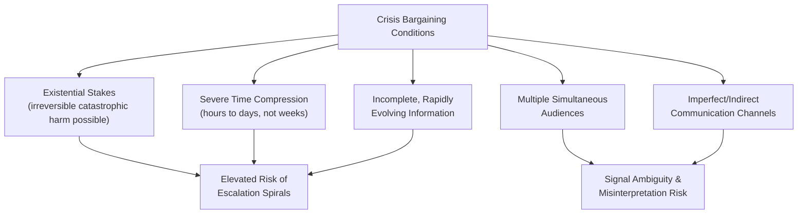

## The Cuban Missile Crisis as Crisis Bargaining

### Definition and Historical Context

The Cuban Missile Crisis (October 16–28, 1962) is the paradigmatic case study in crisis bargaining theory: a thirteen-day confrontation between the United States and the Soviet Union following American discovery of Soviet nuclear missile installations in Cuba, which brought the two superpowers to what is widely regarded as the closest point to intentional or inadvertent nuclear war during the Cold War. The crisis is studied extensively across negotiation theory, international relations, and decision science not primarily for its substantive outcome (the missiles were removed) but for what it reveals about **bargaining under extreme time pressure, high stakes, and profound uncertainty about an adversary's intentions and internal decision processes** — conditions that distinguish crisis bargaining sharply from routine commercial or diplomatic negotiation.

### What Distinguishes Crisis Bargaining from Ordinary Negotiation

Crisis bargaining, as a distinct negotiation-theory category, is characterized by conditions largely absent from routine negotiation:

- **Existential stakes**: potential outcomes include catastrophic, irreversible harm (nuclear war) rather than the reversible economic or relational losses typical of commercial disputes.
- **Severe time compression**: decisions must be made within hours or days rather than the weeks or months typical of complex commercial or diplomatic negotiations.
- **Incomplete and rapidly evolving information**: decision-makers act on fragmentary, sometimes contradictory intelligence about the adversary's capabilities, intentions, and internal political constraints, with information quality changing hour to hour.
- **Multiple simultaneous audiences**: crisis decision-makers must satisfy several audiences at once — the direct adversary, domestic political constituencies, allied governments, and often internal factions within their own government — each potentially requiring different, sometimes conflicting signals.
- **Compressed and imperfect communication channels**: unlike routine negotiation with established, reliable channels, crisis bargaining often occurs through indirect, ambiguous, or deliberately imprecise signals (public statements, military movements, back-channel communications) rather than direct, explicit proposals.

### Timeline of Key Bargaining Moves

1. **October 16**: US intelligence confirms Soviet medium-range ballistic missile sites under construction in Cuba; President Kennedy convenes the ExComm (Executive Committee of the National Security Council) to deliberate response options.
2. **October 22**: Kennedy publicly announces the discovery and imposes a naval "quarantine" (a deliberately chosen term, avoiding "blockade," which under international law constitutes an act of war) around Cuba, demanding removal of the missiles.
3. **October 24–25**: Soviet vessels approach the quarantine line; several reportedly stop or reverse course rather than test the blockade directly, an early signal of mutual de-escalatory restraint on both sides.
4. **October 26**: Soviet Premier Khrushchev sends a private, emotionally direct letter proposing missile withdrawal in exchange for a US pledge not to invade Cuba.
5. **October 27 ("Black Saturday")**: a second, more formal and harder-line Soviet message arrives publicly demanding the additional condition of US missile withdrawal from Turkey; simultaneously, a US U-2 reconnaissance aircraft is shot down over Cuba, and a separate U-2 strays into Soviet airspace — widely regarded as the crisis's most dangerous point, given the risk that either incident alone could have triggered military escalation.
6. **October 27 (the "Trollope Ploy")**: rather than responding to the harder-line second message, Kennedy's team, on the advice of his brother Robert Kennedy and other advisors, deliberately chooses to respond only to the first, more conciliatory letter, publicly agreeing to its terms (non-invasion pledge for missile withdrawal) while privately and separately, through back-channel communication via Robert Kennedy and Soviet Ambassador Anatoly Dobrynin, agreeing to the secret removal of US Jupiter missiles from Turkey.
7. **October 28**: Khrushchev publicly announces the withdrawal of missiles from Cuba, ending the acute phase of the crisis.

### The "Trollope Ploy": Selective Response as a Negotiation Tactic

The Trollope Ploy — named for a plot device in Anthony Trollope's novels where a woman interprets an ambiguous gesture as a marriage proposal — is among the most frequently analyzed tactical innovations from the crisis. Facing two conflicting Soviet messages (a conciliatory private letter and a harder public demand), the Kennedy administration deliberately chose to respond to the *more favorable* of the two messages as though it were the only one received, effectively allowing Khrushchev a face-saving path to accept terms close to the original, less politically costly offer without having to visibly back down from the harder public position.

**Key Points**

- **Manages face-saving needs under ambiguity**: this tactic directly addresses a core crisis-bargaining problem — how to allow an adversary to make necessary concessions without triggering a domestic or bureaucratic backlash from appearing to capitulate.
- **Exploits genuine ambiguity rather than fabricating it**: the tactic worked specifically because two genuinely distinct messages existed, giving the US a legitimate (if selective) basis for choosing which to treat as authoritative, rather than requiring an outright fabrication.
- **Illustrates the strategic value of not demanding total clarity from an adversary**: in ordinary negotiation, ambiguous or inconsistent signals are typically treated as a problem to be resolved through direct clarification; crisis-bargaining analysis of this episode suggests that under some conditions, tactically choosing which signal to treat as operative can be more productive than forcing the adversary to explicitly reconcile their own contradictory internal positions.

### The Secret Turkey Missile Trade: Public Position Versus Private Deal

A second structurally important, historically underappreciated-until-later-disclosure element was the secret agreement to remove US Jupiter missiles from Turkey — militarily obsolete systems the US had already been considering removing for unrelated reasons — in exchange for the Soviet withdrawal from Cuba, kept secret for years afterward specifically because public acknowledgment would have appeared as a concession under duress, undermining both the Kennedy administration's domestic political position and NATO alliance confidence.

This illustrates a recurring crisis-bargaining and general negotiation-theory principle: the **distinction between a negotiated outcome's public framing and its actual substantive content** can be deliberately and strategically managed, allowing each side's leadership to satisfy the *legitimacy and face-saving* needs of their respective domestic and international audiences even when the underlying substantive trade involves genuine mutual concessions on both sides rather than unilateral capitulation by either party — directly paralleling the legitimacy-management techniques discussed in Camp David Accords analysis, but operating under vastly higher stakes and compressed timescales.

### Escalation Dynamics and the Risk of Inadvertent War

Crisis-bargaining analysis of the Cuban Missile Crisis places substantial emphasis on the risk of **inadvertent escalation** — outcomes neither side intended or desired, arising from the interaction of decentralized military command structures, imperfect communication, and compressed decision timelines rather than from either leadership's deliberate choice:

- **The U-2 shootdown (October 27)**: the destruction of a US reconnaissance aircraft over Cuba was reportedly not authorized by top Soviet leadership but by a local Soviet air-defense commander, illustrating the crisis-bargaining risk that decentralized military authority can produce escalatory actions inconsistent with the national leadership's actual negotiating stance — a principal-agent problem with potentially catastrophic stakes.
- **Naval incidents at the quarantine line**: several documented close encounters between US naval forces and Soviet submarines (including incidents where Soviet submarine commanders reportedly considered using nuclear torpedoes under mistaken belief that war had already begun, based on incomplete information reaching the submerged vessels) illustrate how the compressed information environment of crisis bargaining can produce decisions based on inaccurate situational awareness at a level far removed from top-level negotiation.
- **The compressed decision window as an escalation risk multiplier**: [Inference] much of the crisis-bargaining literature analyzing this case argues that the severe time pressure itself, independent of either side's substantive demands, was a primary driver of escalation risk, since it left minimal margin for correcting misperceptions or miscommunications before they could compound into unintended military action; this is a widely held interpretive claim in the literature rather than a directly measurable, undisputed causal finding.

### Graduated Response and Signaling Strategy

The US choice of a naval "quarantine" rather than an immediate airstrike or invasion is frequently analyzed as a deliberate crisis-bargaining strategy of **graduated response**: selecting an initial action calibrated to demonstrate resolve and impose costs while preserving room for de-escalation and further signaling short of direct military confrontation, rather than presenting the adversary with an immediate, binary escalate-or-capitulate choice.

$$\text{Response Intensity} \propto \text{Resolve Signaled} - \text{Escalation Risk Incurred}$$

This is a stylized representation rather than a formula literally computed by decision-makers; [Speculation] it captures the underlying strategic logic often attributed to the ExComm's deliberation process — weighing signaling strength against escalation risk at each step — as reconstructed by subsequent historical and political-science analysis, rather than a quantitative model contemporaneously applied by the actual decision-makers.

The quarantine's specific legal and rhetorical framing (avoiding the term "blockade" for its formal act-of-war implications under international law) is itself an example of using precise language choice as a signaling and legitimacy tool — communicating firm resolve to the Soviet Union while simultaneously providing legal and diplomatic cover to avoid triggering automatic escalatory obligations or alliance complications.

### Lessons Applied to General Crisis Negotiation Theory

**Key Points**

- **Preserve face-saving exits for the adversary**: the Trollope Ploy and the secret Turkey trade both illustrate the crisis-bargaining principle that forcing an adversary into a purely humiliating, zero-face-saving capitulation increases the risk they will choose escalation over surrender; viable exits that allow a public narrative of mutual accommodation reduce this risk.
- **Separate public signaling from private substantive bargaining**: maintaining distinct public and private channels allows each side's leadership to manage domestic and allied audiences without those audience-management needs derailing the substantive resolution being negotiated through private channels.
- **Beware of decentralized escalation risk independent of top-level intent**: crisis negotiators and policymakers must account for the possibility that subordinate military or bureaucratic actors, acting on incomplete information or standing orders, may take actions inconsistent with top-level negotiating intent — a risk-management consideration largely absent from routine commercial negotiation but central to any negotiation involving large, hierarchical organizations under time pressure.
- **Graduated escalation preserves future negotiating flexibility**: choosing an initial response that signals resolve without foreclosing further diplomatic options preserves the ability to continue bargaining, whereas an immediately maximal response can eliminate the room needed for a negotiated (rather than purely coerced or purely capitulated) resolution.
- **Time pressure itself is a variable to be managed, not just endured**: crisis-bargaining analysis suggests decision-makers should, where possible, actively seek to create additional decision time (e.g., through graduated rather than immediate maximal response) rather than treating the crisis's compressed timeline as an unchangeable external constraint.

### Critiques and Limitations of the Case as a General Negotiation-Theory Exemplar

- **Extreme stakes limit generalizability**: the specific tactics documented (Trollope Ploy, secret side-deals, graduated military response) emerged from a nuclear-war-avoidance context with no direct analogue in the vast majority of negotiations most practitioners encounter, requiring care when extracting generalizable lessons versus context-specific historical particulars.
- **Declassification-dependent historical understanding**: significant elements of the crisis's actual bargaining dynamics (notably the secret Turkey missile trade) were unknown publicly for years after 1962, meaning earlier negotiation-theory analyses of the crisis were working from incomplete information about what had actually been negotiated — a caution relevant to how confidently any historical crisis case can be analyzed before all relevant primary-source material becomes available.
- **Survivorship bias in crisis-bargaining case selection**: because the crisis is studied specifically because it resolved without war, the case may overrepresent the effectiveness of the specific tactics used relative to how those same tactics might have performed under a slightly different counterfactual chain of decentralized decisions (e.g., had the U-2 shootdown triggered an immediate retaliatory strike), a limitation broadly relevant to drawing confident causal lessons from any single non-repeated historical crisis.
- **Asymmetric documentation**: substantially more documentation and testimony exists from the American side (ExComm transcripts, participant memoirs) than from Soviet internal deliberations, potentially biasing historical negotiation-theory analysis toward better understanding and thus emphasizing American tactical choices over the corresponding Soviet decision process.

### Illustrative Application: Crisis-Bargaining Principles in a High-Stakes Corporate Standoff

**Example**

A hostile takeover attempt escalates rapidly when the target company's board receives two conflicting signals from the acquiring company within the same week — an informal, conciliatory approach from the acquirer's CEO suggesting openness to a negotiated partnership structure, followed by a formal, aggressive tender offer filing that publicly signals hostile intent.

1. **Selective response (Trollope Ploy analogue)**: rather than treating the aggressive formal filing as the acquirer's authoritative position, the target board's advisors respond publicly and substantively to the earlier informal conciliatory approach, giving the acquirer's leadership room to walk back the hostile filing's public posture without appearing to capitulate to the target's resistance.
2. **Separating public posture from private substance**: while both companies issue firm public statements to their respective shareholders and boards, back-channel discussions between the two CEOs pursue an actual negotiated structure quietly, allowing each side's public audience management to proceed independently of the substantive deal-making.
3. **Graduated response**: the target board authorizes a measured defensive response (engaging an independent financial advisor, communicating openly with shareholders) rather than an immediate maximal countermeasure (a poison-pill defense), preserving room for a negotiated resolution rather than forcing an immediate escalate-or-capitulate dynamic.
4. **Awareness of decentralized-actor risk**: the target board explicitly directs its investor-relations and legal teams to avoid independent public statements that could inadvertently escalate the conflict beyond what board leadership intends, addressing the crisis-bargaining lesson that decentralized actors within an organization can trigger unintended escalation.

This illustrates how crisis-bargaining principles — face-saving exits, separation of public and private tracks, graduated response, and awareness of decentralized escalation risk — generalize as a conceptual toolkit for any high-stakes, rapidly evolving negotiation, even outside the existential-stakes context of the original case.

### Related Topics

- Crisis Bargaining and Escalation Dynamics Theory
- Signaling and Costly Signals in International Negotiation
- Face-Saving and Legitimacy Management Under Duress
- Principal-Agent Problems in Hierarchical Negotiation Structures
- Graduated Escalation and De-escalation Strategy
- The Camp David Accords and Principled Negotiation in Practice
- Decision-Making Under Time Pressure and Incomplete Information
- Back-Channel Diplomacy and Track II Negotiation
- Game-Theoretic Models of Brinkmanship (Chicken Game Analysis)
- Historical Case Studies in International Mediation