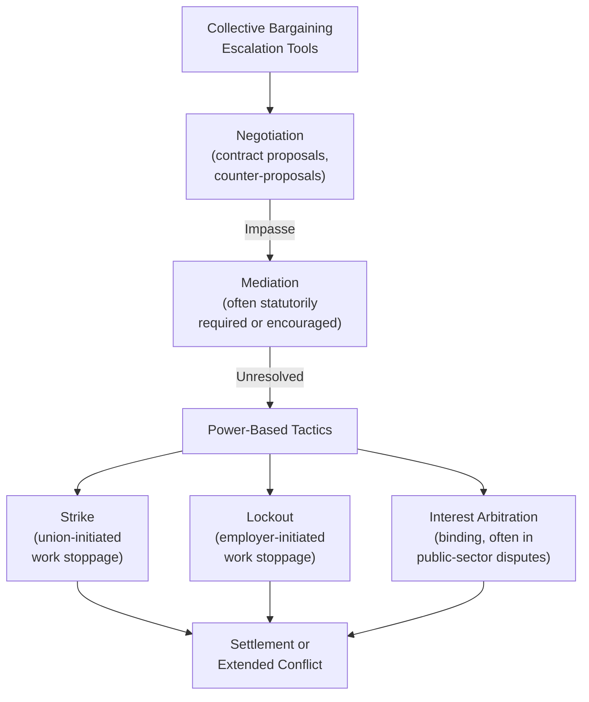

## Landmark Labor Disputes and Collective Bargaining Outcomes

### Definition and Scope

Landmark labor disputes are historically significant collective bargaining conflicts between organized labor and management (or government, in the case of public-sector disputes) whose processes and outcomes have shaped subsequent labor law, bargaining practice, and negotiation theory. This topic surveys a set of paradigmatic cases used across labor relations and negotiation curricula to illustrate power-based bargaining dynamics, the interaction between negotiation tactics and legal/institutional context, and the long-run consequences of both successful and failed collective bargaining processes.

### Collective Bargaining as a Distinct Negotiation Category

Collective bargaining differs structurally from bilateral commercial or diplomatic negotiation in ways relevant to interpreting these cases:

- **Multi-principal representation**: negotiators (union representatives and management) act as agents for large, internally heterogeneous constituencies (union members, shareholders/ownership), introducing principal-agent dynamics absent from simple two-party negotiation.
- **Institutionalized power tools**: strikes, lockouts, and picketing function as sanctioned "power-based" tactics within the interests-rights-power framework (see Choosing Among Negotiation, Mediation, and Arbitration), providing a formalized escalation mechanism largely unavailable in ordinary commercial negotiation.
- **Legal and regulatory embedding**: collective bargaining occurs within a dense statutory and regulatory framework (in the US context, principally the National Labor Relations Act of 1935 and subsequent amendments, plus a substantial body of labor board and judicial precedent) that structures permissible tactics, timelines, and remedies in ways ordinary negotiation is not constrained.
- **Repeated-game dynamics**: union-employer relationships typically persist across many successive contract negotiations, meaning tactics and reputations built in one round of bargaining carry forward into future rounds, unlike many one-shot commercial negotiations.

### The 1981 PATCO Strike: A Watershed in Bargaining Leverage

The Professional Air Traffic Controllers Organization (PATCO) strike of August 1981 is among the most frequently cited landmark labor disputes in both labor relations and general negotiation curricula, principally for its demonstration effect on subsequent bargaining power dynamics rather than its narrow substantive outcome.

**Background and dispute**: PATCO, representing federal air traffic controllers, struck in August 1981 over wages, working conditions, and staffing levels, in violation of a federal statute prohibiting strikes by federal employees — a critical structural fact distinguishing this case from most private-sector labor disputes.

**Outcome**: President Reagan declared the strike illegal, gave striking controllers 48 hours to return to work, and upon their non-compliance, terminated approximately 11,000 striking controllers and banned them from federal employment, subsequently rebuilding the air traffic control workforce with replacement staff and military controllers.

**Key Points**

- **Demonstrated the enforceability limits of illegal strikes**: the case is used to illustrate that a union's strike leverage depends critically on its legal standing; PATCO's position was severely weakened by its strike's illegality under federal law, a structural constraint absent from most private-sector strike scenarios governed by different legal frameworks.
- **BATNA miscalculation**: negotiation-theory analysis of the case frequently highlights PATCO leadership's apparent miscalculation of the employer's (the federal government's) BATNA — specifically, an apparent underestimation of the administration's willingness and practical capacity to replace striking specialized workers entirely rather than negotiate under strike pressure, a critical failure of counterparty BATNA assessment (see Data Analytics for Negotiation Preparation).
- **Broader labor-relations demonstration effect**: the case is widely cited in labor relations literature as having signaled to private-sector employers that permanently replacing striking workers was a viable, lower-cost strategy than previously assumed, with subsequent research linking the case to a broader shift in private-sector employer willingness to hire permanent striker replacements in the following years. [Inference] The precise causal weight of the PATCO case versus other contemporaneous economic and political factors (broader deregulation trends, changing labor law enforcement priorities) in driving this broader shift is a matter of ongoing debate among labor economists and historians rather than a settled, uncontested causal claim.

### The 1936–37 Flint Sit-Down Strike: Innovation in Tactical Leverage

The Flint sit-down strike (December 1936–February 1937), conducted by the United Auto Workers against General Motors, is a landmark case illustrating **tactical innovation as a source of negotiating leverage** independent of the underlying substantive bargaining positions.

**Tactical innovation**: rather than a conventional strike (workers leaving the premises and picketing externally), striking workers occupied GM's Flint, Michigan plants, physically remaining inside the facilities. This tactic prevented the company from using replacement workers to continue production (a standard employer counter-tactic against conventional strikes, since replacement workers could not access occupied facilities) and made forcible removal politically and practically costly given the risk of violent confrontation if authorities attempted physical eviction.

**Outcome**: after 44 days, GM recognized the UAW as the exclusive bargaining representative for its workers at the affected plants, a landmark early victory for industrial unionism that catalyzed subsequent unionization across the American automobile industry.

**Key Points**

- **Illustrates tactic innovation as a leverage source distinct from underlying bargaining power**: the sit-down tactic's effectiveness stemmed specifically from neutralizing management's most reliable counter-tactic (replacement labor), a case study in how tactical creativity can shift relative bargaining power even without a change in either side's underlying resources or legal position.
- **Raises the risk-escalation tradeoff inherent in novel tactics**: the sit-down strike's legal status was contested at the time (occupying private property raised distinct legal issues from conventional off-premises picketing), illustrating the general negotiation-tactics principle that novel, aggressive tactics can generate leverage precisely because they impose costs or risks the counterparty had not planned for, while simultaneously exposing the initiating party to legal or reputational risk proportional to the tactic's novelty and aggressiveness.
- **Demonstrates the role of external political context in tactical viability**: the strike's success is frequently attributed partly to a sympathetic state government (Michigan's governor declined to forcibly remove the strikers), illustrating that a tactic's viability depends significantly on the surrounding political and institutional environment, not solely on the tactic's inherent characteristics.

### Public-Sector Interest Arbitration as an Alternative to Strike-Based Leverage

Many public-sector labor disputes (particularly involving essential services like police, firefighting, and, in some jurisdictions, teaching) are structured around **interest arbitration** rather than strike leverage, reflecting a policy judgment that strikes by essential public-service workers impose costs on the public that justify substituting a binding third-party determination for power-based bargaining.

- **Final-offer arbitration**: a specific interest-arbitration design (used in various US states for public-sector disputes) where each party submits a single final proposal, and the arbitrator must select one party's complete final offer in its entirety rather than crafting a compromise position. This design is theorized to incentivize each party toward moderate, reasonable proposals, since an extreme proposal reduces the likelihood the arbitrator will select it over a more moderate counterpart offer.
- **Conventional (compromise) interest arbitration**: the arbitrator has discretion to craft an outcome between the parties' positions, potentially reducing the incentive toward moderation that final-offer arbitration is designed to create, since either party may reason that a moderate compromise outcome is likely regardless of how extreme their stated position is.

[Inference] The relative effectiveness of final-offer versus conventional interest arbitration in producing moderate bargaining positions is a subject of extensive empirical labor-economics research with mixed findings across different studies and jurisdictions, rather than a definitively settled comparative conclusion, and the appropriate design choice likely depends on jurisdiction-specific factors not fully captured by a single general theoretical prediction.

### The 2007–2008 Writers Guild of America Strike: New Media and Changing Value Structures

The WGA strike (November 2007–February 2008), a 100-day strike by Hollywood television and film writers against major studios and networks, is a frequently studied contemporary case illustrating **bargaining breakdown driven by disagreement over how to value an emerging, uncertain revenue category** — specifically, compensation formulas for content distributed via then-emerging digital/streaming platforms.

**Core dispute**: the existing residual payment formula (compensation to writers for reuse/redistribution of content beyond its initial broadcast) had been established for older distribution technologies (home video, syndication) and did not adequately address the rapidly growing digital distribution and streaming category, whose future revenue scale was genuinely uncertain to both sides at the time of negotiation.

**Key Points**

- **Illustrates the negotiation challenge of valuing uncertain future revenue streams**: unlike disputes over a known, fixed pool of value, this negotiation required both sides to bargain over compensation formulas for a revenue category whose actual future scale neither side could confidently predict, a structurally different and arguably harder negotiation problem than dividing a known quantity.
- **Demonstrates strike timing and leverage calibration**: the strike's timing (during the traditional television pilot season) was calibrated to maximize production disruption and thus employer cost, illustrating the general power-based-bargaining principle that strike timing itself is a significant strategic variable independent of the underlying substantive dispute.
- **Settlement structure**: the eventual settlement established new residual formulas specifically for streaming and digital distribution, providing a template subsequently referenced (and revisited, given continued rapid change in streaming economics) in later entertainment-industry labor negotiations, including the 2023 WGA and SAG-AFTRA strikes that revisited similar digital-compensation and, notably, generative-AI-related concerns.

### Analytical Themes Across These Cases

**Key Points**

- **BATNA assessment accuracy as a critical determinant of outcome**: across these cases, disputes where one party significantly misjudged the other's actual willingness or capacity to sustain a work stoppage (PATCO) or to replace striking labor (Flint) produced markedly different outcomes than cases where both parties' bargaining positions reflected reasonably accurate mutual BATNA assessment.
- **Legal and institutional context shapes available tactics and their viability**: the same general tactic (a strike) produces dramatically different risk and leverage profiles depending on the surrounding legal framework (illegal federal strike in PATCO versus legally ambiguous but ultimately politically tolerated occupation in Flint versus statutorily channeled arbitration in many public-sector contexts).
- **Tactical innovation can shift bargaining power independent of underlying resources**: the Flint sit-down strike illustrates that creative tactical choices, not just relative economic or numerical strength, can determine bargaining outcomes.
- **Repeated-game reputation effects extend beyond a single negotiation**: several of these cases (particularly PATCO) are cited as having shaped bargaining dynamics and strategic expectations in subsequent, unrelated labor negotiations well beyond the immediate parties involved, illustrating how landmark disputes can function as reputation-setting or expectation-setting events for an entire sector or bargaining regime.
- **Valuing genuinely uncertain future value categories is a distinct negotiation challenge**: the WGA strike illustrates that disputes over compensation for uncertain, rapidly evolving revenue categories require different analytical tools (e.g., structured formulas with built-in future adjustment mechanisms) than disputes over a fixed, known value pool.

### Illustrative Example: Applying These Lessons to a Contemporary Bargaining Preparation

**Example**

A union negotiating team preparing for an upcoming contract renewal with a mid-sized manufacturing employer draws on these landmark cases during strategy preparation:

1. **BATNA assessment discipline (PATCO lesson)**: rather than assuming the employer cannot operate without the current workforce, the union commissions an analysis of the employer's realistic capacity to source replacement labor or shift production to other facilities during a work stoppage, avoiding the BATNA miscalculation that proved costly in the PATCO case.
2. **Tactical creativity consideration (Flint lesson)**: the negotiating committee explicitly discusses whether conventional strike tactics remain the union's strongest leverage option, or whether alternative pressure tactics (e.g., targeted work-to-rule actions, coordinated public communications campaigns) might neutralize specific employer counter-tactics more effectively than a conventional strike, consistent with the tactical-innovation lesson from Flint.
3. **Structuring provisions for uncertain future value (WGA lesson)**: recognizing that the employer is beginning to automate certain production processes with uncertain future scope, the union proposes a contract provision establishing a framework for revisiting compensation and job-security terms tied to future automation milestones, rather than attempting to negotiate a single fixed provision for a category whose future scale remains genuinely uncertain.
4. **Institutional context assessment**: the team confirms the applicable legal framework governing the specific bargaining unit and any statutory constraints on available tactics, ensuring the union's chosen escalation strategy operates within a viable legal framework rather than repeating PATCO's structural legal vulnerability.

This illustrates how landmark labor dispute case studies function not merely as historical narratives but as a structured diagnostic checklist — BATNA assessment rigor, tactical creativity, legal/institutional context awareness, and structured handling of valuation uncertainty — directly applicable to contemporary collective bargaining preparation.

### Related Topics

- Interests–Rights–Power Framework in Dispute Resolution
- BATNA and Reservation Value Estimation in High-Stakes Negotiation
- Final-Offer Versus Conventional Interest Arbitration
- Strikes, Lockouts, and Power-Based Bargaining Tactics
- National Labor Relations Act and US Labor Law Framework
- Principal-Agent Dynamics in Union Representation
- Reputation and Repeated-Game Effects in Ongoing Bargaining Relationships
- Valuing Uncertain Future Revenue in Contract Negotiation
- The Cuban Missile Crisis as Crisis Bargaining
- Public-Sector Labor Relations and Essential Services Policy