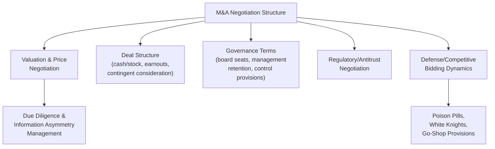

## Notable Mergers and Acquisitions Negotiations

### Definition and Scope

M&A negotiation is a specialized negotiation domain combining elements of valuation-driven distributive bargaining, complex multi-party and multi-round processes, information asymmetry management, and often adversarial dynamics under time and regulatory pressure. This topic surveys landmark M&A negotiations used across negotiation and corporate strategy curricula to illustrate distinct tactical and structural patterns: hostile takeover defense, competitive bidding war dynamics, deal-structuring creativity under valuation disagreement, and post-agreement renegotiation risk.

### Structural Features Distinguishing M&A Negotiation

- **Extreme information asymmetry**: target company insiders possess material non-public information about the business's true value, creating a structural asymmetry that due diligence processes, representations and warranties, and regulatory disclosure requirements are specifically designed to mitigate.
- **Multiple simultaneous negotiation tracks**: a single M&A transaction typically involves parallel negotiations over price, deal structure (stock versus cash, earnouts), governance terms (board seats, management retention), and regulatory/antitrust conditions, each with distinct stakeholders and leverage dynamics.
- **Fiduciary duty constraints**: target company boards typically operate under fiduciary obligations (in US law, principles arising from cases like *Revlon v. MacAndrews & Forbes*) requiring them to seek the best reasonably available outcome for shareholders once a sale becomes likely, constraining a board's ability to simply favor a preferred acquirer over a higher competing bid.
- **Regulatory and antitrust overlay**: large transactions frequently require government approval, introducing a third-party veto-holder whose concerns (market concentration, national security) must be negotiated alongside the primary commercial terms.
- **Time-limited exclusivity and competitive dynamics**: deal processes are frequently structured with formal or informal auction dynamics (go-shop provisions, competing bid windows) that directly affect bargaining leverage between target and acquirer.

### Hostile Takeover Defense: The Poison Pill and Related Tactics

Hostile takeovers — where an acquirer bypasses target management and board and appeals directly to shareholders (via tender offer or proxy contest) — generated a distinct family of negotiation-leverage tactics during the intensive M&A activity of the 1980s.

#### The Poison Pill (Shareholder Rights Plan)

The poison pill, first developed and legally validated in the context of *Moran v. Household International* (Delaware, 1985), is a defensive mechanism granting existing shareholders (other than the hostile acquirer) the right to purchase additional shares at a steep discount if a triggering event occurs (typically an acquirer crossing a defined ownership threshold, often around 10-20%), massively diluting the hostile acquirer's stake and effectively making an unapproved acquisition prohibitively expensive.

**Key Points**

- **Functions as a structural BATNA modifier rather than a direct negotiating position**: the pill does not itself state a price or term; instead, it fundamentally alters the acquirer's alternative-to-negotiated-agreement calculus by making the unilateral/hostile path dramatically more costly, effectively forcing the acquirer back to the negotiating table with the target board.
- **Shifts negotiating leverage from shareholders directly to the board**: by making a direct shareholder-level tender offer economically irrational once triggered, the pill concentrates negotiating power in the target board's hands, a structural leverage shift whose desirability is itself a matter of ongoing corporate-governance debate (proponents argue it prevents coercive, undervalued hostile bids; critics argue it entrenches underperforming management against value-creating acquisitions).
- **Illustrates a broader negotiation-theory principle**: unilaterally altering the other party's BATNA (making their outside option less attractive) can function as a powerful negotiating tactic independent of any direct communication or proposal exchange, a technique with analogues far beyond the M&A context.

#### White Knight and Competitive Bidding Dynamics

When a hostile bid emerges, target boards frequently solicit a **white knight** — a preferred alternative acquirer willing to offer superior terms — converting what began as an adversarial, board-versus-acquirer dynamic into a competitive bidding process among multiple potential acquirers, directly increasing target shareholder value through auction dynamics rather than bilateral negotiation alone.

### RJR Nabisco (1988): The Paradigmatic Competitive Bidding War

The 1988 leveraged buyout battle for RJR Nabisco — chronicled extensively in the book and subsequent film *Barbarians at the Gate* — remains among the most frequently cited landmark M&A negotiations in business school curricula, illustrating several distinct negotiation dynamics simultaneously.

**Background**: RJR Nabisco's CEO initiated a management-led leveraged buyout proposal, intending to take the company private with management retaining significant equity and control. This initial "insider" bid triggered a competitive bidding process as other private equity firms, recognizing the company was now effectively in play, submitted competing bids.

**Key Points**

- **Illustrates the "opening bid as an information signal" dynamic**: the management-led bid's specific pricing inadvertently signaled to the market and competing bidders that management believed the company was worth substantially more than its prevailing public market valuation, triggering competitive interest that management's own bid then had to overcome — an instance of a negotiating party's own opening move altering the broader competitive landscape in ways that worked against their ultimate interest.
- **Demonstrates fiduciary-duty-driven board dynamics under conflicted management interest**: because RJR's own management was simultaneously a bidder (creating an acute conflict of interest with their fiduciary duty to shareholders as directors/officers), the board's special committee process for evaluating competing bids became a central and heavily scrutinized element of the negotiation, illustrating the general principle that negotiator conflicts of interest require structural safeguards (independent committees, external advisors) rather than reliance on the conflicted party's self-restraint.
- **Escalating bid dynamics under competitive pressure**: the case illustrates how competitive bidding processes can drive final prices substantially above initial valuations through iterative competitive escalation, a dynamic with parallels to auction theory's documented tendency toward winner's-curse risk (the winning bidder potentially having overpaid relative to the asset's actual value, precisely because winning requires having the most optimistic valuation among all competing bidders).
- **Deal complexity and structuring creativity under time pressure**: the eventual winning bid involved complex financing structures (heavy use of leveraged debt financing characteristic of 1980s LBO transactions) negotiated under significant time pressure from the competitive bidding timeline, illustrating how deal structure itself becomes a negotiating variable alongside headline price.

### AOL–Time Warner (2000/2001): Valuation Disagreement and Post-Merger Integration Failure

The AOL–Time Warner merger, announced in January 2000 near the peak of the dot-com boom and completed in January 2001, is frequently studied not for its negotiation *process* but as a cautionary case illustrating how a negotiated deal structure can fail to account for underlying valuation and strategic-fit risks that only manifest after closing.

**Key Points**

- **Illustrates the risk of negotiating on a rapidly deteriorating valuation basis**: the deal's stock-for-stock structure was negotiated based on AOL's internet-boom-era market valuation; when the broader internet/technology valuation bubble collapsed shortly after the deal's announcement, the fundamental economic premise underlying the negotiated exchange ratio had shifted dramatically, a risk inherent to any negotiation where a key valuation input (a volatile stock price) can change substantially between agreement and closing or integration.
- **Demonstrates that a well-negotiated price/structure does not guarantee a successful outcome if strategic fit assumptions are wrong**: much of the case's negotiation-theory relevance concerns the distinction between negotiating favorable *terms* and correctly assessing the underlying *strategic premise* of a transaction — the negotiated exchange ratio and governance terms were, by most accounts, competently negotiated as terms, but the deal's fundamental strategic thesis (that "old media" content and "new media" internet distribution would combine synergistically) proved substantially harder to realize than either negotiating party's due diligence process had anticipated.
- **Highlights post-agreement integration as a distinct phase requiring its own negotiation-like management**: cultural and organizational integration disputes that emerged after closing (between AOL's internet-culture management approach and Time Warner's traditional media culture) illustrate that the negotiated deal agreement itself represents only the formal conclusion of one phase, with substantial ongoing internal negotiation over integration, governance, and resource allocation required afterward — a general lesson relevant to any M&A negotiation that focuses primarily on deal-closing terms without adequate attention to post-closing integration mechanisms.

### Kraft–Cadbury (2010): Cross-Border Hostile Takeover and Regulatory/Political Dimensions

The Kraft Foods acquisition of Cadbury (2009–2010), a UK-based confectionery company, illustrates the layered complexity of **cross-border hostile takeover negotiation**, where national political and regulatory considerations become active negotiating variables beyond the immediate commercial terms.

**Key Points**

- **Illustrates political/reputational leverage beyond the immediate parties**: the deal generated substantial UK political and public opposition (given Cadbury's status as a prominent British heritage brand and concerns about UK job losses), creating pressure on Kraft's negotiating posture that a purely commercial, non-cross-border transaction would not have faced, illustrating how the identity and political salience of a target can itself function as a negotiating variable independent of financial terms.
- **Demonstrates the interaction between initial hostile rejection and eventual negotiated acceptance**: Cadbury's board initially rejected Kraft's approach as undervaluing the company, and only after Kraft raised its offer (following the classic hostile-to-negotiated-acceptance pattern seen across many hostile takeover cases) did the board recommend acceptance, illustrating the common M&A pattern where an initial rejection functions as a genuine opening negotiating position (a request for better terms) rather than a final refusal.
- **Highlights post-deal commitment credibility issues**: Kraft's subsequent decisions regarding UK manufacturing facility commitments made during the negotiation process, and public scrutiny of whether those commitments were honored post-acquisition, illustrate the general negotiation-theory concern about the enforceability and credibility of non-binding or soft commitments made during deal negotiations to secure stakeholder or regulatory support, versus commitments with genuine binding force.

### Analytical Themes Across M&A Case Studies

**Key Points**

- **BATNA manipulation through structural/legal mechanisms**: the poison pill exemplifies a broader M&A negotiation pattern of using legal and structural tools to reshape a counterparty's alternatives rather than relying solely on direct proposal-based bargaining.
- **Competitive dynamics as a value-discovery and leverage-shifting mechanism**: white-knight solicitation and competitive bidding processes (RJR Nabisco) demonstrate how introducing additional negotiating parties can shift bargaining power and price discovery in ways bilateral negotiation between a single target and acquirer cannot replicate.
- **Terms versus strategic premise as distinct negotiation-success dimensions**: AOL-Time Warner illustrates that skillful negotiation of deal terms does not guarantee a successful outcome if the underlying strategic and valuation assumptions prove incorrect, a distinction directly relevant to how negotiators should allocate diligence effort between term optimization and premise validation.
- **Non-commercial stakeholders as negotiation variables**: Kraft-Cadbury illustrates that political, regulatory, and public-sentiment stakeholders can function as de facto negotiating parties in cross-border or politically salient transactions, even without formal standing in the negotiation itself.
- **Conflict-of-interest structural safeguards**: RJR Nabisco's management-buyout conflict illustrates the general principle that negotiations involving a party with dual or conflicting roles require independent process safeguards rather than reliance on self-management of the conflict.

### Illustrative Example: Applying These Lessons to a Contemporary Acquisition Negotiation

**Example**

A mid-sized technology company's board receives an unsolicited acquisition approach from a larger competitor and must structure its negotiating response.

1. **BATNA-shaping consideration (poison pill lesson)**: the board's advisors evaluate whether adopting a shareholder rights plan would provide useful negotiating leverage to ensure a fuller, more considered process rather than a rushed response to time pressure, while being mindful of the governance debate around such defenses' potential entrenchment effects.
2. **Competitive process consideration (RJR Nabisco lesson)**: rather than negotiating exclusively with the initial approaching acquirer, the board authorizes its financial advisors to discreetly solicit interest from other potential acquirers, testing whether competitive dynamics can improve the terms available to shareholders.
3. **Strategic premise diligence (AOL-Time Warner lesson)**: beyond negotiating price and structure, the board specifically directs diligence attention toward validating the acquirer's stated strategic rationale (e.g., claimed technology synergies), recognizing that favorable terms alone do not ensure the combination will succeed post-closing, and that this validation is particularly relevant if any portion of consideration is stock in the acquirer rather than cash.
4. **Stakeholder-sensitivity awareness (Kraft-Cadbury lesson)**: given the target's significant regional employment footprint, the board anticipates that local political and employee-community reactions may become a relevant negotiating consideration, and proactively considers what binding (rather than merely aspirational) commitments regarding employment and facilities might be appropriate to include in the transaction terms.

This illustrates how landmark M&A cases function as a structured diagnostic framework — BATNA-shaping options, competitive-process value, strategic-premise validation, and stakeholder-sensitivity awareness — directly transferable to contemporary acquisition negotiation strategy.

### Related Topics

- BATNA Manipulation Through Structural and Legal Mechanisms
- Auction Theory and the Winner's Curse in Competitive Bidding
- Fiduciary Duty and Board Process in Change-of-Control Transactions
- Poison Pills and Other Hostile Takeover Defenses
- Post-Merger Integration as a Continuation of Negotiation
- Cross-Border M&A and Political/Regulatory Negotiation Dynamics
- Conflict of Interest and Independent Committee Structures in Negotiation
- Valuation Methods and Their Role in Negotiation Anchoring
- Choosing Among Negotiation, Mediation, and Arbitration
- The Camp David Accords and Principled Negotiation in Practice