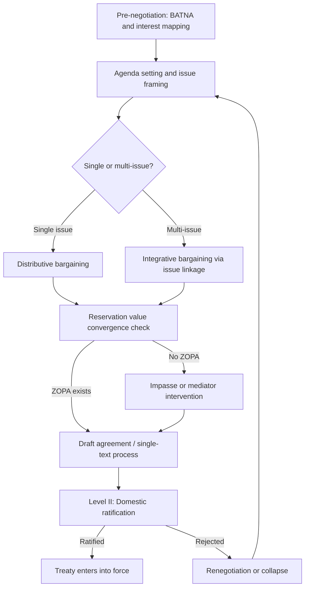

## Historic Trade and Treaty Negotiations

### Overview

Historic trade and treaty negotiations provide empirical case material for testing negotiation theory against real multiparty, multi-issue, high-stakes bargaining under conditions of incomplete information, ratification constraints, and long time horizons. These cases are used to validate or challenge frameworks such as BATNA analysis, the Negotiator's Dilemma, two-level games, integrative vs. distributive bargaining, and coalition theory.

### Analytical Frameworks Applied to Historic Negotiations

**Two-Level Games (Putnam, 1988)**

Robert Putnam's framework models international negotiations as simultaneous games: Level I is the negotiation between state representatives; Level II is the ratification process within each party's domestic constituency (legislature, public, interest groups).

- The "win-set" is the range of possible Level I agreements that would be ratified at Level II.
- Larger win-set overlap between parties increases the probability of agreement.
- A negotiator with a smaller domestic win-set can paradoxically gain leverage ("tying hands") by credibly claiming limited room to concede.

$$W_i = \{x \in X : x \text{ would be ratified by constituency } i\}$$

Agreement is feasible only where $W_1 \cap W_2 \neq \emptyset$.

**BATNA and Reservation Value Analysis**

Each historic case can be decomposed into:

- BATNA (Best Alternative to a Negotiated Agreement) for each party
- Reservation value (the walk-away point derived from BATNA)
- ZOPA (Zone of Possible Agreement), existing only if reservation values overlap

**Distributive vs. Integrative Dimensions**

Most historic treaties combine claiming-value (distributive, zero-sum) issues like territorial boundaries or tariff rates, with creating-value (integrative) issues like mutual security guarantees or trade liberalization, where joint gains are possible through issue linkage and log-rolling.

### Case Study 1: The Congress of Vienna (1814–1815)

**Key Points**

- Multiparty negotiation among the victorious powers (Austria, Russia, Prussia, Britain) plus a defeated France, restructuring the European order after the Napoleonic Wars.
- Klemens von Metternich (Austria) used coalition management and sequential side-negotiations to prevent Russia and Prussia from forming a dominant bloc.
- Talleyrand (France) leveraged the principle of "legitimacy" and divisions among the victors to reinsert a defeated power into great-power negotiations, an early example of a weak party exploiting coalition asymmetry.
- Result: The Concert of Europe, a multilateral security framework that produced roughly four decades of relative great-power peace.

**Theoretical Relevance**

- Illustrates coalition theory: the instability of grand coalitions and the value of pivotal-player positioning.
- Demonstrates issue linkage: territorial questions (Poland, Saxony) were linked to broader balance-of-power guarantees to create trades unavailable in a purely distributive framing.
- [Inference] Some historians characterize Vienna as the first sustained modern instance of institutionalized multilateral diplomacy functioning as an early "regime" in the international-relations sense, though this framing is a retrospective theoretical overlay rather than a term used by participants.

### Case Study 2: The Treaty of Versailles (1919)

**Key Points**

- Negotiated primarily among the "Big Four" (US, UK, France, Italy), with Germany excluded from substantive negotiation and presented the terms as a near-fait accompli.
- Illustrates the risk of a negotiated outcome outside the losing party's win-set: Germany's exclusion from Level I bargaining left no domestic ratification buy-in, contributing to long-term settlement instability.
- Georges Clemenceau (France) pursued primarily distributive, security-maximizing demands (reparations, territorial buffer). Woodrow Wilson (US) pursued integrative, principle-based goals (the Fourteen Points, League of Nations) but faced a Level II failure: the US Senate did not ratify the treaty, illustrating win-set mismatch even for the initiating party.

**Theoretical Relevance**

- Canonical negative case for the "exclude the losing party" strategy: unlike the more inclusive Congress of Vienna, Versailles' failure to secure the defeated party's buy-in is frequently cited in negotiation literature as contributing to the settlement's fragility.
- [Inference] The comparison between Vienna's inclusive approach and Versailles' exclusionary approach is a common instructive pairing in negotiation and diplomatic history curricula, though attributing interwar instability to negotiation design alone (versus economic and political factors) simplifies a multi-causal historical outcome.

### Case Study 3: Camp David Accords (1978)

**Key Points**

- Mediated negotiation between Egypt (Anwar Sadat) and Israel (Menachem Begin), facilitated by US President Jimmy Carter over 13 days at Camp David.
- Textbook case of principled/integrative negotiation via a mediator using single-text procedure: Carter's team drafted successive versions of a single document, with each side reacting to the draft rather than to each other, reducing reactive devaluation and positional anchoring.
- Issue restructuring: reframed the Sinai territorial dispute from a zero-sum sovereignty claim into a package trading full Israeli withdrawal from Sinai for full peace and normalization, separating this from the more intractable Palestinian question (deferred to a separate framework).

**Theoretical Relevance**

- Demonstrates the mediator's role in overcoming a Negotiator's Dilemma, where both parties want value creation but fear exploitation if they reveal underlying interests.
- Demonstrates fractionation: breaking a large, entangled dispute into separable sub-agreements with independent ZOPAs.
- Single-text mediation is a specific procedural technique now standard in mediation theory, directly traceable to this case's documented process.

### Case Study 4: General Agreement on Tariffs and Trade (GATT) Rounds (1947–1994)

**Key Points**

- Sequential multilateral trade rounds (Geneva, Kennedy, Tokyo, Uruguay) reducing tariff and non-tariff barriers among expanding membership.
- Uruguay Round (1986–1994) is the most complex: linked previously separate issue areas (agriculture, services, intellectual property, textiles) into a "single undertaking," where members had to accept the entire package rather than cherry-picking favorable provisions.
- Resulted in the creation of the World Trade Organization (WTO), converting an informal agreement-based regime into a rules-based institution with binding dispute settlement.

**Theoretical Relevance**

- The "single undertaking" design is a direct application of log-rolling and issue linkage theory: agriculture-exporting developing countries accepted intellectual-property protections (TRIPS) they otherwise opposed, in exchange for market access gains elsewhere.
- Demonstrates the coalition-formation dynamics of large-N negotiations (100+ parties), including bloc bargaining (e.g., the Cairns Group of agricultural exporters) as a mechanism to reduce effective negotiating-party count.
- Illustrates "nibble" and reciprocity-based concession patterns across rounds, where each round's outcome became the reservation point/anchor for the next round.

### Case Study 5: North American Free Trade Agreement (NAFTA) Negotiations (1990–1992)

**Key Points**

- Trilateral negotiation (US, Canada, Mexico) combining an existing US–Canada Free Trade Agreement with newly negotiated Mexican accession terms.
- Illustrates asymmetric-power negotiation: Mexico, the smaller economy, used the credible threat of unilateral market liberalization and competing bids for foreign investment as a form of BATNA-strengthening leverage against larger partners.
- Side agreements on labor and environment (NAALC, NAAEC) were added post-core-agreement to secure US domestic ratification (a Level II fix), illustrating a negotiated settlement expanded specifically to widen a domestic win-set.

**Theoretical Relevance**

- Direct illustration of two-level game dynamics: the core trilateral deal was renegotiated at the margins specifically to satisfy US congressional ratification requirements.
- Demonstrates how a weaker party can improve its BATNA through parallel signaling to third parties (other potential trade partners) rather than relying solely on the primary counterpart relationship.

### Comparative Synthesis Table

| Case | Structure | Primary Framework Illustrated | Outcome Stability |
| --- | --- | --- | --- |
| Congress of Vienna | Multilateral, inclusive of defeated party | Coalition theory, issue linkage | High (~40 yrs) |
| Treaty of Versailles | Multilateral, exclusionary | Win-set mismatch, Level II failure | Low (~20 yrs) |
| Camp David Accords | Bilateral, mediated | Single-text mediation, fractionation | High (bilateral peace held) |
| GATT/Uruguay Round | Large-N multilateral | Log-rolling, single undertaking | High (institutionalized as WTO) |
| NAFTA | Trilateral, asymmetric power | Two-level games, BATNA leverage | Moderate (later renegotiated as USMCA) |

### Negotiation Process Flow (Generalized Treaty Model)

### Win-Set Overlap Diagram (svg_diagram)

<svg xmlns="http://www.w3.org/2000/svg" viewBox="0 0 640 300">
<text x="320" y="30" text-anchor="middle" font-size="18" font-weight="bold" fill="#1a1a1a">Two-Level Game: Win-Set Overlap (svg_diagram)</text>
<ellipse cx="230" cy="170" rx="150" ry="90" fill="#4A90D9" opacity="0.4" stroke="#2c5f8a" stroke-width="2" />
<text x="150" y="120" font-size="14" fill="#1a1a1a">Party A Win-Set (W1)</text>
<ellipse cx="410" cy="170" rx="150" ry="90" fill="#D96B4A" opacity="0.4" stroke="#8a3f2c" stroke-width="2" />
<text x="440" y="120" font-size="14" fill="#1a1a1a">Party B Win-Set (W2)</text>

<text x="320" y="175" text-anchor="middle" font-size="13" font-weight="bold" fill="`#1a1a1a`">ZOPA</text>

<text x="320" y="192" text-anchor="middle" font-size="11" fill="`#1a1a1a`">(W1 ∩ W2)</text>

<text x="320" y="270" text-anchor="middle" font-size="12" fill="#444">Larger overlap → higher probability of ratified agreement</text>

</svg>

### Common Failure Modes Observed Across Cases

- **Exclusion of a key stakeholder from Level I negotiation** (Versailles): produces an agreement outside that party's win-set, risking future instability or revisionism.
- **Single-issue framing of a multi-issue dispute**: forces zero-sum outcomes where integrative trades were structurally available (avoided at Camp David via fractionation, present in early, less successful Versailles reparations debates).
- **Ratification failure despite negotiator agreement**: Versailles/US Senate and, in a modern analog, various unratified multilateral agreements demonstrate that Level I success does not guarantee Level II success.
- [Unverified] Attribution of any single historical outcome (e.g., interwar instability) purely to negotiation-design failure versus broader economic, military, and political conditions is contested among historians and should not be treated as a monocausal claim.

### Practical Application Exercise

**Example**

Using the Camp David single-text method as a template, a modern business M&A negotiation with an entrenched IP licensing dispute could be restructured by:

1. Identifying the distributive core (valuation/price) and separating it from integrative elements (post-merger governance, technology-sharing terms).
2. Appointing a neutral drafter to produce one working document both sides revise, rather than exchanging competing term sheets.
3. Deferring the most intractable single issue to a side-letter with its own timeline, mirroring the Camp David deferral of the Palestinian question.

### Related Topics

- Two-Level Games and Domestic Ratification Constraints
- Coalition Formation and Bloc Bargaining in Multiparty Negotiations
- Single-Text Mediation Procedure
- Issue Linkage and Log-Rolling in Trade Diplomacy
- The Negotiator's Dilemma: Claiming vs. Creating Value
- Post-WWII Institution Building: From GATT to the WTO
- Asymmetric Power Bargaining and BATNA Leverage in Trade Blocs
- Renegotiation Dynamics: NAFTA to USMCA as a Case in Treaty Revision