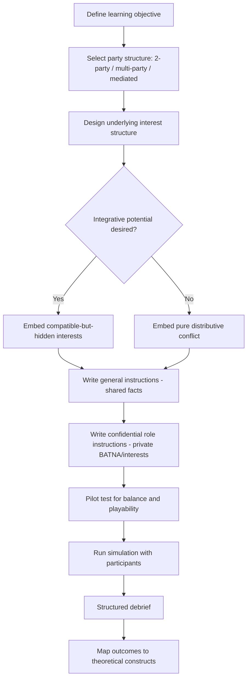

## Simulation Exercises Used in Negotiation Pedagogy

### Overview

Simulation exercises are structured, role-based enactments used in negotiation education to translate abstract theoretical constructs (BATNA, ZOPA, integrative bargaining, coalition dynamics) into experiential learning. Pedagogical simulations range from short two-party distributive drills to multi-day, multi-team, multi-issue mega-simulations, and are foundational to negotiation curricula at institutions such as Harvard Law School's Program on Negotiation (PON), which maintains one of the largest simulation clearinghouses in the field.

### Pedagogical Design Principles

**Confidential Instructions**

Each role in a simulation receives private, role-specific information ("confidential instructions" or "general instructions + confidential annex") that establishes:

- The role's underlying interests (not just stated positions)
- A quantified or qualitative reservation value / BATNA
- Constraints (authority limits, deadlines, principal-agent instructions)
- Information asymmetries deliberately withheld from the counterpart

This structure operationalizes the position-vs-interest distinction central to principled negotiation (Fisher & Ury).

**Debrief-Centric Learning Model**

The simulation itself is the data-generation phase; the debrief is where theoretical learning is extracted. Standard debrief structure:

1. Outcome reporting (did parties reach agreement; what were the terms)
2. Process reconstruction (what moves were made, in what order)
3. Comparison against theoretical benchmarks (Was the ZOPA identified? Was value left on the table? Was there premature anchoring?)
4. Generalization to real-world application

[Inference] Negotiation pedagogy research generally treats the debrief, not the exercise itself, as the primary locus of learning transfer, though the relative weighting of exercise-time versus debrief-time varies by instructor and institution.

### Taxonomy of Simulation Types

**By Party Structure**

| Type | Description | Example Constructs Taught |
| --- | --- | --- |
| Two-party, single-issue | Pure distributive bargaining, often price-only | Anchoring, reservation value, first-offer effects |
| Two-party, multi-issue | Package deals across several issues | Log-rolling, issue prioritization, integrative trades |
| Multi-party (3+) | Coalition and voting dynamics | Coalition formation, side-payments, pivotal power |
| Mediated / three-role | Includes a neutral third party | Mediation technique, single-text procedure |
| Large-scale multi-team | Dozens of roles, multi-day | Complex multi-issue linkage, organizational negotiation |

**By Information Structure**

- **Symmetric information**: both parties see identical (or fully overlapping) instructions, isolating tactical/behavioral variables.
- **Asymmetric information**: parties hold private information about value or constraints, testing information-revelation strategy and trust-building.
- **Distributive vs. integrative potential embedded by design**: exercises are engineered so that a ZOPA either does or does not exist, or so that apparent conflict conceals compatible underlying interests (the classic "orange" structure, where two parties both want the same resource for different underlying reasons).

### Canonical Teaching Simulations

**"The Orange" (Fisher & Ury illustrative case, dramatized in classroom exercises)**

Two parties each want an orange; positional analysis suggests a zero-sum 50/50 split, but interest-based inquiry reveals one wants the peel (for zest) and the other wants the pulp (for juice), permitting a 100% joint-gain outcome. Used as the canonical illustration that stated positions can obscure compatible interests.

**"Ugli Orange Case" (PON)**

A more developed multi-role version involving a pharmaceutical company representative and a foreign government agricultural representative, both needing Ugli oranges for different underlying purposes (a chemical extraction vs. pesticide-affected crop destruction). Tests whether negotiators ask sufficient interest-discovery questions before assuming scarcity-driven conflict.

**"Harborco" (PON)**

A multi-party (6+ role), multi-issue simulation involving a port development project with government regulators, environmental groups, unions, and industry. Used to teach coalition formation, multi-issue package construction, and the difficulty of aggregating heterogeneous interests into a single agreement.

**"Two-Alpha/New Recruit" family (PON)**

Two-party job-offer negotiation exercises with multiple linked issues (salary, signing bonus, vacation, start date, relocation) each carrying different weighted value to each party, explicitly designed to have an integrative solution superior to any single-issue compromise. Frequently used to demonstrate that positions expressed as single numbers ("I want $95,000") suppress the multi-issue trade space available.

**International/Diplomatic Simulations**

Multi-day Model UN-style or treaty-simulation exercises replicate multilateral treaty negotiation dynamics (see related Congress of Vienna / GATT case studies), often assigning students full country delegations with domestic political constraints, explicitly modeling two-level game dynamics (Level I inter-state bargaining constrained by a simulated Level II domestic ratification requirement).

### Simulation Design Architecture (Generalized)

### Assessment Metrics Used in Simulation Debriefs

- **Joint gain / Pareto efficiency**: Was the agreement close to the Pareto frontier, or did parties settle for a dominated outcome, leaving mutual value uncaptured?
- **Distributive share**: How was value split relative to each party's reservation value (measuring individual claiming performance).
- **Process quality indicators**: Number of interest-discovery questions asked, use of contingent/if-then offers, presence of anchoring, use of objective criteria.
- **Impasse rate**: Percentage of pairs/groups failing to reach agreement, often compared against the theoretical ZOPA existence built into the exercise design, to reveal process failures versus structural impossibility.

$$\text{Joint Gain} = \sum_{i} v_i(\text{agreement}) - \sum_{i} v_i(\text{BATNA}_i)$$

where $v_i$ is party $i$'s value function over the outcome space.

### Common Pedagogical Pitfalls Simulations Are Designed to Surface

- **Premature settlement**: parties agree quickly on an anchor-driven split without exploring the full issue space, missing available integrative trades (directly targeted by multi-issue exercises like New Recruit).
- **Reactive devaluation**: a proposal is devalued simply because it comes from the counterpart, tested in exercises with a "reveal the actual midpoint" debrief twist.
- **Failure to identify a real ZOPA**: in exercises engineered with overlapping reservation values, some pairs still reach impasse due to positional rigidity, illustrating process failure rather than structural incompatibility.
- **Over-claiming leading to relationship damage**: in exercises with repeated-role or reputation elements, aggressive distributive tactics in an early round measurably affect counterpart behavior in a later linked round.

### Practical Application Exercise

**Example**

A basic classroom two-issue simulation can be constructed as follows:

1. Two roles: "Buyer" and "Seller" negotiating over Price and Delivery Timeline.
2. Buyer's confidential instructions: values fast delivery highly (worth up to $5,000 equivalent) but has a firm price ceiling.
3. Seller's confidential instructions: values price highly but has slack capacity, making fast delivery low-cost to concede.
4. Design intent: a naive negotiator treats this as single-issue price bargaining; a skilled negotiator discovers the asymmetric issue valuation and trades delivery speed for price concessions, producing a Pareto-superior outcome to any pure price compromise.

### Limitations and Critiques of Simulation-Based Pedagogy

- [Inference] Classroom simulations are frequently criticized in the pedagogy literature for lacking the relationship continuity, reputational stakes, and emotional intensity of real high-stakes negotiations, which may limit transfer to real-world contexts; this is a recognized methodological limitation rather than an argument against the method's value.
- Debrief quality is highly instructor-dependent; poorly facilitated debriefs risk reducing the exercise to entertainment without theoretical extraction.
- Behavior in a graded or observed classroom simulation may not fully replicate behavior in an unobserved real negotiation, a general limitation of experimental/role-play methodology in behavioral research. [Unverified] The precise magnitude of this observer effect in negotiation simulations specifically is not consistently quantified across the pedagogy literature.

### Related Topics

- Program on Negotiation (PON) Clearinghouse and Case Library Structure
- Interest-Based vs. Positional Bargaining (Fisher & Ury Framework)
- Debrief Facilitation Technique for Experiential Learning
- Multi-Issue Package Deals and Log-Rolling
- Two-Level Games in Simulated Diplomatic Exercises
- Measuring Pareto Efficiency in Negotiated Outcomes
- Role-Play Design for Asymmetric Information Bargaining
- Coalition Simulation Design (Harborco-Style Multi-Party Exercises)