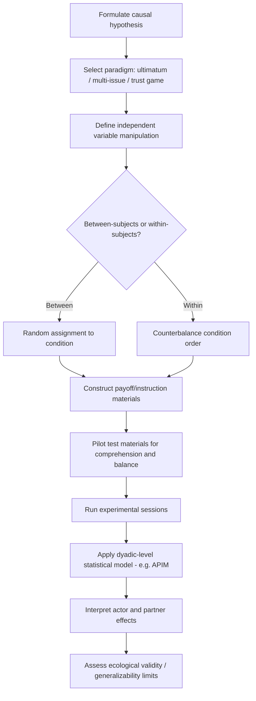

## Experimental Designs in Negotiation Research

### Overview

Experimental methods in negotiation research allow controlled manipulation of variables (power, information, framing, cultural background) to establish causal relationships that observational or case-study methods cannot isolate. This field draws heavily on experimental economics and social psychology methodology, adapted to the dyadic and multi-party interactive structure unique to negotiation.

### Core Experimental Paradigms

**Bilateral Bargaining Games**

The foundational paradigm places two participants in a controlled negotiation over a fixed or variable surplus, with the researcher manipulating structural variables while holding others constant.

- **Ultimatum Game**: Party A proposes a division of a fixed sum; Party B either accepts (division is enacted) or rejects (both receive zero). Used to test deviation from purely rational self-interest predictions, since substantial rejection rates of positive offers empirically contradict simple game-theoretic payoff-maximization.
- **Dictator Game**: A control variant where Party A unilaterally allocates the sum with no counterpart veto, isolating pure allocation preference (fairness/altruism) from strategic concern about rejection.
- **Trust Game**: Party A can transfer (often tripled/multiplied) resources to Party B, who then chooses how much to return, modeling trust extension and reciprocity as precursors to negotiated cooperation.

$$\pi_A = (1-x) \cdot S, \quad \pi_B = x \cdot S \quad \text{if accepted; both } = 0 \text{ if rejected}$$

where $S$ is the surplus and $x$ is the proposed share to Party B.

**Multi-Issue Bargaining Tasks**

Participants negotiate over several issues with private, researcher-assigned payoff schedules (point values per issue-option combination), allowing precise ex-post calculation of:

- Individual value claimed
- Joint/dyadic value created
- Distance from the Pareto-efficient frontier

This design (originating with Pruitt & Lewis-style payoff matrices) is the dominant paradigm for studying integrative bargaining behavior because it permits objective quantification of "value left on the table," which field studies cannot measure without knowing true private valuations.

### Manipulated Independent Variables (Representative Categories)

| Variable Category | Example Manipulations | Typical Dependent Measures |
| --- | --- | --- |
| Power/BATNA | Strong vs. weak alternative disclosed to one/both parties | Concession rate, final outcome share |
| Information | Full disclosure vs. private payoff schedules | Joint gain, impasse rate |
| Framing | Gain-framed vs. loss-framed offers | Risk-taking, concession magnitude |
| Time pressure | Deadline present/absent, deadline proximity | Concession rate near deadline, agreement rate |
| Mood/affect | Induced positive/negative/neutral affect (via film clips, recall tasks) | Cooperativeness, ultimatum rejection rate |
| Communication medium | Face-to-face vs. computer-mediated vs. no communication | Deception rate, trust, rapport-building behavior |
| Cultural background | Individualist vs. collectivist participant samples | Concession pattern, use of contingent contracts |
| Anchoring | High vs. low first offer (confederate or scripted) | Final settlement point |

### Standard Experimental Design Structures

**Between-Subjects Design**

Each participant experiences only one condition (e.g., only the high-power or only the low-power role). Avoids demand characteristics and carryover effects but requires larger sample sizes to achieve statistical power, since between-participant variance is not controlled for.

**Within-Subjects (Repeated-Measures) Design**

The same participant negotiates across multiple conditions or rounds. Increases statistical power and controls for individual differences but introduces risks of learning effects, fatigue, and carryover (a participant's behavior in round 2 may be contaminated by round 1 experience), requiring counterbalancing of condition order.

**Confederate Designs**

One "participant" is a trained research assistant following a fixed script (e.g., always opening with a specific anchor, always displaying a specific emotional expression). This isolates the causal effect of a single behavioral variable but raises ecological validity concerns since real counterparts do not behave identically across every session.

**Computer-Mediated / Simulated Counterpart Designs**

Participants believe they are negotiating with another human but are actually interacting with a programmed algorithm or scripted responses delivered via a chat interface, allowing perfect standardization of the "counterpart's" behavior across all participants. Requires careful ethical handling of deception (see Ethical Considerations below).

### Statistical Analysis Considerations

**Dyad as the Unit of Analysis**

A central methodological issue specific to negotiation research: because two negotiators interact and mutually influence each other's outcomes, their data points are not independent observations. Standard techniques (e.g., the Actor-Partner Interdependence Model, APIM) explicitly model both the actor's own characteristics and the partner's characteristics as predictors of the actor's outcome.

$$Y_{ij} = \beta_0 + \beta_1 X_{ij} + \beta_2 X_{i'j} + \epsilon_{ij}$$

where $Y_{ij}$ is the outcome for actor $i$ in dyad $j$, $X_{ij}$ is the actor's own predictor, and $X_{i'j}$ is the partner's predictor (the "partner effect").

**Common Dependent Variable Operationalizations**

- Individual economic outcome (points, dollars claimed)
- Joint/dyadic outcome (sum of both parties' points)
- Distance-to-Pareto-frontier (efficiency loss)
- Impasse/agreement binary outcome
- Process-coded behaviors (via trained coders applying a behavioral coding scheme to negotiation transcripts, e.g., counting integrative vs. distributive tactics)

### Experimental Design Workflow

### Threats to Validity Specific to Negotiation Experiments

**Internal Validity**

- Confound between manipulated variable and unintended correlated factors (e.g., a "high power" manipulation that also inadvertently signals higher competence).
- Experimenter demand effects, particularly acute in negotiation studies because participants often can infer the study's hypothesis from the framing of instructions.

**External Validity / Ecological Validity**

- Most laboratory negotiations involve strangers, single-shot interactions, and modest financial stakes, whereas real-world negotiations often involve ongoing relationships, reputational stakes, and much higher stakes.
- [Inference] The negotiation research literature generally treats the gap between lab-induced low-stakes bargaining and high-stakes real-world negotiation (e.g., labor disputes, M&A) as a significant generalizability concern, motivating complementary field-study and archival-data approaches rather than reliance on lab experiments alone.
- Student-sample dependence: a substantial portion of negotiation experiments use university student participants, raising questions about generalizability to professional negotiator populations.

**Construct Validity**

- Operationalizing abstract constructs like "trust" or "integrative behavior" via specific behavioral proxies or self-report scales risks measurement error; multiple validated instruments (e.g., specific negotiation-behavior coding schemes) are used precisely to standardize this operationalization across studies.

### Ethical Considerations

- **Deception**: Confederate and simulated-counterpart designs necessarily involve deceiving participants about the true nature of their counterpart; standard practice requires full debriefing post-session explaining the deception and its rationale, per standard human-subjects research ethics protocols (IRB/ethics-board oversight).
- **Financial incentive design**: Studies commonly use real (if modest) monetary payoffs contingent on negotiated outcomes to ensure participants are genuinely incentivized rather than negotiating hypothetically, which affects both realism and required ethics-board review of compensation structures.
- [Unverified] The specific compensation and deception-disclosure norms vary by institution and jurisdiction; researchers should consult their local ethics board's current requirements rather than assuming a universal standard.

### Practical Application Exercise

**Example**

A researcher testing whether time pressure reduces joint gains in multi-issue negotiation would:

1. Design a multi-issue payoff matrix with a known, calculable Pareto-efficient frontier.
2. Randomly assign dyads to "deadline" (e.g., 10-minute limit, publicly displayed countdown) vs. "no deadline" between-subjects conditions.
3. Measure: (a) whether agreement was reached, (b) joint point total achieved, (c) distance from the Pareto frontier.
4. Apply a dyad-level statistical model (treating the dyad, not the individual, as the unit of analysis) to test whether the deadline condition significantly increases efficiency loss.

### Related Topics

- Actor-Partner Interdependence Model (APIM) in Dyadic Data Analysis
- Behavioral Coding Schemes for Negotiation Transcripts
- Ultimatum Game Variants and Cross-Cultural Replications
- Field Studies vs. Laboratory Studies in Negotiation Research
- Deception and Debriefing Protocols in Behavioral Experiments
- Payoff Matrix Design for Multi-Issue Bargaining Tasks
- Measuring Pareto Efficiency and Joint Gain Empirically
- Cross-Cultural Experimental Designs in Negotiation Behavior