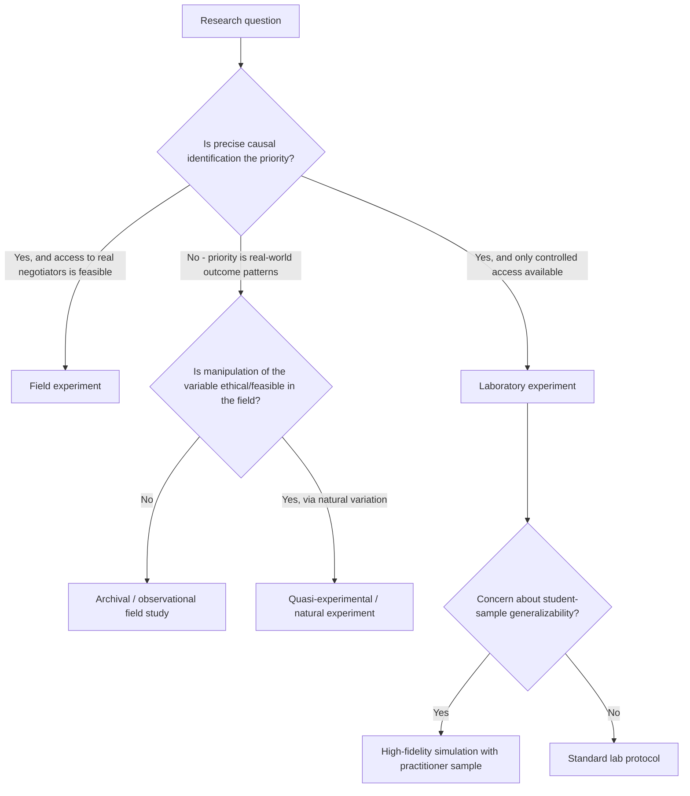

## Laboratory Versus Field Studies

### Overview

Negotiation research relies on two broad methodological traditions: laboratory studies, which manipulate variables under controlled conditions to establish causal inference, and field studies, which observe or measure negotiation behavior in naturally occurring, real-world settings to establish ecological validity. Neither tradition is sufficient alone; the field generally treats them as complementary, with a persistent methodological tension between internal validity (lab strength) and external validity (field strength).

### Defining Characteristics

**Laboratory Studies**

- Conducted in controlled settings (often university labs) with randomly assigned participants.
- Independent variables are directly manipulated by the researcher (see companion topic: Experimental Designs in Negotiation Research).
- Payoff structures are typically researcher-constructed and fully known to the researcher, permitting exact calculation of Pareto efficiency, joint gain, and individual value claimed.
- Sessions are usually single-shot or short-duration, involving strangers with no prior or future relationship.

**Field Studies**

- Conducted in naturally occurring negotiation contexts: real business deals, labor-management disputes, diplomatic negotiations, real estate transactions, or organizational salary negotiations.
- The researcher does not manipulate the negotiation; data is collected via observation, participant self-report, archival records, or post-hoc interviews.
- True private valuations/reservation values are typically unknown to the researcher, making exact efficiency-loss calculations difficult or impossible; researchers instead rely on proxy measures (e.g., final price relative to market comparables, participant satisfaction ratings, settlement time).
- Relationships are typically ongoing or reputationally consequential, with real financial, professional, or diplomatic stakes.

### Comparative Trade-off Table

| Dimension | Laboratory Studies | Field Studies |
| --- | --- | --- |
| Internal validity (causal inference) | High — controlled manipulation, random assignment | Low — confounded by uncontrolled real-world factors |
| External/ecological validity | Low — artificial task, often low stakes, stranger dyads | High — real stakes, real relationships, real context |
| Precision of outcome measurement | High — exact payoff schedules known | Low — private valuations typically unobserved |
| Replicability | High — standardized protocol | Low — each real negotiation is unique and non-repeatable |
| Participant pool | Often students / convenience samples | Actual practitioners (executives, diplomats, union reps) |
| Cost and access | Relatively low cost, high researcher access | High cost, significant access/gatekeeping barriers |
| Generalizability to high-stakes contexts | Contested | Direct, but with reduced causal certainty |

### Methodological Bridge Approaches

**Field Experiments**

Researchers manipulate a variable within a real-world negotiation context (e.g., randomly assigning some real salary negotiators to receive a specific piece of market-rate information, others not), combining the causal leverage of experimentation with a genuine field setting. This design directly addresses the internal/external validity trade-off but is logistically difficult to arrange and often faces ethical and access constraints, since real negotiators and real outcomes are affected by the manipulation.

**Quasi-Experimental / Natural Experiment Designs**

Researchers exploit naturally occurring variation (e.g., a policy change altering disclosure requirements in one jurisdiction but not another, or a natural change in one party's BATNA due to an external market shock) as a proxy for manipulation, without direct researcher control. Requires careful argument that the "treatment" and "control" groups are otherwise comparable (absence of confounding selection effects).

**Archival/Observational Field Studies**

Analysis of existing records: real estate transaction databases, court settlement records, labor contract archives, or historical diplomatic correspondence. Provides large sample sizes and genuine outcomes but is limited to variables that happen to be recorded, and causal claims require strong identification strategies (e.g., instrumental variables, regression discontinuity) to approximate experimental control.

**High-Fidelity Simulation with Practitioner Samples**

Uses lab-style controlled simulations but recruits actual professional negotiators (executives, lawyers, diplomats) rather than students, as a partial bridge on the "participant realism" dimension while retaining the causal-inference advantages of controlled design.

### Methodology Selection Framework

### Key Empirical Divergences Between Lab and Field Findings

- **Stakes sensitivity**: [Inference] Some behavioral effects observed reliably in low-stakes lab settings (e.g., certain framing or anchoring effects) have been found to attenuate under higher real-world stakes in field replications, though the direction and magnitude of this attenuation varies by specific effect and is not a universal finding across all lab-established effects.
- **Relationship effects**: Lab studies with stranger, single-shot dyads cannot capture reputation-preservation behavior that dominates many real field negotiations (e.g., a supplier moderating aggressive tactics to preserve a multi-year buyer relationship), a factor field studies are structurally better positioned to observe.
- **Selection effects unique to field data**: Field data on negotiated outcomes is inherently conditional on negotiations that were attempted and, often, only on those that concluded in agreement (agreements that collapsed may go unrecorded), introducing a form of survivorship bias absent from lab designs where all sessions are recorded regardless of outcome.

### Validity Threats Specific to Each Tradition

**Laboratory-Specific Threats**

- Demand characteristics: participants inferring the hypothesis and adjusting behavior accordingly.
- Low ecological stakes reducing motivational realism (real money is often used, but typically at levels far below real-world negotiation stakes).
- Homogeneous, often student-based samples limiting generalizability to professional populations.

**Field-Specific Threats**

- Confounding: real negotiations vary simultaneously along many uncontrolled dimensions (relationship history, market conditions, individual negotiator skill), making isolation of a single causal factor difficult.
- Measurement difficulty: true reservation values and private interests are typically unobservable, forcing reliance on imperfect proxies.
- Access and selection bias: organizations or individuals willing to grant researcher access to real negotiations may differ systematically from those who decline, potentially skewing the sample toward more cooperative or higher-performing negotiators.

### Practical Application Exercise

**Example**

A researcher wants to determine whether providing negotiators with third-party market-comparable data increases the likelihood of reaching an efficient (non-impasse) agreement.

- **Lab-only approach**: Construct a multi-issue payoff matrix, randomly assign half the dyads to receive fabricated "market comparable" information, measure agreement rate and joint point total. High internal validity; unclear whether effect generalizes to real, higher-stakes negotiations.
- **Field experiment approach**: Partner with a real estate brokerage; randomly assign a subset of live home-sale negotiations to receive an automated comparable-sales report, withhold it from a control subset, then compare actual closing outcomes (sale price relative to appraised value, time-to-close). Higher external validity; more difficult to arrange, and confounds (e.g., differing property characteristics) must be statistically controlled rather than experimentally eliminated.
- **Recommended complementary design**: Run the lab study first to establish a clean causal estimate of the mechanism, then attempt the field experiment or a quasi-experimental field replication to test whether the effect holds at real-world stakes and with real practitioner samples.

### Related Topics

- Field Experiments in Real-World Negotiation Contexts
- Quasi-Experimental and Natural Experiment Identification Strategies
- Archival Data Analysis of Negotiated Settlements
- Student Samples vs. Practitioner Samples in Behavioral Research
- Ecological Validity and Motivational Realism in Experimental Design
- Survivorship Bias in Negotiation Outcome Data
- Reputation and Relationship Effects on Negotiation Behavior
- Instrumental Variables and Regression Discontinuity in Observational Negotiation Research