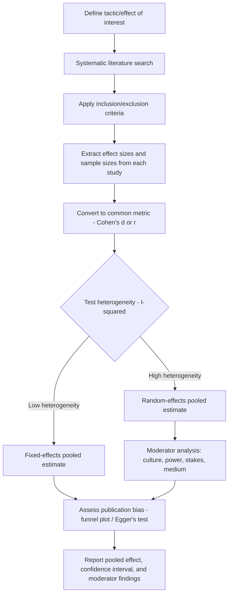

## Meta-Analytic Findings on Negotiation Tactics

### Overview

Meta-analysis aggregates effect sizes across many independent studies to estimate the average magnitude and consistency of a given negotiation tactic's impact, correcting for sampling error and enabling moderator analysis (identifying conditions under which an effect strengthens, weakens, or reverses). Because individual negotiation experiments often have modest sample sizes and produce heterogeneous findings, meta-analysis is a primary tool for establishing which tactical effects in the field are robust versus context-dependent or weakly supported.

### Core Meta-Analytic Methodology

**Effect Size Aggregation**

Individual study results are converted to a common effect size metric, most commonly Cohen's $d$ (standardized mean difference) or correlation coefficient $r$, then combined via weighted averaging, with weights typically inversely proportional to each study's sampling variance.

$$\bar{d} = \frac{\sum_{i} w_i d_i}{\sum_{i} w_i}, \quad w_i = \frac{1}{SE_i^2}$$

where $d_i$ is the effect size from study $i$ and $w_i$ is its inverse-variance weight.

**Fixed-Effects vs. Random-Effects Models**

- **Fixed-effects model**: assumes all studies estimate a single true effect size, with observed variation attributable only to sampling error.
- **Random-effects model**: assumes true effect sizes vary across studies (due to differing populations, tactics operationalizations, or contexts), estimating both the mean effect and between-study variance ($\tau^2$).

[Inference] Random-effects models are generally preferred in negotiation meta-analyses given the substantial heterogeneity in experimental paradigms (payoff structures, cultural samples, stakes levels) typically pooled together, though the choice is a standard methodological one made explicitly by each meta-analysis's authors rather than a universal default.

**Heterogeneity and Moderator Analysis**

The $I^2$ statistic quantifies the proportion of total variance attributable to true between-study heterogeneity rather than sampling error. High heterogeneity motivates moderator analysis: testing whether study-level variables (culture, stakes, power symmetry, communication medium) explain variation in effect size across the pooled studies.

**Publication Bias Assessment**

Standard diagnostic tools include funnel plots (assessing asymmetry that would suggest small null-result studies are underrepresented) and statistical tests (e.g., Egger's test) for such asymmetry, since studies finding significant tactical effects are more likely to be published than null results.

### Representative Meta-Analytic Findings by Tactic Category

**Anchoring / First-Offer Effects**

Meta-analytic and cumulative experimental evidence consistently finds that the first offer in a negotiation exerts a strong anchoring effect on the final settlement point, with more extreme first offers generally associated with more favorable final outcomes for the offering party, up to a point where excessive extremity risks impasse or counterpart withdrawal.

- [Inference] The general direction and robustness of the first-offer anchoring effect is one of the more consistently replicated findings in the negotiation literature; the precise optimal degree of anchor extremity is more context-dependent and is not reducible to a single universal numeric threshold.

**Reciprocity and Concession Patterns**

Findings generally support that concessions tend to be reciprocated (a party who concedes is more likely to receive a subsequent concession), consistent with broader social-psychological reciprocity norms, though the magnitude of reciprocation varies with relationship context and perceived intentionality of the initial concession.

**Emotional Expression (Anger vs. Happiness Display)**

A frequently cited line of experimental and meta-analytic work finds that expressed anger by a counterpart can elicit larger concessions in single-shot, low-power-differential negotiations, but this effect reverses or backfires when the angry party is perceived as low-power, when future interaction is expected, or across certain cultural contexts, indicating a significant moderating role of context and relationship expectations rather than a uniformly beneficial "anger tactic."

**Deception and Misrepresentation**

Research on strategic misrepresentation of interests or reservation values generally finds it can produce short-term distributive gains but is associated with reduced trust, lower likelihood of repeated interaction, and reduced joint value creation when discovered, an established trade-off in the literature between short-term claiming gains and longer-term relational/reputational cost.

**Question-Asking and Information-Seeking Behavior**

Studies and reviews on integrative bargaining behavior consistently associate higher rates of interest-discovery questions (asking about priorities, constraints, and underlying needs) with higher joint outcomes and more Pareto-efficient agreements, this being one of the more robust behavioral correlates of integrative success across multiple study designs.

**Multiple Equivalent Simultaneous Offers (MESOs)**

Presenting several different offers of approximately equal value to oneself, simultaneously, rather than one offer at a time, is associated in experimental work with improved information revelation from the counterpart (since counterpart preferences among the equivalent offers reveal relative priorities) and generally favorable outcomes relative to single sequential offers.

**Power and BATNA Strength**

A consistent finding across experimental and field-adjacent studies is that possessing (and, more specifically, being aware of possessing) a strong BATNA improves individual negotiated outcomes, both by raising the negotiator's own reservation value/confidence and by altering counterpart concession behavior when the strong BATNA is credibly communicated. [Inference] The literature also generally finds diminishing or even counterproductive effects when a strong-power party leverages that power in overtly aggressive ways that damage the relationship or trigger retaliatory hardening from the counterpart, though the precise tipping point is context-dependent.

### Moderator Variables Frequently Tested Across Meta-Analyses

| Moderator | Typical Finding Pattern |
| --- | --- |
| Cultural background (individualist vs. collectivist) | Tactic effectiveness (e.g., direct confrontation, contingent contracts) often varies significantly by cultural sample |
| Power symmetry | Tactics involving displayed emotion or aggression show different, sometimes reversed, effects for high- vs. low-power parties |
| Relationship expectation (one-shot vs. repeated) | Distributive/aggressive tactics show more favorable short-term but less favorable long-term effects under repeated-interaction expectation |
| Gender | Some tactic-effectiveness and tactic-usage patterns show gender-based moderation, though findings are mixed and sensitive to task framing across studies |
| Communication medium (face-to-face vs. computer-mediated) | Deception rates and rapport-building magnitude differ by medium in multiple studies |

### Meta-Analytic Workflow

### Interpreting Effect Size Magnitude in This Domain

Conventional Cohen's $d$ benchmarks (0.2 small, 0.5 medium, 0.8 large) are commonly used as a reference scale, but [Inference] many robust negotiation-tactic effects (e.g., anchoring) are reported in the small-to-medium range individually, while still being considered practically significant given the direct, cumulative financial impact of small percentage shifts in negotiated outcomes; practical significance in this domain is therefore not equivalent to the conventional small/medium/large statistical labels alone.

### Limitations of Meta-Analytic Evidence in Negotiation Research

- **Construct heterogeneity**: different studies often operationalize the "same" tactic (e.g., "aggressive opening offer") with meaningfully different manipulations, complicating direct pooling.
- **Lab-dominance of underlying studies**: because most individual studies feeding negotiation meta-analyses are laboratory-based (see companion topic: Laboratory Versus Field Studies), pooled effect sizes inherit the external-validity limitations of the underlying lab literature.
- **File-drawer problem**: null or negative tactic-effect findings are less likely to be published, and while funnel-plot and statistical bias-correction methods partially address this, [Unverified] the degree of residual publication bias in any specific negotiation-tactic meta-analysis depends on the completeness of that analysis's literature search and correction method, and should be checked in the specific source rather than assumed uniformly corrected.

### Practical Application Exercise

**Example**

Interpreting a hypothetical meta-analysis reporting $\bar{d} = 0.45$ (random-effects, $I^2 = 68\%$) for the effect of first-offer extremity on final settlement favorability:

1. The pooled effect ($d = 0.45$) indicates a moderate, consistent positive relationship between anchor extremity and favorable outcome across the pooled studies.
2. The high $I^2$ (68%) signals substantial heterogeneity, meaning the true effect likely varies meaningfully across contexts, and the moderator analysis (e.g., testing whether power symmetry or culture explains this variance) should be consulted before generalizing the pooled estimate to a specific real-world context.
3. A practitioner should treat the 0.45 figure as an average tendency, not a guarantee, and should weight the specific moderators most relevant to their own negotiation context (e.g., is this a repeated-relationship negotiation, where the aggressive-anchor tactic's downside risk is typically amplified per the reciprocity and relationship-expectation moderator findings above).

### Related Topics

- Random-Effects vs. Fixed-Effects Meta-Analytic Models
- Publication Bias Detection: Funnel Plots and Egger's Test
- Anchoring and First-Offer Effects in Distributive Bargaining
- Emotional Expression as a Tactical Lever (Anger, Happiness, Disappointment)
- Multiple Equivalent Simultaneous Offers (MESO) Technique
- Cross-Cultural Moderators of Negotiation Tactic Effectiveness
- Reciprocity Norms and Concession-Matching Behavior
- Constructing and Interpreting Forest Plots in Behavioral Meta-Analysis