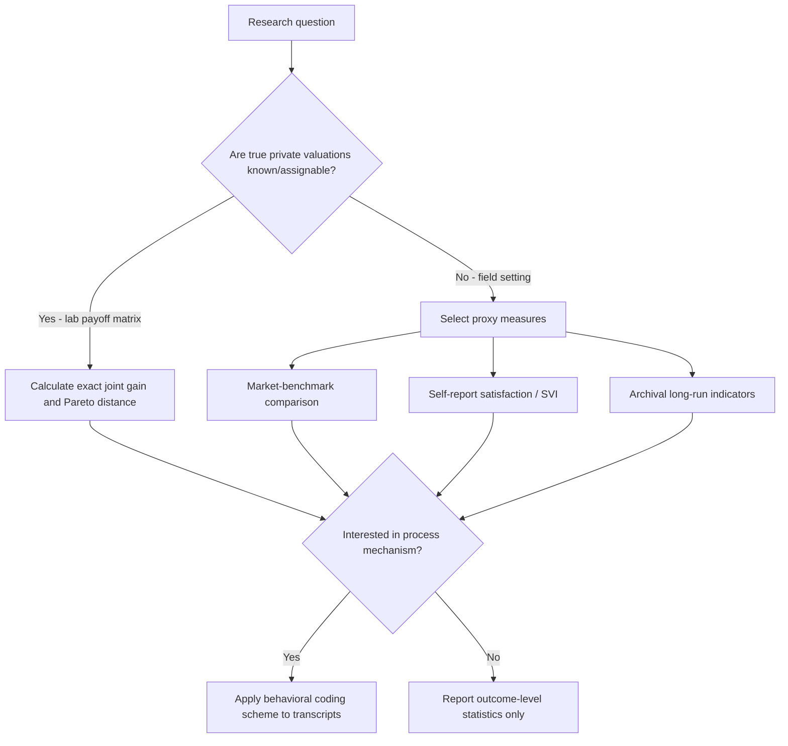

## Measuring Negotiation Outcomes and Effectiveness

### Overview

Measuring negotiation outcomes requires distinguishing between distributive performance (how much value an individual party claimed), joint/dyadic performance (how much total value was created), and process quality (how the outcome was reached), since a negotiator can score well on one dimension while performing poorly on another. This measurement problem is foundational to negotiation research because most theoretical constructs (integrative bargaining, Pareto efficiency, satisfaction) require an operational, quantifiable proxy before they can be tested empirically.

### Core Outcome Dimensions

**Individual (Distributive) Outcome**

The absolute or relative value an individual party claims from the agreement, typically measured as:

- Raw point total or dollar value under a researcher-assigned payoff schedule (lab studies)
- Final price/term relative to an initial anchor or market benchmark (field studies)
- Share of total surplus relative to the theoretical maximum available

$$\text{Individual Share}_i = \frac{v_i(\text{agreement})}{v_i(\text{maximum possible})}$$

**Joint (Integrative) Outcome**

The combined value created for both/all parties, used to assess whether the negotiation was efficient or left value unclaimed.

$$\text{Joint Outcome} = \sum_{i=1}^{n} v_i(\text{agreement})$$

**Pareto Efficiency / Distance-to-Frontier**

Whether the agreement lies on the Pareto frontier (no reallocation could make one party better off without making another worse off), or how far it falls short. This requires the researcher to know each party's full payoff function, which is feasible in controlled lab payoff-matrix designs but rarely directly observable in field settings.

$$\text{Efficiency Loss} = v(\text{Pareto-optimal point}) - v(\text{actual agreement})$$

**Impasse Rate**

The proportion of negotiation attempts that fail to reach agreement, used both as a standalone outcome measure and as a boundary condition for other metrics (efficiency and joint-gain measures are undefined for impassed negotiations, so impasse rate must be reported and analyzed separately, often as a binary logistic outcome).

### Subjective / Perceptual Outcome Measures

Because objective economic measures do not capture the full experience of a negotiation, subjective measures are commonly collected via post-negotiation self-report instruments:

- **Subjective Value Inventory (SVI)**: A validated multi-dimensional self-report scale (Curhan, Elfenbein, and colleagues) measuring four typical dimensions: feelings about the instrumental outcome, feelings about the self, feelings about the process, and feelings about the relationship with the counterpart. Widely used because objective economic outcome and subjective satisfaction are empirically only moderately correlated, meaning a party can claim substantial economic value yet report low subjective satisfaction (e.g., due to a damaged relationship or a felt-unfair process), or vice versa.
- **Perceived fairness ratings**: Single or multi-item scales asking participants to rate how fair they perceived the process and/or outcome, frequently used as a predictor of future willingness to negotiate with the same counterpart or comply with the agreement.
- **Relationship/trust measures**: Post-negotiation trust or relationship-quality scales, used particularly in studies examining the long-term cost of aggressive distributive tactics.

### Process-Based Measures (Behavioral Coding)

Independent of final outcome, researchers frequently code the negotiation process itself using structured coding schemes applied to transcripts, recordings, or real-time observation:

| Coded Behavior Category | Example Codes |
| --- | --- |
| Information exchange | Number of interest-discovery questions asked, disclosure of priorities |
| Distributive tactics | Positional demands, threats, extreme anchors |
| Integrative tactics | Trade-off proposals, package offers, contingent contracts |
| Emotional expression | Displays of anger, enthusiasm, frustration |
| Reciprocity patterns | Concession-matching sequences |

Process coding allows researchers to test mechanism-level hypotheses (e.g., "does question-asking frequency mediate the relationship between negotiator training and joint outcome?") rather than relying on outcome measures alone.

### The Measurement Validity Problem in Field Settings

In laboratory studies, the researcher assigns payoff schedules and therefore knows each party's true valuation, permitting exact efficiency and joint-gain calculations. In field studies, true private valuations are typically unobserved, forcing reliance on imperfect proxies:

- Final price relative to independently assessed market value (e.g., appraisal-relative sale price in real estate negotiation research)
- Self-reported satisfaction or perceived-fairness scales
- Archival indicators such as time-to-settlement, litigation avoidance, or contract renewal/renegotiation rates as long-run proxies for agreement quality

[Inference] This measurement gap is a primary reason experimental/lab designs remain dominant for testing precise joint-gain and efficiency hypotheses, while field studies more commonly rely on subjective, price-benchmark, or long-run behavioral proxies rather than exact efficiency calculations.

### Measurement Framework Selection

### The Subjective Value Inventory (SVI) Structure

The SVI is commonly structured around four factors, each measured via multiple Likert-scale items:

1. **Feelings about the instrumental outcome**: perceived fairness and satisfaction with the tangible terms achieved.
2. **Feelings about the self**: whether the negotiator felt competent, ethical, and true to their own interests during the process.
3. **Feelings about the negotiation process**: perceived fairness, respect, and quality of the interaction itself, independent of the final terms.
4. **Feelings about the relationship**: trust in and desire for future interaction with the counterpart.

[Inference] The multi-factor structure of the SVI is specifically designed to demonstrate that these four dimensions are separable and only moderately correlated with each other and with objective economic outcome, a finding generally supported in the validation literature for the instrument, though the precise correlation magnitudes vary across specific studies and samples.

### Common Measurement Pitfalls

- **Conflating economic outcome with overall negotiation success**: a negotiator who "won" on point totals but damaged the relationship or violated a norm of perceived fairness may face negative long-run consequences not captured by the single-session economic score.
- **Ignoring impasse censoring**: calculating average joint gain only across negotiations that reached agreement, without separately reporting or modeling the impasse rate, biases efficiency estimates by silently excluding failed negotiations (a selection/survivorship issue also discussed under Laboratory Versus Field Studies).
- **Assuming subjective and objective measures are interchangeable**: given their typically modest empirical correlation, a study design should specify explicitly which dimension (economic, subjective, relational) is the primary dependent variable of interest, rather than treating them as a single undifferentiated construct.
- **Failing to model the dyad**: as with experimental design more broadly, outcome measures for two interacting parties are not statistically independent, requiring dyadic-level modeling approaches (e.g., Actor-Partner Interdependence Model) rather than simple independent-samples comparisons.

### Practical Application Exercise

**Example**

Evaluating "negotiator effectiveness" for a corporate procurement team across a quarter of supplier negotiations:

1. **Economic measure**: average percentage discount off initial supplier quote, and/or total dollar savings relative to budget baseline.
2. **Efficiency proxy**: since true supplier reservation prices are unknown, use market-benchmark comparison (price relative to industry-average procurement cost for comparable goods) as an efficiency proxy.
3. **Subjective measure**: post-negotiation SVI-style survey of both the procurement negotiator and (where feasible) the supplier contact, assessing relationship and process satisfaction.
4. **Long-run proxy**: supplier contract renewal rate and incidence of post-contract disputes over the following year, as an indicator of whether apparently favorable short-term economic outcomes came at the cost of relationship durability.
5. **Composite interpretation**: a negotiator scoring high on economic measures but with declining supplier renewal rates and low relationship-satisfaction scores would be flagged as potentially over-indexing on short-term distributive claiming at the expense of long-run relational value, illustrating why single-dimension measurement is insufficient for assessing overall effectiveness.

### Related Topics

- Subjective Value Inventory (SVI) Validation and Application
- Actor-Partner Interdependence Model for Dyadic Outcome Data
- Behavioral Coding Schemes for Negotiation Process Analysis
- Pareto Efficiency and Joint Gain Calculation Methods
- Impasse Rate as a Censored/Selection Variable in Outcome Research
- Long-Run Relational Proxies: Contract Renewal and Dispute Incidence
- Market-Benchmark Methods for Field-Setting Outcome Measurement
- Distinguishing Distributive Success from Overall Negotiation Effectiveness