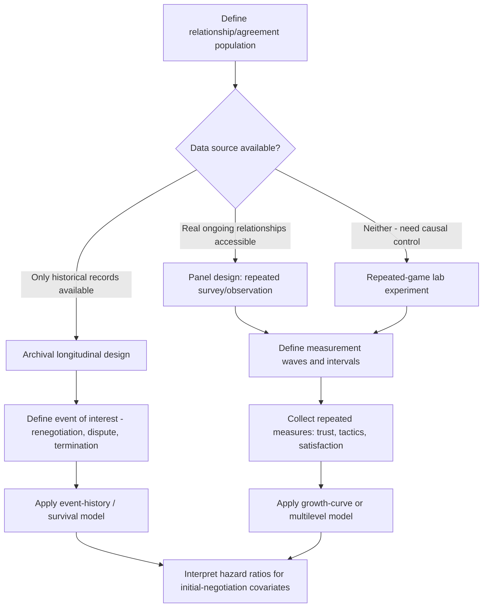

## Longitudinal Studies of Negotiated Relationships

### Overview

Longitudinal studies of negotiated relationships track the same negotiating parties, dyads, or agreements over multiple time points, enabling researchers to study how trust develops, how initial tactics affect long-run relational outcomes, and how a single agreement performs through its implementation and renegotiation lifecycle. This design directly addresses a core limitation of single-shot lab and cross-sectional field studies (see companion topics: Experimental Designs in Negotiation Research; Laboratory Versus Field Studies): most real-world negotiations occur within an ongoing relationship, where today's tactics shape tomorrow's negotiating conditions.

### Rationale for Longitudinal Design in Negotiation Research

- **Reputation and repeated-game dynamics**: A negotiator's behavior in one round of an ongoing relationship affects the counterpart's strategy, trust level, and concession behavior in subsequent rounds, an effect structurally invisible to single-shot designs.
- **Trust development trajectories**: Trust is understood in the relational-negotiation literature as a variable that accumulates or erodes across repeated interactions rather than a fixed initial state, requiring repeated-measurement designs to observe its trajectory.
- **Contract performance and renegotiation**: An agreement's terms at signing are only one data point; longitudinal designs can track implementation fidelity, dispute incidence, and eventual renegotiation, capturing "success" in a way a single post-agreement survey cannot.
- **Distinguishing short-term claiming from long-term relational cost**: As discussed under Measuring Negotiation Outcomes and Effectiveness, a distributive/aggressive tactic may show a favorable outcome at Time 1 but a measurable relational or economic cost at Time 2 or Time 3, which only a longitudinal design can detect.

### Core Longitudinal Design Structures

**Panel Designs (Repeated Measurement of the Same Dyad/Parties)**

The same negotiating parties (individuals, firms, or national delegations) are measured at multiple time points across repeated negotiation rounds or across the lifecycle of a single ongoing agreement.

- *Fixed-panel*: identical parties/dyads tracked across all waves.
- *Rotating/cohort panel*: overlapping but not identical sets of parties tracked, allowing broader sampling while retaining some repeated-measurement power.

**Event-History / Survival Analysis Designs**

Used when the outcome of interest is the timing of an event, such as time-to-renegotiation, time-to-dispute, or time-to-contract-termination. Models the hazard rate of the event occurring as a function of covariates (e.g., initial negotiation tactics, initial perceived fairness).

$$h(t) = h_0(t) \exp(\beta_1 X_1 + \beta_2 X_2 + \dots)$$

where $h(t)$ is the hazard (instantaneous risk) of the event at time $t$, $h_0(t)$ is a baseline hazard function, and $X_i$ are covariates such as initial-negotiation tactic variables (a Cox proportional-hazards specification is a standard implementation of this general form).

**Repeated-Game Experimental Designs (Lab-Based Longitudinal Analog)**

A controlled variant bringing longitudinal logic into the lab: the same participant dyad negotiates across multiple linked rounds (sometimes with real or manipulated reputational information carried forward), allowing controlled study of trust-building, retaliation, and reciprocity trajectories with the causal-inference advantages of experimental manipulation, at some cost to real-world ecological validity relative to true field panel designs.

**Archival Longitudinal Designs**

Tracking of real contracts, treaties, or labor agreements through publicly available or organizationally provided records (renewal dates, amendment history, dispute/litigation records, renegotiation terms), often the only feasible way to study very long time horizons (e.g., decades-long treaty relationships) without direct researcher-administered repeated measurement.

### Key Constructs Studied Longitudinally

**Trust Trajectory**

Modeled typically as a trajectory (e.g., via growth-curve or multilevel modeling) rather than a single time-point measure, testing whether trust increases, plateaus, or decays following specific triggering events (e.g., a single instance of discovered deception).

$$\text{Trust}_{it} = \beta_0 + \beta_1(\text{Time}) + \beta_2(\text{Time} \times \text{Event}_i) + u_i + \epsilon_{it}$$

where $u_i$ is a random intercept capturing individual/dyad-level baseline differences, allowing the model to separate within-dyad change over time from between-dyad baseline variation.

**Reciprocity and Retaliation Cycles**

Sequential analysis of concession-and-retaliation patterns across rounds, testing whether early cooperative or competitive moves establish a persistent behavioral norm for the relationship ("tit-for-tat" pattern stability) or whether the relationship exhibits recovery/forgiveness dynamics after a defection.

**Contract Renegotiation and Renewal**

Event-history analysis of whether initial negotiation characteristics (e.g., perceived fairness at signing, degree of integrative vs. distributive tactic use) predict the hazard of early renegotiation, dispute, or non-renewal.

**Escalation of Commitment**

Longitudinal tracking of whether parties continue investing in a failing negotiated course of action (e.g., a joint venture with worsening terms) beyond the point a purely rational re-evaluation would suggest, a bias requiring repeated observation to distinguish from a single rational persistence decision.

### Longitudinal Study Design Workflow

### Statistical Modeling Considerations

**Multilevel / Hierarchical Models**

Because repeated observations are nested within individuals or dyads, standard OLS regression violates the independence assumption; multilevel (mixed-effects) models explicitly separate within-unit change from between-unit variation, analogous to but distinct from the Actor-Partner Interdependence Model used for single-time-point dyadic data (see companion topics on experimental and outcome-measurement methodology).

**Attrition and Missing Data**

A defining challenge of longitudinal negotiation research: relationships may dissolve, firms may be acquired, or participants may become unavailable for follow-up, and this attrition is frequently non-random (e.g., failed relationships may be systematically less likely to respond to a follow-up survey than successful ones), risking biased estimates if not explicitly modeled (e.g., via selection models or sensitivity analysis for missing-not-at-random data).

**Time-Varying Covariates**

Unlike single-time-point designs, longitudinal models can incorporate covariates that themselves change over time (e.g., market conditions, personnel turnover on the negotiating team), which may confound or moderate the relationship between initial-negotiation characteristics and later outcomes if not properly accounted for.

### Distinctive Threats to Validity in Longitudinal Negotiation Research

- **Attrition/survivorship bias**: as above, dissolved relationships are structurally harder to follow longitudinally than surviving ones, risking a sample that over-represents "successful" relationships.
- **History confounds**: external events occurring between measurement waves (e.g., a market shock, regulatory change) may affect the relationship independently of the initial negotiation characteristics being studied, complicating causal attribution over long time horizons.
- **Measurement reactivity over repeated waves**: repeatedly surveying the same parties about their relationship satisfaction or trust may itself influence their behavior or self-perception, a general repeated-measurement concern requiring careful design (e.g., varied instrumentation, embedded control groups) to detect.
- [Inference] Given the cost, access difficulty, and multi-year time horizon required, longitudinal field studies of negotiated relationships are less numerous in the literature than cross-sectional or single-shot lab studies, meaning conclusions in this specific sub-literature often rest on a smaller number of large, resource-intensive studies rather than a large replication base; readers should weigh individual study conclusions accordingly.

### Practical Application Exercise

**Example**

Studying whether integrative (vs. purely distributive) tactics used during an initial multi-year supplier contract negotiation predict the contract's renewal likelihood three years later:

1. **Design**: Archival panel design using a firm's procurement records, coding the initial negotiation's process characteristics (integrative tactic use, perceived fairness at signing, if survey data available) as baseline (Time 0) covariates.
2. **Outcome**: Event-history model with "time to renegotiation-with-improved-terms" vs. "time to non-renewal/termination" as competing-risk outcomes.
3. **Model**: Cox proportional-hazards specification with initial-negotiation tactic variables as covariates, controlling for time-varying covariates such as intervening market price shifts for the contracted goods.
4. **Interpretation caution**: because firms selecting into long-term supplier relationships may differ systematically from those that do not (a selection effect), any hazard-ratio finding should be interpreted as associational unless a genuine natural experiment or randomized field-experiment component is available to support a stronger causal claim.

### Related Topics

- Trust Development Trajectories in Repeated Negotiation
- Event-History and Survival Analysis for Contract Renegotiation
- Multilevel/Hierarchical Modeling of Repeated Dyadic Data
- Attrition and Missing-Data Handling in Longitudinal Field Research
- Repeated-Game Experimental Paradigms and Reciprocity Cycles
- Escalation of Commitment in Ongoing Negotiated Relationships
- Archival Methods for Studying Long-Horizon Treaty and Contract Relationships
- Distinguishing Short-Term Claiming from Long-Term Relational Cost