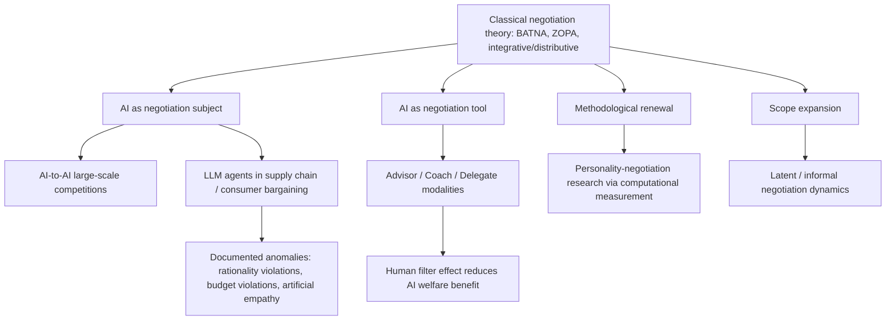

## Emerging Research Frontiers in Negotiation Theory

### Overview

Negotiation theory is currently expanding beyond its traditional human-dyad, lab-and-field empirical base into several active frontiers driven largely by the proliferation of large language model (LLM) agents as both negotiation subjects and negotiation tools, alongside renewed theoretical attention to informal/undeclared negotiation dynamics and a resurgence of personality-based research enabled by new computational measurement methods. These frontiers extend, rather than replace, the classical frameworks covered elsewhere in this syllabus (two-level games, BATNA/ZOPA analysis, integrative bargaining), applying them to genuinely new empirical contexts.

### Frontier 1: Autonomous AI-to-AI Negotiation

**Key Points**

A large-scale international research competition, in which participants designed and refined prompts for AI negotiation agents, facilitated over 180,000 negotiations between agents to systematically study AI-to-AI bargaining behavior. The study's central motivation was that while current AI negotiation theory advances technical approaches, specifications, and optimization, it has generally neglected the nearly 70-year history of behavioral and cognitive research on human negotiations. [PNAS](https://www.pnas.org/doi/10.1073/pnas.2521774123)[PNAS](https://www.pnas.org/doi/10.1073/pnas.2521774123)

Findings from this research indicate that principles from human negotiation theory remain crucial even in AI-AI contexts, and that AI-specific technical strategies also independently contribute to negotiation success. Applying natural language processing methods to the negotiation transcripts, researchers found that positivity, gratitude, and question-asking, behaviors associated with interpersonal warmth, were strongly predictive of outcomes, echoing the human-negotiation integrative-bargaining literature on question-asking (see companion topic: Meta-Analytic Findings on Negotiation Tactics) while extending it to a machine-agent context. [PNAS](https://www.pnas.org/doi/10.1073/pnas.2521774123)[PNAS](https://www.pnas.org/doi/10.1073/pnas.2521774123)

The research also surfaced dynamics with no clear analog in classical human negotiation theory, including AI-specific technical strategies such as chain-of-thought reasoning and prompt injection as unique dynamics in AI-AI negotiations not fully explained by existing negotiation theory. The authors concluded that these findings point toward the need to establish a new theory of AI negotiation that integrates classic negotiation theory with AI-specific negotiation theories to understand autonomous agent bargaining fully. [PNAS](https://www.pnas.org/doi/10.1073/pnas.2521774123)[PNAS](https://www.pnas.org/doi/10.1073/pnas.2521774123)

**Theoretical Relevance and Caveats**

- [Inference] This body of work is generally positioned as a bridging effort between the mature behavioral-negotiation literature and a rapidly scaling but theoretically underdeveloped AI-agent negotiation literature, rather than a wholesale replacement of classical frameworks.
- A related large-scale study specifically notes a generalizability limitation: its competition results pertain to a specific frontier model, which was selected for its balance of high textual intelligence and low computational cost, and findings therefore may or may not generalize uniformly across different AI platforms. [Unverified] The degree to which specific tactical findings (e.g., the warmth-behavior correlation) transfer across different model architectures and providers has not been established as a settled, cross-model finding. [arXiv](https://arxiv.org/pdf/2503.06416)

### Frontier 2: LLM Agents in Applied Bargaining Contexts (Supply Chain and Consumer Markets)

**Key Points**

Beyond controlled competitions, researchers are testing LLM agents in economically structured bargaining scenarios modeled on real procurement and consumer contexts. One study investigating LLM agents in autonomous supply chain contract negotiations, testing scenarios where supplier cost information was public, private, ambiguous, or deceptive, found that LLM agents use simple heuristics to make decisions and generally exhibit human-like negotiating behavior. [Wiley Online Library](https://onlinelibrary.wiley.com/doi/10.1111/deci.70010)

Notably, this research found a divergence from human baseline behavior: contrasting humans, LLM agents are more inclined toward reaching agreement, leading to greater supply chain efficiency but potentially greater inequality compared to human negotiators. The study further demonstrated a manipulability concern directly relevant to negotiation ethics: deceiving LLM agents into believing they have higher costs can improve outcomes for the supplier at the expense of retailers and the supply chain's overall efficiency. [Wiley Online Library](https://onlinelibrary.wiley.com/doi/10.1111/deci.70010)[Wiley Online Library](https://onlinelibrary.wiley.com/doi/10.1111/deci.70010)

A parallel research direction examines agent-to-agent consumer market transactions, motivated by the observation that the potential business value and rising capabilities of deep neural network agents have led researchers and practitioners to explore methods for building automated negotiation models, with more recent work shifting toward prompt-based LLM agents for complex negotiation tasks rather than the purely numerical, game-theoretic optimization approaches of earlier automated-negotiation research. [arxiv](https://arxiv.org/pdf/2506.00073)[arxiv](https://arxiv.org/pdf/2506.00073)

**Documented Behavioral Anomalies in LLM Negotiators**

Systematic evaluation work has identified specific failure modes distinct from human negotiator biases:

- Frontier models frequently violate principles of negotiation rationality and are susceptible to adversarial pressure. [arxiv](https://arxiv.org/pdf/2607.05863)
- Separately documented is a failure to maintain consistent strategic goals across multi-turn interactions. [arxiv](https://arxiv.org/pdf/2607.05863)
- Critical behavioral anomalies such as budget violations and "artificial empathy" concessions have been identified as posing significant financial risks in autonomous transactions. [arxiv](https://arxiv.org/pdf/2604.09855)
- [Inference] These anomalies collectively suggest that classical human-negotiator bias frameworks (e.g., anchoring, reciprocity) are necessary but not sufficient to fully characterize LLM negotiator behavior, motivating a distinct sub-literature on AI-specific negotiation failure modes.

### Frontier 3: Human-AI Negotiation Assistance and Delegation Modalities

**Key Points**

A distinct frontier examines not AI-as-negotiator but AI-as-tool for human negotiators, comparing different levels of AI involvement. One study structured this as three assistance modalities: Advisor mode (proactive recommendations), Coach mode (reactive feedback), and Delegate mode (autonomous actions taken without requiring approval at each step), the last of which corresponds to autonomous agent products now offered by major AI providers. [arxiv](https://arxiv.org/pdf/2602.12089)[arxiv](https://arxiv.org/pdf/2602.12089)

This research documented a notable preference-performance gap: researchers found a preference-performance misalignment where users prefer the Advisor modality but achieve the highest welfare outcomes with the Delegate modality. The mechanism identified was a "human filter" effect, in which users in Advisor and Coach modes modify, override, or ignore high-quality AI proposals, diluting the welfare benefit the AI could otherwise provide. [arxiv](https://arxiv.org/pdf/2602.12089)[arxiv](https://arxiv.org/pdf/2602.12089)

**Theoretical Relevance**

- [Inference] This finding is significant for applied negotiation practice because it suggests that the value of AI negotiation assistance may be structurally undermined by human oversight itself, an outcome not predicted by classical models of negotiator decision support, and raises open design questions about how much autonomy to grant AI negotiation tools in real deployments.

### Frontier 4: Personality in Negotiation, Revisited via Computational Methods

**Key Points**

A recent review explicitly reframes personality-negotiation research as newly tractable due to methodological advances, noting that emerging tools include computational measurement and agent-based paradigms expected to accelerate cumulative progress in this previously stagnant sub-literature. [PubMed](https://pubmed.ncbi.nlm.nih.gov/42537551/)

- [Inference] Personality-negotiation research had historically produced weak and inconsistent effect sizes using traditional self-report trait measures; the cited computational-measurement and agent-based methodological shift is presented in the recent literature as a response to that historical inconsistency, though the specific magnitude of improvement in predictive validity these new tools will yield is not yet an established, settled finding as of the available reporting.

### Frontier 5: Latent and Informal Negotiation Dynamics

**Key Points**

An emerging theoretical strand examines negotiations that occur without being formally recognized as such by the parties involved. Recent conceptual work on this topic focuses on the contextual and cognitive mechanisms that explain how such informal negotiation dynamics emerge and are perceived in practice, framed around research questions concerning the initial conditions under which such latent negotiations are likely to emerge, and which contextual design parameters characterize perceived effectiveness in these informal settings. [MIT Press](https://direct.mit.edu/ngtn/article-pdf/doi/10.1162/NGTN.a.58/2581920/ngtn.a.58.pdf)[MIT Press](https://direct.mit.edu/ngtn/article-pdf/doi/10.1162/NGTN.a.58/2581920/ngtn.a.58.pdf)

**Theoretical Relevance**

- [Inference] This frontier extends negotiation theory's traditional scope, which has generally assumed parties consciously recognize themselves as being "in a negotiation," into everyday informal interactions (workplace requests, implicit social bargaining) where that recognition may be absent or only partial, a genuinely novel theoretical direction relative to the classical distributive/integrative frameworks.

### Comparative Summary of Frontiers

| Frontier | Primary Research Question | Relation to Classical Theory |
| --- | --- | --- |
| AI-to-AI negotiation | Do human negotiation principles hold when both parties are AI agents? | Extends classical tactics (warmth, question-asking) to a new agent population; identifies genuinely novel AI-specific dynamics |
| LLM agents in applied bargaining | How do LLM negotiators perform and fail in economically realistic scenarios? | Tests classical rationality/efficiency assumptions against a new class of boundedly-rational agent |
| Human-AI delegation modalities | How much autonomy should AI negotiation tools be given? | Introduces a new choice variable (assistance modality) absent from classical human-only frameworks |
| Personality revisited | Can new computational methods resolve historically weak personality-negotiation effect sizes? | Methodological renewal of an existing but stagnant classical research question |
| Latent/informal negotiation | Can negotiation theory extend to interactions not consciously framed as negotiations? | Expands the theoretical scope/definition of what counts as a negotiation |

### Frontier Research Landscape

### Open Theoretical Questions Emerging From This Literature

- Whether a unified "AI negotiation theory" integrating classical behavioral principles with AI-specific technical strategies (as called for in the large-scale competition study) can be developed, or whether AI-AI and human-AI negotiation require substantially separate theoretical frameworks.
- How the documented human-filter effect in AI-assisted negotiation should reshape the design of negotiation support systems, given that higher autonomy modalities have shown higher measured welfare despite lower user preference.
- Whether the efficiency-versus-inequality trade-off observed in LLM supply-chain agents (higher agreement rates and efficiency, but potentially greater distributional inequality) generalizes across other applied bargaining domains.
- [Speculation] As computational personality-measurement and agent-based paradigms mature, it is plausible that negotiation research will increasingly use AI agents themselves as controllable "confederates" with precisely specified personality profiles, extending the confederate-design tradition described under Experimental Designs in Negotiation Research; this specific methodological convergence was not directly stated in the reviewed sources and is offered here as a reasoned extrapolation rather than an established finding.

### Related Topics

- AI-Specific Negotiation Tactics: Chain-of-Thought Reasoning and Prompt Injection
- Behavioral Anomalies in LLM Negotiators (Rationality Violations, Artificial Empathy)
- Human-AI Delegation Modalities and the "Human Filter" Effect
- Computational and Agent-Based Methods for Personality-Negotiation Research
- Latent Negotiation: Theoretical Definitions and Boundary Conditions
- Efficiency-Equality Trade-offs in Autonomous Supply Chain Bargaining
- Cross-Model Generalizability Limits in AI Negotiation Research
- Deception Vulnerability in LLM Negotiation Agents