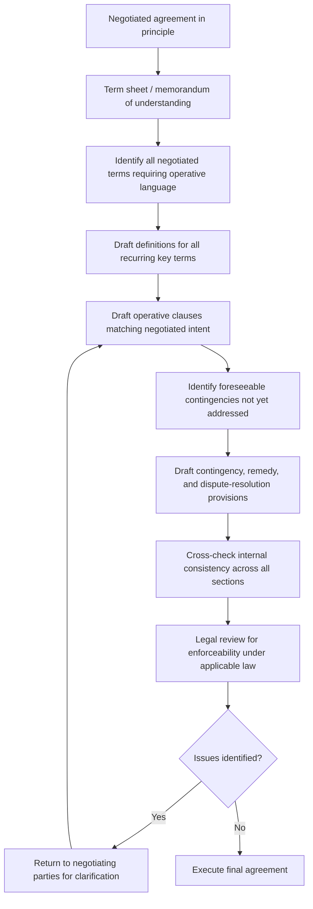

## Drafting Clear and Enforceable Agreements

### Overview

Drafting clear and enforceable agreements is the mechanism by which a negotiated understanding is converted into a durable, legally operative instrument. A negotiation can produce a genuinely integrative, mutually satisfactory outcome and still fail in practice if the resulting document is ambiguous, incomplete, or unenforceable, making drafting quality a direct determinant of whether negotiated value is actually realized during implementation. This topic bridges negotiation theory (interest alignment, agreement structure) and contract-drafting practice (legal enforceability, risk allocation).

### Core Drafting Objectives

**Fidelity to Negotiated Intent**

The primary drafting objective is ensuring the written instrument accurately reflects what was actually agreed, not merely what was discussed. Ambiguity between the parties' understanding at the table and the document's actual language is a leading cause of post-agreement disputes, particularly when agreement was reached verbally or via summarized term sheets before full drafting.

**Enforceability**

A clear agreement is not automatically an enforceable one. Enforceability requires satisfying applicable legal requirements for contract formation (offer, acceptance, consideration, capacity, legality of purpose, depending on jurisdiction) and avoiding drafting defects (vagueness, illusory promises, unconscionable terms) that a court or arbitrator could use to void or reform the agreement.

**Completeness (Gap-Filling)**

Well-drafted agreements anticipate foreseeable future states and specify how they will be handled, rather than relying on later renegotiation or default legal rules that may not reflect either party's actual preference.

**Clarity and Precision**

Clear drafting minimizes the scope for divergent interpretation, reducing both the likelihood of dispute and the cost/uncertainty of resolving any dispute that does arise.

### Structural Components of a Well-Drafted Agreement

| Component | Function |
| --- | --- |
| Recitals/Preamble | States context and purpose; can aid interpretation but is typically not itself operative/binding |
| Definitions section | Fixes precise meaning for key terms used repeatedly, reducing ambiguity and drafting length |
| Operative/substantive clauses | The core obligations, rights, and conditions each party is bound by |
| Representations and warranties | Statements of fact each party relies on in entering the agreement, allocating risk if the statement proves false |
| Conditions precedent/subsequent | Events that must occur before an obligation arises or that terminate an obligation |
| Term and termination | Duration of the agreement and the conditions/process for ending it |
| Dispute resolution clause | Specifies the forum and method (litigation, arbitration, mediation) for resolving disagreements |
| Boilerplate/general provisions | Standard clauses (governing law, entire agreement, severability, notices, assignment) that govern the agreement's legal operation |
| Signature block | Formalizes execution and, in many jurisdictions, is a required element of enforceability |

### Common Sources of Ambiguity and Drafting Failure

**Vague or Undefined Terms**

Terms like "reasonable efforts," "material," "promptly," or "as needed" are frequently disputed because they lack an objective, verifiable standard. Where such terms are unavoidable, best practice is to supplement them with a defined standard (e.g., "reasonable efforts, meaning at minimum the actions specified in Schedule A") or an objective proxy (e.g., replacing "promptly" with a specific number of business days).

**Internal Inconsistency**

Contradictions between different sections of the same document (e.g., a definitions section and a later clause using the same term differently, or a schedule/exhibit that conflicts with the main body) create interpretive uncertainty and are a common source of litigation. Drafting review should specifically cross-check defined terms against every instance of their use.

**Silence on Foreseeable Contingencies**

Failing to address common contingencies (delay, force majeure, change of control, breach and cure periods, dispute escalation) leaves the parties dependent on default legal rules or ad hoc renegotiation, which may not reflect either party's actual risk preference, particularly under time pressure post-breach.

**Illusory or Unenforceable Promises**

A promise that gives one party unfettered, essentially unconstrained discretion (e.g., "Party A will perform such services as it deems appropriate") may be found illusory, lacking the mutuality of obligation required for enforceable consideration in many contract-law systems.

**Ambiguous Integration/Entire Agreement Clauses**

An "entire agreement" (integration) clause states that the written document supersedes prior negotiations, discussions, and side agreements. Its absence, or poor drafting of its scope, can leave the parties exposed to claims based on pre-contractual statements or side letters that one party believed were superseded.

### The Negotiation-to-Drafting Handoff

### Risk-Allocation Drafting Techniques

**Representations, Warranties, and Covenants**

- *Representations*: statements of fact as of a specific point in time (e.g., at signing), on which the other party is entitled to rely.
- *Warranties*: promises that a particular fact is and will remain true, often paired with representations as "representations and warranties," providing a remedy basis (e.g., indemnification) if false.
- *Covenants*: ongoing promises to do or refrain from doing something throughout the agreement's term, distinct from a one-time factual representation.

**Conditions Precedent and Subsequent**

Explicitly conditioning an obligation on a specified event's occurrence (condition precedent) or terminating an obligation upon a specified event (condition subsequent) allocates the risk of that event's non-occurrence to a specific party by design, rather than leaving it to post-hoc interpretation.

**Limitation of Liability and Indemnification Clauses**

Caps on damages, exclusions of consequential/indirect damages, and indemnification obligations (one party compensating the other for specified categories of loss) are standard mechanisms for allocating financial risk of future disputes or third-party claims, and are frequently among the most heavily negotiated boilerplate provisions precisely because of their direct financial consequence.

**Force Majeure Clauses**

Specifies which categories of extraordinary, unforeseeable events (e.g., natural disaster, war, government action) excuse performance, and the process for invoking this excuse (notice requirements, mitigation obligations). Drafting precision matters significantly here: courts in many jurisdictions interpret force majeure clauses narrowly, applying them only to the specific categories of events enumerated rather than to unlisted analogous events.

### Dispute Resolution Clause Design

| Mechanism | Characteristics |
| --- | --- |
| Litigation | Public process, formal rules of evidence/procedure, appealable, generally slower and more costly |
| Arbitration | Private, typically faster, limited appeal rights, arbitrator(s) selected by parties or a named institution, award generally enforceable across jurisdictions under relevant international conventions |
| Mediation (often as escalation step before arbitration/litigation) | Non-binding, facilitated negotiation aimed at settlement; frequently drafted as a mandatory first step ("multi-tier" or "escalation" clause) before either party may initiate arbitration or litigation |
| Expert determination | Binding resolution of a specific technical/factual question (e.g., valuation) by a named neutral expert, narrower in scope than arbitration |

**Choice of Law and Forum Selection**

Specifying which jurisdiction's substantive law governs interpretation, and which court or arbitral seat has jurisdiction, reduces the risk of costly, outcome-uncertain jurisdictional disputes arising after a substantive disagreement has already occurred. [Inference] Standard drafting practice generally recommends addressing governing law and forum selection explicitly even when the parties consider a dispute unlikely, precisely because the cost of specifying this in advance is low relative to the cost of litigating jurisdiction after a dispute has already arisen.

### Drafting Clarity Techniques

- **Active voice and identified actors**: "Party A shall deliver the goods by [date]" is clearer than passive constructions that obscure who bears the obligation.
- **Consistent terminology**: using a single defined term consistently, rather than varying near-synonyms (e.g., alternating between "Agreement," "Contract," and "this document" for the same referent), reduces interpretive ambiguity.
- **Numbered/structured obligations**: breaking compound obligations into discrete, separately numbered sub-clauses makes each individual obligation and its associated remedy easier to identify and enforce.
- **Objective, measurable standards over subjective language**: replacing subjective qualifiers with measurable criteria wherever feasible (e.g., specific delivery timeframes, quantified performance metrics, defined acceptance criteria) reduces reliance on future interpretation or expert testimony about intent.

### Enforceability Considerations by Contract Element

**Consideration and Mutuality**

Most common-law jurisdictions require each party to provide something of legal value (consideration) for a contract to be enforceable; a one-sided promise with no corresponding obligation risks unenforceability as an illusory or gratuitous promise, distinct from civil-law systems where consideration is generally not a formation requirement. [Unverified] Because contract-formation requirements vary meaningfully by jurisdiction, drafting practices should be confirmed against the specific governing law selected for the agreement rather than assumed universal.

**Capacity and Authority**

Enforceability requires that signatories had legal capacity and, for organizational parties, actual authority to bind the entity; drafting practice commonly addresses this via signature-authority representations and, for higher-stakes agreements, verification of corporate authorizing resolutions.

**Unconscionability and Public Policy Limits**

Even a clearly drafted term may be unenforceable if a court finds it unconscionable (grossly one-sided, particularly where bargaining power was highly asymmetric) or contrary to public policy (e.g., certain non-compete or penalty clauses in specific jurisdictions), meaning clarity of drafting does not by itself guarantee enforceability of every drafted term.

### Practical Application Exercise

**Example**

A supply agreement negotiated with an integrative outcome (extended payment terms in exchange for a volume commitment) can fail if poorly drafted:

- **Poor draft**: "Buyer will purchase a reasonable volume of goods, and Seller will provide flexible payment terms." — Both key terms ("reasonable volume," "flexible payment terms") are vague, non-verifiable, and could each independently support a breach claim by either party with no objective standard for resolution.
- **Improved draft**: "Buyer shall purchase not less than 10,000 units per calendar quarter (the 'Minimum Volume Commitment'). In consideration of the Minimum Volume Commitment, Seller shall extend payment terms of net 60 days from invoice date for all Purchase Orders submitted under this Agreement." — Both obligations are quantified, the consideration linkage between them is explicit, and the standard for breach (falling below 10,000 units, or invoicing outside the 60-day term) is objectively verifiable.
- **Added contingency handling**: A subsequent clause specifying the remedy if the Minimum Volume Commitment is missed in a given quarter (e.g., cure period, and only after repeated shortfall, reversion to standard net-30 terms) converts a foreseeable risk into a pre-agreed, non-disputed process rather than a point of future renegotiation or dispute.

### Related Topics

- Representations, Warranties, and Covenants: Structural Differences and Remedies
- Multi-Tier Dispute Resolution Clause Design (Mediation-to-Arbitration Escalation)
- Force Majeure Clause Drafting and Narrow Judicial Interpretation
- Consideration and Contract Formation Requirements Across Legal Systems
- Term Sheets and Memoranda of Understanding as Pre-Drafting Instruments
- Limitation of Liability and Indemnification Clause Negotiation
- Choice of Law and Forum Selection Clause Strategy
- Post-Signing Contract Management and Implementation Monitoring