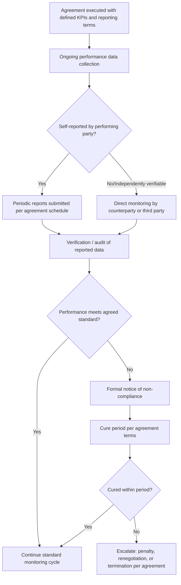

## Monitoring Compliance and Performance

### Overview

Monitoring compliance and performance is the post-agreement process of verifying that negotiated obligations are actually being fulfilled as drafted, and of tracking whether the agreement is delivering its intended value over time. Negotiation theory treats agreement execution as a distinct phase from agreement formation: an agreement that was well-negotiated and well-drafted (see companion topic: Drafting Clear and Enforceable Agreements) can still fail to deliver value if performance is not systematically monitored, deviations are not detected early, and non-compliance is not addressed through a defined process rather than ad hoc reaction.

### Why Monitoring Is a Distinct Negotiation-Theory Concern

- **Information asymmetry persists post-signing**: The same information asymmetries that shaped the negotiation itself often continue into the implementation phase (e.g., a supplier's actual production costs, a licensee's actual usage volume), meaning monitoring is frequently the only mechanism by which one party can verify the other's compliance with obligations that are not self-evidently observable.
- **Incentive misalignment can emerge post-agreement**: Even a genuinely value-maximizing agreement at signing can create incentives for opportunistic under-performance during implementation (a form of moral hazard), particularly where monitoring costs are high or verification is difficult, making monitoring design itself a negotiated and drafted element of the agreement.
- **Relationship and reputation effects compound over time**: As discussed under Longitudinal Studies of Negotiated Relationships, how compliance issues are detected and handled shapes trust trajectories and the likelihood of successful renegotiation or renewal, meaning the monitoring process itself is a relationship-management input, not merely a technical/legal one.

### Core Monitoring Design Elements

**Performance Metrics and Key Performance Indicators (KPIs)**

Well-designed agreements specify objective, measurable performance criteria at the drafting stage precisely so that compliance can later be verified without relying on subjective judgment. Common categories:

| Metric Category | Example |
| --- | --- |
| Volume/quantity | Units delivered, minimum purchase volume met |
| Timeliness | On-time delivery rate, response time to service requests |
| Quality | Defect rate, service-level uptime percentage |
| Financial | Payment timeliness, royalty/revenue reporting accuracy |
| Regulatory/legal | Compliance with specified certifications, audit findings |

**Reporting Obligations**

Agreements commonly specify who reports what, how often, and in what format (e.g., quarterly sales reports for royalty calculation, monthly service-level reports). Reporting obligations shift some monitoring burden onto the performing party itself, reducing the monitoring party's independent verification cost, though this also creates a self-reporting reliability question addressed by audit rights.

**Audit and Inspection Rights**

A contractual right for one party (or an independent third party) to inspect records, facilities, or data to independently verify self-reported performance. Audit clauses typically specify scope, frequency, notice requirements, and cost allocation (who pays for the audit, and whether cost shifts to the audited party if a material discrepancy is found).

**Escalation and Cure Provisions**

Rather than treating any deviation as an immediate breach, well-designed agreements typically specify a graduated response: notice of non-compliance, a defined cure period, and only thereafter progressively more severe remedies (penalty, price adjustment, termination right), converting monitoring findings into a predictable process rather than an ad hoc negotiation each time an issue arises.

### Monitoring Process Architecture

### Monitoring Mechanisms by Agreement Type

**Commercial/Supply Agreements**

Typically monitored via delivery records, quality inspection reports, and invoice-versus-purchase-order reconciliation; audit rights are common where volume commitments or exclusive-pricing terms create an incentive for the reporting party to understate actual performance.

**Licensing and Royalty Agreements**

Monitoring centers heavily on usage/sales self-reporting combined with audit rights, since the licensor typically cannot directly observe the licensee's actual sales or usage volume without either reporting cooperation or an independent audit; royalty audit clauses are consequently among the most heavily negotiated provisions in licensing agreements precisely because of this structural information asymmetry.

**International Treaties and Trade Agreements**

Monitoring at the state level typically relies on a combination of self-reporting to a treaty secretariat or oversight body, periodic peer or independent review, and, in some regimes, a formal dispute-settlement mechanism triggered by an alleging party (as in the WTO's dispute settlement system referenced under Historic Trade and Treaty Negotiations), since no supranational enforcement authority can compel direct inspection in most treaty contexts absent specific verification provisions the parties negotiated in advance (as with certain arms-control verification regimes).

**Labor and Collective Bargaining Agreements**

Monitored via grievance procedures (a structured process for raising and escalating alleged violations), scheduled labor-management committee reviews, and, in many jurisdictions, a defined arbitration step for unresolved grievances, functioning as a specialized version of the general escalation/cure architecture described above.

### Statistical and Analytical Approaches to Compliance Monitoring

**Variance Analysis**

Comparing actual performance against the agreed baseline or target to quantify the magnitude and direction of any deviation, often the first analytical step before determining whether a deviation is material enough to trigger formal notice.

$$\text{Variance} = \frac{\text{Actual Performance} - \text{Target Performance}}{\text{Target Performance}} \times 100\%$$

**Trend Analysis**

Because a single-period deviation may reflect normal variability rather than systematic non-compliance, monitoring frameworks commonly track performance across multiple reporting periods to distinguish a one-off shortfall from a persistent or worsening pattern, which is typically weighted more heavily in escalation decisions.

**Sampling-Based Audit Design**

Where full-population verification (e.g., reviewing every transaction) is cost-prohibitive, audit rights are frequently exercised via statistical sampling, with the audit clause specifying the sampling methodology, materiality threshold for extrapolating findings, and the cost-shifting trigger (commonly, a discrepancy exceeding a specified percentage shifts audit cost to the non-compliant party).

### Behavioral and Relational Considerations in Monitoring

**Monitoring Intensity as a Relationship Signal**

[Inference] Excessively intrusive or frequent monitoring, even when contractually permitted, can itself function as a distrust signal that damages the counterpart relationship, a consideration generally weighed in the negotiation-theory literature on long-term relational contracts against the verification benefits of intensive monitoring; the specific optimal monitoring intensity is context-dependent and not reducible to a universal formula.

**Distinguishing Willful Non-Compliance from Capacity Failure**

Effective monitoring processes generally distinguish between a counterpart's inability to perform (e.g., a genuine capacity or external-shock constraint) and unwillingness to perform (opportunistic under-performance), since the theoretically appropriate response differs: capacity failures may warrant renegotiation or accommodation, whereas willful non-compliance more directly implicates the escalation and remedy provisions of the agreement.

**Renegotiation Triggers from Monitoring Data**

Sustained monitoring may reveal that the original agreement's terms no longer reflect current conditions (e.g., a fixed-price commitment made unsustainable by a subsequent market shift), functioning as a data-driven trigger for a renegotiation conversation rather than a strict compliance dispute, connecting monitoring practice directly to the event-history/renegotiation-hazard concepts discussed under Longitudinal Studies of Negotiated Relationships.

### Common Monitoring Design Failures

- **Metrics that are unmeasurable or unverifiable as drafted**: a KPI referencing an undefined or subjective standard (see also: vague terms under Drafting Clear and Enforceable Agreements) cannot be effectively monitored regardless of monitoring process quality.
- **No defined escalation path**: absent a specified notice-and-cure sequence, each instance of non-compliance risks becoming an ad hoc, high-conflict negotiation rather than a predictable contractual process.
- **Asymmetric monitoring capability without corresponding audit rights**: where only one party can practically observe true performance, the absence of audit or verification rights for the other party leaves that party structurally dependent on the counterpart's voluntary, unverified self-reporting.
- **Monitoring data collected but not acted upon**: performance data that is gathered but not systematically reviewed against defined thresholds fails to generate the early-warning benefit monitoring is designed to provide, effectively converting a proactive compliance system into a passive record with no operational function.

### Practical Application Exercise

**Example**

A software licensing agreement includes a usage-based royalty structured as $0.50 per active user per month, self-reported quarterly by the licensee, with an audit right permitting the licensor to inspect usage logs once per year at its own cost, shifting to the licensee's cost if the audit reveals underreporting exceeding 5%.

1. **Monitoring baseline**: Licensor tracks quarterly self-reported active-user figures against the prior quarter and against any independently observable proxy (e.g., publicly reported user-growth figures for the licensee's product, where available) to identify plausible variance before triggering a costly formal audit.
2. **Trend flag**: A single quarter's reported figure below the prior trend may not itself justify an audit; a two-quarter consecutive decline inconsistent with other available market signals is treated as a stronger trigger for exercising the audit right.
3. **Audit exercise and outcome**: If the annual audit reveals reported usage was understated by 8% (exceeding the 5% materiality threshold), the audit cost shifts to the licensee per the negotiated clause, and the underpayment plus any specified interest or penalty becomes due, following the escalation terms defined at drafting rather than requiring fresh negotiation over the remedy itself.
4. **Relational follow-up**: Because the discrepancy exceeded the pre-agreed materiality threshold, the licensor's response follows the contractually specified process rather than an ad hoc reaction, preserving a predictable relationship dynamic even where the underlying finding is adversarial.

### Related Topics

- Royalty and Usage Audit Clause Design in Licensing Agreements
- Notice-and-Cure Escalation Structures in Commercial Contracts
- Moral Hazard and Information Asymmetry in Post-Agreement Performance
- Grievance and Arbitration Procedures in Labor Agreement Compliance
- Statistical Sampling Methods for Contract Compliance Audits
- Treaty Verification Regimes and International Dispute Settlement Mechanisms
- Renegotiation Triggers Arising from Performance Monitoring Data
- Trust and Monitoring Intensity Trade-offs in Long-Term Relational Contracts