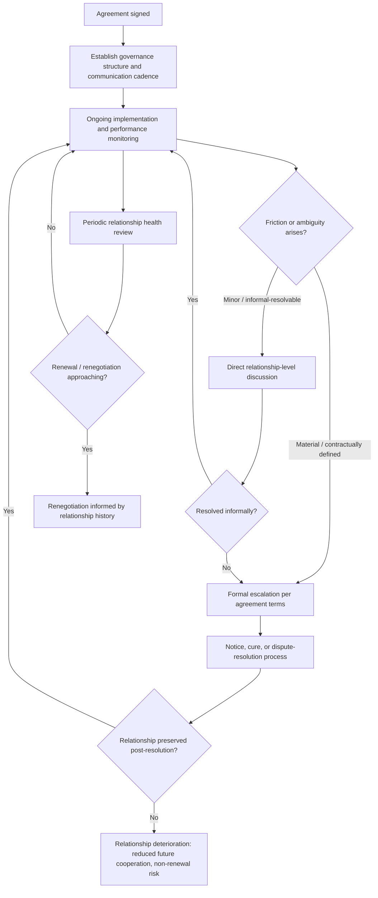

## Managing the Relationship After the Deal Closes

### Overview

Managing the relationship after the deal closes is the discipline of sustaining, and often strengthening, the interpersonal and organizational relationship between negotiating parties once the formal agreement has been signed and implementation has begun. Negotiation theory distinguishes this phase from both deal-making (reaching agreement) and compliance monitoring (verifying performance against agreed terms): a technically compliant agreement can still deteriorate relationally, undermining renewal prospects, informal cooperation, and the accumulation of trust that enables future integrative value creation.

### Why Post-Deal Relationship Management Is a Distinct Concern

- **Economic outcome and relational outcome are only moderately correlated**: As established under Measuring Negotiation Outcomes and Effectiveness, a party can achieve a favorable economic settlement yet report low relational satisfaction, meaning contract compliance alone does not guarantee relationship health.
- **Relationships evolve after signing, not just during negotiation**: The Longitudinal Studies of Negotiated Relationships framework establishes that trust follows a trajectory shaped by post-agreement events (how disputes are handled, how contingencies are managed) rather than being fixed at the moment of signing.
- **Most agreements require ongoing interaction, not one-time execution**: Contracts involving supply, licensing, service delivery, joint ventures, or diplomatic treaties all require sustained coordination well beyond signature, making relationship quality a direct input into implementation efficiency, not merely a "soft" consideration alongside it.

### Core Post-Deal Relationship Management Functions

**Governance Structure Establishment**

Many complex agreements formally establish an ongoing governance mechanism at signing: a joint steering committee, a designated relationship manager on each side, or scheduled business-review meetings. This converts relationship management from an implicit, informal expectation into a structured, recurring institutional process with defined participants, cadence, and agenda scope.

**Communication Cadence and Channels**

Establishing regular, predictable communication (scheduled check-ins, status reports, escalation contacts) reduces the likelihood that minor issues accumulate unaddressed until they trigger a formal dispute, and provides a lower-stakes forum for addressing friction before it reaches the threshold of contractual escalation described under Monitoring Compliance and Performance.

**Expectation Alignment Beyond Contract Text**

Because no drafted agreement can specify every contingency (see Drafting Clear and Enforceable Agreements), ongoing relationship management includes continuously aligning expectations on matters the contract is silent or ambiguous on, ideally resolving these informally before they harden into a positional dispute.

**Early Issue Identification and Informal Resolution**

Relationship-management practice generally favors addressing performance or relational friction informally and early, reserving the formal notice-and-cure or dispute-resolution mechanisms in the agreement for issues that cannot be resolved through direct relationship-level communication, since invoking formal mechanisms prematurely can itself damage the relationship even when contractually justified.

### Post-Deal Relationship Management Lifecycle

### Trust Maintenance and Repair

**Trust as an Accumulating, Not Fixed, Asset**

Consistent with the trust-trajectory modeling described under Longitudinal Studies of Negotiated Relationships, trust built during negotiation is not self-sustaining; it requires reinforcement through consistent post-signing behavior (reliability, transparency, responsiveness) and is vulnerable to erosion from unaddressed friction, missed commitments, or perceived opportunism during implementation.

**Trust Repair After a Breach or Dispute**

Where a compliance issue or dispute has occurred, negotiation and organizational-behavior literature on trust repair generally emphasizes: transparent acknowledgment of the issue, a credible and specific corrective action plan, and consistent follow-through demonstrated over multiple subsequent interactions, rather than a single reassurance or apology. [Inference] The relative effectiveness of specific trust-repair approaches (e.g., apology versus structural/procedural changes) is an active area of organizational-behavior research and appears to depend on factors such as whether the breach was perceived as a competence failure versus an integrity failure, though this distinction is a general finding from the broader trust-repair literature rather than a claim specific to any single study cited here.

**Reciprocity Norms in Ongoing Relationships**

As discussed under Meta-Analytic Findings on Negotiation Tactics, concessions and cooperative behavior tend to be reciprocated; in an ongoing post-deal relationship, this dynamic extends beyond the original negotiation into implementation-phase behavior; for example, flexibility extended by one party during a counterpart's genuine capacity constraint may be reciprocated with goodwill during a future renegotiation, functioning as a relational investment rather than a purely altruistic accommodation.

### Distinguishing Relationship Management from Contract Enforcement

| Dimension | Contract Enforcement Focus | Relationship Management Focus |
| --- | --- | --- |
| Primary tool | Notice, cure periods, formal dispute mechanisms | Direct communication, informal negotiation, governance meetings |
| Time horizon | Addresses the specific instant dispute | Addresses long-run cooperation and renewal prospects |
| Success metric | Compliance with drafted terms | Trust level, willingness to renew/expand relationship |
| Risk of overuse | Excessive formal enforcement can damage trust even when contractually justified | Excessive informal accommodation without any enforcement can enable unaddressed opportunism |

[Inference] Effective post-deal management generally requires balancing these two focuses rather than treating them as substitutes: relying solely on relationship goodwill without any enforcement mechanism risks unaddressed non-compliance, while relying solely on formal enforcement without relationship investment risks a compliant but low-trust, low-cooperation relationship unlikely to survive renewal or adapt well to unforeseen contingencies.

### Renewal and Renegotiation as Relationship Outcomes

**Relationship History as an Input to Renegotiation**

As modeled in event-history/survival analysis approaches to contract renewal (see Longitudinal Studies of Negotiated Relationships), the accumulated relationship history, not just the current contract terms, is a significant predictor of whether a relationship proceeds to renewal, renegotiation with improved terms, or termination.

**Using Relationship Equity in Renegotiation**

A relationship characterized by high accumulated trust and a track record of good-faith issue resolution can itself function as a form of leverage or facilitation in renegotiation, potentially enabling more integrative, less positional renegotiation dynamics than would be available between parties with no relationship history or prior friction.

### Organizational Practices Supporting Post-Deal Relationship Management

- **Designated relationship owner**: assigning continuity of responsibility for the relationship (rather than treating post-signing management as an unassigned residual task after the deal team disbands) reduces the risk that relationship issues go unmonitored due to unclear ownership.
- **Scheduled relationship health reviews**: periodic (e.g., quarterly or annual) structured reviews assessing both compliance status and relationship-quality indicators (e.g., a lightweight internal version of the Subjective Value Inventory dimensions discussed under Measuring Negotiation Outcomes and Effectiveness), rather than relying solely on ad hoc, dispute-triggered check-ins.
- **Knowledge transfer at deal-team handoff**: because the negotiating team and the implementation/relationship-management team are frequently different individuals within an organization, documenting negotiated intent, key sensitivities, and any informal understandings (distinct from the formal contract text) reduces the risk that relationship-relevant context is lost at handoff.

### Practical Application Exercise

**Example**

A multi-year strategic supplier partnership, following a well-negotiated and well-drafted agreement (see prior topics in this chapter), can still be at relationship risk if:

1. **No governance structure was established**: without a scheduled quarterly business review, the first time either party's leadership engages directly post-signing is when a compliance issue has already escalated to formal notice, foreclosing the opportunity for earlier informal resolution.
2. **Remediation**: Establishing a joint steering committee with representatives from both organizations, meeting quarterly to review performance data (drawing on the KPI and reporting structures from Monitoring Compliance and Performance) alongside open discussion of any emerging friction, creates a standing forum for informal resolution before issues reach contractual escalation thresholds.
3. **Trust-repair scenario**: If a genuine, disclosed capacity shortfall causes a temporary breach, a relationship-management response emphasizing transparent disclosure, a credible recovery plan, and follow-through, paired with only measured (not maximal) invocation of contractual remedies, is more likely to preserve the relationship for a value-creating renewal than immediate, maximal enforcement of every available contractual penalty.
4. **Renewal linkage**: At the contract's renewal point, the accumulated relationship history from this governance and trust-repair process becomes a direct input into whether renegotiation proceeds on more integrative, trust-based terms or reverts to a more positional, distrust-driven negotiation resembling the original deal-formation stage.

### Related Topics

- Trust Repair Following a Contractual Breach or Dispute
- Joint Governance Structures and Steering Committee Design
- Relationship Equity as Leverage in Renegotiation
- Distinguishing Competence Failures from Integrity Failures in Trust Erosion
- Deal-Team-to-Implementation-Team Knowledge Transfer Practices
- Reciprocity Norms in Ongoing Post-Agreement Relationships
- Balancing Formal Enforcement and Informal Relationship Investment
- Periodic Relationship Health Review Design and Metrics