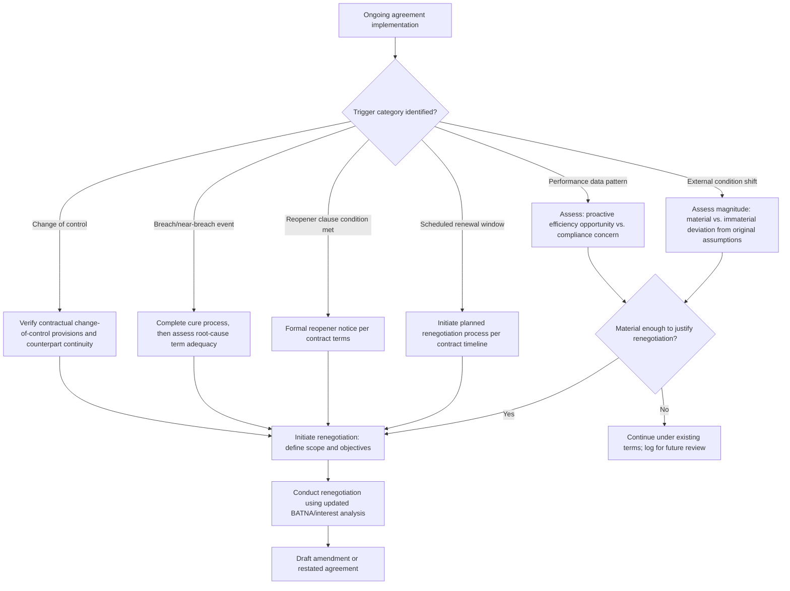

## Renegotiation Triggers and Processes

### Overview

Renegotiation is the process of revisiting and modifying the terms of an existing agreement before its natural expiration or at a scheduled renewal point, typically because changed circumstances, discovered inefficiencies, or relationship developments have made the original terms suboptimal, unsustainable, or a poor fit for current conditions. Renegotiation is theoretically distinct from initial negotiation because it occurs against the backdrop of an existing relationship, a known performance history, and an existing legal baseline (the current contract terms function as a powerful anchor and status quo reference point), all of which shape the process differently than negotiating from a blank slate.

### Categories of Renegotiation Triggers

**Changed External Conditions**

Market price shifts, regulatory changes, exchange rate movements, or supply-chain disruptions can render originally efficient terms (e.g., a fixed price locked in at signing) misaligned with current economic reality for one or both parties, creating pressure to reopen terms even absent any breach or dispute.

**Performance and Compliance Data**

As discussed under Monitoring Compliance and Performance, sustained monitoring can reveal that agreed KPIs or volume commitments no longer reflect achievable or optimal levels, functioning as a data-driven trigger distinct from a compliance dispute; this is a proactive, often mutually initiated renegotiation rather than an adversarial one.

**Relationship and Trust Developments**

Accumulated trust or, conversely, accumulated friction (see Managing the Relationship After the Deal Closes) can itself motivate renegotiation, either to formalize an improved, more integrative arrangement warranted by a strong track record, or to address structural terms that have repeatedly generated friction even where each individual instance was technically resolved.

**Scheduled Renewal Points**

Many agreements specify a fixed term with an explicit renewal or renegotiation window, converting renegotiation from an exceptional event into a planned, cyclical process; this is the most structurally predictable trigger category, since both parties know in advance that terms will be revisited.

**Contractually Specified Reopener Clauses**

Some agreements explicitly build in a "reopener": a clause permitting either party to trigger renegotiation of specified terms (e.g., pricing) upon a defined condition (e.g., a commodity index moving beyond a specified band), formalizing what would otherwise be an ad hoc renegotiation trigger into a pre-agreed contractual mechanism.

**Breach or Near-Breach Events**

A significant compliance failure, even where formally cured under the notice-and-cure provisions described under Monitoring Compliance and Performance, may reveal that the underlying terms (not just one party's performance) were poorly calibrated, prompting a broader renegotiation of the terms themselves rather than a narrow remedy for the specific breach.

**Change of Control or Structural Changes**

A merger, acquisition, or significant organizational restructuring on either side can trigger renegotiation, both because such changes are frequently a specified contractual trigger (a change-of-control clause) and because the negotiating relationship itself may need to be reestablished with new counterpart representatives.

### Renegotiation Trigger Identification and Response Framework

### Structural Differences Between Initial Negotiation and Renegotiation

| Dimension | Initial Negotiation | Renegotiation |
| --- | --- | --- |
| Anchor/reference point | No prior agreement; anchors set by market data or opening offers | Existing contract terms function as a powerful status-quo anchor |
| BATNA | Often based on external alternatives only | Includes the option of continuing under existing (possibly now-suboptimal) terms as an explicit alternative |
| Information available | Limited by pre-relationship information asymmetry | Enriched by actual performance history and monitoring data |
| Relationship stakes | Establishing a new relationship | Preserving (or ending) an existing, potentially valuable relationship |
| Process formality | Often extensive, structured due diligence | Can range from lightweight (minor amendment) to as extensive as original negotiation (major restructuring) |

**BATNA Reassessment in Renegotiation**

A critical renegotiation-specific analytical step is that each party's BATNA now explicitly includes "continue under the current contract as-is" as one alternative, which was not available during the original negotiation (where the BATNA was necessarily an external alternative, since no existing agreement yet existed). This reframes the ZOPA analysis: renegotiation will only succeed where the proposed new terms improve on the status-quo-continuation BATNA for both parties, not merely where they would have been mutually acceptable in a first negotiation.

$$\text{Renegotiation ZOPA exists only if: } \exists \, x : v_A(x) > v_A(\text{status quo}) \text{ and } v_B(x) > v_B(\text{status quo})$$

### Renegotiation Process Models

**Amendment-Based Renegotiation**

Narrow-scope renegotiation addressing specific terms (e.g., a pricing adjustment) via a formal contract amendment, leaving the bulk of the original agreement's structure intact. Common for reopener-clause-triggered and minor performance-driven renegotiations.

**Full Restatement Renegotiation**

Comprehensive renegotiation resulting in a wholly restated agreement, typically used for major scheduled renewals, significant relationship restructuring, or where accumulated minor amendments have made the original document unwieldy and internally inconsistent.

**Interest-Based Renegotiation**

Applying integrative-bargaining principles (see foundational negotiation-theory topics) to renegotiation specifically: rather than treating renegotiation as a purely distributive reallocation of the same fixed pie, parties explore whether changed conditions have created new integrative trade opportunities not present or not recognized during the original negotiation (e.g., a market shift that increased the value of a previously minor contract term to one party, creating a new trade opportunity).

### Behavioral and Strategic Considerations Specific to Renegotiation

**The "Hold-Up" Risk**

[Inference] Negotiation and contract theory literature generally recognizes a risk in renegotiation contexts where one party, having made a relationship-specific investment that cannot easily be redeployed elsewhere (e.g., specialized equipment built to serve one specific counterpart), becomes vulnerable to the counterpart using renegotiation to extract better terms by leveraging the investing party's reduced BATNA; well-designed original contracts often anticipate this via specified reopener terms or pricing formulas precisely to reduce this vulnerability rather than leaving the extraction risk to be resolved ad hoc.

**Anchoring Effects of Existing Terms**

The existing contract price or term itself functions as a strong anchor in renegotiation discussions (consistent with the anchoring findings discussed under Meta-Analytic Findings on Negotiation Tactics), meaning the party proposing a change from the status quo often bears an persuasive burden the original negotiation did not require, since deviation from an established anchor is psychologically and rhetorically more difficult to justify than an initial opening position.

**Relationship History as Both Asset and Constraint**

A strong relationship history (see Managing the Relationship After the Deal Closes) can facilitate more open, integrative renegotiation dialogue, but can also create pressure toward maintaining status quo terms out of relationship-preservation concern even where a more substantial renegotiation would better serve both parties' current interests, a tension requiring explicit management rather than passive deference to relationship comfort.

### Common Renegotiation Process Failures

- **Treating renegotiation as purely distributive**: failing to explore whether changed conditions have created new integrative trade opportunities, defaulting to a zero-sum reallocation frame inherited from the original negotiation's structure even where it no longer fits current conditions.
- **Failing to update BATNA analysis**: continuing to negotiate as though the pre-existing external BATNA still applies, without explicitly incorporating the "continue under current terms" alternative into the analysis.
- **Ambiguous or absent reopener trigger conditions**: where a reopener clause's triggering condition is vaguely drafted (see drafting-clarity principles under Drafting Clear and Enforceable Agreements), disputes can arise over whether renegotiation was properly triggered at all, before the substantive renegotiation can even begin.
- **Renegotiating under acute time pressure without contingency planning**: initiating renegotiation only after a crisis has already emerged (e.g., an imminent breach) rather than proactively at an identified trigger point, compressing the available time for careful interest analysis and increasing the risk of a suboptimal, pressure-driven outcome.

### Practical Application Exercise

**Example**

A multi-year raw-material supply contract with a fixed price was signed two years into a five-year term when a significant, sustained commodity price increase makes the fixed price unsustainable for the supplier.

1. **Trigger identification**: This is a changed-external-conditions trigger; the agreement should be checked for an existing reopener clause tied to a commodity index (see Drafting Clear and Enforceable Agreements for reopener drafting practice).
2. **BATNA reassessment**: The buyer's BATNA now explicitly includes "continue at the current fixed price" as an available alternative (highly favorable to the buyer), while the supplier's BATNA may include supply disruption risk if it cannot sustain unprofitable delivery, an outcome unfavorable to both parties if it results in a forced default rather than a negotiated adjustment.
3. **Integrative reframing**: Rather than a purely distributive renegotiation over price alone, the parties might explore an integrative trade, such as a price adjustment mechanism indexed to the commodity price going forward (reducing the risk of needing to renegotiate again at the next price swing) in exchange for a modest extension of the contract term, addressing both parties' interests (price sustainability for the supplier, continuity certainty for the buyer) rather than a single-issue concession.
4. **Process selection**: Given the scope is limited to pricing mechanism and term length, an amendment-based renegotiation (rather than a full restatement) is likely appropriate, preserving the remainder of the original, well-functioning agreement structure.

### Related Topics

- Reopener Clause Drafting and Trigger-Condition Specification
- BATNA Reassessment Methodology in Renegotiation Contexts
- The Hold-Up Problem and Relationship-Specific Investment Risk
- Integrative Reframing of Distributive Renegotiation Disputes
- Anchoring Effects of Existing Contract Terms in Renegotiation
- Change-of-Control Clauses and Counterpart Continuity Risk
- Amendment-Based vs. Full-Restatement Renegotiation Approaches
- Event-History Modeling of Renegotiation Timing and Hazard