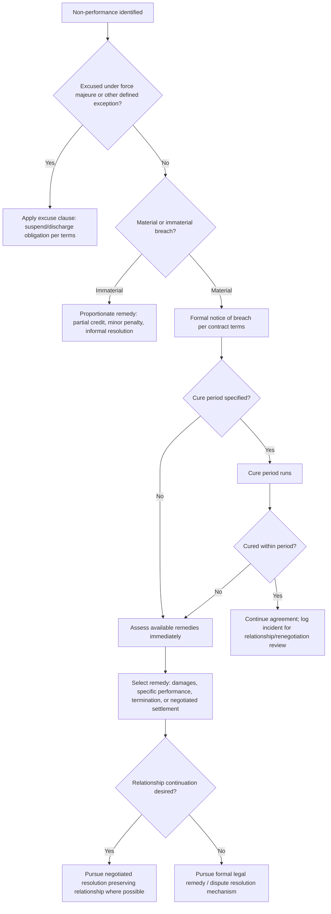

## Handling Breach and Non-Performance

### Overview

Handling breach and non-performance is the process by which parties respond when an agreement's obligations are not fulfilled as drafted, ranging from minor, informally-resolved shortfalls to material breaches triggering formal legal remedies. Negotiation theory treats breach response as a distinct decision point where the parties' choices (immediate strict enforcement, negotiated accommodation, formal dispute escalation) shape both the resolution of the specific incident and the longer-term trajectory of the relationship, connecting directly to the monitoring, relationship-management, and renegotiation frameworks discussed elsewhere in this chapter.

### Classifying Breach and Non-Performance

**Material vs. Immaterial Breach**

Most legal systems and well-drafted contracts distinguish breaches by severity: a material breach substantially undermines the purpose or value of the agreement for the non-breaching party, typically justifying termination or significant remedy, whereas an immaterial (minor) breach does not defeat the agreement's essential purpose and typically only justifies a proportionate remedy (e.g., damages) rather than termination. This distinction is frequently defined or illustrated explicitly within the contract itself precisely to reduce disputes over which category a given failure falls into.

**Anticipatory vs. Actual Breach**

- *Anticipatory breach*: one party clearly indicates, before performance is due, that it will not perform (e.g., explicit repudiation or an action making performance impossible), allowing the non-breaching party to treat the contract as breached and pursue remedies immediately rather than waiting for the performance date to pass.
- *Actual breach*: a failure to perform occurs at or after the time performance was due.

**Willful vs. Excused Non-Performance**

Distinguishing deliberate or negligent non-performance from non-performance excused by a contractually defined event (e.g., force majeure, as discussed under Drafting Clear and Enforceable Agreements) is critical because the appropriate response differs substantially: excused non-performance typically suspends or discharges the obligation without penalty, per the specific force majeure or excuse clause, whereas willful or negligent non-performance triggers the agreement's standard breach remedies.

**Partial vs. Total Non-Performance**

Partial non-performance (some but not all contracted obligations fulfilled) often permits a proportionate remedy (e.g., a price reduction reflecting the shortfall), while total non-performance more directly supports termination and full-damages remedies, though the precise line depends on the specific contract terms and applicable law.

### Breach Response Decision Framework

### Remedy Categories

**Damages**

Monetary compensation intended to place the non-breaching party in the position they would have occupied had the contract been performed (expectation damages), or in some systems, to compensate reliance losses or restore benefits conferred (restitution). Contracts frequently pre-specify certain damages via a liquidated damages clause, a pre-agreed amount payable upon a specified breach, designed to avoid the cost and uncertainty of proving actual damages later. [Unverified] Liquidated damages clauses are enforceable in many jurisdictions only if they represent a genuine pre-estimate of likely loss rather than a punitive penalty; the specific enforceability threshold varies by jurisdiction and should be confirmed against applicable law rather than assumed universal.

**Specific Performance**

A court-ordered remedy compelling the breaching party to actually perform the contracted obligation, rather than merely paying damages; generally available only where damages would be inadequate (e.g., the subject matter is unique, such as real property or a one-of-a-kind item), and is used comparatively less frequently than damages across most commercial contract disputes.

**Termination**

Ending the agreement, typically available for material breach or after a specified and unremedied cure period has expired; well-drafted agreements specify the termination process (notice requirements, effective date, post-termination obligations such as data return or transition assistance) to reduce ambiguity at the point of dispute.

**Negotiated Settlement**

Resolving the breach through direct negotiation between the parties rather than invoking formal legal remedies, potentially including a modified performance schedule, a partial concession, or another form of accommodation; frequently preferred where relationship continuation (see Managing the Relationship After the Deal Closes) is valued and the breach does not reflect a fundamental breakdown in trust.

### The Notice-and-Cure Process in Detail

Well-drafted agreements typically specify a structured sequence rather than allowing either party to move directly to termination or litigation upon any breach:

1. **Formal written notice**: specifying the nature of the alleged breach with reference to the specific contract provision violated.
2. **Cure period**: a defined window (e.g., 30 days) during which the breaching party may remedy the failure without further consequence.
3. **Verification of cure**: confirming the breach has actually been remedied, not merely addressed superficially.
4. **Escalation if uncured**: proceeding to the next contractually specified step (further notice, penalty, termination right, or formal dispute resolution) only if the cure period expires without adequate remedy.

[Inference] This structured sequence is generally favored in contract drafting because it converts breach response from an ad hoc, potentially relationship-damaging reaction into a predictable process both parties can anticipate, reducing the risk that a single incident escalates faster or more severely than either party actually intends.

### Strategic Considerations in Choosing a Breach Response

**Cost-Benefit Analysis of Formal Enforcement**

[Inference] Pursuing formal legal remedies (litigation, arbitration) carries direct costs (legal fees, time, management attention) and relational costs (as discussed under Managing the Relationship After the Deal Closes) that should generally be weighed against the value of the specific remedy sought, particularly for lower-value or clearly unintentional breaches, though this is a general strategic consideration rather than a claim that formal enforcement is inappropriate in cases of serious or willful breach.

**Distinguishing Capacity Failure from Opportunism**

As discussed under Monitoring Compliance and Performance, an effective breach response generally first assesses whether non-performance reflects genuine incapacity (e.g., a supplier's supply-chain disruption) versus deliberate opportunism, since the theoretically and relationally appropriate response differs: capacity failures may warrant accommodation or renegotiation (see Renegotiation Triggers and Processes), while clear opportunism more directly supports firm enforcement of available remedies.

**Reputation and Precedent Effects**

A party's response to one breach can function as a signal to the counterpart (and, in repeated-relationship or industry contexts, more broadly) about how future non-performance will be handled; consistently under-enforcing clear breaches may invite further opportunistic non-performance, while consistently over-enforcing minor or excusable failures may damage the relationship and deter future good-faith flexibility from the counterpart.

### Breach in Multi-Party and International Contexts

**Multi-Party Agreements**

Where an agreement involves more than two parties (e.g., a multi-party joint venture or a multilateral treaty), breach by one party raises additional questions regarding whether remaining parties' obligations to each other continue, are suspended, or are affected, typically addressed via specific severability and multi-party breach provisions in well-drafted multi-party agreements.

**International Treaty Non-Compliance**

As referenced under Historic Trade and Treaty Negotiations and Monitoring Compliance and Performance, treaty non-compliance is typically addressed through formal dispute settlement mechanisms specific to the treaty regime (e.g., the WTO's dispute settlement system), since no general supranational enforcement authority exists to directly compel state compliance absent such a specifically negotiated mechanism.

### Common Failures in Handling Breach

- **Escalating immediately to maximal remedy without following the contractually specified process**: undermines the predictability the notice-and-cure structure was designed to provide, and may itself constitute a procedural breach if the contract specifies a mandatory process.
- **Failing to document the breach and response process**: inadequate documentation of notice, cure period, and verification can undermine a party's position if the dispute proceeds to formal resolution, since the burden of demonstrating compliance with the contractual process typically falls on the party invoking a remedy.
- **Treating every breach identically regardless of materiality or intent**: applying a uniform maximal response regardless of whether a breach was minor, excusable, or willful can damage otherwise valuable relationships and is often disproportionate to the actual harm caused.
- **Delaying response to avoid relationship friction**: excessive reluctance to invoke available remedies, even for clear and material breaches, out of relationship-preservation concern can itself invite continued or escalating non-performance, and may in some jurisdictions risk being interpreted as a waiver of the right to enforce the provision in the future.

### Practical Application Exercise

**Example**

A logistics services agreement specifies a 99% on-time delivery rate as a KPI, with a notice-and-cure provision requiring 15 days' written notice and a 30-day cure period before penalty provisions apply.

1. **Identification**: Monitoring data (per Monitoring Compliance and Performance) shows on-time delivery fell to 92% for two consecutive months.
2. **Classification**: This is a partial, likely immaterial-in-isolation breach (a KPI shortfall rather than total non-performance), but the two-month trend suggests it may not be a one-off, excusable event.
3. **Process**: Formal written notice is issued per the contract's 15-day notice requirement, specifying the KPI provision violated and the observed shortfall; the 30-day cure period begins.
4. **Capacity vs. opportunism assessment**: During the cure period, the provider discloses a specific, verifiable equipment failure at one distribution hub as the cause, along with a concrete remediation plan and timeline, supporting a capacity-failure rather than opportunism classification.
5. **Resolution choice**: Given the capacity-failure finding and a otherwise strong performance history, the receiving party chooses a negotiated resolution, accepting the remediation plan and a modest service credit for the shortfall period rather than invoking the full penalty and termination-consideration provisions available for an uncured material breach, preserving the relationship consistent with the trust-repair principles discussed under Managing the Relationship After the Deal Closes.

### Related Topics

- Material vs. Immaterial Breach Classification Standards
- Liquidated Damages Clauses and Penalty-Clause Enforceability Limits
- Notice-and-Cure Process Design and Documentation Practice
- Capacity Failure vs. Opportunistic Non-Performance Assessment
- Specific Performance as a Remedy: Availability and Limitations
- Multi-Party Breach and Severability Provisions
- Treaty Non-Compliance and International Dispute Settlement Mechanisms
- Waiver Risk from Delayed or Inconsistent Breach Enforcement