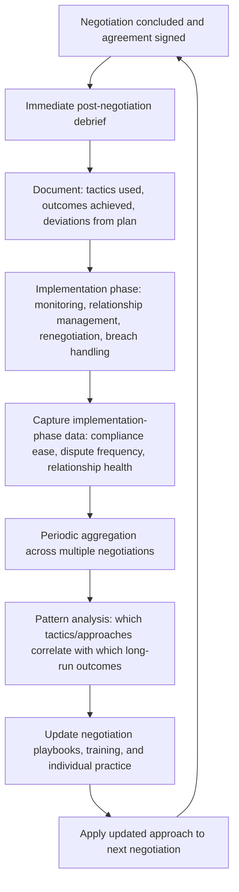

## Feedback Loops for Improving Future Negotiations

### Overview

Feedback loops for improving future negotiations are the structured processes by which organizations and individuals capture, analyze, and apply lessons from completed negotiations and their post-agreement outcomes to improve subsequent negotiation performance. This closes the loop on the full negotiation lifecycle covered in this chapter: outcomes from drafting, monitoring, relationship management, renegotiation, and breach handling are treated not as terminal events but as data inputs into an organizational or individual learning process, directly connecting negotiation practice to the empirical and measurement frameworks discussed under Measuring Negotiation Outcomes and Effectiveness and Longitudinal Studies of Negotiated Relationships.

### Rationale for Systematic Feedback Loops

- **Negotiation skill develops through deliberate practice with feedback, not repetition alone**: Consistent with broader skill-acquisition research, simply conducting many negotiations does not reliably improve performance absent structured reflection connecting specific actions to specific outcomes; unstructured experience risks reinforcing habitual tactics regardless of their actual effectiveness.
- **Post-agreement data reveals information unavailable at signing**: As emphasized throughout this chapter, whether an agreement was actually well-negotiated often only becomes evident during implementation (compliance ease, dispute frequency, relationship trajectory, renegotiation outcomes), meaning feedback loops must extend beyond the negotiation table itself to be genuinely informative.
- **Organizational learning requires deliberate capture, not incidental memory**: Individual negotiators' informal recollections are an unreliable and non-transferable knowledge base; without deliberate documentation, lessons from one negotiation frequently fail to transfer to other negotiators or future deals within the same organization.

### Feedback Loop Architecture

### Levels of Feedback Loop Operation

**Individual-Level Feedback**

Post-negotiation self-reflection or structured debrief for an individual negotiator, typically comparing planned strategy (BATNA, target, opening position) against actual process and outcome, identifying specific moments where a different tactical choice might have produced a better result.

**Dyad/Team-Level Feedback**

Where negotiations are conducted by teams, structured after-action review capturing not only the outcome but also internal team coordination effectiveness (e.g., whether role division, such as a lead negotiator and a relationship-focused team member, functioned as intended).

**Organizational-Level Feedback**

Aggregation of individual and team-level feedback across many negotiations over time to identify systematic patterns, such as which tactics reliably correlate with favorable long-run outcomes across the organization's negotiation population, feeding into training programs, standardized playbooks, and template contract language.

### Structured Debrief Methodology

**Immediate Post-Negotiation Debrief**

Conducted shortly after agreement (or impasse), while details remain fresh, typically addressing:

- What was the actual outcome relative to the pre-negotiation target and reservation value?
- What tactics were used by each side, and which appeared most influential on the outcome?
- Were there identifiable missed opportunities for integrative trades (see Meta-Analytic Findings on Negotiation Tactics on question-asking and MESO techniques)?
- What would be done differently in a similar future negotiation?

**Delayed/Longitudinal Debrief**

Conducted at defined intervals after signing (e.g., 6 months, 1 year, at renewal), incorporating implementation-phase data unavailable at the immediate debrief stage:

- How smoothly did compliance monitoring proceed (see Monitoring Compliance and Performance)?
- Did any disputes or breaches occur, and how were they resolved (see Handling Breach and Non-Performance)?
- How has the relationship trajectory evolved (see Managing the Relationship After the Deal Closes)?
- Did renegotiation occur, and if so, on what terms relative to the original agreement (see Renegotiation Triggers and Processes)?

[Inference] The delayed debrief is generally the more diagnostically valuable of the two for assessing overall negotiation quality, since immediate-outcome measures alone (as discussed under Measuring Negotiation Outcomes and Effectiveness) can overstate or understate true negotiation success relative to the full post-agreement performance record; however, few organizations systematically conduct delayed debriefs at the same rate as immediate ones, representing a common gap in practice.

### Data Sources for Feedback Loop Analysis

| Data Source | What It Reveals |
| --- | --- |
| Negotiation debrief notes | Tactical choices, subjective assessment of process quality |
| Signed agreement terms vs. initial target/reservation values | Objective distributive outcome achieved |
| Monitoring/compliance records | Whether agreed terms proved realistic and enforceable in practice |
| Dispute and breach incident logs | Frequency and severity of post-signing conflict |
| Relationship health reviews | Trust trajectory and relational outcome quality |
| Renewal/renegotiation outcomes | Whether the relationship proved durable and value-generating over time |
| Subjective Value Inventory-style surveys | Multi-dimensional satisfaction beyond pure economic outcome |

### Applying Feedback to Improve Future Practice

**Playbook and Template Refinement**

Patterns identified through aggregated feedback (e.g., a specific contract clause repeatedly generating disputes, or a specific concession pattern reliably improving outcomes) can be codified into updated negotiation playbooks and standard contract templates, directly connecting feedback-loop findings to the drafting practices discussed under Drafting Clear and Enforceable Agreements.

**Training Program Design**

Aggregated organizational feedback can identify systematic skill gaps (e.g., a pattern of premature settlement without adequate interest-discovery, consistent with the question-asking findings under Meta-Analytic Findings on Negotiation Tactics) that inform targeted training content, rather than relying on generic negotiation training disconnected from the organization's actual historical performance patterns.

**Pre-Negotiation Preparation Checklists**

Lessons from prior negotiations and their implementation outcomes can be incorporated into structured pre-negotiation preparation processes (e.g., a checklist prompting negotiators to explicitly consider previously identified failure patterns, such as inadequately specified KPIs or missing reopener clauses) before entering a new, similar negotiation.

**Simulation and Training Exercise Design**

Real (anonymized) negotiation and implementation patterns identified through feedback loops can inform the design of internal training simulations, applying the simulation-design principles discussed under Simulation Exercises Used in Negotiation Pedagogy to organization-specific rather than generic scenarios.

### Common Failures in Feedback Loop Design

- **Debriefing outcome only, not process**: capturing only whether the deal was "good" or "bad" in aggregate, without decomposing which specific tactics or decisions contributed, limits the diagnostic and improvement value of the debrief.
- **No connection between negotiation-phase and implementation-phase data**: treating the negotiation debrief and post-signing performance review as entirely separate processes, owned by different teams with no data-sharing mechanism, prevents the organization from learning whether negotiation-phase choices actually predicted implementation-phase outcomes.
- **Feedback captured but never aggregated or analyzed**: individual debriefs conducted diligently but stored without systematic review across multiple negotiations fail to surface organizational-level patterns, functioning as documentation without genuine feedback-loop function.
- **Survivorship bias in feedback sampling**: focusing debrief attention primarily on negotiations that reached agreement, while under-examining impasses or terminated relationships, risks a systematically incomplete picture of what does and does not work, echoing the impasse-censoring concern discussed under Measuring Negotiation Outcomes and Effectiveness.
- **Attributing outcomes solely to negotiator skill without controlling for context**: failing to account for situational factors (e.g., a particularly favorable market BATNA) when evaluating whether a specific tactic caused a specific favorable outcome risks drawing incorrect causal lessons from what may have been a contextually favorable, not tactically superior, negotiation.

### Practical Application Exercise

**Example**

A corporate procurement function seeks to build a systematic feedback loop across its supplier negotiations:

1. **Immediate debrief template**: After each negotiation, the lead negotiator completes a structured form capturing the initial target and reservation price, final agreed price and terms, tactics used by each side, and a self-assessed rating of whether integrative opportunities were fully explored.
2. **Implementation data linkage**: The procurement system is configured to link each contract's compliance monitoring data (per Monitoring Compliance and Performance), any dispute or breach incidents (per Handling Breach and Non-Performance), and eventual renewal outcome (per Renegotiation Triggers and Processes) back to the original negotiation record, rather than storing these as disconnected datasets.
3. **Quarterly aggregation**: A quarterly review aggregates this linked data across all negotiations closed in the prior 12–18 months (allowing sufficient implementation history to accumulate), identifying patterns such as: negotiations where a specific clause type was used showing materially lower dispute rates, or negotiators who reported higher integrative-exploration scores showing better long-run supplier-relationship health scores.
4. **Applied output**: Findings are used to update the organization's standard supplier-contract playbook (incorporating the lower-dispute clause language as a new default) and to design a targeted training module addressing the integrative-exploration gap identified in the lowest-performing negotiator cohort, closing the loop from raw post-agreement data back into concrete, actionable changes to future negotiation practice.

### Related Topics

- Structured Post-Negotiation Debrief Design (Immediate vs. Delayed)
- Linking Negotiation-Phase Decisions to Implementation-Phase Outcomes
- Organizational Playbook and Contract Template Refinement Processes
- Survivorship Bias in Negotiation Feedback and Training Data
- Deliberate Practice and Skill Acquisition Applied to Negotiation Training
- Using Real Negotiation Patterns to Design Internal Simulation Exercises
- Subjective Value Inventory as a Feedback-Loop Data Source
- Distinguishing Contextual Luck from Tactical Skill in Outcome Attribution