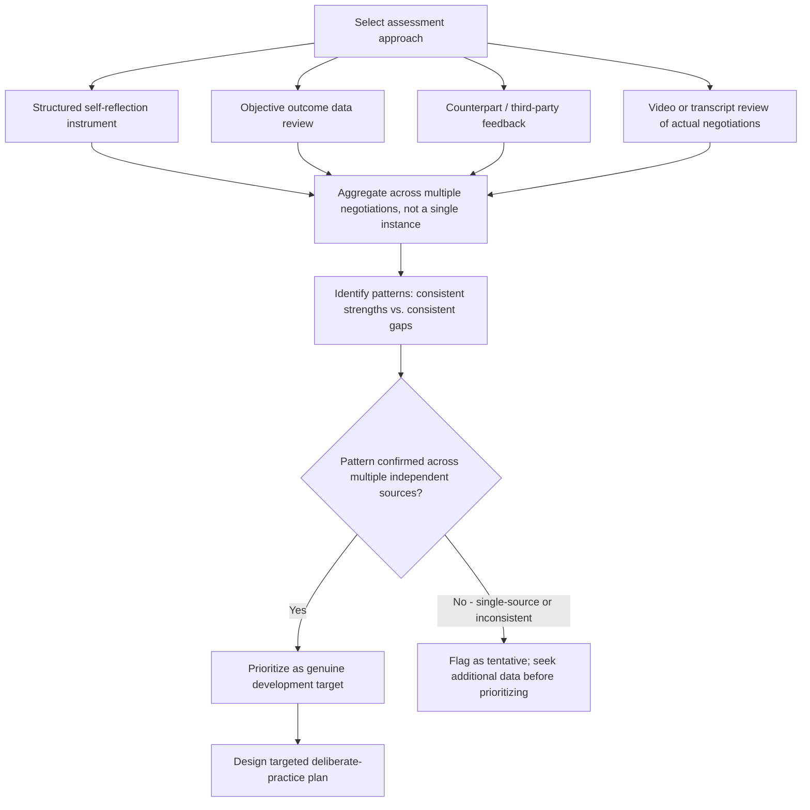

## Self-Assessment of Negotiation Strengths and Weaknesses

### Overview

Self-assessment of negotiation strengths and weaknesses is the structured process by which an individual negotiator evaluates their own tendencies, skill gaps, and behavioral patterns to guide deliberate skill development. This connects the organizational feedback-loop concepts discussed under Feedback Loops for Improving Future Negotiations to the individual level, and provides the diagnostic foundation for the mastery and continuous-development practices covered throughout this chapter.

### Rationale for Structured Self-Assessment

- **Self-perception of negotiation skill is often inaccurate absent structured evaluation**: Individuals frequently rely on impressionistic, outcome-only judgments of their own performance (e.g., "the deal closed, so I negotiated well") rather than decomposed process evaluation, risking both overconfidence in ineffective habitual tactics and underappreciation of genuine strengths.
- **Distinct skill dimensions require distinct assessment approaches**: Negotiation competence spans several partially independent dimensions, including analytical preparation, interpersonal/emotional skill, tactical execution, and ethical judgment, meaning a single global self-rating ("I am a good/bad negotiator") is too coarse to guide targeted improvement.
- **Self-assessment must be triangulated, not purely introspective**: Because self-report alone is subject to well-documented self-serving bias, especially in a domain like negotiation where "success" is partly self-defined, robust self-assessment methodology explicitly incorporates external data sources (counterpart feedback, objective outcome data, third-party observation) rather than relying on unaided introspection.

### Core Dimensions for Self-Assessment

| Dimension | Representative Sub-Skills |
| --- | --- |
| Preparation and analysis | BATNA/reservation-value calculation, interest mapping, issue prioritization |
| Information-gathering | Question-asking frequency and quality, active listening, interest discovery |
| Tactical execution | Anchoring, concession pacing, use of objective criteria, MESO technique use |
| Emotional and interpersonal skill | Emotional regulation under pressure, rapport-building, reading counterpart cues |
| Integrative/creative problem-solving | Identifying trade-offs, package-deal construction, reframing positional impasses |
| Ethical judgment | Honesty in representation, avoidance of manipulative tactics, fairness perception management |
| Process and relationship management | Debrief discipline, follow-through on commitments, relationship maintenance post-agreement |

### Self-Assessment Methodology Framework

### Structured Self-Reflection Techniques

**Post-Negotiation Structured Journaling**

Systematic written reflection after each negotiation, using a consistent template (e.g., planned vs. actual BATNA/target, tactics used, moments of uncertainty or discomfort, specific alternative actions considered in hindsight), producing a comparable dataset across negotiations over time rather than isolated, inconsistent recollections.

**Video or Recording Review**

Where feasible and permitted, reviewing a recording of one's own negotiation behavior (common in negotiation training and coaching contexts) allows direct observation of behaviors an individual may not accurately self-perceive in real time, such as speech pace changes under pressure, non-verbal cues, or interruption patterns.

**Structured Self-Rating Instruments**

Standardized self-assessment questionnaires covering the dimensions listed above, ideally validated instruments rather than ad hoc self-invented scales, allowing comparison against normative benchmarks or against one's own scores over time to track development.

### External and Triangulated Feedback Sources

**Counterpart Feedback**

Where relationship context permits (particularly in ongoing business relationships, per Managing the Relationship After the Deal Closes), directly soliciting counterpart perspective on the negotiation process can surface blind spots unavailable through self-reflection alone, though this requires a relationship context where candid feedback is realistically obtainable.

**Peer and Coach Observation**

Structured observation by a trained coach, mentor, or peer negotiator, either live or via recording, applying a standardized behavioral coding framework (see Experimental Designs in Negotiation Research and Simulation Exercises Used in Negotiation Pedagogy for coding-scheme methodology) rather than unstructured impressionistic feedback.

**360-Degree Feedback Approaches**

Aggregating feedback from multiple perspectives (direct reports, peers, supervisors, and where feasible counterparts) on an individual's negotiation-relevant behaviors, adapted from broader organizational 360-degree feedback methodology to the specific competencies listed above.

**Objective Outcome Pattern Analysis**

Reviewing one's own aggregated negotiation outcome history (economic results, dispute rates, relationship-health scores, renewal rates, per the data sources described under Feedback Loops for Improving Future Negotiations) to identify objective patterns that may not align with subjective self-perception, such as a consistent pattern of favorable initial terms but high subsequent dispute or renegotiation rates, suggesting a gap between distributive tactical skill and durable agreement construction.

### Common Self-Assessment Biases and Pitfalls

**Self-Serving Attribution Bias**

A general tendency to attribute favorable outcomes to one's own skill and unfavorable outcomes to external circumstances (counterpart difficulty, market conditions) risks systematically overestimating genuine skill and underestimating addressable weaknesses if not explicitly corrected for via objective and external data sources.

**Outcome-Only Evaluation**

As discussed under Measuring Negotiation Outcomes and Effectiveness, favorable economic outcome and negotiation process quality are only moderately correlated; self-assessing purely by deal outcome risks reinforcing tactics that happened to work in a specific favorable context (e.g., a weak counterpart BATNA) without recognizing that the same tactic might fail or backfire in a different context.

**Confidence-Competence Mismatch**

[Inference] As in many skill domains, self-assessed confidence and actual demonstrated competence are not always well correlated in negotiation, particularly for individuals with limited exposure to structured feedback; this general pattern (sometimes associated with the broader psychological literature on metacognitive calibration) is a reason structured, externally-triangulated assessment is generally considered more reliable than confidence-based self-judgment alone, though the specific magnitude of this mismatch in negotiation contexts specifically has not been established here as a precisely quantified finding.

**Single-Instance Overgeneralization**

Drawing firm conclusions about a strength or weakness from a single negotiation, rather than a pattern observed across multiple instances, risks mistaking a context-specific result (a favorable or unfavorable counterpart, an unusually easy or difficult issue set) for a stable personal trait.

### From Self-Assessment to Development Planning

**Prioritization of Development Targets**

Given that self-assessment typically surfaces multiple potential development areas, prioritization criteria commonly include: which gaps are most frequently triggered across the individual's actual negotiation contexts, which gaps show convergent evidence across multiple assessment sources (see triangulation above), and which gaps have the most direct link to previously observed negative outcomes (e.g., a documented pattern of high post-agreement dispute rates linking to a self-assessed weakness in drafting-stage clarity, connecting to Drafting Clear and Enforceable Agreements).

**Linking Self-Assessment to Deliberate Practice**

Identified development targets should translate into specific, practicable improvement activities (e.g., targeted simulation exercises per Simulation Exercises Used in Negotiation Pedagogy focused specifically on the identified gap, rather than generic negotiation practice), consistent with deliberate-practice principles requiring focused, feedback-informed repetition on specific sub-skills rather than undifferentiated general experience.

**Periodic Reassessment**

Self-assessment is not a one-time diagnostic but an ongoing cycle; periodic reassessment (e.g., annually, or after a defined number of significant negotiations) tracks whether targeted development efforts have produced measurable change, applying the same triangulated methodology to avoid simply substituting a new unverified self-perception for the original one.

### Practical Application Exercise

**Example**

A mid-career negotiator conducts a structured self-assessment after reviewing their negotiation history over the prior 18 months:

1. **Self-reflection data**: Journaling reveals a consistent self-reported discomfort with silence during pauses in negotiation, often leading to premature concessions to "fill the silence."
2. **Objective data cross-check**: A review of aggregated outcome data shows a pattern of the negotiator's agreements clustering closer to their own opening anchor's midpoint than to their calculated target, consistent with premature concession-making.
3. **External feedback triangulation**: A coach's review of a recorded negotiation confirms observable early concessions following counterpart silence, corroborating both the self-reported discomfort and the objective outcome pattern.
4. **Convergent finding**: Because this pattern is confirmed across three independent sources (self-reflection, objective outcome data, and external observation), it is prioritized as a genuine development target rather than a single-instance or self-perception artifact.
5. **Targeted development plan**: Rather than generic "negotiate more" practice, the negotiator engages in specific simulation exercises designed to include extended silence periods (see Simulation Exercises Used in Negotiation Pedagogy for exercise-design principles), paired with a specific tactical technique (deliberately counting a fixed pause duration before responding to any counterpart silence) and periodic reassessment after a defined number of subsequent negotiations to verify whether the pattern has changed.

### Related Topics

- Structured Post-Negotiation Journaling Templates and Methodology
- 360-Degree Feedback Adaptation for Negotiation Competency Assessment
- Self-Serving Attribution Bias in Outcome Evaluation
- Confidence-Competence Calibration in Skill Self-Assessment
- Video and Recording-Based Negotiation Behavior Review
- Deliberate Practice Principles Applied to Negotiation Skill Gaps
- Behavioral Coding Frameworks for Coach and Peer Observation
- Linking Self-Assessed Weaknesses to Targeted Simulation Design