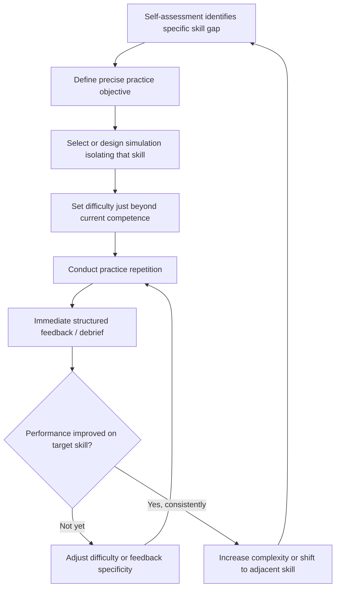

## Deliberate Practice Through Simulation and Role-Play

### Overview

Deliberate practice through simulation and role-play applies the general deliberate-practice framework from skill-acquisition research (Ericsson and colleagues) specifically to negotiation, using structured, repeatable exercises with immediate feedback to target well-defined sub-skills rather than relying on undifferentiated real-world negotiation exposure. This connects the simulation-design principles introduced under Simulation Exercises Used in Negotiation Pedagogy to the individual skill-development goals identified through Self-Assessment of Negotiation Strengths and Weaknesses, converting diagnosed gaps into a structured, practice-based improvement plan.

### Deliberate Practice Principles Applied to Negotiation

**Defining Characteristics of Deliberate Practice**

Deliberate practice, as distinguished from mere repetition or naive experience accumulation, is characterized by:

- A specific, well-defined performance target just beyond current competence.
- Immediate, specific feedback on performance relative to that target.
- Repetition with progressive refinement, rather than one-off exposure.
- Sustained effortful concentration on the specific sub-skill being developed, rather than diffuse general practice.

[Inference] Applying this framework to negotiation implies that simply conducting more real-world negotiations, absent structured feedback and a specific targeted sub-skill focus, is unlikely to reliably produce the same rate of improvement as deliberately designed practice; this is a direct extension of the general deliberate-practice literature to the negotiation domain rather than a negotiation-specific empirical finding on its own.

**Why Simulation Is Well-Suited to Deliberate Practice**

Real-world negotiations are poorly suited to deliberate practice because they involve genuine stakes (making repeated experimentation costly), uncontrolled variation (making it difficult to isolate a single sub-skill), and often no external feedback beyond the final outcome. Simulation and role-play address each of these limitations directly: stakes are removed or reduced, scenario variables can be held constant or systematically varied to isolate a target skill, and structured debrief (see Simulation Exercises Used in Negotiation Pedagogy) provides the immediate, specific feedback deliberate practice requires.

### Designing Targeted Practice From Self-Assessment Findings

### Practice Formats by Skill Target

| Identified Gap (from Self-Assessment) | Suited Practice Format |
| --- | --- |
| Premature concessions / discomfort with silence | Scripted-pause simulations with a confederate counterpart trained to hold silence deliberately |
| Weak interest-discovery / question-asking | Multi-issue simulations with hidden compatible interests (e.g., Ugli Orange-style exercises), debriefed specifically on questions asked |
| Poor anchoring calibration | Repeated single-issue distributive simulations with varied counterpart anchor extremity, tracking final-settlement outcomes across repetitions |
| Difficulty with multi-party coalition dynamics | Multi-role simulations (e.g., Harborco-style) repeated with rotating role assignments |
| Emotional reactivity under pressure | Simulations incorporating a confederate trained to display anger or aggressive tactics, with post-exercise physiological/behavioral self-review |
| Weak drafting-stage clarity | Post-simulation drafting exercises converting a verbally agreed simulated deal into a written term sheet, reviewed against the clarity principles in Drafting Clear and Enforceable Agreements |

### Structuring a Deliberate Practice Session

**Pre-Practice: Objective Setting**

Before beginning a practice repetition, explicitly stating the single sub-skill being targeted (e.g., "in this round, focus specifically on asking at least five interest-discovery questions before making any offer") sharpens attention on the targeted behavior, consistent with the deliberate-practice emphasis on focused effort rather than diffuse general performance.

**During Practice: Controlled Variation**

Where the practice format allows (e.g., repeated confederate-based role-play), systematically varying one contextual variable at a time (e.g., counterpart anchor extremity, while holding the underlying payoff structure constant) allows the practicing negotiator to observe how their targeted skill performs across a range of conditions, rather than practicing under a single fixed scenario.

**Post-Practice: Structured Debrief**

Applying the debrief-centric model from Simulation Exercises Used in Negotiation Pedagogy specifically to the targeted skill: did the specific targeted behavior occur (e.g., was the fixed pause duration actually held), what was the observable effect on the negotiation process, and what adjustment should be attempted in the next repetition.

**Progressive Difficulty Calibration**

Consistent with deliberate-practice principles generally, practice difficulty should track just ahead of current competence: once a targeted skill is reliably demonstrated at a given difficulty level (e.g., consistently avoiding premature concessions against a moderately aggressive confederate), difficulty should be increased (e.g., a more aggressive confederate, added time pressure, or a shift to a live rather than a scripted counterpart) rather than continuing to practice at a plateaued level.

### Role of Confederates and Trained Counterparts

**Confederate-Based Practice**

As discussed under Experimental Designs in Negotiation Research, a confederate is a trained counterpart following a specified behavioral script (e.g., always displaying anger at a specific point, always holding a fixed anchor), allowing the practicing negotiator to experience a controlled, repeatable version of a specific challenging counterpart behavior, isolating the practice target from the natural variability of an untrained counterpart.

**Peer-to-Peer Role-Play**

Practicing with peers rotating through both counterpart and observer roles distributes the practice and feedback-giving skill development across a cohort, and exposes each participant to a wider range of authentic (if unscripted) counterpart styles than confederate-based practice alone, at some cost to the precise controllability confederate-based designs offer.

**AI-Simulated Counterparts**

[Inference] Consistent with the emerging-frontier developments discussed under Emerging Research Frontiers in Negotiation Theory, AI-based simulated negotiation counterparts represent a newer practice modality capable of providing highly available, infinitely repeatable practice opportunities with configurable difficulty and behavioral parameters; however, the specific fidelity of AI-simulated counterpart behavior relative to trained human confederates or authentic human counterparts for deliberate-practice purposes is an open and actively developing question rather than a settled comparison, given the documented behavioral differences between AI and human negotiators noted in that same emerging-frontiers discussion.

### Measuring Improvement From Deliberate Practice

**Within-Practice Metrics**

Direct behavioral counts specific to the targeted skill (e.g., number of interest-discovery questions asked per session, average pause duration before responding to silence, frequency of premature concessions) tracked across repeated practice sessions, providing an objective trend independent of overall negotiation outcome.

**Transfer Assessment**

Because deliberate practice aims at eventual transfer to real negotiations, periodic assessment should examine whether the targeted behavior appears in actual (non-practice) negotiations, connecting back to the objective outcome-pattern review described under Self-Assessment of Negotiation Strengths and Weaknesses, rather than relying solely on improved simulation performance as evidence of genuine skill development.

$$\text{Transfer Ratio} = \frac{\text{Target behavior frequency in real negotiations}}{\text{Target behavior frequency in practice sessions}}$$

[Inference] A low transfer ratio despite strong practice-session performance would suggest the practice format, while producing in-simulation improvement, has not yet generalized to authentic negotiation contexts, a general risk in skill-transfer research that is not unique to negotiation but is a relevant caution when interpreting purely simulation-based performance gains.

### Common Failures in Deliberate Practice Design

- **Practicing without a specific targeted objective**: generic "negotiation practice" without a defined sub-skill focus reduces to unstructured repetition, forfeiting the core benefit deliberate practice is intended to provide.
- **Insufficient or delayed feedback**: practicing repeatedly without a structured, timely debrief (see Simulation Exercises Used in Negotiation Pedagogy) removes the feedback loop deliberate practice depends on, risking reinforcement of ineffective habits rather than correction of them.
- **Static difficulty**: continuing to practice a skill at a difficulty level already mastered fails to drive further improvement, consistent with the general deliberate-practice principle that practice must remain calibrated just beyond current competence.
- **Neglecting transfer verification**: assuming improved simulation performance automatically implies improved real-world negotiation performance, without periodically checking the transfer ratio described above, risks a false sense of confidence in skill development that has not actually generalized.

### Practical Application Exercise

**Example**

Continuing the self-assessment case from the prior topic (a negotiator with a diagnosed pattern of premature concessions during counterpart silence):

1. **Objective setting**: The specific practice objective is defined narrowly: "hold silence for a minimum count of five seconds after any counterpart pause before responding, across ten consecutive practice rounds."
2. **Simulation design**: A confederate-based single-issue distributive simulation is used, with the confederate specifically trained to introduce deliberate silence at three defined points in each round, isolating the targeted behavior from other negotiation variables.
3. **Progressive calibration**: Initial rounds use a moderate, predictable silence pattern; once the negotiator reliably holds the five-second count across five consecutive rounds, difficulty increases by introducing variable-length, unpredictable silences and, subsequently, a live (non-scripted) peer counterpart.
4. **Debrief and metric tracking**: Each round's debrief records whether the target count was held and what concession behavior (if any) occurred immediately after; a simple count-based chart across the ten-round sequence provides an objective improvement trend independent of any single round's negotiated outcome.
5. **Transfer check**: After the practice sequence, the negotiator's subsequent real negotiations are reviewed (per the objective outcome-pattern review methodology from Self-Assessment of Negotiation Strengths and Weaknesses) specifically for whether the reduced premature-concession pattern observed in practice appears in authentic negotiation contexts, confirming genuine skill transfer rather than only simulation-specific improvement.

### Related Topics

- Deliberate Practice Theory (Ericsson) Applied to Professional Skill Domains
- Confederate-Based Role-Play Design and Behavioral Scripting
- Skill Transfer Assessment From Simulation to Real-World Performance
- Progressive Difficulty Calibration in Structured Practice Design
- AI-Simulated Negotiation Counterparts as an Emerging Practice Modality
- Peer-to-Peer Role-Play Cohort Design and Rotation Structures
- Behavioral Metric Tracking Across Repeated Practice Sessions
- Linking Diagnosed Weaknesses to Targeted Practice Objectives