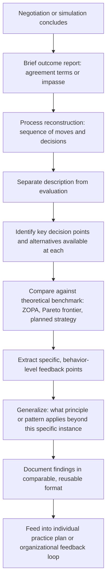

## Structured Debriefing and Feedback Techniques

### Overview

Structured debriefing and feedback techniques are the formalized methods by which negotiation performance, whether from simulation, real negotiation, or practice, is systematically reviewed to extract specific, actionable learning. This topic operationalizes the debrief-centric learning model introduced under Simulation Exercises Used in Negotiation Pedagogy and the feedback-loop and self-assessment frameworks discussed under Feedback Loops for Improving Future Negotiations and Self-Assessment of Negotiation Strengths and Weaknesses, providing the specific procedural techniques that make debriefing effective rather than merely conversational.

### Why Debrief Structure Matters

- **Unstructured debrief tends toward outcome-only discussion**: Left unguided, post-negotiation conversation naturally gravitates toward "did we get a good deal," bypassing the process-level analysis (tactics used, decision points, alternative paths) that generates transferable learning, consistent with the outcome-versus-process distinction discussed under Measuring Negotiation Outcomes and Effectiveness.
- **Structure enables comparability across sessions**: A consistent debrief format applied across multiple negotiations or practice rounds produces comparable data, supporting the pattern-identification and aggregation processes described under Feedback Loops for Improving Future Negotiations, which an inconsistent, ad hoc debrief format cannot support.
- **Facilitation quality determines learning extraction, not just occurrence**: [Inference] The negotiation-pedagogy literature discussed under Simulation Exercises Used in Negotiation Pedagogy generally treats debrief facilitation skill as a significant, potentially limiting factor in learning transfer; a debrief conducted without appropriate structure or facilitation skill risks reducing to entertainment or superficial reaction-sharing rather than genuine skill development, regardless of how well-designed the underlying exercise or negotiation was.

### Core Structural Elements of an Effective Debrief

**Sequencing: Outcome Before Process, Then Back to Outcome**

A commonly recommended debrief sequence begins with a brief factual outcome report (what was agreed, or that impasse occurred), proceeds to detailed process reconstruction (what happened, in what order, and why), and returns to outcome interpretation informed by that process analysis (was the outcome good given what actually happened, or could a different process have produced a better result).

**Separating Description From Evaluation**

Effective debrief technique distinguishes purely descriptive reconstruction ("what did each party actually say and do, in sequence") from evaluative judgment ("was that a good or bad move"), typically sequencing description first; conflating the two prematurely can shut down accurate factual reconstruction if participants become defensive about evaluation before the facts are fully established.

**Grounding in Specific, Observable Behavior**

Effective feedback references specific, observable actions ("you made a counter-offer immediately after their first offer, without asking any clarifying questions") rather than general trait-level characterizations ("you're too aggressive" or "you're a weak negotiator"), because specific behavioral feedback is both more actionable and less likely to trigger defensive reactions than global trait judgments.

### Debrief Process Architecture

### Established Feedback Delivery Frameworks

**Situation-Behavior-Impact (SBI) Framework**

A widely used structured feedback technique specifying three components: the *Situation* (specific context in which the behavior occurred), the *Behavior* (the specific, observable action taken), and the *Impact* (the effect that behavior had on the outcome, the counterpart, or the process). This structure is designed to keep feedback concrete and non-judgmental, reducing defensiveness relative to unstructured trait-based feedback.

- Example structure: "In the second round, when the counterpart proposed the extended timeline (Situation), you immediately countered with a firm rejection rather than asking why the timeline mattered to them (Behavior), which appeared to shut down further discussion of that issue for the rest of the session (Impact)."

**Start-Stop-Continue Framework**

A simple structured technique organizing feedback into three categories: behaviors the individual should *start* doing (identified gaps), behaviors they should *stop* doing (counterproductive patterns), and behaviors they should *continue* doing (genuine strengths), ensuring debrief output includes explicit reinforcement of strengths alongside gap identification rather than skewing entirely toward critique.

**After-Action Review (AAR) Structure**

Adapted from military and organizational learning contexts, typically structured around four core questions: What was supposed to happen? What actually happened? Why was there a difference? What can be learned or done differently next time? This structure explicitly incorporates the planned-versus-actual comparison central to the self-assessment methodology discussed in the prior topic.

### Facilitator Techniques for Group Debriefs

**Balancing Multiple Perspectives**

In simulations or negotiations involving more than two parties, or where observers were present, an effective facilitator deliberately solicits each role's perspective before allowing convergence on a single narrative, since different parties (and observers) frequently perceived the same interaction differently, and this divergence is itself often instructive (illustrating, for instance, how differently the same tactic can be perceived by the party using it versus the party experiencing it).

**Managing Emotional Reactions**

Negotiation debriefs, particularly following a difficult, high-stakes, or poorly-resolved negotiation, can surface genuine frustration or defensiveness; facilitator technique generally emphasizes acknowledging the emotional response without allowing it to derail the structured process, redirecting toward specific behavioral description (per the SBI framework above) as a way to move past unproductive general blame or defensiveness.

**Using Silence and Open Questions**

Effective facilitation often uses open-ended prompts ("what did you notice happening at that point?") followed by deliberate silence, allowing participants to generate their own observations before the facilitator supplies an interpretation, since self-generated insight is generally considered more likely to transfer to future behavior than facilitator-imposed interpretation alone.

### Written Debrief Documentation Techniques

**Standardized Templates**

Consistent with the aggregation needs described under Feedback Loops for Improving Future Negotiations, written debrief documentation benefits from a standardized template capturing the same categories of information across every session (outcome summary, key tactics observed, decision-point analysis, specific feedback points, generalized takeaway), rather than free-form notes that vary in structure and content from session to session.

**Distinguishing Individual and Aggregate-Level Documentation**

Individual debrief records (specific to one negotiator's development) should generally be distinguished from aggregate-level pattern documentation (organizational-level findings across many negotiations), since these serve different purposes and audiences, connecting to the individual-versus-organizational feedback-loop distinction discussed in the prior chapter topic.

### Common Debriefing Failures

- **Skipping process reconstruction and jumping directly to evaluation**: producing surface-level "that went well/poorly" conclusions without the specific behavioral detail needed to generalize the lesson to future negotiations.
- **Trait-level rather than behavior-level feedback**: global characterizations ("you're too passive") are both less actionable and more likely to produce defensiveness than specific behavioral observations (per the SBI framework above).
- **Facilitator dominance**: a facilitator supplying interpretation and conclusions before participants have generated their own observations reduces the self-generated insight that supports genuine learning transfer, even if the facilitator's interpretation is substantively correct.
- **No documentation or inconsistent documentation**: conducting a verbally rich debrief that is never captured in a comparable, reusable format prevents the aggregation and pattern-analysis processes central to organizational feedback loops.
- **Debriefing only successful negotiations**: as with the survivorship-bias concern discussed under Feedback Loops for Improving Future Negotiations, systematically debriefing only negotiations that reached favorable agreement, while skipping impasses or unfavorable outcomes, produces an incomplete and potentially misleading learning base.

### Practical Application Exercise

**Example**

Debriefing a two-party simulation that reached an inefficient (non-Pareto-optimal) agreement:

1. **Outcome report**: Facilitator states the actual agreed terms and, referencing the known (researcher-assigned) payoff matrix, notes that a more efficient agreement was available but not reached.
2. **Process reconstruction**: Each party reconstructs their sequence of offers and reasoning, with the facilitator specifically probing: "At what point did you settle on this issue's terms, and what information did you have at that moment?"
3. **Description-evaluation separation**: The facilitator first establishes the factual sequence (e.g., "Party A proposed a single-issue trade on price only in round two") before inviting evaluative discussion of whether that timing was optimal.
4. **SBI-structured feedback**: A peer observer offers structured feedback: "In round two (Situation), when Party B mentioned timeline flexibility in passing (Behavior), the comment wasn't followed up with any clarifying question (Impact), which meant a potential trade on timeline for price was never explored."
5. **Generalization**: The group extracts a general principle beyond this specific instance: passing mentions of secondary issues during a negotiation may signal unexplored trade opportunities, and warrant a specific follow-up question rather than being treated as incidental conversation.
6. **Documentation**: The specific finding and general principle are recorded in a standardized debrief template, feeding into both the individual participants' development plans and, if this is a recurring organizational training exercise, the aggregate pattern-tracking process described under Feedback Loops for Improving Future Negotiations.

### Related Topics

- Situation-Behavior-Impact (SBI) Feedback Framework
- After-Action Review (AAR) Structure and Application
- Facilitator Technique for Managing Group Debrief Dynamics
- Standardized Debrief Documentation Templates
- Separating Descriptive Reconstruction From Evaluative Judgment
- Self-Generated Insight Versus Facilitator-Imposed Interpretation
- Debriefing Impasse and Unfavorable Outcomes to Avoid Survivorship Bias
- Connecting Individual Debrief Findings to Organizational Feedback Loops