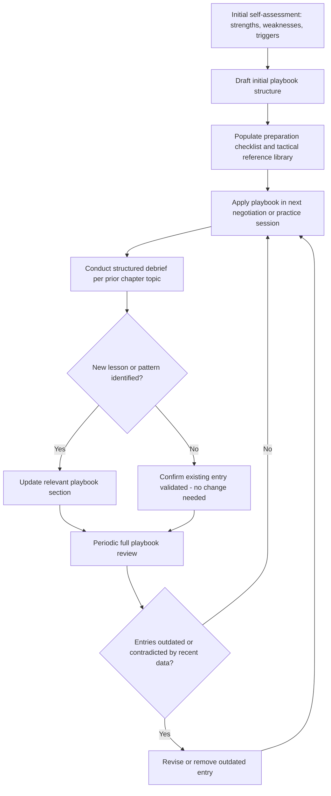

## Building a Personal Negotiation Playbook

### Overview

Building a personal negotiation playbook is the process of consolidating an individual negotiator's accumulated preparation frameworks, tactical preferences, self-assessment findings, and lessons learned into a structured, reusable reference document that guides future negotiation preparation and execution. This topic synthesizes the individual-level outputs of the preceding chapter topics, Self-Assessment of Negotiation Strengths and Weaknesses, Deliberate Practice Through Simulation and Role-Play, and Structured Debriefing and Feedback Techniques, into a single durable artifact, mirroring at the individual level the organizational playbook-refinement process discussed under Feedback Loops for Improving Future Negotiations.

### Rationale for a Personal Playbook

- **Consolidates dispersed learning into a retrievable format**: Without a consolidated playbook, insights from individual debriefs, self-assessments, and practice sessions risk remaining scattered across separate notes or, worse, existing only as unreliable memory, undermining the very feedback-loop function these processes are designed to serve.
- **Provides a structured starting point for preparation**: Rather than preparing each new negotiation entirely from first principles, a playbook provides a pre-organized checklist and reference framework, reducing preparation time and the risk of omitting previously learned lessons.
- **Encodes personal, context-specific patterns generic training cannot capture**: While generic negotiation training (see Simulation Exercises Used in Negotiation Pedagogy) teaches transferable general principles, a personal playbook captures the individual's own specific tendencies, triggers, and effective countermeasures, which are necessarily unique to that individual's self-assessment history.
- **Functions as a living document supporting continuous refinement**: Consistent with the periodic-reassessment principle discussed under Self-Assessment of Negotiation Strengths and Weaknesses, a playbook is designed to be updated iteratively as new negotiations, practice sessions, and debriefs generate new data, rather than being finalized once.

### Core Components of a Personal Negotiation Playbook

| Component | Content |
| --- | --- |
| Preparation checklist | Standardized steps for BATNA/reservation-value calculation, interest mapping, and issue prioritization before any negotiation |
| Personal strength inventory | Confirmed strengths from self-assessment, to be deliberately leveraged |
| Personal weakness/trigger inventory | Confirmed gaps and specific situational triggers (e.g., counterpart silence, aggressive anchoring) identified through self-assessment |
| Tactical reference library | Preferred and practiced tactics (e.g., MESO construction, specific question-asking scripts) with notes on when each has proven effective |
| Counter-tactic responses | Pre-planned responses to counterpart tactics the individual has found personally challenging (e.g., a scripted response to an aggressive anchor or a display of anger) |
| Debrief log summary | Condensed, recurring lessons extracted from the structured debrief process, updated after each significant negotiation |
| Drafting/documentation checklist | Personal reminders linked to drafting-clarity principles (see Drafting Clear and Enforceable Agreements) frequently missed in past agreements |
| Post-agreement follow-through checklist | Personal reminders for relationship management and monitoring practices (see Managing the Relationship After the Deal Closes and Monitoring Compliance and Performance) historically under-prioritized |

### Playbook Development and Maintenance Process

### Populating the Preparation Checklist Section

A playbook's preparation checklist typically operationalizes the standard analytical frameworks referenced throughout this syllabus (BATNA/ZOPA analysis, interest mapping, issue prioritization) into a personal step-by-step sequence, for example:

1. Calculate and document reservation value and BATNA before any opening contact.
2. Identify likely counterpart interests distinct from their probable opening position.
3. List all issues in play and pre-assign personal priority weighting to identify potential integrative trades in advance.
4. Draft a planned opening anchor and the reasoning that would justify it if challenged.
5. Note any personally known triggers (from the weakness inventory) likely to be activated by this specific negotiation's characteristics, and the pre-planned countermeasure for each.

### Populating the Tactical and Counter-Tactic Sections

**Tactical Reference Library Entries**

Each entry typically documents: the tactic itself, the situational conditions under which it has proven personally effective (drawing on the individual's own debrief history rather than generic literature alone), and any noted limitations or contexts where it has previously backfired.

**Counter-Tactic Response Planning**

Because self-assessment frequently identifies specific counterpart behaviors that reliably trigger a personal weakness (e.g., aggressive anchoring triggering premature accommodation, per the running example in prior chapter topics), a playbook's counter-tactic section pre-scripts a specific planned response to each identified trigger, reducing the likelihood of an unplanned, reactive response in the moment. [Inference] Pre-committing to a specific planned response in advance is generally considered to reduce susceptibility to in-the-moment pressure tactics, consistent with general findings on the value of implementation intentions in behavioral self-regulation, though this specific application to negotiation counter-tactic planning is a reasoned extension of that broader principle rather than a negotiation-specific finding cited here.

### Integrating Debrief Findings Into the Playbook

**Selective, Not Exhaustive, Incorporation**

Not every debrief finding warrants a permanent playbook update; consistent with the self-assessment methodology's emphasis on convergent evidence across multiple sources (see Self-Assessment of Negotiation Strengths and Weaknesses), a single debrief observation is generally treated as a candidate for playbook inclusion only once corroborated across multiple negotiations or practice sessions, avoiding a playbook cluttered with single-instance, potentially context-specific observations.

**Versioning and Change Tracking**

Because a playbook is a living document, tracking when and why a given entry was added, revised, or removed (e.g., noting that a previously effective tactic was removed after two recent negotiations where it failed under changed market conditions) preserves the reasoning behind the current playbook content and supports more informed future revision.

### Playbook Format and Accessibility Considerations

**Format Selection**

A playbook can be maintained in various formats (structured document, spreadsheet-based checklist, note-taking application), with format selection generally driven by ease of pre-negotiation retrieval and update convenience rather than any single mandated structure; the critical requirement is consistent, low-friction access before and after each negotiation rather than a specific tool choice.

**Balancing Comprehensiveness With Usability**

[Inference] A playbook that becomes too long or exhaustive risks reduced actual use before time-constrained real negotiations; general practice guidance in this area favors a concise, high-priority core section (the most consistently relevant checklist items and top personal triggers) supplemented by a more detailed reference appendix consulted only when time and negotiation complexity warrant it, though the specific optimal length is inherently individual and context-dependent rather than a fixed standard.

### Common Failures in Playbook Development

- **Building a playbook once and never updating it**: treating playbook creation as a one-time exercise rather than an ongoing process defeats the continuous-improvement purpose described under Feedback Loops for Improving Future Negotiations, since new debrief and self-assessment data will not be incorporated.
- **Copying generic frameworks without personal customization**: a playbook that merely restates general negotiation theory (BATNA, ZOPA, integrative bargaining) without personal, self-assessment-derived specifics (individual triggers, personally validated tactics) provides limited additional value beyond general training materials already covered elsewhere in this syllabus.
- **Incorporating single-instance findings without corroboration**: as noted above, treating every individual debrief observation as a permanent playbook entry risks an unreliable, overfit playbook driven by idiosyncratic single-negotiation circumstances rather than validated patterns.
- **Neglecting post-agreement sections**: a playbook focused exclusively on pre-negotiation preparation and at-the-table tactics, while omitting the post-agreement monitoring, relationship-management, and follow-through checklists discussed elsewhere in this chapter, risks reinforcing a narrow view of negotiation success limited to deal-closing rather than the full lifecycle covered throughout this syllabus.

### Practical Application Exercise

**Example**

Continuing the running example from prior chapter topics (a negotiator with a corroborated pattern of premature concessions during counterpart silence):

1. **Weakness inventory entry**: "Trigger: extended counterpart silence following my offer. Historical pattern: premature concession within 5-10 seconds. Corroborated across self-reflection, objective outcome data, and coach observation (see Self-Assessment of Negotiation Strengths and Weaknesses case)."
2. **Counter-tactic response entry**: "Pre-planned response: silently count to five before responding to any counterpart silence; if the urge to speak arises before the count completes, ask a clarifying question about the current issue rather than making a concession."
3. **Practice-validated tactic entry** (following the deliberate-practice sequence from the prior topic): "Validated through ten-round confederate-based simulation series (see Deliberate Practice Through Simulation and Role-Play case); transfer-ratio check against subsequent real negotiations confirmed reduced premature-concession frequency."
4. **Preparation checklist addition**: A standing reminder item added to the pre-negotiation checklist: "Before this negotiation begins, mentally rehearse the five-second silence-response protocol given historical trigger pattern."
5. **Periodic review outcome**: At the next quarterly playbook review, if several subsequent negotiations show the pattern reliably resolved, the entry may be revised from an active "trigger" item to a "resolved pattern, monitor for recurrence" status, freeing attention for newly identified development targets surfaced through ongoing self-assessment.

### Related Topics

- Implementation Intentions and Pre-Committed Response Planning
- Versioning and Change-Tracking Practices for Living Reference Documents
- Corroboration Thresholds for Incorporating Debrief Findings
- Balancing Playbook Comprehensiveness and Pre-Negotiation Usability
- Linking Individual Playbooks to Organizational Playbook Refinement
- Personal Tactical Libraries Versus Generic Negotiation Training Content
- Post-Agreement Checklist Integration Within a Personal Playbook
- Periodic Playbook Review Cadence and Update Triggers