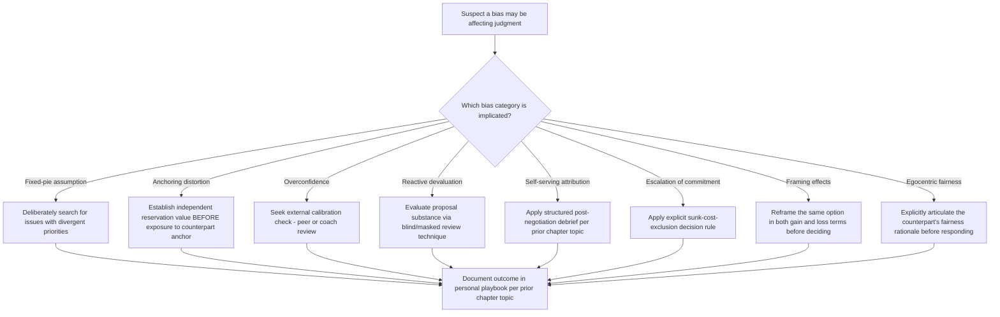

## Recognizing and Correcting Personal Biases

### Overview

Recognizing and correcting personal biases addresses the systematic cognitive and motivational distortions that affect negotiator judgment and decision-making, extending beyond the tactical skill gaps addressed under Self-Assessment of Negotiation Strengths and Weaknesses into the specific, well-documented category of cognitive biases that affect negotiators regardless of general skill level. Because these biases operate largely outside conscious awareness by definition, this topic requires distinct recognition techniques and correction strategies from the behavioral-skill-gap approach used elsewhere in this chapter.

### Why Bias Correction Is Distinct From General Skill Development

- **Biases are often unconscious and resistant to simple awareness**: Unlike a tactical skill gap (e.g., insufficient question-asking), which can often be corrected through deliberate practice once identified, many cognitive biases persist even among negotiators who are explicitly aware of the bias in the abstract, requiring specific structural correction techniques rather than awareness alone.
- **Biases can affect even objectively skilled, experienced negotiators**: Cognitive bias research generally finds that experience and expertise do not reliably eliminate susceptibility to certain biases, and in some documented cases may even increase overconfidence in one's own bias-resistance, making bias-correction a distinct and ongoing concern rather than a gap that is naturally closed through general experience accumulation.
- **Biases can distort the entire negotiation, not just a specific tactic**: Where a tactical gap (e.g., weak anchoring calibration) affects a specific negotiation move, cognitive biases like fixed-pie assumptions or overconfidence can distort the negotiator's entire read of the situation, the counterpart, and the available options, with broader downstream effects.

### Major Cognitive Biases in Negotiation

**Fixed-Pie Bias**

The assumption that a negotiation is inherently zero-sum (any gain to the counterpart is a loss to oneself), leading negotiators to under-explore integrative trade-off opportunities even where they genuinely exist. This is the specific cognitive distortion the "orange" illustration discussed under Simulation Exercises Used in Negotiation Pedagogy is designed to expose and correct.

**Anchoring Bias (as a Judgment Distortion, Not Just a Tactic)**

Beyond its use as a deliberate tactic (see Meta-Analytic Findings on Negotiation Tactics), anchoring also operates as a bias affecting the anchored party's own judgment: exposure to an extreme counterpart anchor can distort a negotiator's own sense of a reasonable settlement range, even when the negotiator consciously recognizes the anchor as a deliberate tactic.

**Overconfidence Bias**

A general tendency to overestimate the accuracy of one's own judgments, predictions, or the favorability of one's negotiating position, which in negotiation contexts is specifically associated with reduced willingness to make efficient concessions and increased impasse risk, since an overconfident negotiator may believe a favorable outcome is more attainable than it actually is.

**Reactive Devaluation**

The tendency to devalue a proposal specifically because it originates from the counterpart, independent of the proposal's actual substantive merit; this bias can prevent recognition of genuinely favorable offers and has been specifically implicated as a barrier in mediated and adversarial negotiation contexts (see the mediator's role in overcoming this dynamic under Historic Trade and Treaty Negotiations' Camp David case).

**Self-Serving Attribution Bias**

As introduced under Self-Assessment of Negotiation Strengths and Weaknesses, the tendency to attribute favorable negotiation outcomes to one's own skill and unfavorable outcomes to external circumstances, which distorts accurate post-negotiation learning if not explicitly corrected for.

**Escalation of Commitment**

The tendency to continue investing in a chosen negotiating position or course of action beyond the point a purely rational reassessment would justify, driven by prior investment (sunk cost) rather than current expected value; this bias is particularly relevant in the renegotiation contexts discussed under Renegotiation Triggers and Processes, where continued adherence to original terms despite clearly changed conditions can reflect this bias rather than a genuine strategic judgment.

**Framing Effects**

Judgment and choice can shift systematically depending on whether a given outcome is framed as a gain or a loss relative to a reference point, even when the underlying substantive outcome is identical; this affects both how a negotiator evaluates their own options and how they should anticipate a counterpart's response to differently-framed proposals.

**Egocentric Fairness Perception**

A tendency for each party in a negotiation to perceive a given division as objectively "fair" when it favors their own interests, independent of any deliberate self-interested misrepresentation; this bias can generate genuine impasses even where an objectively reasonable resolution exists, since each party may sincerely (not merely strategically) believe their preferred outcome is the fair one.

### Bias Recognition and Correction Framework

### Structural Correction Techniques by Bias Type

**Correcting Fixed-Pie Bias**

Deliberately structured interest-discovery processes (systematic question-asking about priorities rather than assuming known interests) directly counteract fixed-pie assumptions by surfacing whether apparent conflicts actually mask compatible underlying interests, consistent with the integrative-bargaining techniques discussed under earlier chapters of this syllabus.

**Correcting Anchoring Distortion**

Establishing and documenting an independent reservation value and target calculation before any exposure to a counterpart's opening offer (i.e., completing this analysis during preparation, not reactively after an anchor has been presented) reduces the degree to which a counterpart's anchor can retroactively shift the negotiator's own sense of a reasonable outcome range.

**Correcting Overconfidence**

Seeking calibration feedback from an independent party who does not share the negotiator's specific stake in the outcome (a peer, coach, or structured pre-mortem exercise asking "if this negotiation fails, what would be the most likely reason") can surface overconfident assumptions the negotiator has not independently identified.

**Correcting Reactive Devaluation**

Structured techniques such as evaluating a proposal's substantive terms in isolation from its source (e.g., having a colleague present the identical terms as though independently sourced, or explicitly listing the proposal's objective merits before considering its origin) can help isolate substantive evaluation from source-based devaluation.

**Correcting Escalation of Commitment**

Applying an explicit decision rule that excludes prior investment from forward-looking evaluation (assessing only the current expected value of continuing versus alternative paths, independent of resources already committed) directly counters the sunk-cost reasoning underlying this bias; this is particularly relevant when applying the BATNA-reassessment methodology discussed under Renegotiation Triggers and Processes.

**Correcting Framing Effects**

Deliberately reformulating a given option in both gain-framed and loss-framed terms before making a judgment (e.g., "this represents a 10% improvement over the status quo" versus "this represents accepting 90% of what was originally sought") can surface whether a preference is driven by the substance of the option or merely its framing.

**Correcting Egocentric Fairness Perception**

Deliberately and explicitly articulating the counterpart's likely fairness rationale, in specific terms, before responding to a proposal one perceives as unfair, can surface whether the perceived unfairness reflects a genuine substantive asymmetry or simply a natural egocentric bias in the observer's own evaluation.

### Organizational and Structural Debiasing Approaches

**Devil's Advocate / Structured Dissent Roles**

Assigning a specific team member the explicit role of challenging the team's current negotiating assumptions (particularly useful for correcting overconfidence and escalation of commitment in team-based negotiations) formalizes dissent that might otherwise be socially discouraged in a cohesive negotiating team.

**Independent Reservation-Value Documentation Requirements**

Organizational practice requiring negotiators to document and submit their reservation value and target calculations before a negotiation begins (rather than only informally holding this in mind) creates a structural anchor-resistance mechanism and, incidentally, supports the objective outcome-pattern review discussed under Self-Assessment of Negotiation Strengths and Weaknesses.

**Rotation of Perspective in Preparation**

Explicitly preparing by articulating the negotiation from the counterpart's perspective (their likely interests, constraints, and fairness rationale) before finalizing one's own strategy directly counters both fixed-pie assumptions and egocentric fairness perception simultaneously.

### Distinguishing Genuine Bias From Legitimate Strategic Judgment

[Inference] Not every instance of holding a firm position or declining a counterpart's proposal reflects a bias; the correction techniques above are intended to surface cases where judgment has been distorted by an identifiable cognitive pattern, not to suggest that all firm negotiating positions are presumptively biased. Distinguishing genuine bias from legitimate strategic judgment generally requires the same triangulation principle emphasized under Self-Assessment of Negotiation Strengths and Weaknesses: a pattern corroborated across multiple negotiations, ideally with some external or objective check, is more credibly attributable to bias than a single instance of firm but potentially well-justified resistance.

### Common Failures in Bias Correction Efforts

- **Assuming awareness alone is sufficient**: knowing that a bias exists in the abstract (e.g., "I know anchoring is a thing") does not reliably prevent its effect without the specific structural countermeasures described above; bias correction generally requires structural intervention, not merely conceptual awareness.
- **Applying correction techniques only after the fact**: several of the most effective correction techniques (e.g., independent reservation-value documentation, perspective-taking preparation) function as preventive measures applied during preparation, not remedial measures applied after a bias has already distorted a decision.
- **Treating bias correction as a one-time training topic rather than an ongoing practice**: consistent with the broader deliberate-practice and playbook-maintenance themes of this chapter, bias susceptibility is not permanently "fixed" after a single training exposure and benefits from the same ongoing self-assessment and structured debrief cycle applied to other negotiation skills.
- **Over-attributing every negotiation friction to bias**: as noted above, treating every instance of disagreement or firm resistance as evidence of bias, rather than considering legitimate substantive grounds for the position, risks its own form of miscalibrated judgment.

### Practical Application Exercise

**Example**

A negotiator preparing for a supplier renegotiation (connecting to the Renegotiation Triggers and Processes framework) reviews their preparation process for bias risk:

1. **Escalation-of-commitment check**: The negotiator notes a personal inclination to preserve the original contract's fixed-price structure specifically because "we already invested significant negotiation effort establishing it," and explicitly flags this as a potential sunk-cost-driven bias rather than a substantive reason to resist the supplier's now-justified price-adjustment request.
2. **Fixed-pie check**: Before finalizing a purely distributive counter-position, the negotiator applies the perspective-rotation technique, explicitly articulating the supplier's likely underlying interest (cost sustainability, not merely opportunistic price extraction), surfacing the integrative reframing opportunity (indexed pricing plus extended term) identified in the earlier renegotiation case example.
3. **Overconfidence check**: The negotiator seeks a colleague's independent calibration review of the planned counter-offer, specifically asking the colleague to identify the most likely reason the negotiation could fail, surfacing an overlooked assumption about the supplier's actual BATNA strength.
4. **Documentation**: Findings from this bias-check process are recorded in the personal playbook (per Building a Personal Negotiation Playbook) as a validated preparation step, to be applied as a standing pre-negotiation check in future renegotiation contexts specifically, given the demonstrated relevance of escalation-of-commitment risk in that particular negotiation type.

### Related Topics

- Fixed-Pie Bias and Its Relationship to Integrative Bargaining Failure
- Overconfidence and Calibration in Negotiator Self-Assessment
- Reactive Devaluation and Its Role in Mediated Negotiation Impasses
- Escalation of Commitment and Sunk-Cost Reasoning in Renegotiation
- Framing Effects on Negotiator Judgment and Choice
- Egocentric Fairness Perception and Genuine (Non-Strategic) Impasse
- Devil's Advocate and Structured Dissent Roles in Team Negotiation
- Distinguishing Cognitive Bias From Legitimate Strategic Firmness